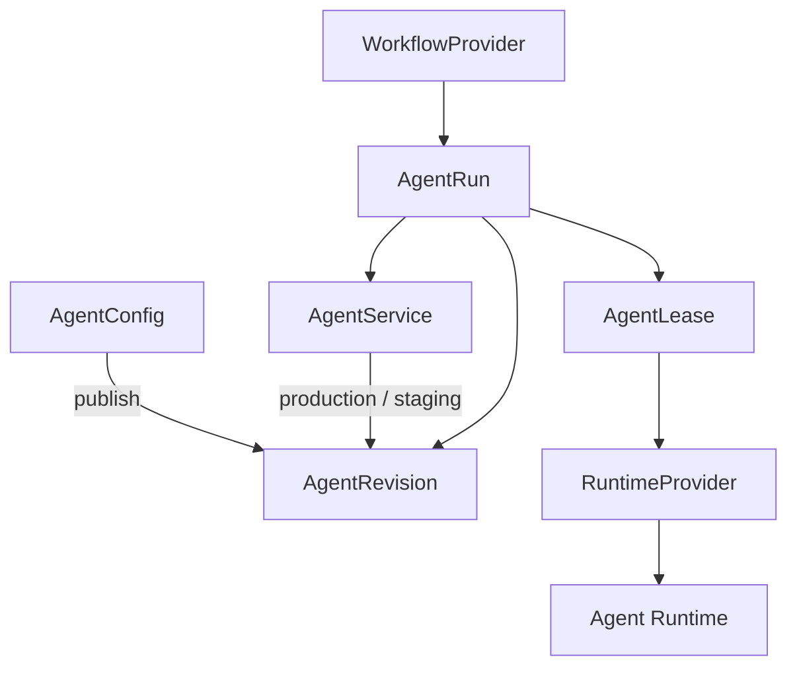

# another-agentic-platform

A Kubernetes-native platform for running **durable, versioned, independently
addressable AI agent services on disposable compute**.

> **Status: design only.** Formerly the `lightbridge-agents` draft.
>
> The first operator (v0: adam-rs agents from `AgentService` and `AgentConfig` on native Kubernetes) is specified in [§59a](docs/architecture/10-control-plane-and-crds.md#59a-operator-v0-adam-rs-agents). Status stays *design only* until its first code lands.

An agent is a stable logical service — not a Pod, a model, a workspace or a
process. It has a stable identity, immutable revisions selected through
release channels, explicitly enabled protocol surfaces (A2A, MCP, Responses),
reusable tools and environments, and compute that exists only while a lease
needs it.

## Documents

| Document | What it covers |
|---|---|
| [Architecture](docs/architecture/README.md) | The full design in 12 topic files: overview, domain model, interfaces, workflows, runtime, environments & storage, tools, security, operations, control plane & CRDs, decisions, summary |
| [MVP](docs/mvp.md) | The v0 cut (scenarios A–C, plus D for free) and build order |
| [Release-channels A2A extension](docs/extensions/release-channels-v1.md) | How any A2A client discovers and selects an agent's channels/revisions |
| [Agent registry](docs/extensions/agent-registry-v1.md) | How any client lists the fleet's A2A agents: a linkset of agent cards |

## Related

- **another-agentic-system** — a protocol-agnostic orchestration layer (chat
  surface + stateless orchestrator). It consumes agents over A2A, MCP and
  webhooks like any other system; when an agent comes from this platform, it
  offers release selection through the extension above.
- **vymalo/another-adam-rs** — the agent harness (AD-022): `adam-coder` and
  `adam-agent`, one image, which the v0 operator runs.
- **vymalo/another-agentic-images** — the toolchain image recipe (Rust, Flutter/Dart,
  Node, agent CLIs under `/opt`) coding runtimes start from.

## License

[MIT](LICENSE). Vendored agent skills keep their own licenses; see
[third-party-notices.md](third-party-notices.md).
