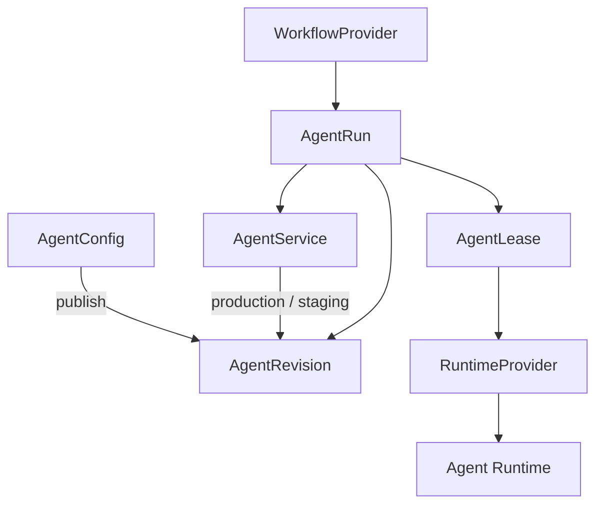

# another-agentic-platform

A Kubernetes-native platform for running **durable, versioned, independently
addressable AI agent services on disposable compute**.

> **Status: design, and the first code of the v0 operator.** Formerly the `lightbridge-agents` draft.
>
> The first operator (v0: adam-rs agents from `AgentService` and `AgentConfig` on native Kubernetes) is specified in [§59a](docs/architecture/10-control-plane-and-crds.md#59a-operator-v0-adam-rs-agents). Slice S1 is built: the Cargo workspace, the CRD types, the CRDs and the examples. There is no controller yet (S5), and nothing else of the architecture is built.

An agent is a stable logical service — not a Pod, a model, a workspace or a
process. It has a stable identity, immutable revisions selected through
release channels, explicitly enabled protocol surfaces (A2A, MCP, Responses),
reusable tools and environments, and compute that exists only while a lease
needs it.



## Documents

| Document | What it covers |
|---|---|
| [Architecture](docs/architecture/README.md) | The full design in 12 topic files: overview, domain model, interfaces, workflows, runtime, environments & storage, tools, security, operations, control plane & CRDs, decisions, summary |
| [MVP](docs/mvp.md) | The v0 cut (scenarios A–C, plus D for free) and build order |
| [Release-channels A2A extension](docs/extensions/release-channels-v1.md) | How any A2A client discovers and selects an agent's channels/revisions |
| [Agent registry](docs/extensions/agent-registry-v1.md) | How any client lists the fleet's A2A agents: a linkset of agent cards |

## Workspace

One Cargo workspace ([§59a](docs/architecture/10-control-plane-and-crds.md#59a-operator-v0-adam-rs-agents), "Workspace layout"); crates are prefixed `aap-`. Built so far:

| Path | What |
|---|---|
| [`crates/api`](crates/api/README.md) | `aap-api`: the `AgentService` and `AgentConfig` types, their CEL rules, `crds()` |
| [`bin/operator`](bin/operator/README.md) | `aap-operator`, binary `operator`: `crdgen` prints the CRDs; `run` arrives with S5 |
| [`deploy/crds`](deploy/crds/agents.vymalo.com.yaml) | The generated CRDs, checked in; CI fails when `crdgen` prints something else |
| [`examples`](examples/coder.yaml) | `coder.yaml` and `chat.yaml` (a service and its config each), and [`invalid/`](examples/invalid), one object per CEL rule, each refused by an API server |

```sh
cargo fmt --all --check
cargo clippy --workspace --all-targets --locked -- -D warnings
cargo test --workspace --locked
cargo run -q -p aap-operator -- crdgen | diff deploy/crds/agents.vymalo.com.yaml -   # the drift check
```

CI is [`.github/workflows/operator.yml`](.github/workflows/operator.yml): the four checks above, and a `kind` job that applies the CRDs, the examples and the invalid examples to a real API server.

## Related

- **another-agentic-system** — a protocol-agnostic orchestration layer (chat
  surface + stateless orchestrator). It consumes agents over A2A, MCP and
  webhooks like any other system; when an agent comes from this platform, it
  offers release selection through the extension above.
- **vymalo/another-adam-rs** — the agent harness (AD-022): `adam-coder` and
  `adam-agent`, one image, which the v0 operator runs.
- **vymalo/another-agentic-images** — the toolchain image recipe (Rust, Flutter/Dart,
  Node, agent CLIs under `/opt`) coding runtimes start from.

## License

[MIT](LICENSE). Vendored agent skills keep their own licenses; see
[third-party-notices.md](third-party-notices.md).
