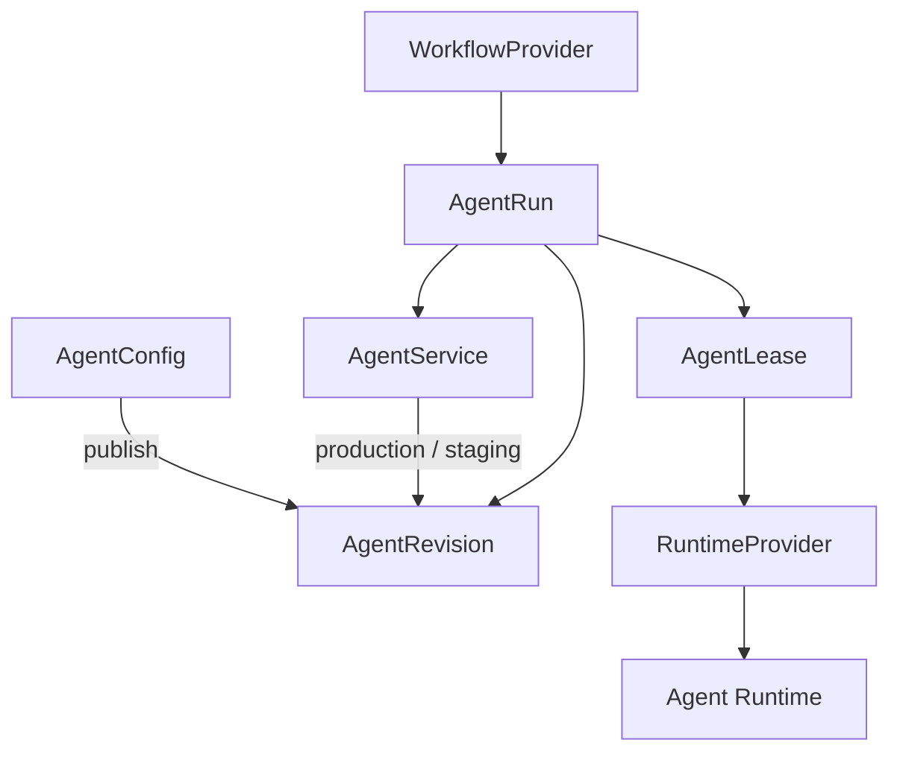

# another-agentic-platform

A Kubernetes-native platform for running **durable, versioned, independently
addressable AI agent services on disposable compute**.

> **Status: design, and the first code of the v0 operator.** Formerly the `lightbridge-agents` draft.
>
> The first operator (v0: adam-rs agents from `AgentService` and `AgentConfig` on native Kubernetes) is specified in [§59a](docs/architecture/10-control-plane-and-crds.md#59a-operator-v0-adam-rs-agents). Slices S1 to S8 are built: the Cargo workspace, the CRD types, the CRDs and the examples (S1); the pure core that validates and resolves them, with parity goldens against the adam-rs chart (S2); the provider traits and their conformance testkit (S3); the `RuntimeProvider` on native Kubernetes (S4: proven against a fake API server, and against a real one only once the `runtime-kubernetes` CI job has run); the controllers, the referenced-Secret store and `operator run` (S5: proven against a fake API server and against a bare kube-apiserver; the pods half, in kind, is *unverified* until the `operator-e2e` CI job has run); the operator-owned CloudNativePG store (S6: proven against a fake API server, and against a real CloudNativePG only once the `store-cnpg` CI job has run). the agent registry the operator serves, with its document read by the system's own reader, vendored (S7: proven against a fake directory and against a bare kube-apiserver; a pod reading it, in kind, is *unverified* until the `operator-e2e` CI job has run); the operator's image, its Helm chart and the CRDs chart, and the workflow that builds, pushes and bumps the image (S8: rendered, linted and checked with kubeconform; **not installed on a cluster, and the image not built, until the `operator-image` CI workflow has run**). Nothing else of the architecture is built.

An agent is a stable logical service — not a Pod, a model, a workspace or a
process. It has a stable identity, immutable revisions selected through
release channels, explicitly enabled protocol surfaces (A2A, MCP, Responses),
reusable tools and environments, and compute that exists only while a lease
needs it.



## Documents

| Document | What it covers |
|---|---|
| [Architecture](docs/architecture/README.md) | The full design in 12 topic files: overview, domain model, interfaces, workflows, runtime, environments & storage, tools, security, operations, control plane & CRDs, decisions, summary |
| [MVP](docs/mvp.md) | The v0 cut (scenarios A–C, plus D for free) and build order |
| [Release-channels A2A extension](docs/extensions/release-channels-v1.md) | How any A2A client discovers and selects an agent's channels/revisions |
| [Agent registry](docs/extensions/agent-registry-v1.md) | How any client lists the fleet's A2A agents: a linkset of agent cards |

## Workspace

One Cargo workspace ([§59a](docs/architecture/10-control-plane-and-crds.md#59a-operator-v0-adam-rs-agents), "Workspace layout"); crates are prefixed `aap-`. Built so far:

| Path | What |
|---|---|
| [`crates/api`](crates/api/README.md) | `aap-api`: the `AgentService` and `AgentConfig` types, their CEL rules, `crds()` |
| [`crates/ports`](crates/ports/README.md) | `aap-ports`: the traits `RuntimeProvider`, `StoreProvisioner` and `AgentDirectory`, their neutral types (`RuntimeSpec`, `EnvValue`, `SecretRef`, `RuntimeStatus`, …), and with the feature `testkit` the conformance macros and `Memory` implementations |
| [`crates/domain`](crates/domain/README.md) | `aap-domain`: pure `validate` and `resolve` into a `RuntimeSpec` with a sha256 digest; **the env contract of `adam-coder` and `adam-agent` lives only here**, held equal to the adam-rs chart by [parity goldens](crates/domain/tests/golden/README.md) |
| [`crates/runtime-kubernetes`](crates/runtime-kubernetes/README.md) | `aap-runtime-kubernetes`: `RuntimeProvider` on native Kubernetes: a `RuntimeSpec` into StatefulSet or Deployment, Service, NetworkPolicy, ConfigMaps and claims by server-side apply, the adoption guard, `RuntimeStatus` from pods, `deletionPolicy`, `watch()`; golden YAML of the examples, a fake API server, and the conformance suite against a real cluster |
| [`crates/store-secret`](crates/store-secret/README.md) | `aap-store-secret`: `StoreProvisioner` for a referenced Secret: it reports the reference and never reads a Secret (the operator has no RBAC on Secrets) |
| [`crates/store-cnpg`](crates/store-cnpg/README.md) | `aap-store-cnpg`: `StoreProvisioner` for an operator-owned CloudNativePG `Cluster` `<service>-db`: server-side apply through the dynamic API, the reference to its `<cluster>-app` Secret (never read), readiness from its status, `deletionPolicy`, and `NotInstalled` without the CloudNativePG API |
| [`crates/registry`](crates/registry/README.md) | `aap-registry`: the `agent-registry/v1` document builder and an axum router: one static bearer compared in constant time, strong `ETag` and `304`, `Cache-Control: private, max-age=30`, a refusal rather than a truncation past 500 items or 1 MiB; the system's reader is vendored in its tests |
| [`crates/controller`](crates/controller/README.md) | `aap-controller`: the `AgentService` and `AgentConfig` reconcilers (kube-rs), generic over the two providers: finalizer, `resolve`, store, runtime, conditions and state, Events, the deletion policy, back-off by error class; and `ReflectorDirectory`, the `AgentDirectory` over the reflector's cache |
| [`bin/operator`](bin/operator/README.md) | `aap-operator`, binary `operator`: `crdgen` prints the CRDs; `run` composes the Kubernetes provider, the store (CloudNativePG, with `store-cnpg`) and the controllers, with health (8081), metrics (9090) and, with a token, the registry (8080); `tests/cluster.rs` and `tests/stub` are the end-to-end against a real cluster |
| [`deploy/crds`](deploy/crds/agents.vymalo.com.yaml) | The generated CRDs, checked in; CI fails when `crdgen` prints something else |
| [`docker/operator`](docker/operator/Dockerfile) | The operator's image, `ghcr.io/vymalo/another-agentic-platform/operator`: cargo-chef on Rust 1.94.1 onto `distroless/cc-debian13:nonroot`, both pinned by tag and digest, user 65532, only the `operator` binary |
| [`deploy/operator`](deploy/operator/README.md) | The operator's Helm chart: one replica (`Recreate`, no leader election), a namespaced `Role` with exactly the verbs of the crates' READMEs (no Secrets), the registry's Service and token file only with a token (an existing Secret or an ExternalSecret), a NetworkPolicy, `bump-tag.sh`, render checks with golden renders |
| [`deploy/operator-crds`](deploy/operator-crds/README.md) | A chart of the CRDs only (its own Argo CD app, §93): a copy of `deploy/crds`, held equal by a test |
| [`tools/adam-parity`](tools/adam-parity/regen.sh) | Regenerates the parity goldens from the adam-rs chart (by hand: needs helm and a clone of adam-rs) |
| [`examples`](examples/coder.yaml) | `coder.yaml` and `chat.yaml` (a service and its config each), and [`invalid/`](examples/invalid), one object per CEL rule, each refused by an API server |

```sh
cargo fmt --all --check
cargo clippy --workspace --all-targets --locked -- -D warnings
cargo test --workspace --locked
cargo run -q -p aap-operator -- crdgen | diff deploy/crds/agents.vymalo.com.yaml -   # the drift check
```

CI is [`.github/workflows/operator.yml`](.github/workflows/operator.yml): the four checks above, and a `kind` job that applies the CRDs, the examples and the invalid examples to a real API server; and [`.github/workflows/operator-image.yml`](.github/workflows/operator-image.yml): the charts' checks, the image built and smoke-tested, then on `main` pushed as `sha-<7>` and `latest`, and the tag bump in `deploy/operator/values.yaml`. The parity goldens are *tested* in CI (against the checked-in files) but *regenerated* by hand: [`tools/adam-parity/regen.sh`](tools/adam-parity/regen.sh) needs helm and a clone of another repository.

## Related

- **another-agentic-system** — a protocol-agnostic orchestration layer (chat
  surface + stateless orchestrator). It consumes agents over A2A, MCP and
  webhooks like any other system; when an agent comes from this platform, it
  offers release selection through the extension above.
- **vymalo/another-adam-rs** — the agent harness (AD-022): `adam-coder` and
  `adam-agent`, one image, which the v0 operator runs.
- **vymalo/another-agentic-images** — the toolchain image recipe (Rust, Flutter/Dart,
  Node, agent CLIs under `/opt`) coding runtimes start from.

## License

[MIT](LICENSE). Vendored agent skills keep their own licenses; see
[third-party-notices.md](third-party-notices.md).
