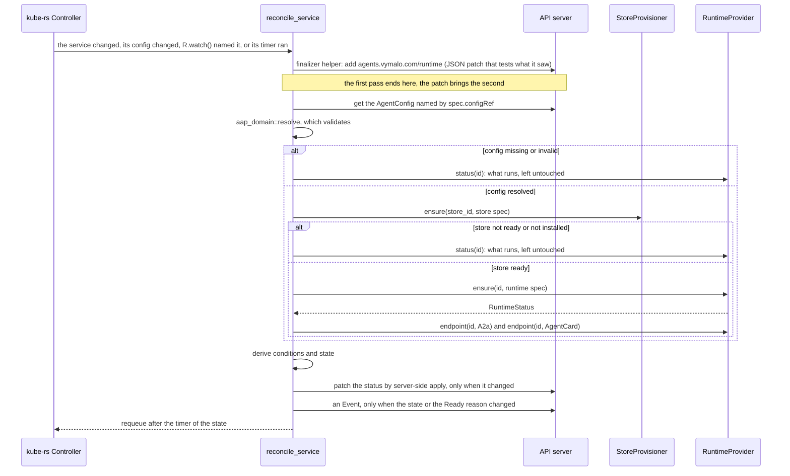
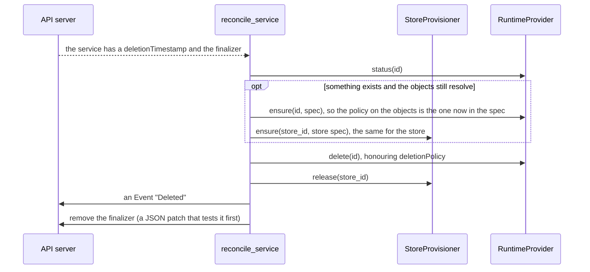
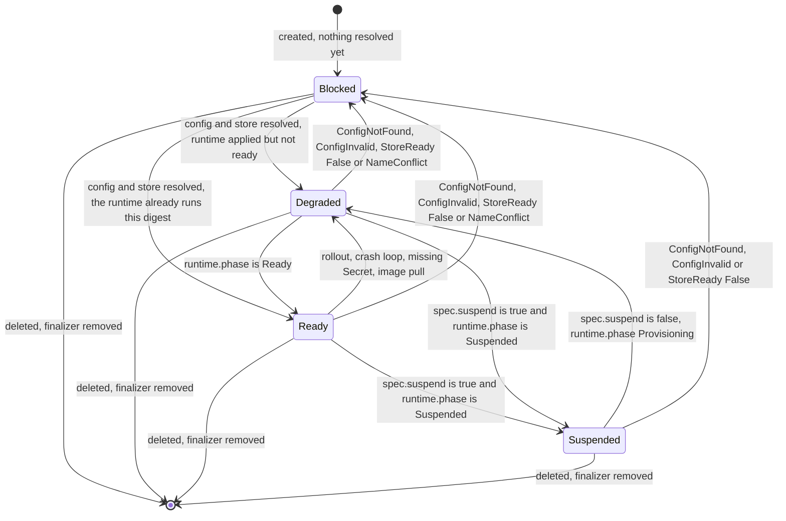

# aap-controller

The reconcilers of the v0 operator ([§59a](../../docs/architecture/10-control-plane-and-crds.md#reconciliation),
AD-020): two kube-rs controllers, one for `AgentService` and one for `AgentConfig`, generic over
`<R: RuntimeProvider, S: StoreProvisioner>` from [`aap-ports`](../ports/README.md). The binary
([`bin/operator`](../../bin/operator/README.md)) is what names the provider types.

```rust
let operator = Operator::new(client, runtime, store, owner_of, Options::default());
let (ready, metrics, directory) = (operator.readiness(), operator.metrics(), operator.directory());
operator.run(shutdown_signal).await;      // until `shutdown_signal` resolves, then the passes in flight finish
```

**No Kubernetes type is in a port's signature.** `kube` appears here, in the controller, which is its job: it reads the
two custom resources of [`aap-api`](../api/README.md) and writes their status. A provider's own notion of ownership
travels as the opaque `OwnerHandle` that the composition root's `OwnerOf` function makes from the object (see
*Deviations*).

| Item | What |
|---|---|
| `Operator::new(client, runtime, store, owner, options)` | wires both controllers to their triggers; nothing runs until `run` |
| `Operator::run(shutdown)` | runs both controllers; returns after `shutdown` resolves and the passes in flight finish |
| `Operator::directory()` | a `ReflectorDirectory`: the `AgentDirectory` over the services controller's cache |
| `Operator::readiness()`, `metrics()` | a `Readiness` handle (both caches have listed the cluster) and the `Metrics` counters, for `/readyz` and `/metrics` |
| `reconcile_service`, `service_error_policy`, `reconcile_config`, `config_error_policy` | one pass of each reconciler, public so a test can drive it |
| `derive::{derive, Observed, ConfigOutcome, StoreOutcome}` | the pure part: what a pass saw, as conditions and a state |
| `Options { watch_namespace, registry, registry_full, resync, concurrency, instance }` | the settings; `RegistryMode::{Disabled, Enabled}`, `registry_full` an `Arc<AtomicBool>` the composition root shares with the registry (the controller depends on no registry crate), `Resync { settled, pending, not_installed }` |
| `Context`, `ConfigContext` | what a reconciler is given; `with_clock`, `with_metrics` |
| `FINALIZER`, `FIELD_MANAGER` | `agents.vymalo.com/runtime` and `aap-operator` |
| `Error` | each variant has a class (`aap_ports::Classify`); the error policy decides from the class |
| `backoff(class, attempt)` | the wait after a failed pass |

## One pass over an `AgentService`



Deletion is the finalizer's other branch:



A pass that fails (a provider or the API server cannot be reached) returns an `Error`, which the error policy turns
into a wait by class and a log line; the status is not rewritten, because the pass learned nothing. What a pass
*finds* is a status and the pass succeeds.

### The status

`derive` is §59a's table and state diagram:

| Condition | True | False | Unknown (not in §59a's table) |
|---|---|---|---|
| `ConfigResolved` | `Resolved` | `ConfigNotFound`, `ConfigInvalid` | |
| `StoreReady` | `SecretReferenced`, `ClusterReady` | `CNPGNotInstalled`, `ClusterNotReady` | `ConfigNotResolved`: the store is looked at once the config resolves |
| `RuntimeReady` | `Ready` | `Provisioning`, `Suspended`, `MissingSecret`, `ConfigRejected`, `DependencyUnavailable`, `ImagePull`, `CrashLoop`, `NameConflict` | `NotObserved`, `NotCreated` (no workload exists) |
| `Listed` | `Listed` | `RegistryDisabled` (no registry served: no token), `A2ADisabled`, `ServiceBlocked`, `RegistryFull` | `NoEndpoint` |
| `Ready` | `Reconciled` | the reason of the first of the first three that is not true | the same |

`RegistryFull` is the registry's (S7): `Options::registry_full`, a flag the registry sets while its document would pass a limit, is read at each pass, and a service that would be listed then says `Listed: False`, reason `RegistryFull` (one that is not listable anyway keeps `A2ADisabled` or `ServiceBlocked`). A change of the flag reaches a service at its next pass, at most one resync later. `Listed` informs and never gates `Ready`. The runtime reason is the most actionable of the issues
the provider reports (`NameConflict`, `MissingSecret`, `ConfigRejected`, `DependencyUnavailable`, `ImagePull`,
`CrashLoop`, in that order). A condition keeps its `lastTransitionTime` until its status changes, so a pass that finds
nothing new writes nothing.



The rule, as `derive::state` has it: a false or unknown `ConfigResolved` or `StoreReady`, or a `NameConflict` issue, is
`Blocked` (**the operator does not apply the desired state and leaves what runs untouched**: it asks the provider for
its `status`, never `ensure`); `spec.suspend` with phase `Suspended` is `Suspended`; phase `Ready` is `Ready`; anything
else is `Degraded`. While blocked, `status.config` and `status.endpoints` stay as they were (what runs was resolved
from them) and `status.runtime` is what the provider reports now.

### What triggers a pass

| Trigger | How |
|---|---|
| the service itself | `Controller::new` over the services (all namespaces, or `Options::watch_namespace`) |
| an `AgentConfig` | `Controller::watches`, mapped through the services' reflector to every service of that namespace whose `spec.configRef.name` is the config |
| a runtime changed | `Controller::reconcile_on` over `RuntimeProvider::watch()`: the id's scope and name are the service's. Ids of other namespaces (when namespaced) and of unknown services are ignored. **A hint, never the truth** |
| the timer | each pass returns `Action::requeue(Resync)`: 5 minutes when `Ready` or `Suspended` or when only a change of the objects can help (a missing or invalid config), 15 s when rolling out, unwell or held by a foreign object, 60 s when a store backend is not installed |
| not a trigger: a Secret | §59a gives the operator no right on Secrets (AD-024), so it cannot watch them. A Secret that appears reaches the controller through the pod, and the runtime's watch |

### Failure and back-off

`Error::class()` decides, never the variant (`ErrorClass` from `aap-ports`). The wait after the *n*th failure in a row of an
object (the count resets on a pass that succeeds):

| Class | Wait |
|---|---|
| `Transient`, `Conflict` | 5 s doubling to 5 minutes |
| `NotFound` | 5 s |
| `Internal` | 30 s doubling to 10 minutes (a bug, or the operator's own RBAC: a person fixes it) |
| `Invalid`, `Unsupported` | 10 minutes (the same input never succeeds; a change of the object brings the next pass sooner) |

A 422 or 409 on the **finalizer's** JSON patch is classed `Conflict`, not `Invalid`: the patch `test`s what it saw and
fails when an earlier pass already changed the finalizers (a pass on a stale cache). The real API server does say 422
there (seen on 2026-10-05 against kube-apiserver v1.35.8, see *Tests*).

### Events

An Event (`events.k8s.io/v1`, reporter `aap-operator`) when the `state` or the reason of `Ready` changes: reason is that
reason (`Reconciled`, `Provisioning`, `Suspended`, `ConfigInvalid`, `MissingSecret`, `NameConflict`, …), type `Normal`
for `Reconciled`, `Provisioning` and `Suspended` and `Warning` otherwise, note the condition's message, at most 1000
characters. One more on deletion (`Deleted`, which volumes and databases were kept). Events are a courtesy: a failure to
write one is logged and fails nothing.

### Deletion, and the deletion policy

The finalizer `agents.vymalo.com/runtime` is added before anything is created. On deletion the controller calls
`RuntimeProvider::delete`, then `StoreProvisioner::release`, then the finalizer is removed; a failure keeps the finalizer
and the pass is retried. The policy a provider honours is the one **of its last `ensure`**, which it remembers on the
objects it made. A person who sets `deletionPolicy: Retain` and deletes in one breath has had no pass in between, and the
provider would still hold `Delete`, which loses data. So when something exists and the objects still resolve, the
controller applies them once more before it deletes; whatever does not resolve, or is refused by a provider, leaves the
remembered policy standing. `a_policy_changed_just_before_the_delete_is_the_one_honoured` holds it.

## `ReflectorDirectory`

The `AgentDirectory` (S3) over the services controller's reflector. **The controller feeds it by doing what it already
does**: it patches each status, the watch brings the change into the cache, and the directory reads the cache; a read
never touches the API server. `list()` is ordered by namespace and name, leaves out a service being deleted, and is
`DirectoryError::NotReady` until the reflector has listed the cluster (never an empty list that looks true). A service
the controller has not reconciled, or that is `Blocked`, is `blocked: true`, so a registry never lists what the
operator has not applied.

## Metrics

`Metrics` is a few counters in Prometheus text (no client library): `aap_reconcile_total{controller,result}`,
`aap_reconcile_errors_total{controller,class}`, `aap_status_patches_total{controller}`,
`aap_service_state_changes_total{state}`, `aap_runtime_signals_total`, `aap_services_deleted_total`.

## Deviations from §59a

| §59a, or the S5 brief | This crate | Why |
|---|---|---|
| "The `AgentService` controller … `RuntimeProvider::status`" | `ensure`'s returned status is the runtime's status after a pass that applied something; `status(id)` is read in every pass that did **not** (blocked ones) | `ensure` returns the status computed right after the apply, which is what `status` would say; asking again is a second list of pods. A blocked pass has no `ensure`, and it is the status of what runs untouched |
| (the brief) the controller uses `owner_handle` of `aap-runtime-kubernetes` | The controller takes an `OwnerOf` function from the composition root, which builds it with `aap_runtime_kubernetes::owner_handle` | The encoding of an owner is the provider's. A controller that imported it would no longer be generic over the provider (AD-020), and a second provider would need a second controller |
| `Controller::reconcile_on` | kube's `unstable-runtime` feature | It is the only way kube-rs 4.0.0 takes a trigger that is a stream of ids (`RuntimeProvider::watch`). *Verified 2026-10-05*, `kube-runtime-4.0.0/src/controller/mod.rs`: `reconcile_on` is behind `unstable-runtime-reconcile-on`. The version is pinned by `Cargo.lock`; the call is one line in `operator.rs`, and a stable replacement (a `watches_stream` over a stream of objects, which is also unstable) would not be simpler |
| `Listed`: `RegistryDisabled` | Every service gets `Listed: False`, reason `RegistryDisabled`, from `RegistryMode::Disabled`, which `operator run` sets when it has no registry token or no `registry` feature | Fail closed: the condition says so instead of staying absent |
| `Listed`: `RegistryFull` on "every service" | On every service that would otherwise be listed, from a flag the registry sets; a service that is not listable keeps its own reason; it follows the flag at the service's next pass | The controller cannot know the registry's byte size, and §59a gives no mechanism. The flag is the smallest one that keeps the controller free of a registry crate (AD-020) |
| the reason tables of "Status" | A provider that refuses a spec the domain accepted (`RuntimeError::InvalidSpec`/`Unsupported`, for example Kubernetes refusing a changed StatefulSet claim template) is `ConfigResolved: False`, reason `ConfigInvalid`, with the provider's words: `Blocked`, nothing applied. A store provisioner that does not serve a kind (or whose backend is absent) is `StoreReady: False`, reason `CNPGNotInstalled` | The tables have no better reason for a spec nobody can apply, and "someone has to change the objects" is what `ConfigInvalid` says |
| the reason tables | `Unknown` conditions with the reasons `ConfigNotResolved`, `NotObserved`, `NotCreated`, `NoEndpoint` | A condition not yet evaluated is `Unknown`, as Kubernetes convention has it; the reason is required and the tables name none |
| the brief: "store-secret checks the Secret and its key exist" | It does not. See [`aap-store-secret`](../store-secret/README.md) | AD-024 and §59a: the operator has no RBAC on Secrets and "cannot check that a referenced Secret exists". A missing one is the condition `RuntimeReady: MissingSecret`, from the pod |
| (not in §59a) timers and back-off | The numbers above | §59a gives none |
| (not in §59a) delete-time policy sync | Described under *Deletion* | A change of `deletionPolicy` followed at once by a delete must not lose data |
| `status` of `AgentConfig` | `observedGeneration` and the condition `Valid` (True/`Valid`, False/`ConfigInvalid`), from `aap_domain::validate_config`, a function this slice added to `aap-domain` for the config's own rules | `validate` takes both objects |
| (the brief) leader election "only if §59a asks" | None | §59a: "One replica, `Recreate`, no leader election" |

## Cluster rights

For the chart of S8, in the namespaces watched (the runtime provider's own are in
[its README](../runtime-kubernetes/README.md#cluster-rights)):

| Resources | Verbs |
|---|---|
| `agentservices`, `agentconfigs` (`agents.vymalo.com`) | `get list watch patch` (`patch` also writes `metadata.finalizers`) |
| `agentservices/status`, `agentconfigs/status` | `patch` (server-side apply under `aap-operator`) |
| `events` (`events.k8s.io`) | `create patch` |

**No right on Secrets**, and none on `agentservices/finalizers`: owner references are made without `blockOwnerDeletion`.

## Tests

`cargo test -p aap-controller` (nothing needs a cluster):

| File | What |
|---|---|
| `tests/reconcile.rs` | one pass at a time, the **real `kube::Client`** against a fake API server (`tests/support`: JSON patches of the finalizer with their `test`, server-side apply of `/status`, Events, 404s as the server words them) and the `Memory` providers of `aap-ports`: the first pass only adds the finalizer; create → Ready with every condition, endpoints, digest, owner, one Event; a second pass writes nothing; a changed config is a new digest; an invalid config blocks and leaves what runs untouched, and fixing it unblocks; a missing config; a missing Secret, each runtime issue, a rollout in progress; a `NameConflict` that clears; suspend and resume; a provider without `suspend`; a spec a provider refuses; a store without CloudNativePG, a cluster not ready; a served registry lists a ready service, and a full one makes it `Listed: False` / `RegistryFull` without making it unready; delete under `Retain` and under `Delete`, a policy changed just before the delete, a service that never got a runtime, a delete that fails and keeps the finalizer; back-off by class and its reset; API failures by class; the `AgentConfig` `Valid` condition |
| `tests/operator.rs` | `Operator::run` against the fake's **list and watch**: a service that appears is reconciled and listed in the directory, a changed config reconciles the services that name it, an id from `RuntimeProvider::watch()` reconciles its service (no object changed), another namespace is left alone, a deletion runs the finalizer, the controllers stop when told to |
| `tests/pure.rs` | `derive`: the five conditions in order, the transition time kept, the state rule row by row, the first false reason on `Ready`, the issue that speaks, `Listed` with a registry (and `RegistryFull`); `backoff`; the counters' text; the directory over a reflector's cache |

`tests/support/scripted.rs` wraps `MemoryRuntime`: the in-memory one resets a forced status on every `ensure` and speaks on
every `ensure` (which, in a running controller, is a reason to run another pass forever), so a test scripts what
the runtime reports and sends the signals of `watch()` itself.

### What is not tested here

* **A real API server.** The fake is not one: no CRD schema or CEL, no resource versions to resume a watch from, no
  server-side apply semantics beyond "the status becomes what was applied". `bin/operator/tests/cluster.rs` runs the same
  flows against a real one (and found the 422 above); read [`bin/operator`](../../bin/operator/README.md#tests) for what
  has and has not been run.
* A watch that breaks and resumes, a lost signal the timer has to find, and a reflector under load.
