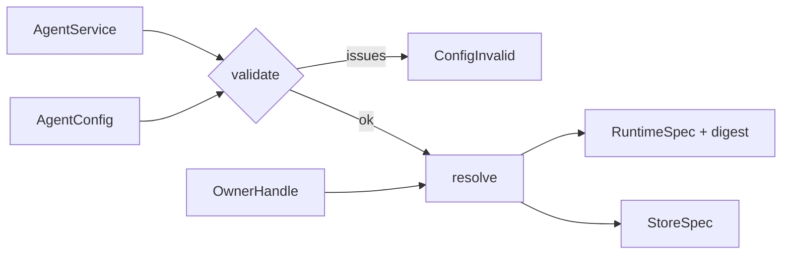

# aap-domain

The pure core of the v0 operator ([§59a](../../docs/architecture/10-control-plane-and-crds.md#59a-operator-v0-adam-rs-agents)):

* **`validate(&AgentService, &AgentConfig) -> Result<(), Vec<ConfigIssue>>`**: the rules §59a leaves to
  the reconciler (the ones `aap-api` could not put in CEL, and the cross-object ones).
* **`resolve(&AgentService, &AgentConfig, OwnerHandle) -> Result<ResolvedAgent, Vec<ConfigIssue>>`**: the
  `RuntimeSpec` of the agent, the `StoreSpec` of its ledger and the sha256 **digest** the pods are
  stamped with.
* **The env contract** of `adam-coder` and `adam-agent`: every variable name, default and rule of
  §59a's table is in this crate and only here ([`src/contract.rs`](src/contract.rs),
  [`src/resolve.rs`](src/resolve.rs)).

It is **pure**: no async, no I/O, no Kubernetes client, no clock, no randomness, no environment
variable. The inputs are `aap-api`'s objects; the outputs are `aap-ports`' neutral types; no
`k8s-openapi` type is in a public signature (the crate names a few internally, in
[`src/convert.rs`](src/convert.rs), to read the selectors and quantities `aap-api` embeds). The same input always gives the
same output, the digest included.

Dependency direction, as §59a's table has it: `aap-domain` depends on `aap-api` (inputs) and `aap-ports`
(outputs); `aap-ports` depends on neither.

## Public API

| Item | What |
|---|---|
| `validate(service, config)` | every issue found, in a fixed order (the service's, then the config's), or `Ok(())` |
| `ConfigIssue { field, message }` | one reason an object pair cannot be resolved; `field` is `AgentConfig spec.tools.mcpServers[search].url`. The controller joins them into the `ConfigInvalid` condition. (Named apart from `aap_ports::Issue`, which is a runtime's) |
| `resolve(service, config, owner)` | `validate`, then the specs. The owner is the opaque handle the controller got from the object; it is copied into the specs unread and is not part of the digest |
| `ResolvedAgent { id, store_id, runtime, store, digest, public_url }` | what the controller needs to reconcile. `runtime.digest == digest` |
| `spec_digest(&RuntimeSpec)`, `digest_json`, `canonical_json` | the digest and the canonical serialisation it is of, so a provider or a test can recompute it |
| `contract` | the names, paths, ports, probe periods, sidecar command and defaults of adam, as constants (`contract::env::OPERATOR_SET` lists every variable the operator may set) |

## What `resolve` makes

One `Workload` per process kind: a `combined` service has one (role `All`, `<svc>`, `scaling.workers`
replicas); a `split` one has the workers (`<svc>`, role `Worker`) and the front (`<svc>-front`, role
`ControlPlane`, `scaling.front.replicas`). The table of §59a, row by row, is
[`tests/examples.rs`](tests/examples.rs); what it is held to is the chart, below.

* **Roles read what they need.** Workers have the model, GitHub, workspace and MCP settings, the
  volumes, the sidecar and the key file; the front has `ROLE`, `PUBLIC_URL`, `A2A_BEARER_TOKENS`,
  `DATABASE_URL`, `extraEnv` and (for `adam-agent`) the folder, and nothing else; a worker does not get
  `PUBLIC_URL` or the tokens (§59a, the chart's `statefulset.yaml` and `front-deployment.yaml`).
* **`adam-coder`** runs the image's entrypoint and has `MCP_ALLOW_STDIO=true`, the coder's variables and
  `GITHUB_MCP_URL`; **`adam-agent`** runs `tini -- adam-agent`, has `ADAM_AGENT_DIR=/etc/adam/agent`, none
  of the coder's variables and no `MCP_ALLOW_STDIO` (the image does not set it, and `adam-agent` must refuse
  local processes unless its deployment opts in).
* **A secret is a reference.** `…secretRef` fields become `EnvValue::Secret`, the GitHub App key a
  `VolumeSource::SecretFile` mounted at `/var/run/secrets/github-app/private-key.pem` (mode `0440`): a key
  is a file and never a variable. An extra MCP server's header is `Authorization: Bearer ${SEARCH_MCP_TOKEN}`
  in a file set, and the variable `SEARCH_MCP_TOKEN` is a reference to the Secret key of that name
  (§59a: "named by the Secret key"). `tests/secrets.rs` puts sentinels in every Secret name and key of both
  examples, walks the specs, and fails if either is anywhere but a reference, a header variable's name or a
  `${…}` of the MCP file.
* **Files.** An inline folder is an immutable file set `<svc>-agent-<hash8>` (the first eight hex digits of
  the sha256 of its content) mounted read-only at `/etc/adam/agent`; a `configMapRef` is mounted as it is
  (`ExternalFiles`). The extra MCP servers are the file set `<svc>-mcp` (`mcp.json`, `${VAR}` references
  only) mounted at `/etc/adam/extra-mcp`, with `ADAM_EXTRA_MCP_FILE`.
* **The sidecar** `github-mcp`: `tini -- github-mcp-server http --read-only --toolsets
  context,repos,issues,pull_requests --listen-host 127.0.0.1 --port <port>`, an `exec` startup probe on
  loopback, its own small resources, `GITHUB_HOST` only when `host` is set; on workers only.

## The digest

`sha256:<hex>` over a **canonical serialisation** (object keys sorted, no whitespace; written in this crate,
[`src/digest.rs`](src/digest.rs), so another crate turning on `serde_json`'s `preserve_order` cannot move
it) of the `RuntimeSpec` with what is only *applied* set aside: the owner, the deletion policy, `suspend`,
each workload's `replicas` and `min_available`, and who may reach the port. A bigger `scaling.workers`, a
suspend, a different `allowFrom` or a new owner must not roll running pods; a changed image, variable, file,
volume, probe or sidecar must, because adam reads its files and variables at startup only.

* `tests/digest.rs` pins the digest of `examples/coder.yaml` (**an operator upgrade that changes it rolls every
  coder: change it on purpose, and say so in the commit**), checks that what is applied does not move it and
  what a pod runs does (each in its own case, each to a digest no other change gave), that input key order is
  not the input, and runs five `proptest` properties: the same input, the same digest; the order of
  `extraEnv` is irrelevant; scale and owner never move it; a different variable, and a different folder, always do.
* **Limit:** a folder given as `configMapRef` is tracked by the ConfigMap's *name*: the operator is pure and has
  no right to read it, so editing that ConfigMap in place is not a rollout (rename it, or use `files`).

## Validation

Issues are all reported, not the first. Besides the rules of the chart's `_validate.tpl` that §59a lists
(placement values, the work volume per placement, more than one worker needs a placement, `githubMcp.port`,
MCP URL, header and prefix, plain `http` to another machine needs `allowInsecureHttp`, `extraEnv` names), it
checks what the reconciler needs and the schema cannot say:

* `configRef` names the config given, in the same namespace; the service has a name that is a DNS label of at
  most 52 characters (`<name>-front`, `<name>-agent-<hash>`, `<name>-db-app` and the StatefulSet's revision
  label derive from it; the 52 is *unverified* here, from Kubernetes issue 64023) and a namespace.
* **A2A:** `interfaces.a2a.enabled` must be true and `bearerTokensSecretRef` set. adam serves A2A in every
  role that serves anything and exits 78 without a token (no token, no server), so a service with A2A off
  would crash-loop; v0 has no other surface. This makes the `Listed: A2ADisabled` reason unreachable in v0
  (see *Deviations*).
* A header's Secret key must be a variable name, not one the operator sets, and not shared with a different
  Secret; `extraEnv` names must be variable names the operator does not set; an MCP server's name is letters,
  digits, `_` and `-` (the model sees `<name>__<tool>`; *unverified* against every gateway).
* Quantities (volumes, resources, a cluster) parse; mount paths are absolute, not nested in one another or in a
  path the operator mounts; volume names are DNS labels, unique, not the operator's; `scope: agent` only.
* Folder `files` paths are relative with no `..`, the folder is at most 1 MiB, and holds an
  `instructions.md` (`agent/instructions.md` and `agents/<name>/instructions.md` are also found by adam:
  *verified 2026-10-05*, adam-rs `docs/authoring.md` at `0391809`, "Discovery rules").
* `allowFrom` peers set at least one field, an `ipBlock` is not combined with a selector, operators and
  values agree.
* GitHub: `installationId` positive, owners clean (`*` is refused beside other names, as adam does),
  URLs `http(s)` with no user information.
* The **shape rules of the CRD's CEL** (one of two, a block that goes with a binary, the surfaces v0 does not
  serve, `front` only with `split`) are checked again, because `resolve` relies on them and an object that never
  met an API server's CEL (a test, a CRD installed without the rules) must not be resolved into something
  half-made. `tests/validate.rs` runs every file of `examples/invalid` through `validate`.

## Deviations from §59a

Choices where §59a says little or says something this crate could not keep. Each is a decision the owner can
reverse in one place.

| Where §59a says | This crate | Why |
|---|---|---|
| A StatefulSet "when a `perReplica` persistent volume exists", else a Deployment | `Workload::stable_identity` is true for a per-replica volume **or** a `WORKER_ID` taken from the pod name (`affinity`, `isolated`); a provider makes a StatefulSet when it is true | `affinity` pins runs by `WORKER_ID` = the pod name, whose volume is one shared claim: on a Deployment every restart renames the pod and strands the runs it owned (adam-coder README, "Workspace placement": the id must survive restarts, "a StatefulSet pod name") |
| The pods are annotated with the digest of the `RuntimeSpec` | The digest is of the spec **without** scale, suspend, ownership, the deletion policy and the network policy | A bigger `scaling.workers` must not roll the running pods (see *The digest*) |
| `interfaces.a2a.enabled` may be false (`Listed: A2ADisabled`) | `validate` refuses it | adam fails closed without a bearer token and serves nothing else, so the pods would crash-loop with exit 78 |
| `access.allowFrom` is a NetworkPolicy's ingress | An empty list makes **no** policy (it does not deny everything) | The bearer token is the gate; an agent nobody can reach is a worse default. Stated in `aap-ports` |
| The front has the chart's settings | The front's resources (`100m` / `256Mi`, limit `512Mi`) and grace period (30 s) are the chart's `front.*` defaults, **not configurable** | `environment.resources` is sized for workers; v0 has no field for the front's |
| `tools.allowInsecureHttp` → `MCP_ALLOW_INSECURE=true` | Always set when true, whatever the servers (the chart sets it only for a plain-http extra server) | `examples/chat.yaml` has no extra server and needs it for the orchestrator's thread tools |
| `scaling.workers` are the pods; `coder.workers` is `WORKERS` | `adam-agent` gets no `WORKERS` | `AgentConfig` has the knob for the coder only; `adam-agent` keeps its default of 4 |
| `status.endpoints.a2a` is `http://<name>.<ns>.svc:8080/` | `PUBLIC_URL` defaults to the same; the chart's is `….svc.cluster.local` | §59a's own status example; both resolve |
| A changed folder is a rollout | True for `files`; a `configMapRef` folder is tracked by name only | The operator is pure and cannot read the ConfigMap |
| `validate -> Result<(), Vec<Issue>>` | The issue type is `ConfigIssue` | `aap_ports::Issue` is a runtime's `{ role, reason, message }`; two types named `Issue` in one controller would be confusing |

## Parity with the chart

§59a's risk "adam's env contract is copied into `aap-domain`" is handled by **parity goldens**: what the
adam-rs chart `deploy/coder` renders (`helm template`) at the revision §59a cites, `0391809` (*verified
2026-10-05*), for three sets of values equivalent to `examples/coder.yaml` and two variations (`split` with
isolated workers; two affinity workers on a token with a GitHub Enterprise host). `tests/parity.rs` projects
`RuntimeSpec` onto the same shape (as a Kubernetes provider makes the pods) and compares, section by section,
the environment (name and source of every variable), command, mounts, probes, resources, the sidecar, the
volumes and claims, the extra MCP file, the security context, the Service and the budget.

**Not for `adam-agent`**: the chart renders `adam-coder` only (it cannot mount a folder or override the
command), so the folder agent's golden is **written by hand** from `bin/adam-agent/README.md` and the
`Dockerfile` (`tests/golden/chat-env.json`, which says so), and is *verified by reading, not by running*.

How the goldens are regenerated, and the differences that are intended:
[`tests/golden/README.md`](tests/golden/README.md). The check is **local** (helm and a clone of adam-rs); CI
runs the tests against the checked-in goldens only.

## Tests

`cargo test -p aap-domain`:

| File | What |
|---|---|
| `tests/examples.rs` | every row of §59a's table on `coder` and `chat`, and the variations: split, each placement, a token, a pinned installation, a cluster store, a folder from a ConfigMap, no sidecar |
| `tests/validate.rs` | each rule refused with the field it is about; the examples accepted; every `examples/invalid` file refused |
| `tests/digest.rs` | the digest rules above, the pinned digest and the properties |
| `tests/secrets.rs` | the sentinel walk: no secret value in a spec |
| `tests/parity.rs` | the goldens |
| `tests/conformance.rs` | every resolved spec passes `RuntimeSpec::check` and is made by `MemoryRuntime`/`MemoryStore`; `DATABASE_URL` and the provisioner's connection agree |
| `src/*` unit tests | the syntax checks (DNS label, URL, quantity, paths) and the canonical JSON |

Not tested here: anything that needs a cluster (the CEL rules against a real API server are the `kind` job's;
the pods a provider makes from a spec are S4's).
