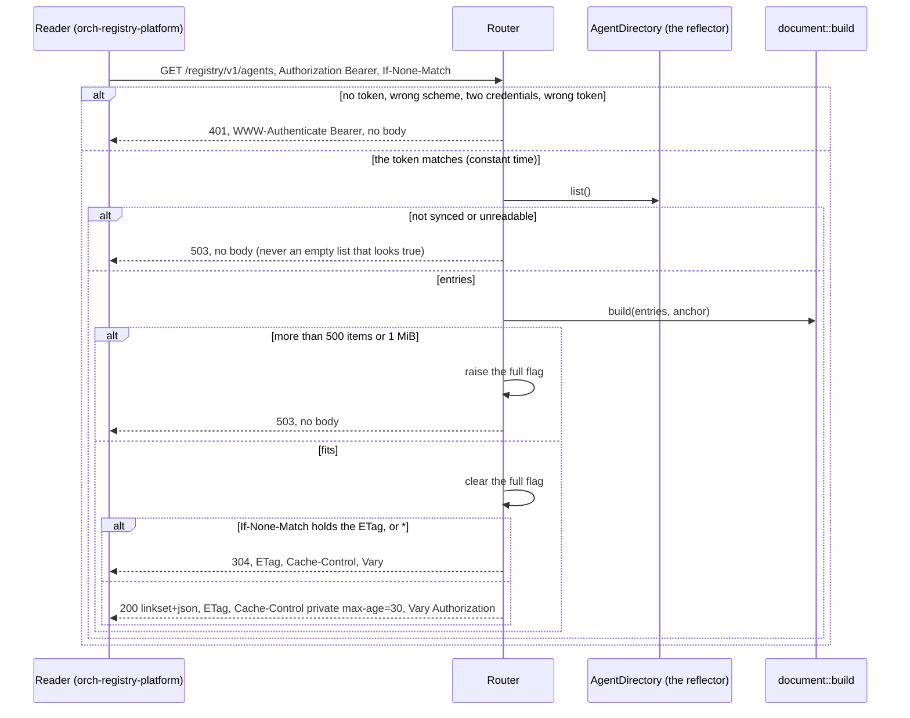
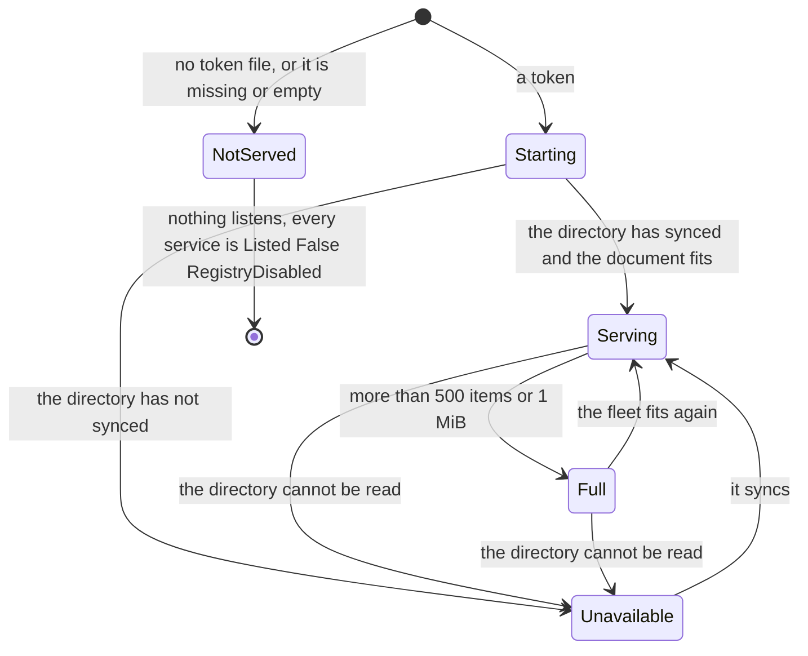

# aap-registry

The **`agent-registry/v1` registry** of the v0 operator
([§59a, "Registry in v0"](../../docs/architecture/10-control-plane-and-crds.md#registry-in-v0), AD-021,
[the contract](../../docs/extensions/agent-registry-v1.md)): a builder of the linkset document from an
[`aap_ports::AgentDirectory`](../ports/README.md), and an axum router that serves it behind one static bearer. The
operator binary mounts it on port 8080; `another-agentic-system`'s `orch-registry-platform` is its first reader.

```rust
let token = aap_registry::Token::from_file(Path::new("/etc/registry/token"))?;      // no token, no registry
let registry = Arc::new(
    aap_registry::Registry::new(operator.directory(), token)
        .with_anchor("http://operator.ns.svc:8080/registry/v1/agents")             // optional
        .with_full_flag(full.clone()),                                              // shared with the controller
);
let router = registry.router();                                                     // GET and HEAD of /registry/v1/agents
```

The crate depends on `aap-ports` and not on the controller or a provider (AD-020). **No Kubernetes type** appears: the
directory is whatever implements the trait, and in the operator that is the controller's reflector.

| Item | What |
|---|---|
| `document::build(entries, anchor)` | pure: entries in, a `Built { body, etag, listed, skipped }` out, or `Overflow` |
| `Registry::new(directory, token)`, `with_anchor`, `with_full_flag` | the server's state |
| `Registry::router()` | `GET` (and so `HEAD`) of `PATH` = `/registry/v1/agents`; another path is `404`, another method `405` |
| `Registry::document()` | read the directory and build, setting the full flag: a request is this plus headers |
| `Token::new`, `Token::from_file`, `Token::matches` | the bearer: held as a SHA-256, compared in constant time with `subtle`; `Debug` prints `<redacted>` |
| `MAX_AGE_SECS` | 30 |

## One request





* **`Serving`** answers `200` and `304`. **`Unavailable`** and **`Full`** answer `503` with no body, which a reader takes
  for "the registry is unavailable" and then lists no platform agents (the contract: fail closed, never stale).
* **`Full`** also sets the flag the controller reads, so every service that would have been listed says `Listed: False`,
  reason `RegistryFull` at its next pass (**at most one resync later**: 5 minutes for a settled service). The operator also
  builds the document every 15 seconds when nobody asks, so the flag follows the directory and not the last request.

## The document

`document::build` lists a service when the directory's own rule holds (`DirectoryEntry::listed`: A2A enabled, not
`Blocked`, with a card URL), **in scope-then-name order**, which is the display order and the same between reads. Then:

| Rule of the contract | What the builder does |
|---|---|
| `href`: absolute `http(s)` URL | the card URL of the service (`status.endpoints.agentCard`), normalised by `url`; a URL that is relative, of another scheme or with credentials is **not listed** (a reader would skip it), and the entry is in `Built::skipped` |
| `service`: `["<id>"]`, `^[a-z0-9][a-z0-9-]{0,62}$` | the `AgentService` name; one that is not a valid id is not listed |
| rule 3: never the same `service` twice | the first by (namespace, name) wins and a later namespace's service of that name is not listed (`skipped`). v0 deployments watch one namespace, so this is a guard and not a design |
| `title` (optional) | `spec.registry.title`, trimmed, at most 200 characters; absent when there is none, and a reader defaults it to the id |
| `tags` (optional, at most 16, 64 characters each) | `spec.registry.tags`: the empty and the over-long are dropped, repeats are dropped, the first 16 kept; absent when none is left |
| `type` | `application/json` |
| the context object | `profile: [{href: "https://agents.vymalo.com/registry/v1"}]`; `anchor` when configured; `item` absent when the list is empty |
| rule 6 / limits: 500 items and 1 MiB, **never truncated** | past either, `Overflow` and a `503` |

No releases, channels, descriptions or configuration are in the document: the contract has no such member (the system's
reader ignores what it does not know, and rule 4 says "nothing else").

The body is compact JSON with members in key order, so the same entries give the same bytes. The **`ETag` is strong**: the
first 128 bits of the SHA-256 of the body, quoted. A change of the `anchor` is a change of the document.

## Serving

| Header | Value |
|---|---|
| `Content-Type` | `application/linkset+json; profile="https://www.rfc-editor.org/info/rfc9727"` |
| `Cache-Control` | `private, max-age=30` (the contract asks for 60 or less) |
| `Vary` | `Authorization` |
| `ETag` | the strong validator. `If-None-Match` with it, with `W/` before it, in a list, or `*` is `304` (the weak comparison RFC 9110 gives that header) |
| `WWW-Authenticate` | `Bearer`, on `401` only |

* **One static bearer.** `Authorization: Bearer <token>`, the scheme case-insensitive, **compared in constant time**: the
  token is held as its SHA-256 and the digests are compared with `subtle`, so neither the token's length nor how much of a
  guess is right shows in the time. Two `Authorization` headers are no credential. A `401` has **no body**, and an
  unauthenticated caller learns nothing, not even a `304`. The token is never in a body, a header, a log line or `Debug`.
* **No token, no registry.** The binary reads `REGISTRY_TOKEN_FILE` once at start (a mounted Secret; the trailing newline is
  not part of it). Unset, missing, unreadable or empty, it serves nothing on the port and logs why. Rotating the Secret is
  a restart (the operator is one replica with `Recreate`, §59a).
* **`HEAD`** has the headers and no body. The `Accept` header is not read: there is one media type.
* **No rate limit and plain HTTP**, behind a NetworkPolicy and a ClusterIP (§59a): the contract wants both outside a
  trusted cluster network.

## Deviations from the contract and from §59a

| The contract, §59a, or the brief | This crate | Why |
|---|---|---|
| `401` or `403` | `401` only | one bearer: there is no caller that is valid and not allowed. §59a lists it |
| the list filtered per caller (`agent.invoke`, §52) | every holder of the token sees every listed service | §59a, v0; an open question in §93 |
| a size cap "which yields `RegistryFull` on the services it leaves out" (the brief) | past 500 items or 1 MiB the registry **lists nothing**, answers `503`, and **every service that would be listed** is `RegistryFull` | §59a: "the operator **refuses rather than truncates**: past either limit it answers `503` and every service gets `Listed=False` `RegistryFull`". The contract forbids truncating, and a service the cap "left out" would be an arbitrary one. A service that is not listable anyway keeps its own, more specific reason (`A2ADisabled`, `ServiceBlocked`) |
| releases on the card (§12a) | none | the contract's items have none, and v0 has no release-channels extension |
| the agent token rule: the registry's consumer sends one token to every agent, which must be one of each service's `A2A_BEARER_TOKENS` | **not checked here** | the operator has no right on Secrets, so no code can check it; it is a deployment rule (§59a). The consumer test below reads the document and says nothing of tokens |
| `Last-Modified` (the contract allows it) | not sent | the `ETag` is enough |
| `anchor` (the contract: a server SHOULD) | sent when `REGISTRY_PUBLIC_URL` is set | the operator does not know the URL it is reached at |
| a service name used in two namespaces (§59a does not say) | listed once, the first namespace in order | the contract forbids a duplicate `service` |

## The consumer's reader

The reader of this contract that matters is the system's: `orchestrator/crates/registry-platform/src/linkset.rs` in
[another-agentic-system](https://github.com/vymalo/another-agentic-system). **It is vendored**, with its unit tests (its
parsing test vectors), in [`tests/vendored/consumer_linkset.rs`](tests/vendored/consumer_linkset.rs), at commit
`e5da0a42d089835a390c57ddbcce37b02c95d76b` (2026-10-05), with one change (`orch_core::is_valid_agent_id` is defined in the
file), so this repository does not depend on that one. [`tests/vendored/UPSTREAM`](tests/vendored/UPSTREAM) says how to
refresh it. Two fixtures come from there too: the contract's own example and the document its compose stack's mock
registry serves.

What the tests hold with it: the fleet's document parses with **nothing skipped**; an empty fleet is an empty list and not
an unreadable one; a document at 500 items is readable; and a property test over arbitrary entries (names that are and are
not ids, odd titles, up to 24 tags, cards that are and are not URLs, listed or not) shows that whatever the directory
holds, the builder either refuses the document or writes one the consumer reads **with no item skipped** and with exactly
the ids the builder says it listed. The HTTP half of the consumer (its cache headers and its fail-closed reading) is
tested in that repository, against its own mock; this crate's `tests/router.rs` is the server's half.

## Tests

```sh
cargo test -p aap-registry
AAP_UPDATE_GOLDENS=1 cargo test -p aap-registry --test document   # rewrite tests/fixtures/golden-document.json, then read the diff
```

| File | What |
|---|---|
| `src/token.rs` unit tests | the token matches only itself, is trimmed, `Debug` hides it, a file is read, a missing or empty one is an error |
| `tests/document.rs` | what is listed and in what order; the same bytes for the same entries in any order; the strong `ETag` follows the body; **the golden document and its `ETag`**; the version marker and the anchor; cards and names a reader would skip are not listed; titles and tags made to fit; the limits are refusals (501 items, and a body past 1 MiB); the ids; the consumer reads the fleet, the empty fleet, the vendored documents and a document of 500 items; the property test |
| `tests/router.rs` | `401` for ten kinds of missing or wrong credential on `GET` and `HEAD`, with no body; the scheme is case-insensitive and the token not; no `304` for the unauthenticated; the headers of the contract; `HEAD`; `304` for the five forms of a match and `200` for the four of a mismatch; a change of the fleet is a new `ETag`; a blocked or A2A-less service leaves the list; an empty fleet; `503` before the directory has synced; past a limit `503`, the flag raised and, when it fits again, cleared; `document()` sets the flag without a request; other paths and methods |
| `bin/operator/tests/cluster.rs` | against a real cluster: the operator serves the registry with a token, lists the Ready agent and not a Blocked one, refuses without the token, answers `304` and `HEAD`, reads the registry and the card it lists **from a pod**, and drops a deleted service; without a token nothing listens |

### What is not tested

* **A pod reading the registry has not been run.** No kind or docker daemon existed where this slice was written. The case
  does it when `AAP_TEST_HOST_ADDR` is set (CI computes the gateway of the docker network `kind`) and is *unverified*
  until the `operator-e2e` job has run. The same case, host side, **was run** against a bare kube-apiserver v1.35.8 on
  2026-10-05 (the controller manager and the kubelet played by the test): all of it passed but the pod.
* A reader over real HTTP and TLS: the registry is plain HTTP in the cluster, and the system's own reader is tested in its
  repository. The two have not been run against each other.
* Behaviour under load, and a registry of more than a few hundred services.
