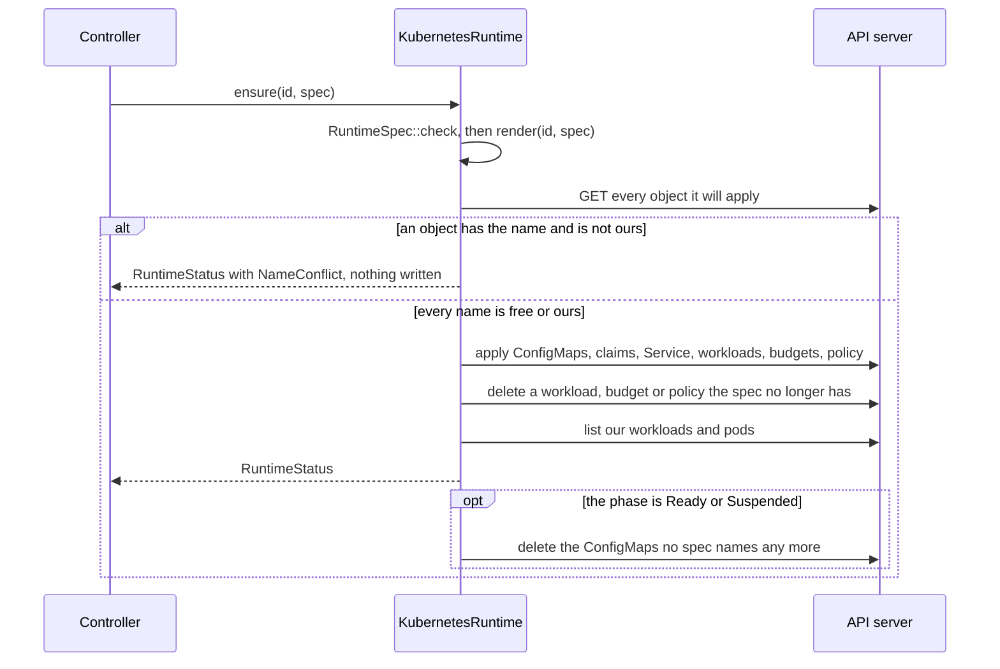
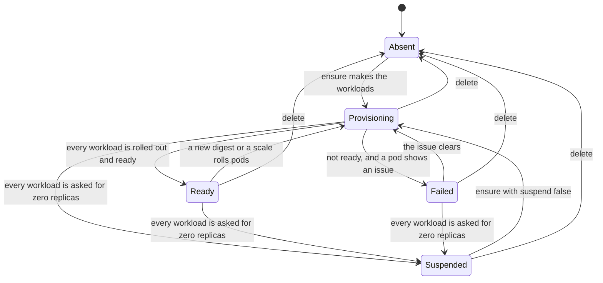

# aap-runtime-kubernetes

`RuntimeProvider` on native Kubernetes ([§23](../../docs/architecture/05-runtime.md#23-native-kubernetes-runtime),
[§59a](../../docs/architecture/10-control-plane-and-crds.md#59a-operator-v0-adam-rs-agents), AD-020, AD-023). It
turns an [`aap_ports::RuntimeSpec`](../ports/README.md) into the objects of an agent, applies them by
**server-side apply**, and reads the pods back as a `RuntimeStatus`.

```rust
let runtime = KubernetesRuntime::try_default().await?;   // in-cluster, or KUBECONFIG
let status = runtime.ensure(&id, &spec).await?;           // a RuntimeSpec from aap_domain::resolve
```

**No Kubernetes type is in any signature the ports define.** `kube` and `k8s-openapi` types appear in this crate's own
constructors (`KubernetesRuntime::new(kube::Client)`) and in the pure modules [`render`](src/render.rs) and
[`status`](src/status.rs), which tests and tooling read. A secret is a `secretKeyRef` or a Secret volume and nothing
else: the provider has no right on Secrets, never reads one, and copies no kubelet message into an issue.

| Item | What |
|---|---|
| `KubernetesRuntime` | the provider. `new(client)`, `try_default()`, `watching_namespace(ns)` |
| `render(id, spec) -> Rendered` | the objects of a spec, pure; `Rendered::documents()` is what the golden files hold |
| `status::compute`, `pod_issues` | workloads and pods into `RuntimeStatus`, pure |
| `owner_handle(api_version, kind, name, uid)` | the encoding of the opaque `OwnerHandle` this provider understands |
| `names` | the labels, annotations and the field manager, as constants |
| `Error` | the provider's errors, each with a class (`aap_ports::Classify`); the trait returns `RuntimeError` |
| feature `testkit` | `impl RuntimeUnderTest for KubernetesRuntime`, to run the conformance suite against your own cluster |

## The objects

| Object | Name | When |
|---|---|---|
| `StatefulSet` | the workload's name (`<svc>`, `<svc>-front`) | `Workload::stable_identity`: a per-replica volume, or a pod name that is a worker's identity (`affinity`, `isolated`) |
| `Deployment` | the same | otherwise |
| `PodDisruptionBudget` | the workload's name | `Workload::min_available` is set (`aap-domain`: a front of more than one replica) |
| `Service` | `<svc>` | always: ClusterIP, port `http` to the named container port, selecting `Network::selects` |
| `NetworkPolicy` | `<svc>` | `Network::allow_from` is not empty: ingress on the container port from those peers, **no egress rule**. An empty list makes no policy (and deletes one an earlier spec made) |
| `ConfigMap` | the `FileSet`'s name | one per file set. A path with `/` is a key by an injective encoding (`skills/review/SKILL.md` is `skills_sreview_sSKILL.md`) and is mounted at its path through `items` |
| `PersistentVolumeClaim` | `<svc>-<volume>` | a `Shared` persistent volume: one ReadWriteMany claim for every replica |
| (the StatefulSet's `volumeClaimTemplates`) | `<volume>`, claims `<volume>-<workload>-<n>` | a `PerReplica` volume: ReadWriteOnce, one per replica |

**The pod template** is the adam-rs chart's `statefulset.yaml`: no service-account token, `runAsNonRoot` with the ids of
`Security`, `seccompProfile: RuntimeDefault`, every container drops all capabilities and refuses privilege escalation,
the probes of the spec on the named port, `WORKER_ID` from the downward API, and the sidecars as **native sidecars**
(init containers with `restartPolicy: Always`). `tests/render.rs` states each of these, and the goldens in
[`tests/golden`](tests/golden) hold the whole of `examples/coder.yaml` (combined and split) and `examples/chat.yaml`.

### Labels, annotations, ownership

| Where | What |
|---|---|
| every object | `app.kubernetes.io/managed-by: aap-operator`, `app.kubernetes.io/instance: <svc>`, `app.kubernetes.io/name` (the workload's name on workloads and pods, `<svc>` elsewhere) |
| workloads and pods | `app.kubernetes.io/component`: `agent` (`Role::All`), `worker`, `front` (`Role::ControlPlane`). The pod selector is `name` and `instance`, which never changes |
| every claim | `agents.vymalo.com/volume: <volume>`, so a delete can say which volumes stay |
| every object but a `volumeClaimTemplate` | the annotation `agents.vymalo.com/config-digest: <RuntimeSpec::digest>`, and the same on the pod template, so a changed folder, file, image or variable is a rollout and nothing else is |
| workloads and shared claims | `agents.vymalo.com/deletion-policy: Retain \| Delete`, the policy of the last `ensure`, which `delete(id)` reads back |
| compute objects | an owner reference built from the `OwnerHandle` (`controller: true`, no `blockOwnerDeletion`) |
| data objects | **none**: not the claims, not the StatefulSet's (it is made with `persistentVolumeClaimRetentionPolicy: Retain` on both counts) |

The `OwnerHandle` is the JSON `{apiVersion, kind, name, uid}` that `owner_handle` writes; the controller reads those four
from the object it reconciles and never looks inside. A handle that is not this encoding (empty, or a test's) stands for
no owner: nothing is garbage collected on its account, and the finalizer's explicit `delete` remains what removes the
compute.

## Applying

Every apply is a server-side apply under the field manager **`aap-operator`** with `force`. §59a does not say where to
force; this provider forces **every** apply, because it is the one writer of the fields it sets and it also moves
`replicas` itself (`suspend`, a merge patch under the same manager name, is a different manager entry for the API
server): without `force` a wake after a suspend, or a `kubectl scale`, would stall the reconcile on a conflict with
nothing to resolve it. What protects objects that are not ours is the adoption guard below, which runs before any apply.



* **Adoption guard.** An object of a name the spec needs that does not carry `managed-by: aap-operator` **and**
  `instance: <svc>` is not ours: `ensure` writes nothing and returns the status of what *is* ours with an issue
  `NameConflict` naming the object (`StatefulSet coder exists and is not managed by aap-operator for this service`).
  `status` says it too while nothing of ours runs. A Helm release's objects (`managed-by: Helm`) block the operator until
  they are pruned; our own label for *another* service blocks it too (`coder-front` the service and the front of `coder`
  would share a Deployment name). The guard reads before it writes; between its read and the apply there is a window
  of one round trip (see *What is not tested*).
* **File sets** are applied immutable, named by content. A superseded one is **not** deleted while pods of the old
  template may still mount it: an `ensure` that finds the phase `Ready` (or `Suspended`) deletes the ConfigMaps no spec
  names. The controller reconciles on a timer, so the next pass does it. A workload that changed kind (StatefulSet to
  Deployment), a budget and a policy the spec no longer has are deleted at once.
* **A StatefulSet's claim templates and selector cannot change**: Kubernetes refuses it (`422`), and that is
  `RuntimeError::InvalidSpec` with the API server's message. Nothing is deleted to make it work.
* **`suspend(id)`** is a JSON merge patch of `spec.replicas: 0` on every workload (a partial server-side apply would
  drop every other field the manager owns), and **keeps everything else, claims included**. `ensure` of a spec whose
  `suspend` is false wakes it; `ensure` of one whose `suspend` is true applies zero replicas.

## Status

`status(id)` lists the workloads and pods that are ours (not those being deleted) and maps them:



* **Rolled out.** A StatefulSet: the controller has seen the current generation, every replica is on the current
  revision and ready. A Deployment: seen, `updated == ready == replicas == desired` (so no pod of an old template is
  left). `replicas` of the status are the ready replicas of the workloads whose role steps runs (`Role::All`, `Worker`),
  never the front's; a suspended runtime reports 0 whatever is still stopping.
* **`Failed`** is "not rolled out, and a pod says why" (the table below). It is what §59a's `Degraded` is made of, with
  `Provisioning`: the controller does not distinguish them beyond the reason.

| Issue | Seen as (on a pod's containers, native sidecars included) |
|---|---|
| `ConfigRejected` | last exit code 78 in `CrashLoopBackOff`, or a container just exited with 78 |
| `DependencyUnavailable` | the same with 69 |
| `MissingSecret { name }` | `CreateContainerConfigError` whose message is about a Secret. The name is read from the message (`secret "x" not found`, `couldn't find key K in Secret ns/x`), or else from the container's own `secretKeyRef`s. The **name is in the reason; the message never holds it** |
| `ImagePull` | `ErrImagePull`, `ImagePullBackOff`, `InvalidImageName` and their kin |
| `CrashLoop` | `CrashLoopBackOff` after any other exit |
| `NameConflict` | the adoption guard, not a pod |

Issues are one per role and reason however many replicas show them, and a pod being deleted shows none. What this
mapping cannot see: a Secret or ConfigMap **volume** whose source is missing never produces a container status (the pod
stays `ContainerCreating`, and the kubelet's word is an Event); the pod is `Provisioning` without an issue. Reading Events
needs another right and is left to a later slice. A `CreateContainerConfigError` that is not about a Secret
(`runAsNonRoot` against an image that runs as root, say) is reported as `ConfigRejected`, the closest reason in the
closed set.

## Deleting

`delete(id)` removes the compute (workloads, Service, budgets, policy, ConfigMaps) by background deletion, so the objects
are gone at once and the pods are collected after. It reads the **policy remembered on the objects** (the annotation of the
last `ensure`; `Retain` when it finds none: data stays unless the policy clearly says otherwise).

| Policy | Claims | `DeleteOutcome::retained_volumes` |
|---|---|---|
| `Retain` | stay, with their labels, **and lose the owner references** that point at a StatefulSet, a Deployment or the custom resource, so nothing garbage-collects them. A service of the same name finds them again: the set that is made by the next `ensure` mounts `<volume>-<svc>-<n>` as before | the volume names (`work`), from the claims and the StatefulSet's templates, so a claim not made yet is named too |
| `Delete` | deleted **after** the compute, so nothing is left to make one again | empty |

What it never touches: Secrets (no right on them), the database (the `StoreProvisioner`'s), and objects that are not this
service's. A second delete finds nothing and says `existed: false`. A crash between deleting the workloads and the claims
loses the policy (it lived on the workloads), and a retry then keeps the data: the failure is on the side of keeping.

## `watch()`

Watches (reflectors, from `kube::runtime::watcher` with a back-off) on StatefulSets, Deployments and **Pods** filtered by
`app.kubernetes.io/managed-by=aap-operator`, in every namespace or in one (`watching_namespace`). A pod is watched
because a crash loop changes a pod and not its set. Each event yields `RuntimeId(namespace, instance)`. The stream is lazy:
it lists on its first poll and reports what it lists too, so a stream that is polled after a change still hears of it. It
is a hint, as the trait says: duplicates and other services' ids are normal, and the controller reads `status`.

## Cluster rights

For the chart of S8. The provider needs, in the namespaces it serves (a `Role`, or a `ClusterRole` for `watch` over every
namespace):

| Resources | Verbs |
|---|---|
| `statefulsets`, `deployments` (apps) | `get list watch patch create delete` |
| `services`, `configmaps`, `persistentvolumeclaims` | `get list patch create delete` |
| `networkpolicies` (networking.k8s.io), `poddisruptionbudgets` (policy) | `get list patch create delete` |
| `pods` | `list watch` |

`patch` and `create` both: a server-side apply of an object that is not there creates it, and Kubernetes authorises that
with both verbs. **No right on Secrets**, and none on the custom resources: the controller's.

## Tests

```sh
cargo test -p aap-runtime-kubernetes                         # all but the cluster; the cluster tests skip
AAP_UPDATE_GOLDENS=1 cargo test -p aap-runtime-kubernetes --test render   # rewrite tests/golden, then read the diff
AAP_TEST_KUBECONFIG=$HOME/.kube/config cargo test -p aap-runtime-kubernetes --test cluster   # a throwaway cluster
```

| File | What |
|---|---|
| `src/*` unit tests | the key encoding, the error classes, the status mapping from crafted Pods (every row of the issue table, the phases, the rollout checks), the plain-text audit |
| `tests/render.rs` | golden YAML of `examples/coder.yaml` (combined and split) and `examples/chat.yaml`, and each rule stated: labels, digest, owner (compute has one, data has none), the chart's pod template, the policy, the budget, shared claims, suspend, no Secret name in plain text, what is refused |
| `tests/api.rs` | the provider against a **fake API server** (`tests/support`): the real requests of a real `kube::Client` against an in-memory store. The order of calls (reads before writes), `fieldManager` and `force`, the guard (no write at all), stale objects, `suspend`, both deletion policies and their order, status from seeded pods, endpoints, failures by class. It is not an API server: no controllers, no validation, no garbage collection |
| `tests/cluster.rs` | against a real API server: `runtime_provider_conformance!` (14 cases) and the cases only a cluster shows (below) |

| Variable | Meaning |
|---|---|
| `AAP_TEST_KUBECONFIG` | the kubeconfig file of the cluster to test. **Unset: the cluster tests skip.** Never the default context |
| `AAP_TEST_REQUIRE_CLUSTER` | `1` or `true`: unset `AAP_TEST_KUBECONFIG` is a failure (CI) |
| `AAP_TEST_REQUIRE_BACKEND` | the same switch inside the `aap-ports` macros (a suite that is skipped fails); CI sets it too |
| `AAP_UPDATE_GOLDENS` | `1`: `tests/render.rs` rewrites its golden files |

The cluster tests create the namespace `aap-test` (the ids of `aap_ports::testkit` live there) and leave what a case does
not delete (the claims of `Retain`): use a cluster you can throw away. The suite's spec names an image that does not exist,
so the **harness** makes the containers runnable: the image becomes `busybox:1.37.0` from the public ECR mirror, pinned
by digest (`sha256:bdf57e52…`, *verified 2026-10-05*: the same index on Docker Hub and on `public.ecr.aws`), the agent
serves `/healthz` with `httpd`, sidecars sleep, and the grace period is 1 s; it also creates the Secrets the spec
references, with a dummy value. Everything else (every object, label and field) is the provider's own.

The cases beyond the suite: a runtime gets `Ready`, its claims outlive a `Retain` delete **and are the same claims
(uids) when the service comes back**, and `Delete` removes them; a foreign StatefulSet is never written to (its spec and
generation are unchanged and no managed field belongs to `aap-operator`) and the runtime is made once its owner removes it; a missing Secret is `MissingSecret`
with the name in the reason and none in the message, and the pod recovers when the Secret appears; a pod that cannot pull,
exits 78, 69 and 1 is `ImagePull`, `ConfigRejected`, `DependencyUnavailable` and `CrashLoop`; an owner's deletion
collects the compute and not the claim; a changed claim template is refused as `Invalid`; a superseded file set is
deleted after the rollout; a Deployment becomes `Ready`; and, with no cluster, a TLS client builds and a refused
connection is `Transient`.

### What is not tested

* **The cluster tests have not been run.** No cluster, kind or docker exists where this slice was written. They compile,
  their skip path was run, and the logic they check is covered by `tests/api.rs` against the fake; what the fake cannot say
  (the API server's refusals, the StatefulSet controller, the kubelet's words, the garbage collector, a watch) is theirs,
  and is *unverified* until the `runtime-kubernetes` job of `.github/workflows/operator.yml` has run them.
* **A race in the adoption guard**: the guard's read and the apply are two requests, so an object that appears between them
  is adopted (the apply would add our labels to it). Closing it needs an apply that fails if the object exists and is not
  ours; Kubernetes has no such precondition for a server-side apply.
* A Secret or ConfigMap volume whose source is missing, a cluster without the native sidecar feature (Kubernetes before
  1.29), and the `watch()` stream surviving an API server restart are not exercised.
