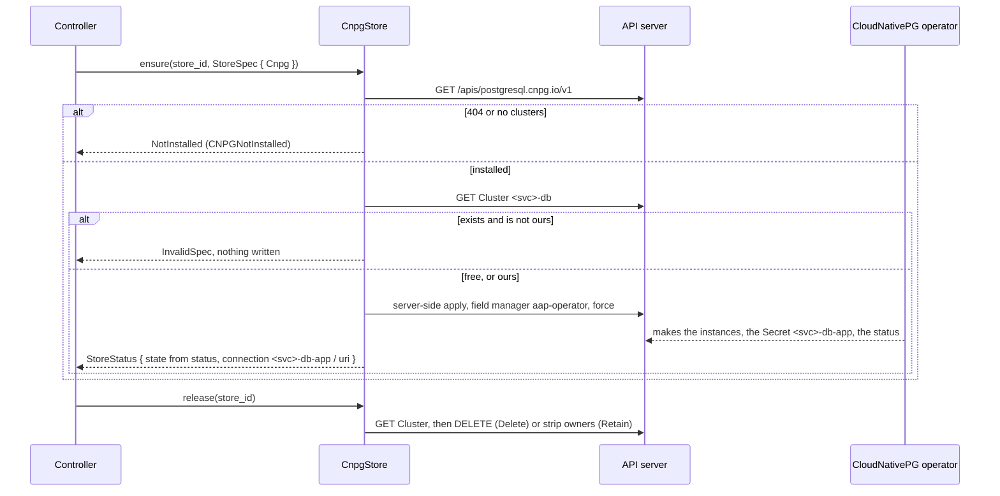
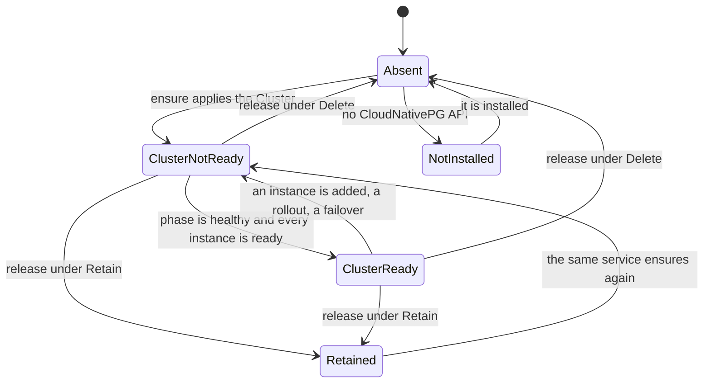

# aap-store-cnpg

`StoreProvisioner` for an **operator-owned CloudNativePG `Cluster`**
([§59a](../../docs/architecture/10-control-plane-and-crds.md#secrets-and-databases), AD-020, AD-024): the store of a
service whose `spec.store.postgres.cnpg` is set. It makes the Cluster `<service>-db`, says where its connection string
is, and says whether the Cluster is ready.

```rust
let store = aap_store_cnpg::CnpgStore::new(client);        // a kube::Client
let status = store.ensure(&id, &spec).await?;               // StoreStatus { state, connection }
// connection = SecretRef { name: "<service>-db-app", key: "uri" }, from aap_ports::cnpg_connection
```

**No Kubernetes type is in any signature the ports define**, and there is no CloudNativePG crate: the Cluster is a
`kube` `DynamicObject`, because the provisioner needs six fields of it and a generated type would tie the operator to one
CloudNativePG release. **It never reads a Secret** (the operator has no right on Secrets, AD-024): `connection` is a
*reference* the runtime provider copies into the pod as a `secretKeyRef` for `DATABASE_URL`.

| Call | Does |
|---|---|
| `capabilities()` | `{ cnpg: true }` |
| `ensure(id, spec)` with `StoreKind::Cnpg(c)` | asks the API server for `postgresql.cnpg.io/v1`, reads `Cluster <service>-db`, and server-side applies it; reports `ClusterReady` or `ClusterNotReady` from the Cluster's status, and `connection` = `<service>-db-app` key `uri` |
| `ensure(id, spec)` with `StoreKind::Secret(r)` | the reference, as [`aap-store-secret`](../store-secret/README.md) does it (this crate holds a `SecretStore` for it): a provisioner passes the whole suite of `aap-ports`, so the composition root names one store type |
| `ensure` of a spec that fails `StoreSpec::check` | `StoreError::InvalidSpec` |
| `ensure` with no CloudNativePG API in the cluster | `StoreError::NotInstalled`: the controller's `StoreReady: False`, reason `CNPGNotInstalled` |
| `ensure` when a Cluster of that name exists and is not ours | `StoreError::InvalidSpec` naming the Cluster, **nothing written**: the controller's `ConfigResolved: False`, reason `ConfigInvalid`, with those words |
| `release(id)` | the Cluster is ours: under `Retain` it stays (any owner reference is removed); under `Delete` it is deleted. `existed` / `retained` say which. Not there, or not ours: `existed: false`, nothing touched |

## What it applies

```yaml
apiVersion: postgresql.cnpg.io/v1
kind: Cluster
metadata:
  name: coder-db                                  # <service>-db
  labels:
    app.kubernetes.io/name: coder-db
    app.kubernetes.io/instance: coder             # the adoption guard checks this label and managed-by
    app.kubernetes.io/managed-by: aap-operator
  annotations:
    agents.vymalo.com/deletion-policy: Retain     # the policy of the last ensure, which release reads back
spec:
  instances: 1                                    # store.postgres.cnpg.instances
  storage: { size: 5Gi, storageClass: longhorn }  # store.postgres.cnpg.storage; no class: the cluster's default
```

Nothing else: no `bootstrap`, `imageName`, `managed.roles` or `Database`. CloudNativePG's defaults make a database `app`
owned by a role `app`, and the Secret `<cluster>-app` for it. The system chart's multi-database Cluster with managed roles
(`another-agentic-system/deploy/chart/templates/cnpg-clusters.yaml`) is **"a `Database` in someone else's Cluster"**, which
§59a defers (server-side-apply co-ownership of `managed.roles` is *unverified*).

* **Field manager `aap-operator`, `force`**, as the runtime provider: it is the one writer of the fields it sets.
* **No owner reference.** The Cluster is data, and §59a says data objects carry none ("garbage collection must not take
  them with the service, so the finalizer deletes them explicitly, and only under `deletionPolicy: Delete`"). The S6
  brief says "labels and owner reference work as in S4"; in S4 data has no owner, and this follows that. `release` under
  `Retain` still strips owner references of any kind, so nothing can make the garbage collector take a kept database.
* **The API is looked up, not assumed.** `GET /apis/postgresql.cnpg.io/v1`; `404`, or an answer without `clusters`, is
  `NotInstalled`. `release` does not look: a `404` of any kind (the object, or the whole API) is "nothing to release", so
  **a cluster without CloudNativePG can still delete its services**. (An API server answers a request for a kind of an
  API it does not have with a plain-text `404 page not found` that is no `Status` object, which `Api::get_opt` does not
  take for "not found"; seen on 2026-10-05 against kube-apiserver v1.35.8, and the first version of this crate broke every
  deletion on such a cluster. `tests/api.rs` and the `operator-e2e` case hold it.)

## Where it sits





**Readiness** is `status.phase == "Cluster in healthy state"` **and** `status.readyInstances >= spec.instances`. The second
part is for the moment after `instances` is raised, when the phase has not yet left healthy. A Cluster with no status is
not ready. The controller does not apply the agent while the store is not ready (`StoreReady: False`,
`ClusterNotReady`): the agent would only exit with 69 until the database answers.

## Facts checked

* *Verified 2026-10-05*, <https://cloudnative-pg.io/docs/devel/applications> (the page of the development docs, which
  `cloudnative-pg.io/documentation/current` redirects to): CloudNativePG creates the Secret `<cluster>-app` for the
  application user; it is of the basic-auth type and holds, among others, the keys `uri`, `jdbc-uri`, `fqdn-uri`,
  `fqdn-jdbc-uri`, `username`, `password`, `host`, `port`, `dbname` and a `.pgpass` file. `uri` is what
  `DATABASE_URL` reads.
* *Verified 2026-10-05*, the release manifest `cnpg-1.30.1.yaml` read from
  <https://github.com/cloudnative-pg/cloudnative-pg/releases/download/v1.30.1/cnpg-1.30.1.yaml> (sha256
  `37237f145d8138256ea25ae830f87759255665ff08f8d552fdd8224a5ec032fb`, the same bytes from the `release-1.30` branch): the
  CRD `clusters.postgresql.cnpg.io` is `v1`, kind `Cluster`, plural `clusters`; `spec.instances` (default 1, minimum 1);
  `spec.storage` has `size` and `storageClass`; `status` has `phase` and `readyInstances` ("the total number of ready
  instances in the cluster"); the operator is `ghcr.io/cloudnative-pg/cloudnative-pg:1.30.1` in `cnpg-system`.
* *Verified 2026-10-05*, <https://cloudnative-pg.io/docs/devel/supported_releases>: 1.30.x supports Kubernetes 1.34, 1.35
  and 1.36 (kind's node image here is 1.35.8) and PostgreSQL 14 to 18.
* **Not read in the source, *unverified* until CI has run it**: that `"Cluster in healthy state"` is the exact string of a
  healthy phase. It is what `kubectl get cluster` shows in the documentation's examples and in third-party write-ups (a web
  search on 2026-10-05); the CloudNativePG constant was not read. The `store-cnpg` job waits for `ClusterReady` of a real
  Cluster, so a different string fails CI rather than going unnoticed. Also *unverified*: that CloudNativePG's name limit
  for a Cluster (the webhook refuses a long one) allows every service name; a refusal is `InvalidSpec` with the API
  server's words.

## Cluster rights

For the chart of S8, in the namespaces watched:

| Resources | Verbs |
|---|---|
| `clusters` (`postgresql.cnpg.io`) | `get patch create delete` |
| the API group's discovery (`/apis/postgresql.cnpg.io/v1`) | `get`, which every authenticated user has |

**No right on Secrets**, none on `databases` or `poolers`, and none on `clusters/status`.

## Feature `testkit`

`impl StoreUnderTest for CnpgStore` (its `materialised` is every string of the Cluster it applied, minus
`managedFields`), so a composition root can run `store_provisioner_conformance!` on it.

## Tests

```sh
cargo test -p aap-store-cnpg                                                  # all but the cluster; the cluster tests skip
AAP_TEST_KUBECONFIG=$HOME/.kube/config cargo test -p aap-store-cnpg --test cluster   # a throwaway cluster with CloudNativePG
```

| File | What |
|---|---|
| `src/*` unit tests | the names, the rendered Cluster (ours, no owner), the adoption test, readiness row by row, the error classes |
| `tests/api.rs` | the seven cases of `store_provisioner_conformance!` and the provisioner's own, against a **fake API server** (`tests/support`: discovery, `GET`, server-side apply, merge patch, `DELETE`, and the plain-text `404` of an API that is not there): the order of calls (discovery, the guard's read, the apply), `fieldManager` and `force`, no owner reference, readiness from status, a changed spec and the policy remembered, CloudNativePG not installed (and the group without `clusters`), a Cluster that is not ours or another service's is never written to, `Retain` strips owners and keeps, `Delete` deletes, a policy that is not read keeps the data, a release with no API, a referenced Secret with no call, `503` and `403` transient, no secret in plain text |
| `tests/cluster.rs` | against a real API server **with CloudNativePG installed**: the same conformance suite (7 cases), a Cluster that becomes `ClusterReady` (minutes: it pulls Postgres), whose Secret `<cluster>-app` the harness reads and finds to hold a `postgresql://` `uri` (the value is never printed), and is gone after `Delete`; a `Retain` Cluster that is the same object (uid) when the service comes back; a Cluster that is not ours, left alone with no field of it managed by the operator |

| Variable | Meaning |
|---|---|
| `AAP_TEST_KUBECONFIG` | the kubeconfig file of the cluster to test. **Unset: the cluster tests skip.** Never the default context |
| `AAP_TEST_REQUIRE_CLUSTER` | `1` or `true`: unset `AAP_TEST_KUBECONFIG` is a failure (CI) |
| `AAP_TEST_REQUIRE_BACKEND` | the same switch inside the `aap-ports` macros; CI sets it too |

Every case names its Clusters itself (`aap_ports::testkit::unique`), so the cases share the namespace `aap-test` without
sharing an object. The cluster tests leave the Clusters of `Retain` (and the conformance suite's, whose storage class
`fast` no kind cluster has, so their volumes stay pending): use a cluster you can throw away.

### What is not tested

* **The cluster tests have not been run.** No kind, docker daemon or CloudNativePG existed where this slice was written.
  They compile, their skip path was run, and the logic they check is covered by `tests/api.rs` against the fake. What the
  fake cannot say (CloudNativePG making a database and its Secret, the phase string, the webhook's refusals, the garbage
  collector) is theirs, and is *unverified* until the `store-cnpg` job of `.github/workflows/operator.yml` has run them.
* What *was* run against a real API server (a bare kube-apiserver v1.35.8 with etcd, 2026-10-05, no CloudNativePG): the
  `404` of a missing API (it found the bug above), and the operator's case *a service that asks for a cluster is
  `CNPGNotInstalled` without CloudNativePG* with its deletion.
* A change of `storage.size` (CloudNativePG only grows a volume), of `instances` on a live cluster, and a Cluster whose
  webhook refuses the spec, are not exercised.
* A race in the adoption guard: the read and the apply are two requests, so a Cluster that appears between them is
  adopted (the apply would add our labels to it). The same window as the runtime provider's.
