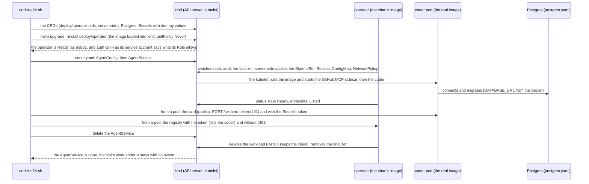
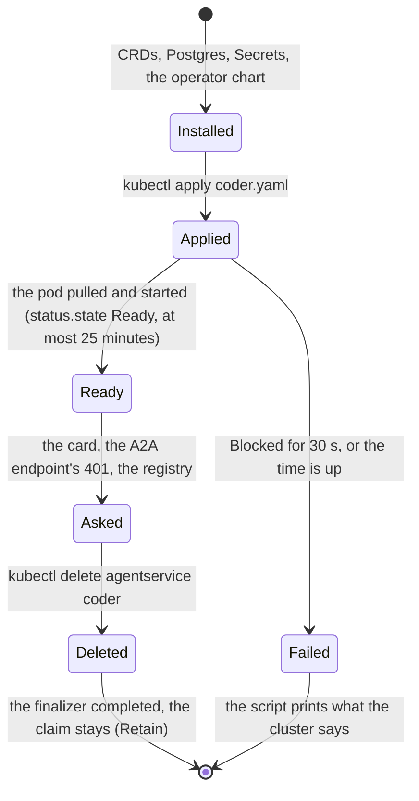

# The kind end-to-end of the coder (S9)

The operator, installed from its chart, runs **the real adam-rs coder image** in a kind cluster. This is the job
`operator-coder-e2e` of [`.github/workflows/operator-image.yml`](../../../../.github/workflows/operator-image.yml); the script
[`coder-e2e.sh`](coder-e2e.sh) is all of it and runs against any kind cluster that has the operator image:

```sh
docker build -t operator:smoke -f docker/operator/Dockerfile . && kind load docker-image operator:smoke --name <cluster>
sh deploy/operator/tests/e2e/coder-e2e.sh        # kubectl on that cluster; needs helm, jq and openssl; pulls a 2.9 GB image
```





## Files

| File | What |
|---|---|
| [`coder-e2e.sh`](coder-e2e.sh) | the script: every step bounded, every assertion named, the cluster's state printed on a failure |
| [`coder.yaml`](coder.yaml) | [`examples/coder.yaml`](../../../../examples/coder.yaml) adapted: the real image by tag and digest (`sha-9a1fd4e`, the newest `main` image of adam-rs on 2026-10-05, read anonymously from ghcr.io), the token variant with a dummy token, a Postgres by `secretRef`, no web search, a 1 GiB claim on kind's default storage class. Each difference is marked `# e2e:` |
| [`postgres.yaml`](postgres.yaml) | a throwaway Postgres 17.9 (Alpine 3.23, pinned by digest, from the public ECR mirror of Docker Hub) with no volume |
| [`operator.values.yaml`](operator.values.yaml) | the operator chart's values: an existing Secret for the registry's token, and only the pods labelled `aap-e2e/client` may read the registry |
| `../../../../bin/operator/tests/e2e_fixture.rs` | `cargo test`, no cluster: `coder.yaml` passes `aap_domain::resolve`, runs the pinned image with its sidecar on the token variant, and names the Secrets the script makes |

## What it proves

* The chart installs on a real cluster: the operator is Ready (`/readyz`), runs as 65532 on a read-only root filesystem, and its service
  account may do what its `Role` says and nothing else: no Secrets, no `agentservices/finalizers`, nothing cluster-wide, nothing in another
  namespace (`kubectl auth can-i`, as the service account).
* The operator makes a workload from `AgentConfig` and `AgentService` that **the real coder starts in**: with the GitHub MCP
  server as a native sidecar of the same image, a Postgres it migrates, and the variables the operator derived. The coder exits 78 on a
  configuration it does not accept and 69 when a dependency is down, so a Ready pod is the startup checks of `bin/adam-coder` passed.
* `status.state` is `Ready`, with `ConfigResolved`, `StoreReady`, `RuntimeReady` and `Ready` True and `Listed: Listed`, and
  `status.endpoints` are what the pod serves.
* The A2A card answers through the Service, from another pod, and names the Coder and its `coding-task` skill; the JSON-RPC
  endpoint is closed without the token and with a wrong one, and the token of the Secret is not refused (the Secret reached the pod).
* The registry, read from a pod with the token, lists the coder with its card URL, title and tags, and the card it lists is the card
  the pod serves; without the token it answers 401. A pod the registry's NetworkPolicy does not name is refused, when the cluster
  enforces NetworkPolicies (otherwise the job says so, in a warning, and does not fail: that is the CNI's, not the operator's).
* Deleting the `AgentService` completes its finalizer, removes the StatefulSet, the Service and the pod, **keeps the claim `work-coder-0` with
  no owner** (`deletionPolicy: Retain`) and the `AgentConfig`, and the registry lists nothing.

## What it does not prove

* **No model.** `MODEL_BASE_URL` is `http://model.invalid/v1`: the coder opens no connection to its model at startup (*verified by reading only, 2026-10-05*: a search of `bin/adam-coder/src`, `crates/adam-service/src` and the model crates
  of adam-rs at `588e9b5`, one commit past the image's `9a1fd4e`, finds no model call at startup), and no task is sent, so nothing ever asks it.
* **No GitHub.** `GITHUB_TOKEN` is a dummy and the GitHub App variant is not run (a real key would be a real credential): the GitHub MCP server
  of the pod is only asked for its tool list, which makes no request to GitHub (*verified 2026-10-03* by adam-rs). No clone, branch, push or pull request.
* **No run.** No A2A task reaches the coder: no journal, lease, worker or tool is exercised beyond startup. That the operator's variables make
  the coder *work* is the parity goldens' claim (`crates/domain/tests/golden`), not this job's.
* **Not the netcup coder**: one worker, 1 GiB of storage on kind's default class, no web search, no Context7, no CloudNativePG (a
  Postgres pod instead; CloudNativePG is `store-cnpg`'s job), the combined topology only (not `split`), and no cutover from the Helm chart (M3).
* The image of adam-rs is the one of `main` on 2026-10-05 and is not tracked: a bump of the pin is a deliberate change of `coder.yaml`,
  with the digest of the tag read from ghcr.io again (`adam-upgrade`, `bump-adam`).

*Unverified* until the job has run: all of the above has been checked here only as far as `shellcheck`, `actionlint`, `helm` and the
`cargo test` of `e2e_fixture.rs` can reach; no cluster, no docker daemon and no kubelet existed where the job was written. Where it
may need a fix: the size of the coder image on a runner's disk (the job frees about 25 GB first), the time of the first pull (25
minutes allowed), kindnet's handling of the operator's egress policy, whether a POST of `{}` to the JSON-RPC endpoint with the right
token is answered with something other than 401 or 403, and `busybox`-free tools: the script asks from `curlimages/curl`, pinned by digest.
