# another-agentic-platform

**Architecture and Design Document**

**Status:** Draft for architecture review  
**Project:** `another-agentic-platform`  
**Audience:** Architects, platform engineers, application developers, security engineers, SREs, AI/agent engineers  
**Document style:** Architecture overview inspired by arc42, with concrete API, CRD, runtime, security, and operational design

**Revision history:**

| Date | Change |
|---|---|
| 2026-09-28 | Imported from the `lightbridge-agents` draft (renames only). |
| 2026-09-28 | Review edits: `AgentRun`/`AgentLease` become application records (§19–20, §56–59, AD-016); `WorkflowProvider` boundary with Restate as one implementation (§17a, AD-017); gateways are replaceable OpenAI-compatible endpoints (§41, AD-018); release channels projected onto A2A (§12a, AD-019); verified notes on ADK-Rust and `opencode acp` (§26) and on storage (§29). MVP cut in [mvp.md](mvp.md). |

---

# 1. Executive Summary

`another-agentic-platform` is a Kubernetes-native platform for defining, operating, exposing, and orchestrating autonomous AI agents as independently addressable services.

The central idea is:

> An agent is not a Pod, a model, a Coder Workspace, an OpenCode process, or a workflow.

An agent is a **stable logical service** with:

- a stable identity;
- one or more explicitly enabled protocol surfaces;
- immutable executable revisions;
- reusable configuration;
- runtime lifecycle management;
- durable workflow execution;
- tools;
- security policies;
- observability;
- artifacts;
- tenancy;
- and optional scale-to-zero execution.

The platform supports different kinds of agents:

- coding agents;
- reviewers;
- test agents;
- security agents;
- research agents;
- documentation agents;
- planning agents;
- infrastructure agents;
- specialized small-model workers;
- larger coordinating agents.

Agents may communicate with each other through **A2A**, expose tools through **MCP**, and optionally expose an **OpenAI Responses-compatible API**.

A coding agent may internally use:

```text
ADK-Rust
   ↓
ACP
   ↓
OpenCode
```

but this is an implementation detail of one `AgentConfig`, not a fundamental requirement of the platform.

The runtime substrate is deliberately abstracted.

The first runtime implementation may use:

- native Kubernetes workloads; or
- Coder Workspaces as the execution substrate.

The rest of the platform does not depend on that choice.

---

# 2. Goals

The primary goals of `another-agentic-platform` are:

1. Define agents declaratively.
2. Expose every agent as an independently addressable service.
3. Support multiple agent protocols without coupling the platform to one framework.
4. Allow agents to communicate with other agents.
5. Support durable, long-running workflows.
6. Support scale-to-zero.
7. Make agent execution reproducible using immutable revisions.
8. Allow reuse of environments, tools, security policies, and project state.
9. Support multi-tenancy from the beginning.
10. Provide strong observability across the complete execution chain.
11. Allow beginner administrators to operate the platform entirely through a UI.
12. Preserve the ability to change runtime implementations later.
13. Avoid coupling the platform architecture to OpenCode, Coder, one LLM vendor, one gateway implementation, or one orchestration framework.
14. Support fleets of specialized agents, including agents powered by relatively small models.
15. Treat security, identity, credentials, and isolation as first-class architecture concerns.

---

# 3. Non-Goals

`another-agentic-platform` is not intended to:

- replace Kubernetes;
- become an LLM provider;
- implement its own coding model;
- implement a new agent protocol when existing protocols are sufficient;
- expose model chain-of-thought;
- require every agent to be a coding agent;
- require every agent to use OpenCode;
- require every agent to use ACP;
- require persistent storage;
- require Coder;
- require a particular Gateway API implementation;
- require a service mesh;
- require a particular LLM/AI gateway (EAIG / Agent Router, AISIX, … are interchangeable OpenAI-compatible endpoints);
- make `/v1/chat/completions` compatibility a platform requirement.

In particular:

> `/v1/chat/completions` is intentionally not supported.

If an agent exposes an OpenAI-compatible interface, it exposes the **Responses API** surface selected by the platform.

---

# 4. Architectural Principles

## 4.1 Stable identity is separate from implementation

Consumers depend on:

```text
coder
reviewer
security-reviewer
docs
```

They should not depend on:

```text
Pod names
workspace IDs
container IDs
OpenCode processes
deployment hashes
```

This leads to:

```text
AgentService
    stable identity

AgentConfig
    editable behavior

AgentRevision
    immutable executable snapshot
```

---

## 4.2 Compute is disposable

An agent service may exist while its compute is completely absent.

```text
AgentService: exists
AgentRevision: exists
Routes: exist
Metadata: available

Runtime replicas: 0
CPU usage: 0
RAM usage: 0
```

Compute is created or activated only when required.

---

## 4.3 State is explicit

Different state belongs in different places.

| State | Location |
|---|---|
| desired configuration | CRDs / control plane |
| immutable executable definition | `AgentRevision` |
| workflow progression | Restate |
| mutable working filesystem | volumes |
| source history | Git |
| durable run outputs | artifact store |
| metrics/traces/logs | observability backend |
| users/projects/tenants | application control-plane database |
| conversation/response metadata | application control-plane database |
| runtime process state | disposable runtime |

A Pod is never considered the durable source of truth.

---

## 4.4 Protocols are interfaces, not identities

An agent can expose:

```text
Responses
A2A
MCP
```

These are different projections of one agent capability.

Internally, the platform operates on a normalized invocation and execution model.

---

## 4.5 Runtime implementation is replaceable

The domain model should not contain concepts such as:

```text
CoderWorkspaceID
TerraformBuildNumber
DeploymentReplicaSet
```

unless they appear in provider-specific status.

The domain model instead uses concepts such as:

```text
runtime
volume
service
lease
environment
revision
```

---

## 4.6 Revisions are immutable

Changing agent behavior produces a new revision.

Production is never silently changed because someone edited configuration.

---

# 5. High-Level Architecture

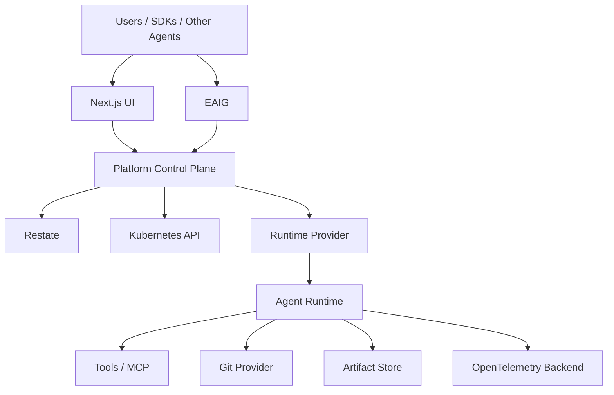

The platform can be viewed as four planes.

## Experience Plane

```text
Next.js
CLI
IDE integrations
bots
OpenAI-compatible SDK clients
other agents
```

## Application Control Plane

```text
API
authentication
authorization
tenant/project management
revision management
release channels
Restate workflows
credential broker
artifact metadata
conversation/response state
quotas
budgets
audit
```

## Infrastructure Control Plane

```text
Kubernetes CRDs
operator/controllers
runtime providers
route providers
identity providers
storage providers
admission providers
```

## Execution Plane

```text
agent runtime
ADK
ACP
OpenCode
MCP clients
A2A clients
shell
filesystem
tests
side services
```

---

# 6. Core Domain Model

The minimal core is:

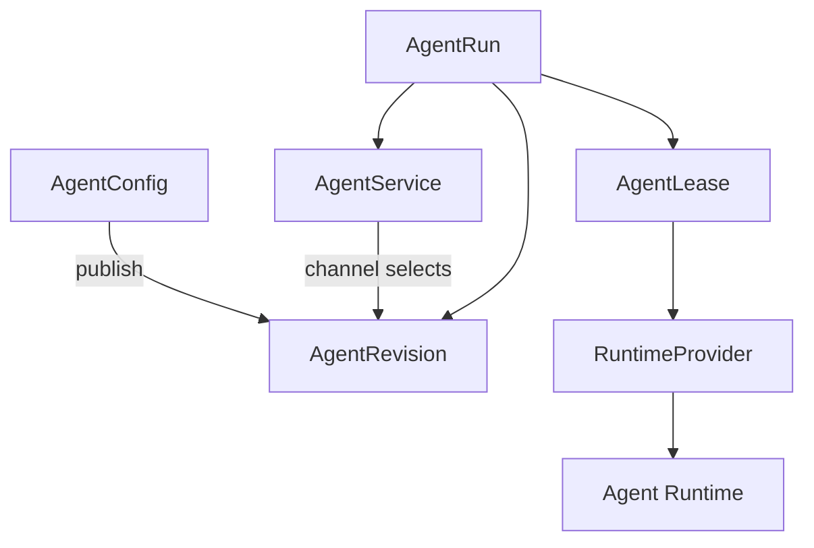

Supporting reusable resources:

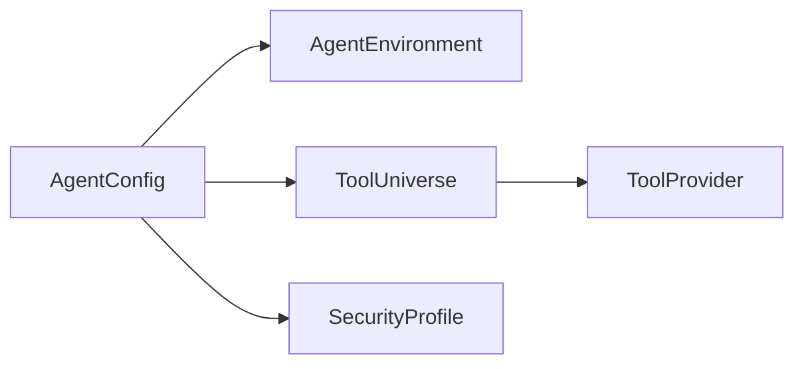

---

# 7. AgentService

`AgentService` represents the stable operational identity of an agent.

It answers:

> How can consumers find, invoke, route to, authorize against, scale, and select revisions of this agent?

It does **not** describe the complete internal behavior of the agent.

Example:

```yaml
apiVersion: agents.vymalo.com/v1alpha1
kind: AgentService

metadata:
  name: coder

spec:
  configRef:
    name: coder

  interfaces:
    responses:
      enabled: true

    a2a:
      enabled: true

    mcp:
      enabled: false

  release:
    defaultChannel: production

    channels:
      production:
        revisionRef: coder-r42

      staging:
        revisionRef: coder-r49

  scaling:
    minReplicas: 0
    maxReplicas: 1
    idleTimeout: 15m

  authorization:
    policyRef:
      name: engineering-agents

  routes:
    - ref:
        name: coder-public

    - ref:
        name: coder-internal
```

Typical `AgentService` concerns:

- stable name;
- description;
- exposed protocols;
- routes;
- release channels;
- default revision/channel;
- scaling policy;
- access policy;
- runtime activation behavior;
- traffic policy.

Changing these does not necessarily produce a new agent revision.

---

# 8. AgentConfig

`AgentConfig` represents editable agent behavior.

It answers:

> What does this agent do, what does it use, and how should it execute?

Example:

```yaml
apiVersion: agents.vymalo.com/v1alpha1
kind: AgentConfig

metadata:
  name: coder

spec:
  instructions:
    system: |
      You are an autonomous software engineering agent.

  model:
    providerRef:
      name: default-models
    model: coding-model

  environmentRef:
    name: fullstack-development

  toolUniverses:
    - name: autonomous-coding

  securityProfileRef:
    name: restricted-coding-agent

  harness:
    type: adk-rust

    codingAgent:
      protocol: acp
      implementation: opencode

  verification:
    policyRef:
      name: standard-ci

  artifacts:
    policyRef:
      name: coding-artifacts
```

Typical configuration includes:

- instructions;
- model selection;
- agent framework;
- tools;
- environment;
- security profile;
- verification;
- artifact policy;
- runtime behavior.

`AgentConfig` is mutable.

Changing it does **not** mutate deployed revisions.

Instead:

```text
AgentConfig generation 18
         ↓
publish
         ↓
AgentRevision coder-r43
```

---

# 9. AgentRevision

`AgentRevision` is an immutable, fully resolved execution definition.

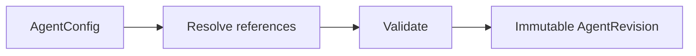

An `AgentRevision` should record exact resolved values where reproducibility matters.

Example:

```yaml
apiVersion: agents.vymalo.com/v1alpha1
kind: AgentRevision

metadata:
  name: coder-r42

spec:
  source:
    configRef:
      name: coder
    generation: 18

  resolved:
    runtimeImage:
      ref: registry.example.com/another-agentic-platform/coder@sha256:abc123

    environmentDigest: sha256:def456

    toolsDigest: sha256:789abc

    securityDigest: sha256:123def

    harness:
      framework: adk-rust
      codingProtocol: acp
      implementation: opencode

    configurationDigest: sha256:abcdef123456
```

An existing revision cannot be modified.

A change creates another revision.

---

# 10. Release Channels

`latest` and `production` are intentionally different.

Example:

```text
r47    production
r51    staging
r53    latest
```

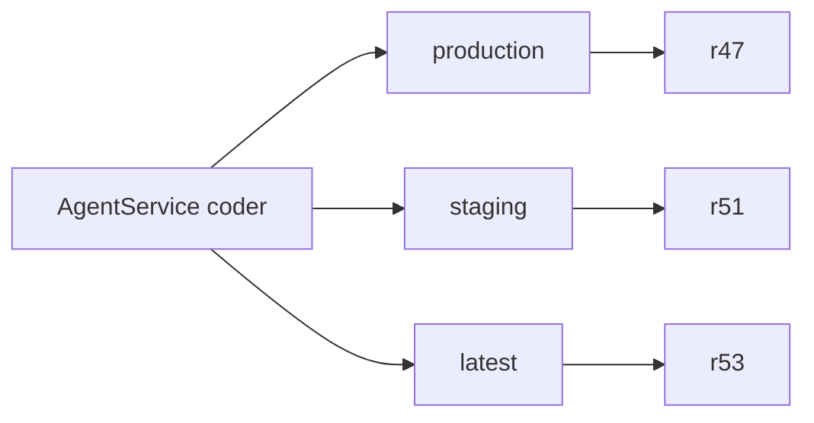

Clients may address:

```text
coder
coder@production
coder@staging
coder@r47
```

Recommended semantics:

```text
coder
    → defaultChannel
    → normally production

coder@production
    → currently promoted production revision

coder@r47
    → immutable exact revision
```

`@latest` may also exist but should never silently replace production.

Rollback is therefore simple:

```text
production: r53
       ↓
production: r47
```

No rebuilding is required.

---

# 11. Agent API Surfaces

Every `AgentService` receives its own logical service endpoint.

Example:

```text
https://coder.agents.example.com
```

The following discovery endpoints should always exist:

```text
/.well-known/api-catalog
/openapi.json
/docs
```

Execution interfaces are explicitly opt-in.

```yaml
interfaces:
  responses:
    enabled: false

  a2a:
    enabled: false

  mcp:
    enabled: false
```

Nothing is exposed by default.

---

# 12. API Discovery

A service may expose:

```text
coder.agents.example.com

/.well-known/api-catalog
/openapi.json
/docs

/v1/responses
/v1/models

/.well-known/agent-card.json
/a2a

/mcp
```

depending on enabled interfaces.

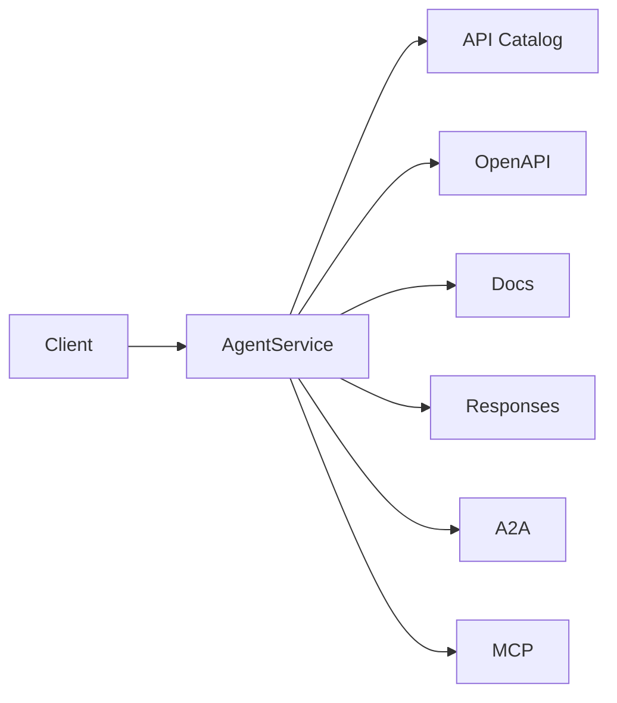

Discovery requests should not wake runtime compute.

---

# 12a. Release-Channels A2A Extension

When A2A is enabled, the service's agent card (`/.well-known/agent-card.json`, served by the control plane, so it never wakes compute) declares the platform's **release-channels extension** in `capabilities.extensions`.

- URI: `https://agents.vymalo.com/a2a/extensions/release-channels/v1`
- `required: false` — plain A2A clients keep working and get the default channel.
- A client that understands it can let a user pick a channel or an exact revision (for example a dropdown in another-agentic-system) and pass the selection with the request.
- Full contract: [extensions/release-channels-v1.md](extensions/release-channels-v1.md).

This projects §10 (release channels) onto A2A without a platform-specific API: the client reads the card; the platform remains the only owner of channel state.

---

# 13. Metadata Plane vs Execution Plane

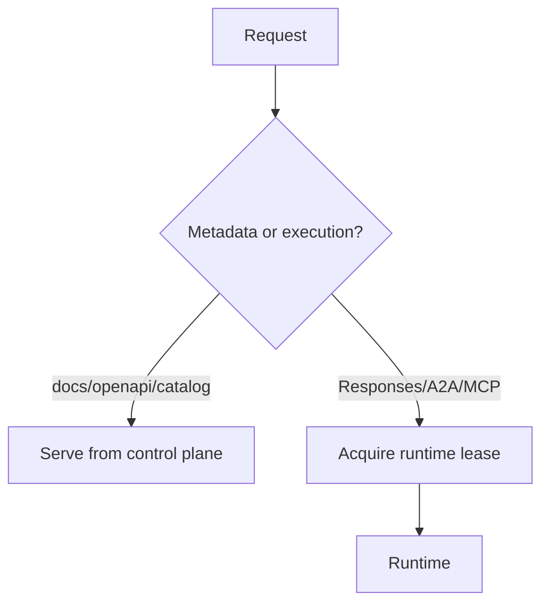

This allows:

```text
runtime replicas = 0
```

while:

```text
GET /docs
GET /openapi.json
GET /.well-known/api-catalog
```

remain instant.

---

# 14. Responses API

The OpenAI-compatible interface is optional and disabled by default.

When enabled, the preferred API is:

```text
POST /v1/responses
GET  /v1/responses/{id}
GET  /v1/models
```

Potentially:

```text
/v1/conversations
```

depending on supported compatibility scope.

`/v1/chat/completions` is intentionally absent.

The Responses adapter translates protocol requests into the internal invocation model.

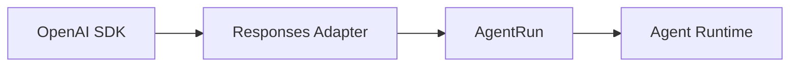

The `model` field identifies an **agent service/revision selector**, not necessarily the underlying foundation model.

Example:

```python
client.responses.create(
    model="coder",
    input="Investigate issue 428 and implement a verified fix."
)
```

Internally, `coder` may use:

- several models;
- multiple agents;
- tools;
- code intelligence;
- OpenCode;
- tests;
- Git;
- review agents.

The caller sees one model-like capability.

---

# 15. A2A and Multi-Agent Work

A2A allows one agent to delegate tasks to independently deployed agents.

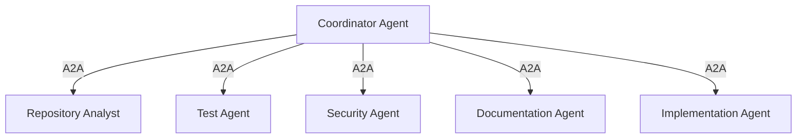

This makes fleets of specialized agents practical.

For example:

| Agent | Model class |
|---|---|
| file locator | tiny |
| test classifier | small |
| documentation search | small |
| dependency analysis | small |
| code review | small/medium |
| security reasoning | medium/large |
| implementation | medium/large |
| architecture planning | larger model when justified |

The platform therefore permits:

> multiple small, specialized agents collaborating on work that might otherwise require one expensive general-purpose model.

---

# 16. Durable Multi-Agent Workflow

Multi-agent coordination should not depend on a coordinator process remaining alive.

Restate handles durable progression.

> **Review note (2026-09-28):** throughout this document, *Restate* stands for the **workflow provider** (§17a). Restate is one implementation; the first planned one is a Rust state machine on Postgres.

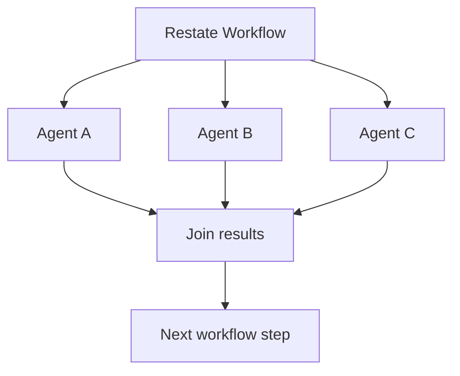

If the coordinator process crashes:

```text
A completed
B completed
C running
```

the durable workflow still knows the state.

Completed work does not need to be rerun.

---

# 17. Restate Responsibilities

Restate answers:

> Where are we in this durable business/workflow operation?

Example:

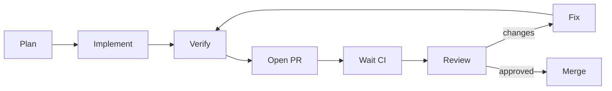

Restate may persist states such as:

```text
Planning
Implementing
Testing
WaitingForCI
Reviewing
Fixing
MergeReady
Merged
NeedsHuman
Failed
```

Restate should own:

- retries;
- waiting;
- timers;
- business-flow transitions;
- long-running orchestration;
- agent-to-agent coordination;
- budgets related to workflow execution.

---

# 17a. WorkflowProvider

Durable workflow progression sits behind a provider boundary, like runtime (§22). Runs, steps, waits and budgets must not depend on one engine.

```rust
// Selected at build time (generic), not via `dyn`: async fn in traits is not dyn-compatible.
trait WorkflowProvider {
    async fn start(&self, run: &AgentRun, workflow: &WorkflowRef) -> Result<WorkflowId, WorkflowError>;
    /// Human answer, CI result, A2A task update, timer…
    async fn signal(&self, id: &WorkflowId, signal: Signal) -> Result<(), WorkflowError>;
    async fn cancel(&self, id: &WorkflowId) -> Result<(), WorkflowError>;
    async fn status(&self, id: &WorkflowId) -> Result<WorkflowStatus, WorkflowError>;
}
```

| Implementation | Status | Notes |
|---|---|---|
| Rust state machine on Postgres | first | Transactional inbox/outbox, `FOR UPDATE SKIP LOCKED`, `LISTEN/NOTIFY`. Same design as another-agentic-system's orchestrator. No extra stateful system to operate. |
| Restate | optional | Durable execution, timers, awakeables, Rust SDK. BSL-licensed server. |

**Restate licence** (checked 2026-09-28 in `restatedev/restate` `LICENSE`): the Additional Use Grant allows use except for a *"Public Restate Platform Service"* — a managed service that lets third parties access Restate's APIs, register their own service deployments and invoke them. Change Date: 4 years after each release; Change License: Apache-2.0. The platform registers its own workflows and tenants invoke through the platform API, which reads as permitted — but a multi-tenant hosted offering should have that confirmed legally before Restate becomes load-bearing.

---

# 18. Runtime Controller Responsibilities

The runtime controller/provider answers:

> What runtime infrastructure must exist now?

Example infrastructure states:

```text
Absent
Provisioning
Ready
Suspended
Failed
```

It should **not** contain application workflow logic such as:

```text
if PR review fails:
    ask agent to fix
    wait for CI
    reopen review
```

That belongs in Restate.

---

# 19. AgentRun

`AgentRun` represents one logical execution.

> **Review decision (2026-09-28, AD-016):** `AgentRun` is an **application-database record, not a CRD**. Runs are created per request and updated constantly; in etcd that is write churn for data Kubernetes never reconciles. The shape below is the record, shown as YAML for readability.

Example record:

```yaml
# application record (Postgres), not a Kubernetes object
kind: AgentRun

metadata:
  name: run-01kxyz

spec:
  agentRef:
    name: coder

  revisionRef:
    name: coder-r42

  input:
    type: issue

    repository:
      url: https://github.example.com/example/project

    issue:
      number: 428

status:
  phase: Running

  conditions:
    - type: RuntimeReady
      status: "True"

    - type: Completed
      status: "False"
```

`AgentRun` correlates:

```text
workflow
revision
runtime
leases
artifacts
logs
traces
Git branch
PR
cost
usage
```

---

# 20. AgentLease

`AgentLease` represents:

> This agent currently requires compute.

This is separate from HTTP request lifetime.

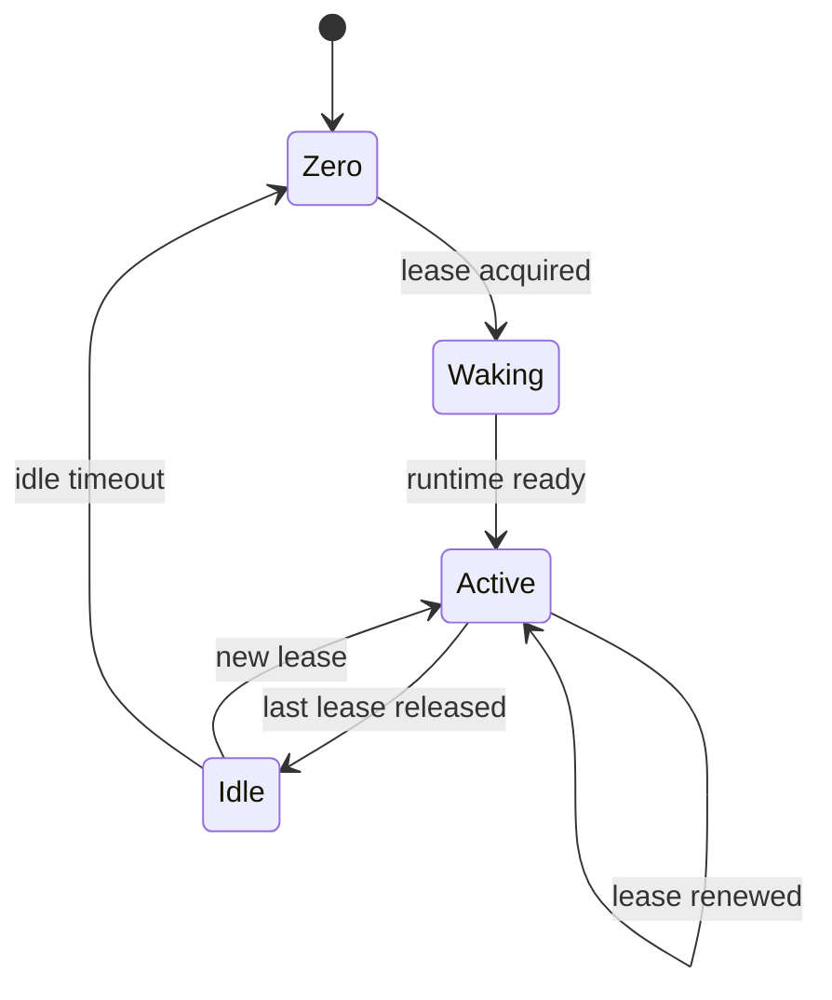

Lease holders may include:

```text
Responses request
background Response
AgentRun
Restate workflow
A2A request
interactive session
debug session
```

> **Review decision (2026-09-28, AD-016):** `AgentLease` is a **lease-service record in Postgres, not a CRD**. Every active holder renews its lease every few seconds; the operator reads the aggregate ("active leases per `AgentService`") instead of watching individual objects.

Example record:

```yaml
# lease-service record (Postgres), not a Kubernetes object
kind: AgentLease

metadata:
  name: run-01kxyz

spec:
  agentRef:
    name: coder

  holder:
    type: AgentRun
    name: run-01kxyz

  expiresAt: "..."
```

Leases should be renewable and short-lived.

If the holder crashes:

```text
lease expires
    ↓
idle timeout
    ↓
runtime stops
```

This avoids leaked compute.

---

# 21. Scale-to-Zero

Scale-to-zero is a semantic capability, not necessarily a Knative implementation.

Desired behavior:

```text
valid leases > 0
    → runtime must be active

valid leases = 0
    → wait idleTimeout
    → runtime may stop
```

The stable service continues to exist while runtime compute is absent.

---

# 22. RuntimeProvider

The platform should define a narrow runtime abstraction.

Conceptually:

```go
type RuntimeProvider interface {
    EnsureRuntime(ctx, revision) error
    Activate(ctx, runtimeID) error
    Suspend(ctx, runtimeID) error
    Delete(ctx, runtimeID) error

    Status(ctx, runtimeID) (Status, error)
    Endpoint(ctx, runtimeID, service string) (Endpoint, error)
    Logs(ctx, runtimeID) (LogStream, error)
}
```

The implementation can change without changing the domain model.

Potential providers:

```text
RuntimeProvider
├── KubernetesRuntimeProvider
└── CoderRuntimeProvider
```

There is no requirement to implement both.

---

# 23. Native Kubernetes Runtime

A native implementation might look like:

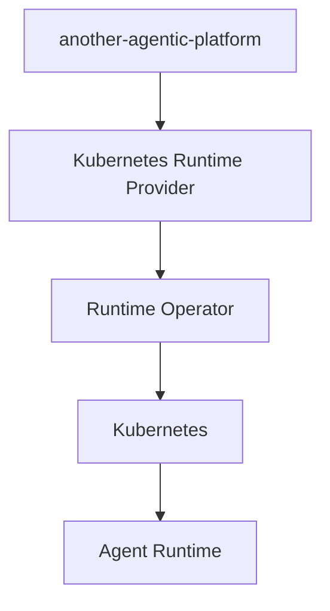

Responsibilities include:

- workload creation;
- volumes;
- networking;
- scale-to-zero;
- readiness;
- side services;
- runtime classes;
- scheduling;
- snapshots;
- cleanup.

This provides maximum architectural control but requires substantial engineering.

---

# 24. Coder Runtime

Coder may alternatively implement the runtime substrate.

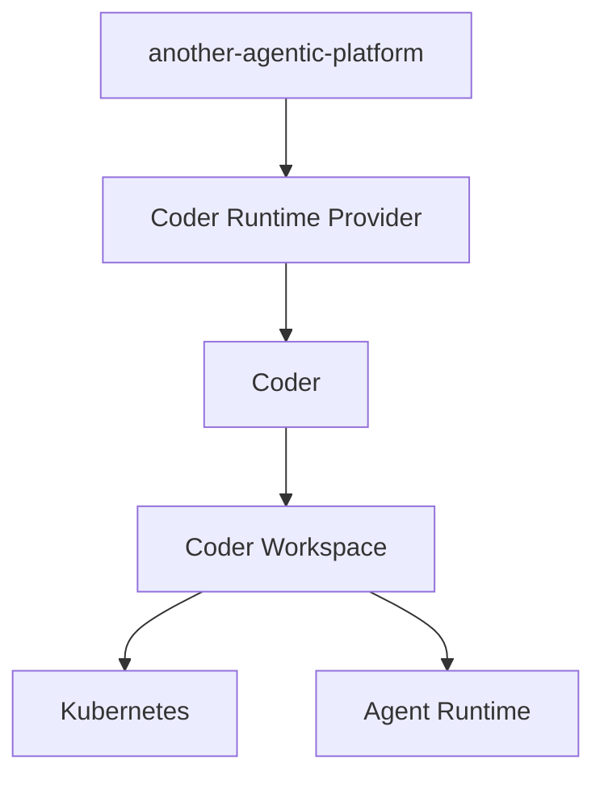

Coder may provide:

- workspace lifecycle;
- start/stop;
- storage provisioning;
- Terraform-managed side resources;
- workspace connectivity;
- logs;
- shell access;
- port access;
- persistent resources;
- development environment support.

The rest of `another-agentic-platform` remains ours:

```text
AgentService
AgentConfig
AgentRevision
ToolUniverse
AgentRun
AgentLease
Restate
EAIG integration
A2A
MCP
Responses
tenancy
authorization
artifacts
observability
release channels
```

The architecture should avoid leaking Coder concepts into these resources.

---

# 25. Coder Architecture Trade-Off

Coder is potentially the lowest-effort runtime solution.

The cost is conceptual translation:

```text
AgentRevision
     ↓
Runtime abstraction
     ↓
Coder Workspace
     ↓
Coder Template
     ↓
Terraform
     ↓
Kubernetes
```

Native Kubernetes is more direct:

```text
AgentRevision
     ↓
Runtime abstraction
     ↓
Kubernetes
```

The decision should therefore be based on whether a **workspace** is a natural runtime abstraction for most agents.

Coding agents map naturally.

Other agents may not.

---

# 26. Agent Runtime

A coding runtime might contain:

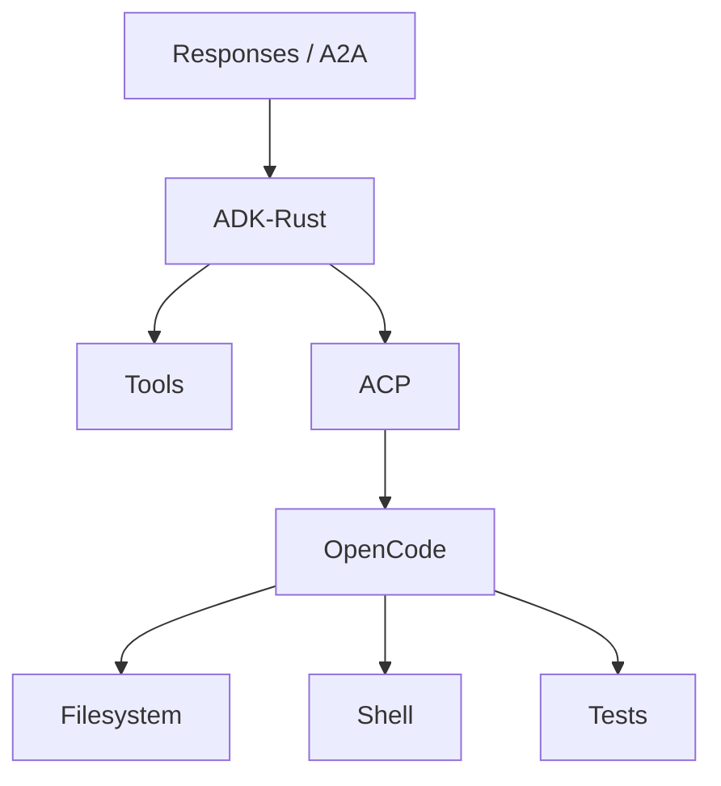

A non-coding agent may simply be:

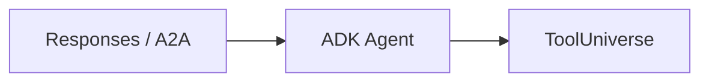

Therefore:

> ACP/OpenCode are agent capabilities, not platform requirements.

**Verified notes (2026-09-28):**

- **ADK-Rust** is [zavora-ai/adk-rust](https://github.com/zavora-ai/adk-rust), a community Rust implementation of Google's ADK (not Google's own). It claims A2A v1.0 support via its `adk-server` crate. Not yet exercised — spike before it becomes load-bearing.
- **`opencode acp`** runs OpenCode as an ACP agent over **stdio** (newline-delimited JSON-RPC). It opens no network port and starts a private OpenCode server per process ([docs](https://opencode.ai/docs/acp/)). The ADK process and OpenCode must therefore share a container/Pod — as drawn above.

---

# 27. AgentEnvironment

`AgentEnvironment` describes the execution environment needed by one or more agent configurations.

Example:

```yaml
apiVersion: agents.vymalo.com/v1alpha1
kind: AgentEnvironment

metadata:
  name: fullstack-development

spec:
  image:
    ref: registry.example.com/dev/fullstack@sha256:...

  resources:
    cpu: "4"
    memory: 8Gi

  volumes:
    - name: workspace
      scope: run
      mountPath: /workspace

      source:
        ephemeral: {}

    - name: project-data
      scope: project
      mountPath: /project

      source:
        persistent:
          size: 100Gi

    - name: cache
      scope: project
      mountPath: /cache

      source:
        cache: {}

  services:
    - name: postgres

      image:
        ref: postgres:17

      readiness:
        tcpPort: 5432

    - name: redis

      image:
        ref: redis:8

      readiness:
        tcpPort: 6379
```

---

# 28. Volumes

The platform must not assume one universal workspace PVC.

Volumes are an optional list.

Possible scopes:

```text
run
agent
project
```

### Run-scoped

Destroyed after execution.

Examples:

```text
temporary checkout
scratch data
temporary OpenCode state
```

### Agent-scoped

Shared between runs of one `AgentService`.

Examples:

```text
agent-specific cache
agent memory database
specialized index
```

### Project-scoped

Reusable by multiple agents belonging to the same project.

Examples:

```text
Git object database
dependency cache
code index
large build cache
```

---

# 29. Shared Project Storage

Multiple agents working on the same project can share project-level state.

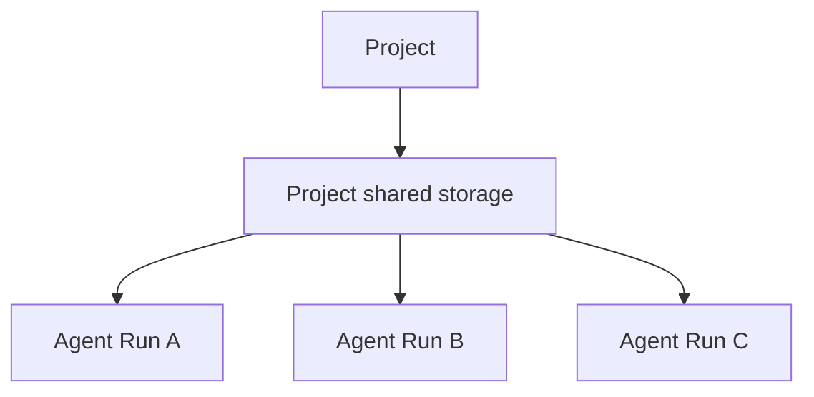

However:

> concurrent agents should normally not mutate the same Git working tree.

A preferred structure is:

```text
/project
├── git/
│   └── shared object database
├── worktrees/
│   ├── run-123/
│   ├── run-124/
│   └── run-125/
├── cache/
└── indexes/
```

Each run works in an isolated worktree.

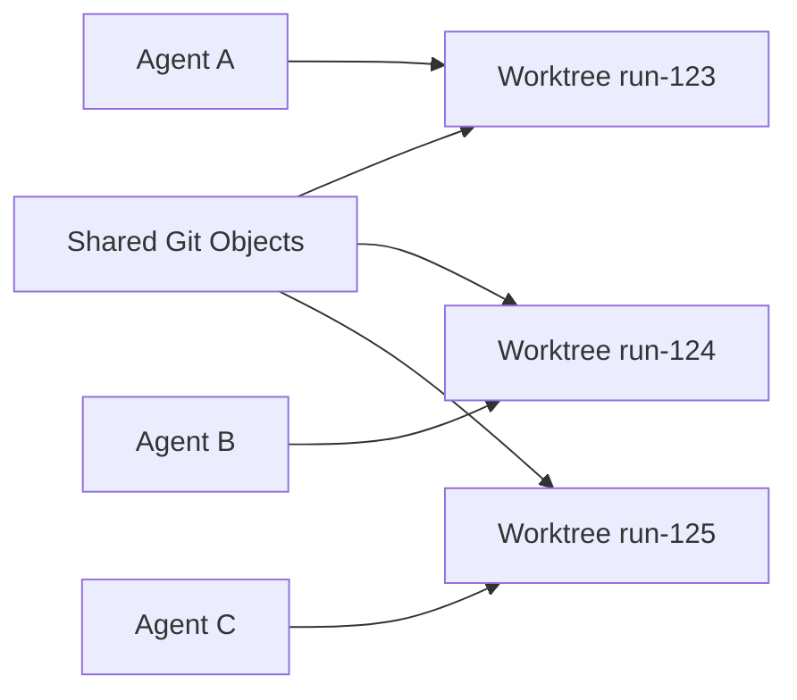

Good candidates for sharing:

| Data | Shared? |
|---|---|
| Git objects | yes |
| package download caches | yes |
| Cargo/Maven/npm cache | yes |
| code-intelligence indexes | often |
| read-only baseline | yes |
| build cache | when concurrency-safe |
| mutable worktree | no |
| OpenCode session database | no |
| credentials | no |
| home directory | generally no |

OpenCode itself should normally be installed in the runtime image rather than persisted on a shared volume.

**Storage reality check (netcup, 2026-09-28):**

- The only StorageClasses are `longhorn` (default) and `longhorn-static`. Sharing one project volume between concurrently running agents needs ReadWriteMany; Longhorn provides RWX through an NFS share-manager, whose performance for Git object databases and build `target/` directories is unverified here.
- A realistic v1: one project volume per active runtime (RWO), plus caches that are already networked and shared (sccache backend, package-registry mirror).
- A mount shadows whatever the image holds at that path, so toolchains belong under `/opt` in the image and only caches/state under mount points (learned running OpenHands Agent Canvas).

---

# 30. Dev Containers

Dev Containers can be supported as an **environment authoring format**.

They should not become the runtime abstraction.

Conceptually:

```text
.devcontainer/devcontainer.json
            ↓
Environment Builder
            ↓
policy validation
            ↓
resolve Features
            ↓
build image
            ↓
SBOM
            ↓
signature
            ↓
immutable OCI digest
            ↓
AgentEnvironment
```

Potentially unsafe developer settings must be rejected or normalized:

```text
privileged=true
docker.sock mount
hostPath
SYS_ADMIN
host networking
```

The platform defines what is permitted.

---

# 31. Environment Builder

Building runtime images should be separate from runtime reconciliation.

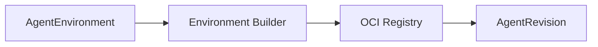

Responsibilities:

- resolve DevContainer configuration;
- build images;
- generate SBOMs;
- sign artifacts;
- create provenance;
- pin image digest;
- report build status.

The Kubernetes operator should not itself build container images.

---

# 32. ToolProvider

A `ToolProvider` defines where tools originate.

Example:

```yaml
apiVersion: agents.vymalo.com/v1alpha1
kind: ToolProvider

metadata:
  name: code-intelligence

spec:
  type: mcp

  mcp:
    transport: streamable-http
    endpoint: https://code-intelligence.internal/mcp

  credentials:
    bindingRef:
      name: code-intelligence
```

Possible provider types:

```text
mcp
native
openapi
a2a
function
```

The list can evolve over time.

---

# 33. ToolUniverse

A `ToolUniverse` defines the set of tools available to an agent class.

```yaml
apiVersion: agents.vymalo.com/v1alpha1
kind: ToolUniverse

metadata:
  name: autonomous-coding

spec:
  providers:
    - providerRef:
        name: github

      include:
        - get_issue
        - get_pull_request
        - create_branch
        - create_pull_request

    - providerRef:
        name: code-intelligence

      include:
        - search
        - references
        - symbols
```

This allows reusable tool sets.

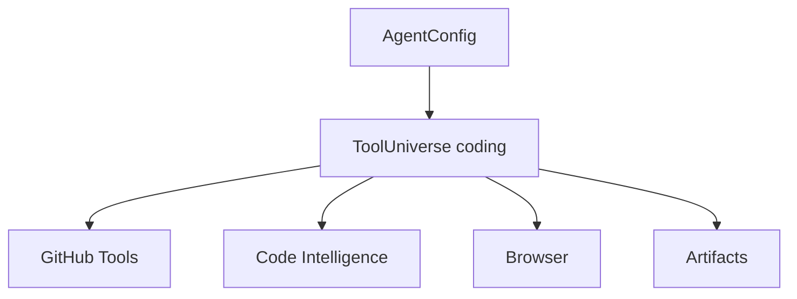

---

# 34. ToolUniverse Composition

ToolUniverses may compose reusable capability layers.

Example:

```text
base
├── artifacts
└── company knowledge

software-engineering
├── base
├── Git
└── code intelligence

autonomous-coding
├── software-engineering
├── shell
└── filesystem
```

```mermaid
flowchart TB
    Base[base]
    Engineering[software-engineering]
    Coding[autonomous-coding]

    Base --> Engineering
    Engineering --> Coding
```

When a revision is generated:

```text
references
    ↓
recursive resolution
    ↓
policy filtering
    ↓
effective tool set
    ↓
digest
    ↓
AgentRevision
```

Changes to the ToolUniverse do not mutate existing revisions.

---

# 35. Internal Tools vs Caller-Supplied Tools

The platform should distinguish:

```text
platform/internal tools
caller-provided tools
```

Effective tools are:

```text
platform-required tools
+
AgentConfig ToolUniverses
+
approved request tools
```

A caller must not be able to remove mandatory platform verification or security tooling.

Request-provided MCP/function tools must pass policy evaluation.

---

# 36. MCP Exposure

A tool available to an agent does not automatically need to be exposed through its MCP endpoint.

Example:

```yaml
tools:
  - ref: github

    visibility:
      agent: true
      externalMcp: false

  - ref: architecture-search

    visibility:
      agent: true
      externalMcp: true
```

This avoids unintentionally turning internal privileged capabilities into public tools.

---

# 37. SecurityProfile

Reusable runtime security constraints should be modeled explicitly.

Example:

```yaml
apiVersion: agents.vymalo.com/v1alpha1
kind: SecurityProfile

metadata:
  name: restricted-coding-agent

spec:
  runAsNonRoot: true

  capabilities:
    drop:
      - ALL

  hostNetwork: false
  hostPID: false

  privileged: false

  filesystem:
    allowHostPath: false

  networking:
    defaultEgress: deny

  images:
    requireDigest: true
```

The profile is translated into provider-specific runtime policy.

Kubernetes admission policy should enforce critical invariants independently of the operator.

---

# 38. Secrets Model

Secrets fall into different categories.

## Platform secrets

Examples:

```text
GitHub App private key
model-provider master credential
signing key
```

These must never enter agent runtimes.

## Ephemeral runtime credentials

Examples:

```text
GitHub installation token
temporary object-store credentials
database token
```

Properties:

- short-lived;
- scoped;
- renewable;
- revocable.

## Test environment secrets

Examples:

```text
temporary PostgreSQL password
temporary Redis password
test application secrets
```

These may be generated per environment and deleted with the environment.

---

# 39. Credential Broker

A dedicated credential broker is recommended.

Example Git workflow:

```mermaid
flowchart LR
    Runtime[Agent Runtime]
    Broker[Credential Broker]
    GitHub[GitHub]

    Runtime -->|authenticated workload identity| Broker
    Broker -->|mint scoped token| GitHub
    GitHub --> Broker
    Broker --> Runtime
```

The control plane owns the long-lived GitHub App credential.

The agent receives only a short-lived credential scoped to:

```text
repository
permissions
operation
time
```

Where possible, Git write operations can be mediated by trusted platform components rather than giving the coding process broad Git credentials.

---

# 40. SPIFFE / SPIRE

SPIFFE answers:

> Which workload is making this request?

Potential identities:

```text
spiffe://agents.vymalo.com/control-plane

spiffe://agents.vymalo.com/credential-broker

spiffe://agents.vymalo.com/agent/coder

spiffe://agents.vymalo.com/agent/reviewer
```

```mermaid
flowchart LR
    Coder[Coder Agent]
    Reviewer[Reviewer]
    Broker[Credential Broker]
    Artifact[Artifact Service]

    Coder -->|mTLS| Reviewer
    Coder -->|mTLS| Broker
    Reviewer -->|mTLS| Artifact
```

SPIFFE identity can later support:

- workload mTLS;
- service authorization;
- secret issuance;
- agent-to-agent trust;
- workload identity independent of bearer tokens.

The API model should therefore avoid treating Kubernetes `ServiceAccount` as the conceptual identity.

A ServiceAccount may simply be one identity provider implementation.

---

# 41. EAIG

EAIG remains the ingress and governance plane.

EAIG is **Envoy AI Gateway**, since renamed **Agent Router** (an Agentic AI Foundation project; the `AIGatewayRoute` CRD and the `aigateway.envoyproxy.io` API group are unchanged). Like AISIX, it is consumed through OpenAI-compatible endpoints: the platform has **no hard dependency** on any one gateway (AD-018).

The same class of gateway also governs **model egress**: agents call models through an OpenAI-compatible gateway endpoint (`AgentConfig.spec.model.providerRef`), never with raw provider keys. That is where model tokens and cost (§85) are measured.

It may provide:

- external routing;
- authentication integration;
- policy enforcement;
- rate limiting;
- request observability;
- activation integration.

Example:

```mermaid
flowchart TB
    Client[Client]
    EAIG[EAIG]
    CP[Platform Control Plane]
    Runtime[Agent Runtime]

    Client --> EAIG
    EAIG --> CP
    CP --> Runtime
```

EAIG does not become the agent runtime.

---

# 42. Scale-from-Zero Request

Example flow:

```mermaid
sequenceDiagram
    participant Client
    participant EAIG
    participant LB as Platform
    participant Lease as AgentLease
    participant Runtime as RuntimeProvider
    participant Agent

    Client->>EAIG: POST /v1/responses
    EAIG->>LB: authenticated invocation

    LB->>Lease: acquire
    LB->>Runtime: activate revision

    Runtime-->>LB: Ready

    LB->>Agent: invoke
    Agent-->>LB: result

    LB->>Lease: release
    LB-->>EAIG: response
    EAIG-->>Client: response
```

For background execution, the HTTP response can end while a Restate workflow continues renewing the lease.

---

# 43. Routing

Routing should be provider-neutral.

Potential model:

```yaml
kind: AgentRoute

metadata:
  name: coder-public

spec:
  agentRef:
    name: coder

  hostnames:
    - coder.agents.example.com

  providerRef:
    name: external-routing

  visibility:
    public: true
```

An agent may have:

```text
0 routes
1 route
many routes
```

For example:

```text
internal route
external route
administrative route
```

The design should not assume Kubernetes Gateway API as the only implementation.

Potential providers:

```text
Gateway API
Ingress
EAIG-specific routing
none
```

---

# 44. Per-Agent Service Identity

The system deliberately avoids a single centralized endpoint that exposes all agents as tools.

Preferred model:

```text
EAIG
 ├── coder.agents.example.com
 ├── reviewer.agents.example.com
 ├── docs.agents.example.com
 └── security.agents.example.com
```

Each agent has independent:

- identity;
- authorization;
- revision lifecycle;
- routes;
- scaling;
- metrics;
- policies;
- API catalog.

---

# 45. OpenAPI and Documentation

Every `AgentService` receives:

```text
/.well-known/api-catalog
/openapi.json
/docs
```

`/openapi.json` should be generated from enabled interfaces.

Example metadata:

```yaml
info:
  title: Coder Agent
  version: coder-r42

x-vymalo-agent:
  service: coder

  channels:
    production: coder-r42
    staging: coder-r49

  interfaces:
    responses: true
    a2a: true
    mcp: false
```

`/docs` may be rendered using:

```text
Scalar
Redoc
Swagger UI
custom frontend
```

The exact renderer is not architectural.

---

# 46. Artifacts

Artifacts are first-class outputs.

Examples:

```text
patch
screenshot
Playwright trace
JUnit XML
coverage report
binary
SBOM
security scan
architecture report
generated documentation
benchmark result
```

An artifact should contain metadata such as:

```text
artifact ID
run ID
revision ID
producer
digest
media type
created time
retention
size
```

Storage should be content-addressable where practical.

---

# 47. Artifact Architecture

```mermaid
flowchart LR
    Agent[Agent Runtime]
    API[Artifact API]
    Metadata[Metadata DB]
    Object[Object Store]

    Agent --> API

    API --> Metadata
    API --> Object
```

Possible object storage providers:

```text
S3
MinIO
GCS
filesystem for development
```

Important distinction:

```text
PVC
    mutable working state

Artifact store
    durable outputs

Git
    source history

Restate
    workflow history/state
```

---

# 48. Observability

Observability is mandatory.

All major operations should emit OpenTelemetry signals.

Common attributes should include:

```text
agent.tenant.id
agent.project.id
agent.service.name
agent.revision.id
agent.run.id
agent.execution.id
agent.protocol
```

Potential protocol values:

```text
responses
a2a
mcp
acp
internal
```

---

# 49. End-to-End Trace

```mermaid
flowchart LR
    EAIG[EAIG]
    CP[Control Plane]
    Restate[Restate]
    Runtime[Runtime]
    Agent[Agent]
    Tool[Tool]
    Git[Git]
    Artifact[Artifact]

    EAIG --> CP
    CP --> Restate
    Restate --> Runtime
    Runtime --> Agent
    Agent --> Tool
    Agent --> Git
    Agent --> Artifact
```

The UI should be capable of presenting a safe timeline such as:

```text
12:01:00 Request accepted
12:01:01 Runtime activation requested
12:01:14 Runtime ready
12:01:15 Agent started
12:01:19 Repository inspected
12:04:30 Tests executed
12:04:47 Tests failed
12:09:10 Files modified
12:11:42 Tests passed
12:12:05 Patch artifact created
12:12:20 Pull request created
```

This is operational information.

The platform should not attempt to expose hidden model chain-of-thought.

---

# 50. Logs

Two paths are useful.

## Live logs

The UI may stream logs directly through a trusted backend:

```text
Browser
   ↓
Next.js / Control Plane
   ↓
Kubernetes logs or runtime provider
```

The browser never receives Kubernetes credentials.

## Historical logs

Historical logs should be stored in the observability backend because runtime Pods/workspaces are disposable.

---

# 51. Human Authentication

Users authenticate through SSO/OIDC.

```mermaid
flowchart LR
    User[User]
    IdP[Identity Provider]
    API[Platform API]
    AuthZ[Authorization Engine]

    User --> IdP
    IdP --> API
    API --> AuthZ
```

JWT claims are input attributes.

They should not themselves be the entire authorization model.

---

# 52. RBAC and ABAC

Example permissions:

```text
agent.read
agent.invoke
agent.configure
agent.publish
agent.promote
agent.logs.read

run.read
run.cancel

artifact.read
artifact.delete

project.admin
tenant.admin
```

ABAC may add constraints such as:

```text
subject group = payments-developers

action = agent.invoke

resource.project = payments
```

Human authorization belongs to the application control plane.

Humans should not need direct Kubernetes RBAC.

---

# 53. Multi-Tenancy

Multi-tenancy should exist in the model from day one.

```mermaid
flowchart TB
    Tenant[Tenant]

    Payments[Project Payments]
    Identity[Project Identity]

    Coder[Coder]
    Reviewer[Reviewer]
    Security[Security]

    Tenant --> Payments
    Tenant --> Identity

    Payments --> Coder
    Payments --> Reviewer

    Identity --> Security
```

Ownership hierarchy:

```text
Tenant
  └── Project
       ├── AgentService
       ├── AgentRun
       ├── Artifacts
       └── policies
```

This provides natural boundaries for:

- permissions;
- quotas;
- model budgets;
- credentials;
- artifacts;
- audit;
- resource isolation.

---

# 54. Project-Level Shared Runtime State

A `Project` can also become the natural scope for expensive reusable state.

Examples:

```text
Git mirror
package cache
code-intelligence index
build cache
dependency graph
repository metadata
```

This is particularly useful for fleets of coding agents.

```mermaid
flowchart TB
    Project[Project Shared Data]

    Planner[Planner]
    Coder1[Coder Agent 1]
    Coder2[Coder Agent 2]
    Reviewer[Reviewer]

    Project --> Planner
    Project --> Coder1
    Project --> Coder2
    Project --> Reviewer
```

Permissions determine which shared resources each agent may mount.

---

# 55. Side Services

An environment can request supporting services.

Example:

```yaml
services:
  - name: postgres

    image:
      ref: postgres:17

    volumes:
      - name: pgdata
        mountPath: /var/lib/postgresql/data

        source:
          ephemeral: {}

  - name: redis

    image:
      ref: redis:8
```

These are logical services.

The runtime provider may implement them as:

```text
same-Pod sidecars
separate Deployments
Jobs
external managed services
```

depending on policy and provider capabilities.

---

# 56. CRD Inventory

Recommended first-class CRDs:

| CRD | Responsibility |
|---|---|
| `AgentService` | stable agent service identity |
| `AgentConfig` | editable agent behavior |
| `AgentRevision` | immutable resolved agent definition |
| `AgentEnvironment` | runtime/environment requirements |
| `ToolProvider` | where tools come from |
| `ToolUniverse` | reusable sets of effective tools |
| `SecurityProfile` | reusable execution security |
| `AgentRoute` | optional routing/exposure |

`AgentRun` and `AgentLease` are application records, not CRDs (§19–20, AD-016).

Potential later CRDs:

```text
ResourceClass
CredentialBinding
ArtifactPolicy
VerificationPolicy
RuntimeProviderConfig
RouteProviderConfig
```

They should only become CRDs if Kubernetes reconciliation is useful.

---

# 57. Things That Should Probably Not Be CRDs

Not every domain object benefits from Kubernetes reconciliation.

Likely application database objects:

```text
Tenant
Project
User
Role
Permission
Conversation
Response
AgentRun
AgentLease
AuditEvent
Artifact metadata
billing records
model usage
workflow history
```

The platform should avoid using Kubernetes as a general-purpose database.

---

# 58. CRD Reference Model

```mermaid
flowchart TB
    Service[AgentService]
    Config[AgentConfig]
    Revision[AgentRevision]

    Environment[AgentEnvironment]
    Universe[ToolUniverse]
    Provider[ToolProvider]
    Security[SecurityProfile]

    Route[AgentRoute]

    Run[AgentRun]
    Lease[AgentLease]

    Service --> Config
    Service --> Revision
    Service --> Route

    Config --> Environment
    Config --> Universe
    Config --> Security

    Universe --> Provider

    Config -->|publish| Revision

    Run --> Service
    Run --> Revision
    Run --> Lease
```

Not every arrow is a Kubernetes `ownerReference`.

`AgentRun` and `AgentLease` appear here as application records, not CRDs (AD-016).

Many are normal object references.

Shared resources such as:

```text
ToolUniverse
AgentEnvironment
SecurityProfile
```

must not be deleted simply because one consuming agent is deleted.

---

# 59. Operator Design

The operator should be deliberately boring.

It should reconcile desired infrastructure.

It should not implement business workflows.

For example:

```text
active leases > 0 (from the lease service)
    ↓
ensure runtime active

active leases = 0
    ↓
wait idle timeout
    ↓
ensure runtime stopped
```

Not:

```text
run agent
wait PR
check CI
ask reviewer
retry implementation
merge
```

The latter belongs in Restate.

---

# 60. UI Architecture

Administrators should not need to touch CRDs.

```mermaid
sequenceDiagram
    participant User
    participant UI as Next.js
    participant API as Platform API
    participant K8s as Kubernetes
    participant Controller

    User->>UI: Create/Edit agent
    UI->>API: Domain configuration
    API->>API: Validate + authorize
    API->>K8s: Apply desired resources
    K8s-->>Controller: Change event
    Controller->>Controller: Reconcile
    Controller-->>K8s: Update status
    API-->>UI: Status
```

The beginner UI may expose:

```text
Name
Description
Model
Environment
Tools
Responses
A2A
MCP
CPU
Memory
Volumes
Security profile
Scaling
Routes
```

Advanced mode can expose:

```text
View YAML
Export YAML
GitOps configuration
status conditions
revision digest
runtime status
```

---

# 61. Draft → Revision → Promotion UX

Recommended workflow:

```mermaid
flowchart LR
    Edit[Edit AgentConfig]
    Publish[Create Revision]
    Test[Test Revision]
    Stage[Promote to Staging]
    Eval[Evaluate]
    Prod[Promote to Production]

    Edit --> Publish
    Publish --> Test
    Test --> Stage
    Stage --> Eval
    Eval --> Prod
```

The UI can display:

```text
Coder

Production      r47
Staging         r51
Latest          r53

Revision    Status      Created
r53         Ready       5m ago
r52         Ready       1d ago
r51         Staging     2d ago
r47         Production  8d ago
```

Editing production in-place is impossible because revisions are immutable.

---

# 62. API / CRD Versioning

Initial resources should use:

```text
agents.vymalo.com/v1alpha1
```

Evolution path:

```text
v1alpha1
   ↓
v1beta1
   ↓
v1
```

Resources should follow Kubernetes conventions:

```text
spec
status
conditions
observedGeneration
```

Where conversion becomes necessary, conversion webhooks can support multiple served versions.

---

# 63. Provider Interfaces

The architecture should prefer a small number of meaningful provider boundaries.

Possible interfaces:

```text
RuntimeProvider
WorkflowProvider
RouteProvider
IdentityProvider
SecretProvider
ArtifactProvider
AdmissionProvider
```

Each provider can advertise capabilities.

Example:

```text
scale-to-zero
persistent-volumes
volume-snapshot
shared-rwx-storage
gpu
runtime-class
direct-exec
multi-container
spiffe
```

An `AgentEnvironment` may require capabilities.

If the selected provider does not support them, validation should fail clearly.

---

# 64. Scheduling and Admission

At small scale, the controller may immediately activate workloads.

At larger scale:

```text
AgentRun
    ↓
WAITING_FOR_CAPACITY
    ↓
admission
    ↓
runtime activation
```

Potential future integration:

```text
Kueue
```

as an optional admission implementation.

GPU and specialized device support may use Kubernetes DRA where relevant.

---

# 65. Resource Classes

Potential future model:

```yaml
kind: ResourceClass

metadata:
  name: medium

spec:
  resources:
    cpu: "4"
    memory: 8Gi

  placement:
    architecture:
      - amd64

  runtimeClass: gvisor
```

Agents can reference logical resource classes instead of embedding cluster details.

---

# 66. Lifecycle and Garbage Collection

The platform must explicitly manage retention.

Resources include:

```text
revisions
runs
runtime Pods
volumes
snapshots
branches
worktrees
artifacts
leases
routes
temporary credentials
side services
```

Example policies:

```text
successful run filesystem:
    delete after 1h

failed run filesystem:
    retain 24h

artifacts:
    retain 30d

successful AgentRuns:
    retain metadata 90d

production revisions:
    retain indefinitely

old unreferenced revisions:
    keep last 20
```

Kubernetes `ownerReferences` should handle Kubernetes-owned resources.

Finalizers should be used only where external cleanup is necessary.

Examples:

```text
delete Git branch
revoke credential
delete object-store data
remove external route
```

---

# 67. Events

The platform should use stable versioned events.

A CloudEvents-inspired envelope is appropriate:

```json
{
  "id": "...",
  "type": "agent.run.completed.v1",
  "source": "...",
  "subject": "...",
  "time": "...",
  "data": {}
}
```

Possible events:

```text
agent.run.created.v1
agent.run.started.v1
agent.run.completed.v1
agent.run.failed.v1

agent.revision.created.v1
agent.revision.promoted.v1

agent.runtime.started.v1
agent.runtime.suspended.v1

artifact.created.v1
```

Transport should remain replaceable.

Potential transports:

```text
Restate
NATS
Kafka
HTTP
```

The event contract should outlive the transport implementation.

---

# 68. Agent-to-Agent Security

A2A invocation should pass through authorization.

Example:

```text
planner
    CAN invoke
        repository-analyst
        test-agent
        documentation-agent

planner
    CANNOT invoke
        production-deployer
```

Authorization can use:

```text
caller workload identity
caller AgentService
caller project
target AgentService
action
tenant
```

With SPIFFE this may become:

```text
spiffe://agents.vymalo.com/agent/planner

MAY a2a.invoke

spiffe://agents.vymalo.com/agent/test-agent
```

---

# 69. Small-Model Agent Fleets

One of the expected design benefits is economic specialization.

Instead of:

```text
one very large model
    + every tool
    + massive context
```

the platform can construct:

```mermaid
flowchart TB
    Coordinator[Coordinator]

    Repo[Repository Agent]
    Tests[Test Agent]
    Docs[Docs Agent]
    Security[Security Agent]
    Dependencies[Dependency Agent]

    Coordinator --> Repo
    Coordinator --> Tests
    Coordinator --> Docs
    Coordinator --> Security
    Coordinator --> Dependencies
```

Each agent can receive:

- narrower instructions;
- fewer tools;
- smaller context;
- smaller model;
- explicit output contract.

This improves:

- cost control;
- specialization;
- parallelism;
- policy isolation;
- observability;
- fault boundaries.

---

# 70. Example Large Coding Task

Input:

```text
Implement tenant-level API rate limiting,
including persistence, UI administration,
tests, migration, documentation and security review.
```

Possible orchestration:

```mermaid
flowchart TB
    User[User Request]

    Planner[Planner]

    Research[Repository Analyst]
    Backend[Backend Agent]
    UI[Frontend Agent]
    Tests[Test Agent]
    Security[Security Agent]
    Docs[Documentation Agent]

    Integrator[Integration Agent]
    Reviewer[Reviewer]

    User --> Planner

    Planner --> Research
    Planner --> Backend
    Planner --> UI
    Planner --> Tests
    Planner --> Security
    Planner --> Docs

    Research --> Integrator
    Backend --> Integrator
    UI --> Integrator
    Tests --> Integrator
    Security --> Integrator
    Docs --> Integrator

    Integrator --> Reviewer
```

Restate controls dependencies and retries.

Agents communicate through A2A.

Artifacts provide durable intermediate outputs.

Git worktrees isolate parallel code changes.

---

# 71. Conversation and Response State

OpenAI Responses state should not live in Pods.

Logical state:

```text
Conversation
Response
AgentRun
```

belongs in durable control-plane storage.

A request such as:

```text
GET /v1/responses/{id}
```

should not wake the runtime simply to read durable state.

The runtime wakes only when computation is required.

---

# 72. Streaming

Runtime execution produces normalized internal events.

Example:

```text
Accepted
RuntimeActivated
ToolStarted
ToolCompleted
ArtifactCreated
OutputDelta
VerificationStarted
VerificationCompleted
Completed
Failed
```

Each external interface decides which events are appropriate to project.

The UI may see richer operational progress than an OpenAI-compatible client.

No surface should expose private chain-of-thought.

---

# 73. Canonical Invocation Model

Conceptually:

```rust
struct Invocation {
    agent: AgentId,
    revision: RevisionSelector,
    conversation: Option<ConversationId>,
    input: Vec<InputItem>,
    tools: EffectiveToolSet,
    mode: InvocationMode,
}
```

Runtime events:

```rust
enum ExecutionEvent {
    Accepted,
    Progress(ProgressEvent),
    OutputDelta(OutputDelta),
    ToolStarted(ToolEvent),
    ToolCompleted(ToolEvent),
    ArtifactCreated(ArtifactRef),
    VerificationStarted(Verification),
    VerificationCompleted(Verification),
    Completed(Output),
    Failed(Error),
}
```

Responses, A2A, MCP and the UI are adapters around this canonical model.

---

# 74. Compatibility Policy

OpenAI compatibility should be defined explicitly rather than claiming indefinite compatibility with every future OpenAI feature.

A compatibility matrix should exist.

Example:

| Capability | Supported |
|---|---|
| Responses create | yes |
| streaming | yes |
| background | planned/yes |
| conversations | planned |
| structured output | yes |
| function tools | yes |
| MCP tools | policy-dependent |
| files | planned |
| images | agent-dependent |
| Chat Completions | no |

Compatibility belongs to the product documentation and should be versioned.

---

# 75. Security Boundaries

Primary trust boundaries:

```text
Internet / external client
        ↓
EAIG
        ↓
platform control plane
        ↓
runtime
        ↓
tools / Git / databases
```

Sensitive boundaries include:

```text
credential broker
artifact store
Git writes
model providers
tenant boundary
runtime-to-runtime communication
```

Each must have explicit authentication and authorization.

---

# 76. Egress Policy

Agent runtimes should not automatically have unrestricted Internet access.

Policy may allow:

```text
Git provider
model provider
approved MCP services
package registries
artifact store
specific project dependencies
```

Default-deny egress is desirable for high-security environments.

---

# 77. Supply-Chain Security

Runtime artifacts should preferably support:

```text
immutable image digests
SBOM
signatures
build provenance
policy validation
```

Potential ecosystem:

```text
OCI
Sigstore/Cosign
SLSA provenance
```

A revision should record the exact runtime image digest.

---

# 78. Reliability Principles

A Pod or runtime may disappear at any time.

The system must therefore tolerate:

```text
runtime crash
node failure
operator restart
control-plane restart
network interruption
agent crash
OpenCode crash
tool timeout
model provider failure
```

Durability comes from:

```text
Restate
control-plane database
Git
artifact store
immutable revisions
```

not from process memory.

---

# 79. Failure Example

Suppose:

```text
run-123
```

has:

```text
implemented changes
committed branch
started CI
```

and the runtime crashes.

Recovery can be:

```text
Restate resumes
    ↓
workflow state says WaitingForCI
    ↓
no need to rerun implementation
    ↓
check CI
    ↓
continue review stage
```

This is a major reason workflow state must remain separate from runtime state.

---

# 80. Runtime Cold Starts

Scale-to-zero introduces cold-start latency.

Potential mitigations:

```text
prebuilt images
shared project Git mirrors
shared dependency caches
shared code indexes
prewarming
minimum replicas for critical agents
snapshot/restore
faster runtime provider
```

The architecture should allow these optimizations without changing the `AgentService` contract.

---

# 81. Caches

Caches should have distinct lifecycle semantics from correct working state.

Caches may be:

```text
deleted
recreated
shared
evicted
```

without affecting correctness.

Examples:

```text
Cargo registry
npm cache
Maven cache
compiler cache
Git objects
code intelligence index
```

A cache should not become the only copy of important mutable state.

---

# 82. Project Worktrees

For parallel coding agents, isolated Git worktrees are recommended.

Example:

```text
/project/git
/project/worktrees/run-a
/project/worktrees/run-b
/project/worktrees/run-c
```

This permits:

```text
agent A modifies backend
agent B modifies frontend
agent C adds tests
```

without direct working-tree collision.

Merge/integration occurs through explicit workflow stages.

---

# 83. Git Integration

Preferred Git architecture:

```mermaid
flowchart LR
    Agent[Agent Runtime]
    Broker[Credential Broker]
    Git[Git Provider]

    Agent --> Broker
    Broker --> Git
```

Where practical, a trusted platform service can own:

```text
clone
push
branch creation
PR creation
merge
```

while the agent operates on the filesystem.

This reduces credentials available inside untrusted agent processes.

---

# 84. Verification

Agent claims should not be sufficient to declare success.

Deterministic verification should exist outside the model where possible.

Examples:

```text
unit tests
integration tests
linters
type checking
security scans
build
migration checks
API contract tests
browser tests
```

Typical workflow:

```text
agent edits
    ↓
deterministic verification
    ↓
pass?
  ↙     ↘
yes     no
 ↓       ↓
continue agent fix cycle
```

---

# 85. Budgets

Budgets may include:

```text
wall-clock time
model tokens
model cost
number of retries
number of agents
parallel runs
CPU hours
GPU hours
artifact storage
```

Example:

```yaml
budget:
  maxDuration: 2h
  maxAgentCalls: 30
  maxParallelAgents: 5
  maxModelCost: 20
```

Restate is a natural place to enforce workflow-level budgets.

---

# 86. Quotas

Quotas may be enforced at:

```text
Tenant
Project
AgentService
User
```

Examples:

```text
maximum concurrent AgentRuns
maximum active runtimes
maximum CPU
maximum memory
maximum model spend
maximum stored artifacts
```

---

# 87. Suggested CRD Status Pattern

Example:

```yaml
status:
  observedGeneration: 12

  conditions:
    - type: Ready
      status: "True"
      reason: Reconciled

    - type: RuntimeAvailable
      status: "False"
      reason: ScaledToZero

  currentRevision:
    name: coder-r53

  productionRevision:
    name: coder-r47
```

Conditions should describe state rather than burying errors in arbitrary text fields.

---

# 88. Possible `AgentService` State

Logical service state may include:

```text
Ready
Degraded
Suspended
Blocked
```

This is distinct from runtime state.

An agent can be:

```text
AgentService: Ready
Runtime: Suspended
```

because scale-to-zero is healthy.

---

# 89. Possible `AgentRun` State Machine

```mermaid
stateDiagram-v2
    [*] --> Pending
    Pending --> WaitingForCapacity
    WaitingForCapacity --> Starting
    Pending --> Starting

    Starting --> Running
    Running --> Succeeded
    Running --> Failed
    Running --> Cancelled

    Failed --> [*]
    Succeeded --> [*]
    Cancelled --> [*]
```

Application-specific workflow state remains in Restate.

---

# 90. Naming

Suggested API group:

```text
agents.vymalo.com
```

Potential resource names:

```text
AgentService
AgentConfig
AgentRevision
AgentEnvironment
ToolUniverse
ToolProvider
SecurityProfile
AgentRun
AgentLease
AgentRoute
```

Resource naming should avoid tying the project to a specific underlying agent framework.

---

# 91. Architecture Decision Summary

## Accepted

### AD-001 — Stable service identity

`AgentService` is separate from execution runtime.

### AD-002 — Config/revision split

`AgentConfig` is mutable.

`AgentRevision` is immutable.

### AD-003 — Production is explicit

Production may point to any valid revision and does not imply latest.

### AD-004 — Responses is optional

Responses API is disabled by default and must be explicitly enabled.

### AD-005 — No Chat Completions shim

`/v1/chat/completions` is intentionally unsupported.

### AD-006 — Per-agent APIs

Each agent has its own service/API surface.

### AD-007 — API discovery

Each `AgentService` exposes:

```text
/.well-known/api-catalog
/openapi.json
/docs
```

### AD-008 — ToolUniverse is reusable

Agent tools are represented through reusable tool configuration resources.

### AD-009 — Workflows and infrastructure are separate

Restate handles durable workflow progression.

Runtime controllers handle infrastructure.

### AD-010 — Scale-to-zero uses leases

Compute lifecycle is controlled by `AgentLease`, not HTTP connection lifetime.

### AD-011 — Persistent storage is optional

No mandatory workspace PVC exists.

### AD-012 — Volumes are explicit lists

An environment can have zero, one, or many volumes at arbitrary mount paths.

### AD-013 — Shared project state is allowed

Project-level caches and repository data may be shared across agents.

Mutable worktrees remain isolated per run.

### AD-014 — Multi-tenancy exists from day one

Tenant and Project are core application concepts.

### AD-015 — Observability is mandatory

Every run must be traceable end-to-end.

### AD-016 — Runs and leases are application records

`AgentRun` and `AgentLease` live in the application database, not etcd (§19–20).

### AD-017 — Workflow engine behind a provider boundary

`WorkflowProvider` (§17a): a Rust state machine on Postgres first; Restate optional.

### AD-018 — Gateways are replaceable OpenAI-compatible endpoints

EAIG / Agent Router, AISIX or others; no gateway-specific dependency (§41).

### AD-019 — Release channels are projected onto A2A

Through the release-channels agent-card extension (§12a).

---

# 92. Proposed Decisions

These still deserve architecture review.

## P-001 — Runtime provider boundary

Keep runtime implementation behind a small provider interface.

## P-002 — Coder as first runtime provider

Coder may provide the lowest-effort runtime implementation while preserving the platform's domain semantics.

## P-003 — SPIFFE/SPIRE

Adopt workload identity based on SPIFFE where operationally justified.

## P-004 — DevContainer compiler

Support Dev Containers as one environment authoring format.

## P-005 — Kueue

Use Kueue only if/when queued execution becomes necessary.

## P-006 — Shared project storage

Formalize `run`, `agent`, and `project` volume scopes.

---

# 93. Open Architecture Questions

The following should be explicitly decided during architecture review.

## Runtime

- Is Coder mandatory for v1?
- Is native Kubernetes runtime required for v1?
- Is `RuntimeProvider` an internal Go/Rust interface or an API boundary?
- Do runtimes always map one-to-one with revisions?
- Can multiple runs reuse one live runtime?

## CRDs

- Which proposed resources truly need to be CRDs?
- ~~Should `AgentRun` be a CRD or application database record?~~ Decided: application record (AD-016).
- ~~Should `AgentLease` be a CRD or lease-service concept?~~ Decided: lease-service record (AD-016).
- Should `AgentRoute` be separate or embedded in `AgentService`?

## Storage

- Which Kubernetes storage classes are required?
- Is RWX available? (netcup: Longhorn only; RWX via NFS share-manager, performance unverified — §29.)
- How are shared project Git objects implemented safely?
- How are project caches cleaned?
- Are snapshots required in v1?

## Security

- Is SPIFFE/SPIRE required initially or roadmap?
- Which credential broker is used?
- Are Git writes mediated?
- What is the default egress policy?
- What runtime sandbox technology is required?

## Routing

- How does EAIG discover/update AgentServices?
- Does EAIG directly implement scale-from-zero activation?
- Are internal agent-to-agent calls routed through EAIG or directly over mTLS?

## Restate

- ~~Is Restate mandatory?~~ Decided: no — behind `WorkflowProvider` (AD-017).
- Is it deployed in-cluster?
- Is workflow execution provider-abstracted?

## Tenancy

- namespace-per-tenant?
- namespace-per-project?
- shared runtime namespace with labels?
- cluster-per-tenant for high-isolation deployments?

## UI

- Is Next.js only UI/BFF or also initial application API?
- Does the UI directly stream Kubernetes logs through its backend?
- What authorization engine implements RBAC/ABAC?

---

# 94. Possible Deployment

```mermaid
flowchart TB
    subgraph Edge
        EAIG
    end

    subgraph ControlPlane
        UI[Next.js]
        API[Platform API]
        Restate[Restate]
        Operator[Operator]
        Credential[Credential Broker]
        ArtifactAPI[Artifact API]
    end

    subgraph Kubernetes
        Runtime1[Agent Runtime]
        Runtime2[Agent Runtime]
        Runtime3[Agent Runtime]
    end

    subgraph Data
        DB[(PostgreSQL)]
        Objects[(Object Store)]
        Obs[(Observability)]
    end

    EAIG --> API

    UI --> API

    API --> Restate
    API --> Operator
    API --> DB

    Restate --> Operator

    Operator --> Runtime1
    Operator --> Runtime2
    Operator --> Runtime3

    Runtime1 --> Credential
    Runtime2 --> Credential
    Runtime3 --> Credential

    Runtime1 --> ArtifactAPI
    Runtime2 --> ArtifactAPI
    Runtime3 --> ArtifactAPI

    ArtifactAPI --> Objects

    API --> Obs
    Runtime1 --> Obs
    Runtime2 --> Obs
    Runtime3 --> Obs
```

If Coder is used, the Operator/runtime portion changes, while the rest remains substantially the same.

---

# 95. Minimal System Explanation

For someone new to the project:

```text
AgentService
    = stable agent identity

AgentConfig
    = editable definition

AgentRevision
    = immutable executable version

AgentRun
    = one piece of work

AgentLease
    = "this agent currently needs compute"

AgentEnvironment
    = runtime requirements

ToolUniverse
    = tools this type of agent may use

SecurityProfile
    = execution security requirements

RuntimeProvider
    = turns revisions + leases into compute

Restate
    = remembers the long-running workflow
```

---

# 96. Minimal Architecture Diagram

```mermaid
flowchart TB
    Config[AgentConfig]
    Revision[AgentRevision]
    Service[AgentService]

    Run[AgentRun]
    Lease[AgentLease]

    Runtime[RuntimeProvider]
    Agent[Agent Runtime]

    Config -->|publish| Revision
    Service -->|production/staging| Revision

    Run --> Service
    Run --> Revision
    Run --> Lease

    Lease --> Runtime
    Runtime --> Agent
```

Everything else supports these concepts.

---

# 97. Example End-to-End Coding Flow

```mermaid
sequenceDiagram
    participant User
    participant EAIG
    participant LB as Platform
    participant Restate
    participant Runtime
    participant Coder as Coding Agent
    participant Reviewer
    participant Git

    User->>EAIG: Implement issue #428
    EAIG->>LB: Request

    LB->>Restate: Start durable workflow

    Restate->>Runtime: Acquire runtime
    Runtime-->>Restate: Ready

    Restate->>Coder: Implement
    Coder->>Git: Read source
    Coder-->>Restate: Implementation complete

    Restate->>Coder: Run verification
    Coder-->>Restate: Tests passed

    Restate->>Git: Create PR

    Restate->>Reviewer: Review PR
    Reviewer-->>Restate: Approved

    Restate->>Git: Merge
    Restate-->>LB: Completed
    LB-->>EAIG: Result
    EAIG-->>User: Done
```

A more complex version could use multiple parallel specialist agents.

---

# 98. Design Philosophy

`another-agentic-platform` should remain opinionated about **semantics**:

```text
immutable revisions
explicit interfaces
durable workflows
strong identity
safe credentials
observable execution
tenant ownership
explicit state
```

but flexible about **implementations**:

```text
Coder vs native Kubernetes
OpenCode vs another ACP agent
one LLM vendor vs another
one route implementation vs another
one storage provider vs another
one identity implementation vs another
```

This distinction is central to avoiding both vendor lock-in and unnecessary abstraction.

---

# 99. Success Criteria

The architecture should be considered successful if the following scenarios are straightforward.

## Scenario A — Simple stateless agent

Create a review agent with:

```text
no PVC
small model
code-search tools
A2A
scale-to-zero
```

## Scenario B — Full coding environment

Create a coding agent with:

```text
persistent project storage
run-isolated worktree
PostgreSQL
Redis
OpenCode over ACP
GitHub credentials
tests
artifacts
```

## Scenario C — Multi-agent task

One coordinator delegates:

```text
repository analysis
implementation
testing
security review
documentation
```

to independent agents.

## Scenario D — Rollback

Production is moved:

```text
r53 → r47
```

without rebuilding.

## Scenario E — Scale-to-zero

An agent:

```text
exists
is discoverable
has docs
has OpenAPI
```

while consuming zero runtime compute.

## Scenario F — Runtime failure

An active runtime disappears and a long-running workflow resumes without losing logical execution state.

## Scenario G — Provider replacement

A runtime implementation can change without changing:

```text
AgentService
AgentConfig
ToolUniverse
A2A clients
Responses clients
```

---

# 100. Final Architecture Statement

The architecture can be summarized as:

> **another-agentic-platform is a platform for running durable, versioned, independently addressable AI agent services on disposable compute.**

Agents are defined through reusable configuration.

Configurations produce immutable revisions.

Services select revisions through release channels.

Runs represent work.

Leases represent compute demand.

Restate coordinates durable workflows.

Runtime providers turn demand into execution environments.

ToolUniverses define reusable capabilities.

AgentEnvironment defines runtime needs.

A2A allows agents to collaborate.

MCP exposes or consumes tools.

Responses optionally exposes an agent as a model-like API.

EAIG governs access and routing.

SPIFFE/SPIRE can provide workload identity.

Artifacts preserve durable outputs.

OpenTelemetry makes the complete execution observable.

And Kubernetes remains the infrastructure foundation without becoming the product's domain model.

The resulting system supports both:

```text
one sophisticated coding agent
```

and:

```text
a fleet of inexpensive specialized agents
working together on one complex task
```

through the same underlying platform.
