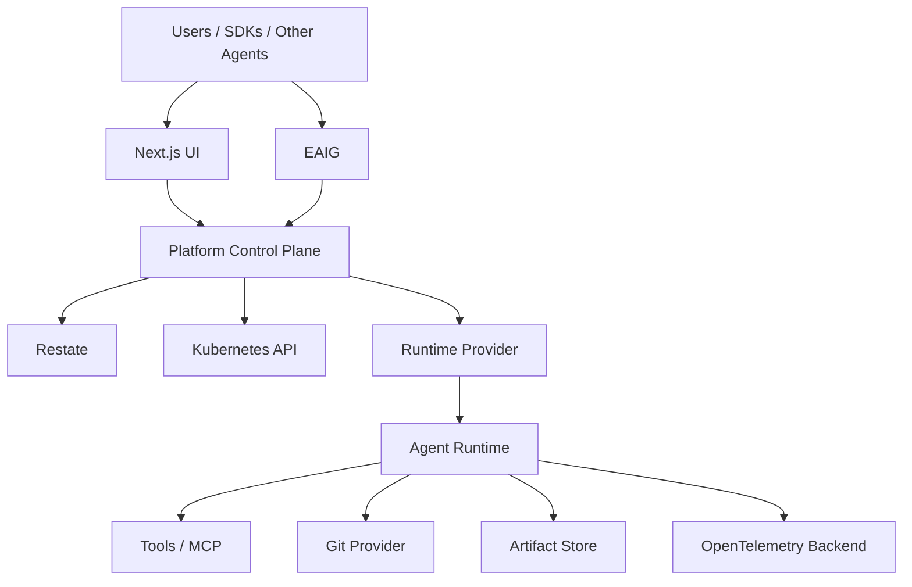

# Overview

[← Index](README.md) · [Next →](02-domain-model.md)


---

## 1. Executive Summary

`another-agentic-platform` is a Kubernetes-native platform for defining, operating, exposing, and orchestrating autonomous AI agents as independently addressable services.

The central idea is:

> An agent is not a Pod, a model, a Coder Workspace, an OpenCode process, or a workflow.

An agent is a **stable logical service** with:

- a stable identity;
- one or more explicitly enabled protocol surfaces;
- immutable executable revisions;
- reusable configuration;
- runtime lifecycle management;
- durable workflow execution;
- tools;
- security policies;
- observability;
- artifacts;
- tenancy;
- and optional scale-to-zero execution.

The platform supports different kinds of agents:

- coding agents;
- reviewers;
- test agents;
- security agents;
- research agents;
- documentation agents;
- planning agents;
- infrastructure agents;
- specialized small-model workers;
- larger coordinating agents.

Agents may communicate with each other through **A2A**, expose tools through **MCP**, and optionally expose an **OpenAI Responses-compatible API**.

A coding agent may internally use:

```text
ADK-Rust
   ↓
ACP
   ↓
OpenCode
```

but this is an implementation detail of one `AgentConfig`, not a fundamental requirement of the platform.

The runtime substrate is deliberately abstracted.

The first runtime implementation may use:

- native Kubernetes workloads; or
- Coder Workspaces as the execution substrate.

The rest of the platform does not depend on that choice.

---

## 2. Goals

The primary goals of `another-agentic-platform` are:

1. Define agents declaratively.
2. Expose every agent as an independently addressable service.
3. Support multiple agent protocols without coupling the platform to one framework.
4. Allow agents to communicate with other agents.
5. Support durable, long-running workflows.
6. Support scale-to-zero.
7. Make agent execution reproducible using immutable revisions.
8. Allow reuse of environments, tools, security policies, and project state.
9. Support multi-tenancy from the beginning.
10. Provide strong observability across the complete execution chain.
11. Allow beginner administrators to operate the platform entirely through a UI.
12. Preserve the ability to change runtime implementations later.
13. Avoid coupling the platform architecture to OpenCode, Coder, one LLM vendor, one gateway implementation, or one orchestration framework.
14. Support fleets of specialized agents, including agents powered by relatively small models.
15. Treat security, identity, credentials, and isolation as first-class architecture concerns.

---

## 3. Non-Goals

`another-agentic-platform` is not intended to:

- replace Kubernetes;
- become an LLM provider;
- implement its own coding model;
- implement a new agent protocol when existing protocols are sufficient;
- expose model chain-of-thought;
- require every agent to be a coding agent;
- require every agent to use OpenCode;
- require every agent to use ACP;
- require persistent storage;
- require Coder;
- require a particular Gateway API implementation;
- require a service mesh;
- require a particular LLM/AI gateway (EAIG / Agent Router, AISIX, … are interchangeable OpenAI-compatible endpoints);
- make `/v1/chat/completions` compatibility a platform requirement.

In particular:

> `/v1/chat/completions` is intentionally not supported.

If an agent exposes an OpenAI-compatible interface, it exposes the **Responses API** surface selected by the platform.

---

## 4. Architectural Principles

### 4.1 Stable identity is separate from implementation

Consumers depend on:

```text
coder
reviewer
security-reviewer
docs
```

They should not depend on:

```text
Pod names
workspace IDs
container IDs
OpenCode processes
deployment hashes
```

This leads to:

```text
AgentService
    stable identity

AgentConfig
    editable behavior

AgentRevision
    immutable executable snapshot
```

---

### 4.2 Compute is disposable

An agent service may exist while its compute is completely absent.

```text
AgentService: exists
AgentRevision: exists
Routes: exist
Metadata: available

Runtime replicas: 0
CPU usage: 0
RAM usage: 0
```

Compute is created or activated only when required.

---

### 4.3 State is explicit

Different state belongs in different places.

| State | Location |
|---|---|
| desired configuration | CRDs / control plane |
| immutable executable definition | `AgentRevision` |
| workflow progression | Restate |
| mutable working filesystem | volumes |
| source history | Git |
| durable run outputs | artifact store |
| metrics/traces/logs | observability backend |
| users/projects/tenants | application control-plane database |
| conversation/response metadata | application control-plane database |
| runtime process state | disposable runtime |

A Pod is never considered the durable source of truth.

---

### 4.4 Protocols are interfaces, not identities

An agent can expose:

```text
Responses
A2A
MCP
```

These are different projections of one agent capability.

Internally, the platform operates on a normalized invocation and execution model.

---

### 4.5 Runtime implementation is replaceable

The domain model should not contain concepts such as:

```text
CoderWorkspaceID
TerraformBuildNumber
DeploymentReplicaSet
```

unless they appear in provider-specific status.

The domain model instead uses concepts such as:

```text
runtime
volume
service
lease
environment
revision
```

---

### 4.6 Revisions are immutable

Changing agent behavior produces a new revision.

Production is never silently changed because someone edited configuration.

---

## 5. High-Level Architecture



The platform can be viewed as four planes.

### Experience Plane

```text
Next.js
CLI
IDE integrations
bots
OpenAI-compatible SDK clients
other agents
```

### Application Control Plane

```text
API
authentication
authorization
tenant/project management
revision management
release channels
Restate workflows
credential broker
artifact metadata
conversation/response state
quotas
budgets
audit
```

### Infrastructure Control Plane

```text
Kubernetes CRDs
operator/controllers
runtime providers
route providers
identity providers
storage providers
admission providers
```

### Execution Plane

```text
agent runtime
ADK
ACP
OpenCode
MCP clients
A2A clients
shell
filesystem
tests
side services
```

---

[← Index](README.md) · [Next →](02-domain-model.md)
