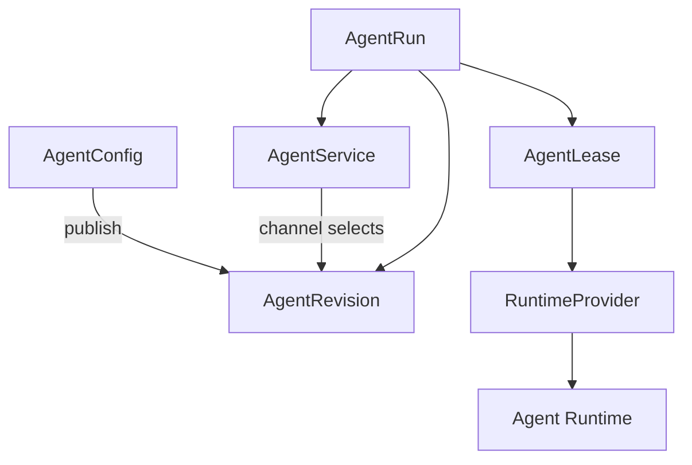
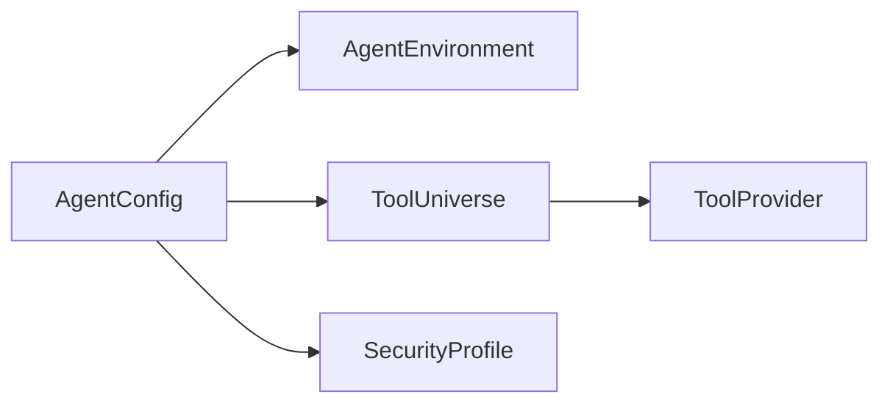
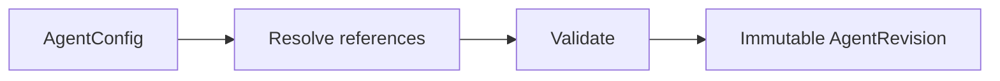
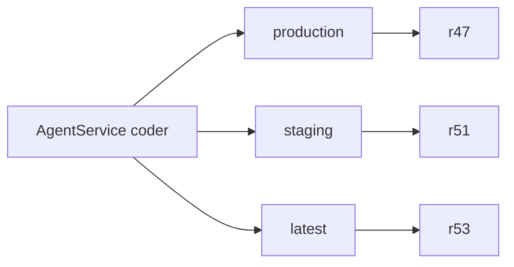

# Domain model and release channels

[← Index](README.md) · [← Previous](01-overview.md) · [Next →](03-interfaces.md)


---

## 6. Core Domain Model

The minimal core is:



Supporting reusable resources:



---

## 7. AgentService

`AgentService` represents the stable operational identity of an agent.

It answers:

> How can consumers find, invoke, route to, authorize against, scale, and select revisions of this agent?

It does **not** describe the complete internal behavior of the agent.

Example:

```yaml
apiVersion: agents.vymalo.com/v1alpha1
kind: AgentService

metadata:
  name: coder

spec:
  configRef:
    name: coder

  interfaces:
    responses:
      enabled: true

    a2a:
      enabled: true

    mcp:
      enabled: false

  release:
    defaultChannel: production

    channels:
      production:
        revisionRef: coder-r42

      staging:
        revisionRef: coder-r49

  scaling:
    minReplicas: 0
    maxReplicas: 1
    idleTimeout: 15m

  authorization:
    policyRef:
      name: engineering-agents

  routes:
    - ref:
        name: coder-public

    - ref:
        name: coder-internal
```

Typical `AgentService` concerns:

- stable name;
- description;
- exposed protocols;
- routes;
- release channels;
- default revision/channel;
- scaling policy;
- access policy;
- runtime activation behavior;
- traffic policy.

Changing these does not necessarily produce a new agent revision.

---

## 8. AgentConfig

`AgentConfig` represents editable agent behavior.

It answers:

> What does this agent do, what does it use, and how should it execute?

Example:

```yaml
apiVersion: agents.vymalo.com/v1alpha1
kind: AgentConfig

metadata:
  name: coder

spec:
  instructions:
    system: |
      You are an autonomous software engineering agent.

  model:
    providerRef:
      name: default-models
    model: coding-model

  environmentRef:
    name: fullstack-development

  toolUniverses:
    - name: autonomous-coding

  securityProfileRef:
    name: restricted-coding-agent

  harness:
    type: adk-rust

    codingAgent:
      protocol: acp
      implementation: opencode

  verification:
    policyRef:
      name: standard-ci

  artifacts:
    policyRef:
      name: coding-artifacts
```

Typical configuration includes:

- instructions;
- model selection;
- agent framework;
- tools;
- environment;
- security profile;
- verification;
- artifact policy;
- runtime behavior.

`AgentConfig` is mutable.

Changing it does **not** mutate deployed revisions.

Instead:

```text
AgentConfig generation 18
         ↓
publish
         ↓
AgentRevision coder-r43
```

---

## 9. AgentRevision

`AgentRevision` is an immutable, fully resolved execution definition.



An `AgentRevision` should record exact resolved values where reproducibility matters.

Example:

```yaml
apiVersion: agents.vymalo.com/v1alpha1
kind: AgentRevision

metadata:
  name: coder-r42

spec:
  source:
    configRef:
      name: coder
    generation: 18

  resolved:
    runtimeImage:
      ref: registry.example.com/another-agentic-platform/coder@sha256:abc123

    environmentDigest: sha256:def456

    toolsDigest: sha256:789abc

    securityDigest: sha256:123def

    harness:
      framework: adk-rust
      codingProtocol: acp
      implementation: opencode

    configurationDigest: sha256:abcdef123456
```

An existing revision cannot be modified.

A change creates another revision.

---

## 10. Release Channels

`latest` and `production` are intentionally different.

Example:

```text
r47    production
r51    staging
r53    latest
```



Clients may address:

```text
coder
coder@production
coder@staging
coder@r47
```

Recommended semantics:

```text
coder
    → defaultChannel
    → normally production

coder@production
    → currently promoted production revision

coder@r47
    → immutable exact revision
```

`@latest` may also exist but should never silently replace production.

Rollback is therefore simple:

```text
production: r53
       ↓
production: r47
```

No rebuilding is required.

---

[← Index](README.md) · [← Previous](01-overview.md) · [Next →](03-interfaces.md)
