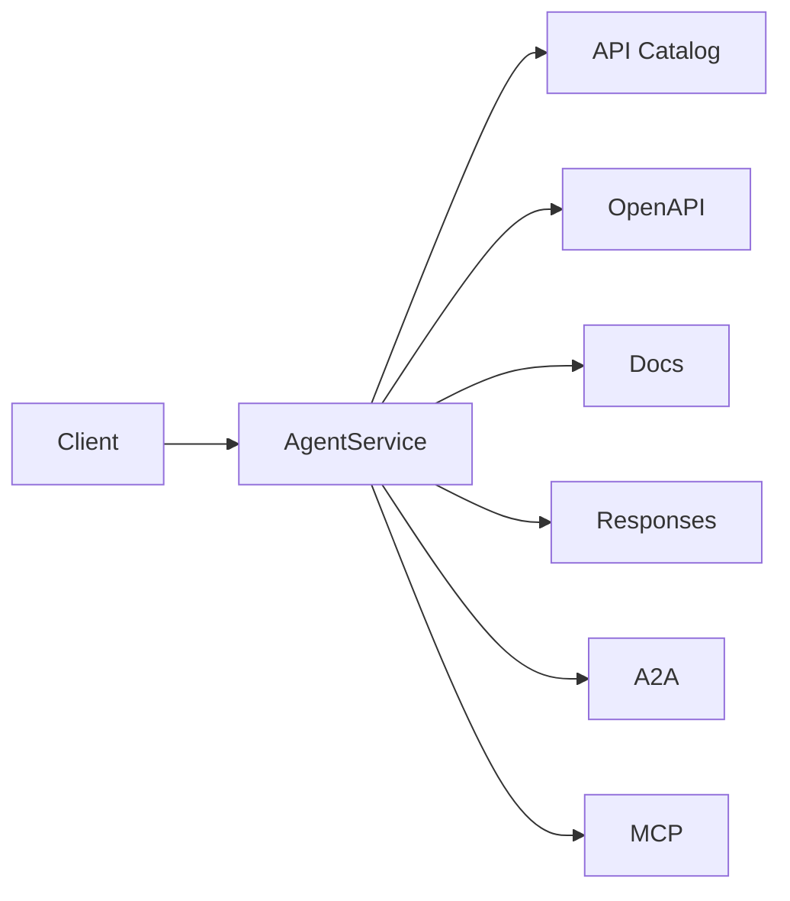
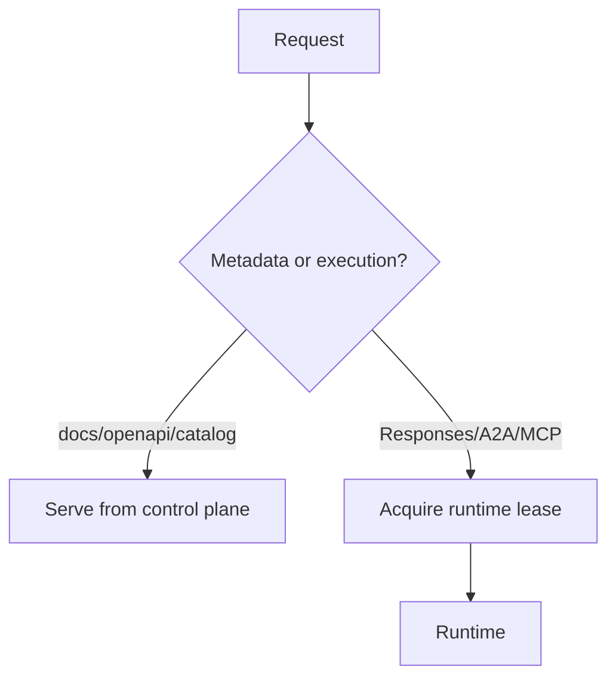
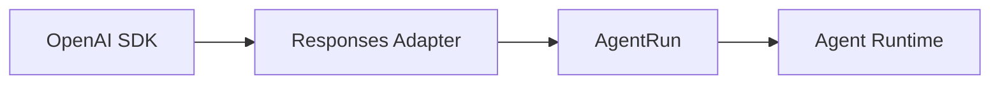

# Interfaces: APIs, discovery, routing and invocation

[← Index](README.md) · [← Previous](02-domain-model.md) · [Next →](04-workflows.md)


---

## 11. Agent API Surfaces

Every `AgentService` receives its own logical service endpoint.

Example:

```text
https://coder.agents.example.com
```

The following discovery endpoints should always exist:

```text
/.well-known/api-catalog
/openapi.json
/docs
```

Execution interfaces are explicitly opt-in.

```yaml
interfaces:
  responses:
    enabled: false

  a2a:
    enabled: false

  mcp:
    enabled: false
```

Nothing is exposed by default.

---

## 12. API Discovery

A service may expose:

```text
coder.agents.example.com

/.well-known/api-catalog
/openapi.json
/docs

/v1/responses
/v1/models

/.well-known/agent-card.json
/a2a

/mcp
```

depending on enabled interfaces.



Discovery requests should not wake runtime compute.

---

## 12a. Release-Channels A2A Extension

When A2A is enabled, the service's agent card (`/.well-known/agent-card.json`, served by the control plane, so it never wakes compute) declares the platform's **release-channels extension** in `capabilities.extensions`.

- URI: `https://agents.vymalo.com/a2a/extensions/release-channels/v1`
- `required: false` — plain A2A clients keep working and get the default channel.
- A client that understands it can let a user pick a channel or an exact revision (for example a dropdown in another-agentic-system) and pass the selection with the request.
- Full contract: [extensions/release-channels-v1.md](../extensions/release-channels-v1.md).

This projects §10 (release channels) onto A2A without a platform-specific API: the client reads the card; the platform remains the only owner of channel state.

---

## 12b. Agent Registry

A client that wants to offer "the platform's agents" needs a list to start from. A2A names curated registries as a discovery strategy but prescribes no registry API (*verified 2026-10-01*, <https://a2a-protocol.org/latest/topics/agent-discovery/>), so the platform defines one: a **linkset of agent cards**, one `item` per `AgentService` that has A2A enabled and that the caller may invoke (§52).

- URI: `https://agents.vymalo.com/registry/v1` (a profile identifier carried in the document).
- A JSON document, `application/linkset+json`, shaped like an RFC 9727 API catalog; each item is the absolute URL of the service's agent card, with the service id, an optional display title and optional tags.
- Served by the control plane, so reading it never wakes runtime compute (§13). Recommended path `/registry/v1/agents` on the platform API host; authorised with the platform API's bearer token (§51, §52) and filtered per caller. It caches with `Cache-Control: private, max-age` (60 s or less) and `ETag`; a client that cannot read it lists no platform agents rather than a stale list.
- It lists addresses and nothing more. It is not a gateway and does not expose agents behind one endpoint (§44): each agent keeps its own host, identity, authorization and card.
- **Releases stay on each card** ([§12a](#12a-release-channels-a2a-extension)). The registry carries no channels or revisions, and nothing about any client's user interface; the platform just provisions A2A-capable agents.
- Full contract: [extensions/agent-registry-v1.md](../extensions/agent-registry-v1.md). Decision: AD-021 (§91).

> **Decision (2026-10-04, AD-023):** until a control plane exists, the operator binary serves the registry from the cache of its own reflector, with **one static bearer** and **no per-caller filtering**, and it refuses rather than truncates a list past the limits. The deviations from this section and from the contract are listed in [§59a](10-control-plane-and-crds.md#registry-in-v0).

The first consumer is another-agentic-system, which reads the registry live beside its own static agent list.

---

## 13. Metadata Plane vs Execution Plane



This allows:

```text
runtime replicas = 0
```

while:

```text
GET /docs
GET /openapi.json
GET /.well-known/api-catalog
```

remain instant.

---

## 14. Responses API

The OpenAI-compatible interface is optional and disabled by default.

When enabled, the preferred API is:

```text
POST /v1/responses
GET  /v1/responses/{id}
GET  /v1/models
```

Potentially:

```text
/v1/conversations
```

depending on supported compatibility scope.

`/v1/chat/completions` is intentionally absent.

The Responses adapter translates protocol requests into the internal invocation model.



The `model` field identifies an **agent service/revision selector**, not necessarily the underlying foundation model.

Example:

```python
client.responses.create(
    model="coder",
    input="Investigate issue 428 and implement a verified fix."
)
```

Internally, `coder` may use:

- several models;
- multiple agents;
- tools;
- code intelligence;
- OpenCode;
- tests;
- Git;
- review agents.

The caller sees one model-like capability.

---

## 43. Routing

Routing should be provider-neutral.

Potential model:

```yaml
kind: AgentRoute

metadata:
  name: coder-public

spec:
  agentRef:
    name: coder

  hostnames:
    - coder.agents.example.com

  providerRef:
    name: external-routing

  visibility:
    public: true
```

An agent may have:

```text
0 routes
1 route
many routes
```

For example:

```text
internal route
external route
administrative route
```

The design should not assume Kubernetes Gateway API as the only implementation.

Potential providers:

```text
Gateway API
Ingress
EAIG-specific routing
none
```

---

## 44. Per-Agent Service Identity

The system deliberately avoids a single centralized endpoint that exposes all agents as tools.

Preferred model:

```text
EAIG
 ├── coder.agents.example.com
 ├── reviewer.agents.example.com
 ├── docs.agents.example.com
 └── security.agents.example.com
```

Each agent has independent:

- identity;
- authorization;
- revision lifecycle;
- routes;
- scaling;
- metrics;
- policies;
- API catalog.

---

## 45. OpenAPI and Documentation

Every `AgentService` receives:

```text
/.well-known/api-catalog
/openapi.json
/docs
```

`/openapi.json` should be generated from enabled interfaces.

Example metadata:

```yaml
info:
  title: Coder Agent
  version: coder-r42

x-vymalo-agent:
  service: coder

  channels:
    production: coder-r42
    staging: coder-r49

  interfaces:
    responses: true
    a2a: true
    mcp: false
```

`/docs` may be rendered using:

```text
Scalar
Redoc
Swagger UI
custom frontend
```

The exact renderer is not architectural.

---

## 71. Conversation and Response State

OpenAI Responses state should not live in Pods.

Logical state:

```text
Conversation
Response
AgentRun
```

belongs in durable control-plane storage.

A request such as:

```text
GET /v1/responses/{id}
```

should not wake the runtime simply to read durable state.

The runtime wakes only when computation is required.

---

## 72. Streaming

Runtime execution produces normalized internal events.

Example:

```text
Accepted
RuntimeActivated
ToolStarted
ToolCompleted
ArtifactCreated
OutputDelta
VerificationStarted
VerificationCompleted
Completed
Failed
```

Each external interface decides which events are appropriate to project.

The UI may see richer operational progress than an OpenAI-compatible client.

No surface should expose private chain-of-thought.

---

## 73. Canonical Invocation Model

Conceptually:

```rust
struct Invocation {
    agent: AgentId,
    revision: RevisionSelector,
    conversation: Option<ConversationId>,
    input: Vec<InputItem>,
    tools: EffectiveToolSet,
    mode: InvocationMode,
}
```

Runtime events:

```rust
enum ExecutionEvent {
    Accepted,
    Progress(ProgressEvent),
    OutputDelta(OutputDelta),
    ToolStarted(ToolEvent),
    ToolCompleted(ToolEvent),
    ArtifactCreated(ArtifactRef),
    VerificationStarted(Verification),
    VerificationCompleted(Verification),
    Completed(Output),
    Failed(Error),
}
```

Responses, A2A, MCP and the UI are adapters around this canonical model.

---

## 74. Compatibility Policy

OpenAI compatibility should be defined explicitly rather than claiming indefinite compatibility with every future OpenAI feature.

A compatibility matrix should exist.

Example:

| Capability | Supported |
|---|---|
| Responses create | yes |
| streaming | yes |
| background | planned/yes |
| conversations | planned |
| structured output | yes |
| function tools | yes |
| MCP tools | policy-dependent |
| files | planned |
| images | agent-dependent |
| Chat Completions | no |

Compatibility belongs to the product documentation and should be versioned.

---

[← Index](README.md) · [← Previous](02-domain-model.md) · [Next →](04-workflows.md)
