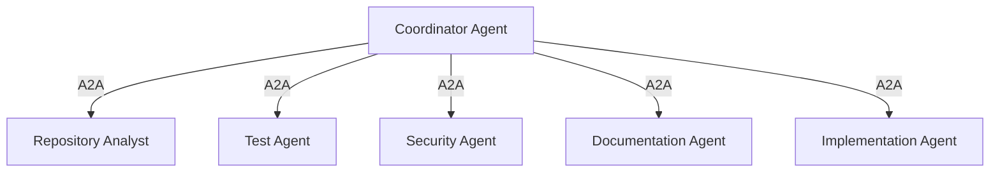
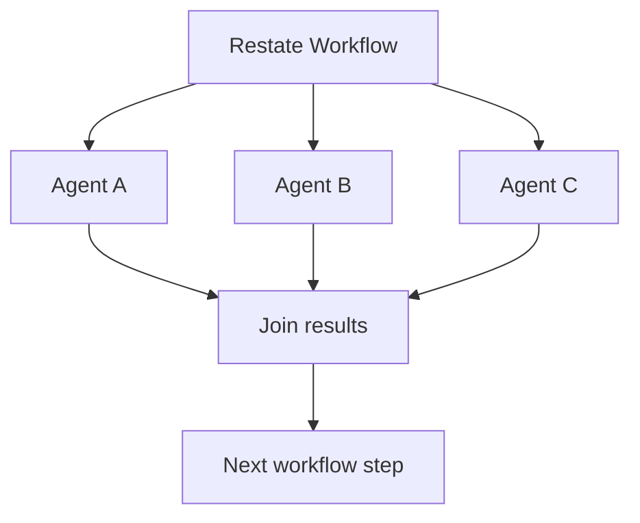
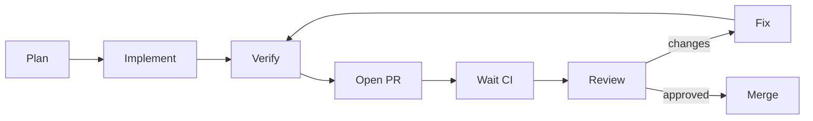
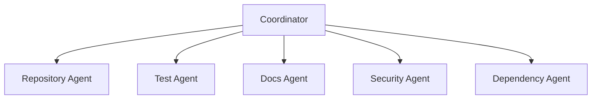
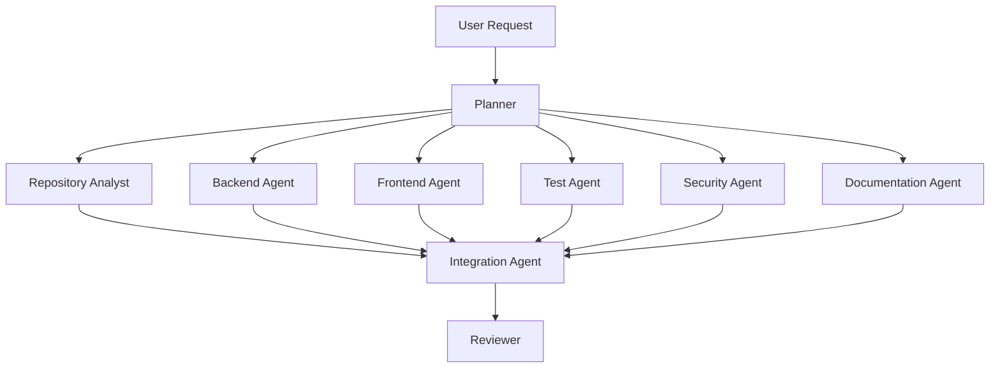

# Multi-agent work, workflows, verification and budgets

[← Index](README.md) · [← Previous](03-interfaces.md) · [Next →](05-runtime.md)


---

## 15. A2A and Multi-Agent Work

A2A allows one agent to delegate tasks to independently deployed agents.



This makes fleets of specialized agents practical.

For example:

| Agent | Model class |
|---|---|
| file locator | tiny |
| test classifier | small |
| documentation search | small |
| dependency analysis | small |
| code review | small/medium |
| security reasoning | medium/large |
| implementation | medium/large |
| architecture planning | larger model when justified |

The platform therefore permits:

> multiple small, specialized agents collaborating on work that might otherwise require one expensive general-purpose model.

---

## 16. Durable Multi-Agent Workflow

Multi-agent coordination should not depend on a coordinator process remaining alive.

Restate handles durable progression.

> **Review note (2026-09-28):** throughout this document, *Restate* stands for the **workflow provider** (§17a). Restate is one implementation; the first planned one is a Rust state machine on Postgres.



If the coordinator process crashes:

```text
A completed
B completed
C running
```

the durable workflow still knows the state.

Completed work does not need to be rerun.

---

## 17. Restate Responsibilities

Restate answers:

> Where are we in this durable business/workflow operation?

Example:



Restate may persist states such as:

```text
Planning
Implementing
Testing
WaitingForCI
Reviewing
Fixing
MergeReady
Merged
NeedsHuman
Failed
```

Restate should own:

- retries;
- waiting;
- timers;
- business-flow transitions;
- long-running orchestration;
- agent-to-agent coordination;
- budgets related to workflow execution.

---

## 17a. WorkflowProvider

Durable workflow progression sits behind a provider boundary, like runtime (§22). Runs, steps, waits and budgets must not depend on one engine.

```rust
// Selected at build time (generic), not via `dyn`: async fn in traits is not dyn-compatible.
trait WorkflowProvider {
    async fn start(&self, run: &AgentRun, workflow: &WorkflowRef) -> Result<WorkflowId, WorkflowError>;
    /// Human answer, CI result, A2A task update, timer…
    async fn signal(&self, id: &WorkflowId, signal: Signal) -> Result<(), WorkflowError>;
    async fn cancel(&self, id: &WorkflowId) -> Result<(), WorkflowError>;
    async fn status(&self, id: &WorkflowId) -> Result<WorkflowStatus, WorkflowError>;
}
```

| Implementation | Status | Notes |
|---|---|---|
| Rust state machine on Postgres | first | Transactional inbox/outbox, `FOR UPDATE SKIP LOCKED`, `LISTEN/NOTIFY`. Same design as another-agentic-system's orchestrator. No extra stateful system to operate. |
| Restate | optional | Durable execution, timers, awakeables, Rust SDK. BSL-licensed server. |

**Restate licence** (checked 2026-09-28 in `restatedev/restate` `LICENSE`): the Additional Use Grant allows use except for a *"Public Restate Platform Service"* — a managed service that lets third parties access Restate's APIs, register their own service deployments and invoke them. Change Date: 4 years after each release; Change License: Apache-2.0. The platform registers its own workflows and tenants invoke through the platform API, which reads as permitted — but a multi-tenant hosted offering should have that confirmed legally before Restate becomes load-bearing.

---

## 69. Small-Model Agent Fleets

One of the expected design benefits is economic specialization.

Instead of:

```text
one very large model
    + every tool
    + massive context
```

the platform can construct:



Each agent can receive:

- narrower instructions;
- fewer tools;
- smaller context;
- smaller model;
- explicit output contract.

This improves:

- cost control;
- specialization;
- parallelism;
- policy isolation;
- observability;
- fault boundaries.

---

## 70. Example Large Coding Task

Input:

```text
Implement tenant-level API rate limiting,
including persistence, UI administration,
tests, migration, documentation and security review.
```

Possible orchestration:



Restate controls dependencies and retries.

Agents communicate through A2A.

Artifacts provide durable intermediate outputs.

Git worktrees isolate parallel code changes.

---

## 84. Verification

Agent claims should not be sufficient to declare success.

Deterministic verification should exist outside the model where possible.

Examples:

```text
unit tests
integration tests
linters
type checking
security scans
build
migration checks
API contract tests
browser tests
```

Typical workflow:

```text
agent edits
    ↓
deterministic verification
    ↓
pass?
  ↙     ↘
yes     no
 ↓       ↓
continue agent fix cycle
```

---

## 85. Budgets

Budgets may include:

```text
wall-clock time
model tokens
model cost
number of retries
number of agents
parallel runs
CPU hours
GPU hours
artifact storage
```

Example:

```yaml
budget:
  maxDuration: 2h
  maxAgentCalls: 30
  maxParallelAgents: 5
  maxModelCost: 20
```

Restate is a natural place to enforce workflow-level budgets.

---

[← Index](README.md) · [← Previous](03-interfaces.md) · [Next →](05-runtime.md)
