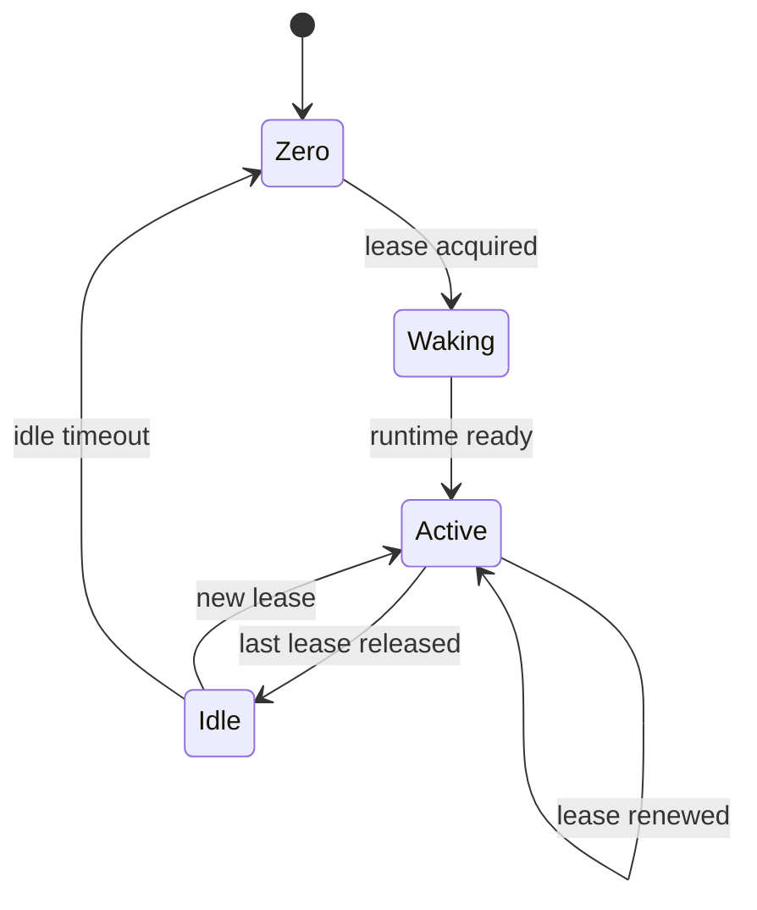
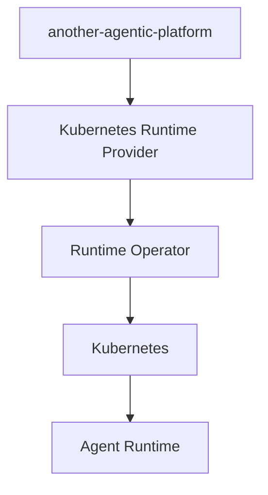
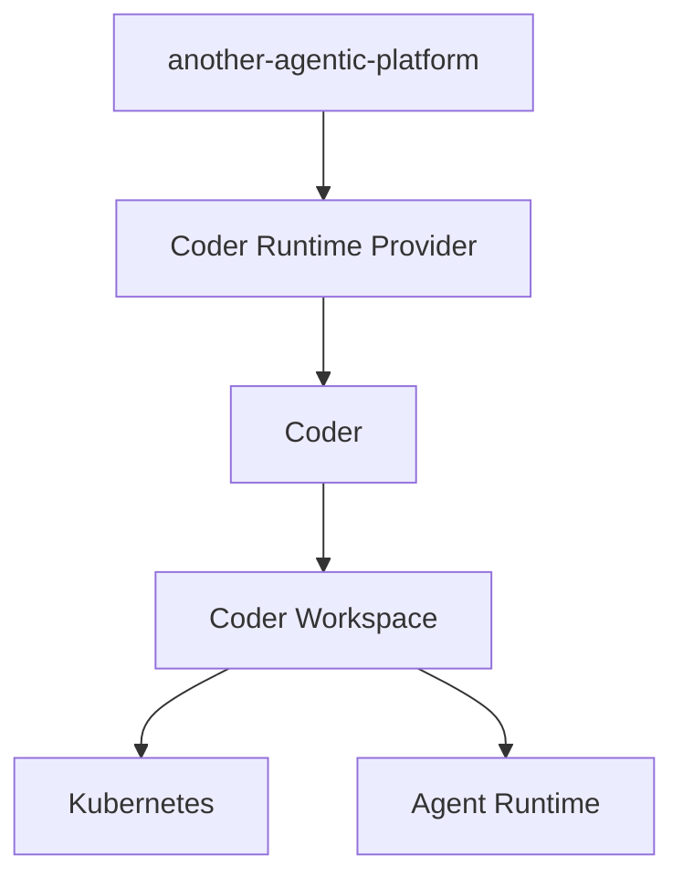
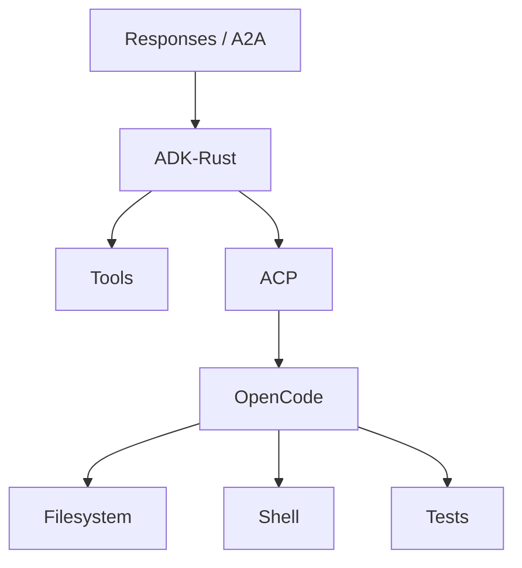
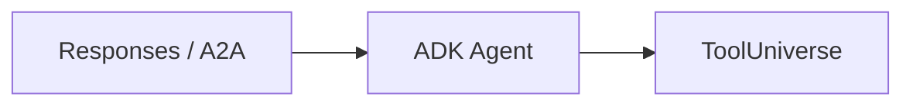
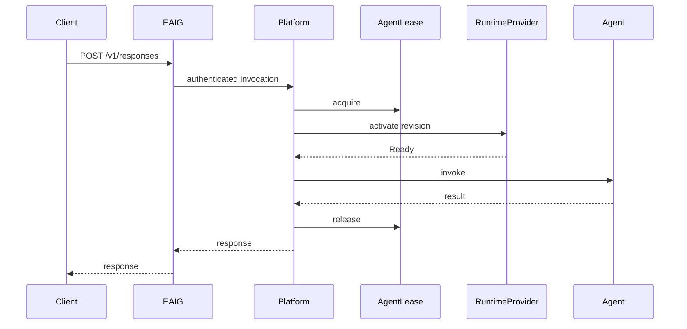

# Runtime, runs, leases and scale-to-zero

[← Index](README.md) · [← Previous](04-workflows.md) · [Next →](06-environments-and-storage.md)


---

## 18. Runtime Controller Responsibilities

The runtime controller/provider answers:

> What runtime infrastructure must exist now?

Example infrastructure states:

```text
Absent
Provisioning
Ready
Suspended
Failed
```

It should **not** contain application workflow logic such as:

```text
if PR review fails:
    ask agent to fix
    wait for CI
    reopen review
```

That belongs in Restate.

---

## 19. AgentRun

`AgentRun` represents one logical execution.

> **Review decision (2026-09-28, AD-016):** `AgentRun` is an **application-database record, not a CRD**. Runs are created per request and updated constantly; in etcd that is write churn for data Kubernetes never reconciles. The shape below is the record, shown as YAML for readability.

Example record:

```yaml
# application record (Postgres), not a Kubernetes object
kind: AgentRun

metadata:
  name: run-01kxyz

spec:
  agentRef:
    name: coder

  revisionRef:
    name: coder-r42

  input:
    type: issue

    repository:
      url: https://github.example.com/example/project

    issue:
      number: 428

status:
  phase: Running

  conditions:
    - type: RuntimeReady
      status: "True"

    - type: Completed
      status: "False"
```

`AgentRun` correlates:

```text
workflow
revision
runtime
leases
artifacts
logs
traces
Git branch
PR
cost
usage
```

---

## 20. AgentLease

`AgentLease` represents:

> This agent currently requires compute.

This is separate from HTTP request lifetime.



Lease holders may include:

```text
Responses request
background Response
AgentRun
Restate workflow
A2A request
interactive session
debug session
```

> **Review decision (2026-09-28, AD-016):** `AgentLease` is a **lease-service record in Postgres, not a CRD**. Every active holder renews its lease every few seconds; the operator reads the aggregate ("active leases per `AgentService`") instead of watching individual objects.

Example record:

```yaml
# lease-service record (Postgres), not a Kubernetes object
kind: AgentLease

metadata:
  name: run-01kxyz

spec:
  agentRef:
    name: coder

  holder:
    type: AgentRun
    name: run-01kxyz

  expiresAt: "..."
```

Leases should be renewable and short-lived.

If the holder crashes:

```text
lease expires
    ↓
idle timeout
    ↓
runtime stops
```

This avoids leaked compute.

---

## 21. Scale-to-Zero

Scale-to-zero is a semantic capability, not necessarily a Knative implementation.

> **Decision (2026-10-04, AD-023):** the v0 operator does not scale to zero ([§59a](10-control-plane-and-crds.md#59a-operator-v0-adam-rs-agents)). It has `spec.suspend`, which takes the workload to zero replicas and reports the runtime phase `Suspended`, and nothing else: no leases, no idle timeout, no activator. A source of run leases is an open question (§93): the coder's workers keep stepping a run after the A2A call has returned, so the HTTP connection says nothing about idleness.

Desired behavior:

```text
valid leases > 0
    → runtime must be active

valid leases = 0
    → wait idleTimeout
    → runtime may stop
```

The stable service continues to exist while runtime compute is absent.

---

## 22. RuntimeProvider

The platform should define a narrow runtime abstraction.

> **Decision (2026-09-28, AD-020):** providers are Rust traits in their own
> crate, with a conformance testkit; implementations (Kubernetes, Coder, …)
> are separate crates selected at build time. The sketch below is kept
> language-neutral.

Conceptually:

```go
type RuntimeProvider interface {
    EnsureRuntime(ctx, revision) error
    Activate(ctx, runtimeID) error
    Suspend(ctx, runtimeID) error
    Delete(ctx, runtimeID) error

    Status(ctx, runtimeID) (Status, error)
    Endpoint(ctx, runtimeID, service string) (Endpoint, error)
    Logs(ctx, runtimeID) (LogStream, error)
}
```

The implementation can change without changing the domain model.

Potential providers:

```text
RuntimeProvider
├── KubernetesRuntimeProvider
└── CoderRuntimeProvider
```

There is no requirement to implement both.

> **Decision (2026-10-04, AD-023):** the Rust shape of the first provider boundary lives in the crate `aap-ports` and is sketched below (S3 settles the details). **`Activate` is folded into `ensure`**: ensuring a suspended runtime wakes it, so there is no second verb to keep in step with the first, and `suspend` stays. `Logs` is not in v0: logs are read through §50. `watch` feeds the controller with the ids of runtimes that changed, so the controller never watches workloads itself. Neutral types and the issue reasons of `RuntimeStatus` are in [§59a](10-control-plane-and-crds.md#59a-operator-v0-adam-rs-agents).

```rust
// crate aap-ports (AD-020): no Kubernetes type in any signature.
pub trait RuntimeProvider: Send + Sync {
    fn capabilities(&self) -> Capabilities;

    /// Make the runtime match `spec`: create it, update it, or wake it.
    async fn ensure(&self, id: &RuntimeId, spec: &RuntimeSpec) -> Result<RuntimeStatus, RuntimeError>;
    async fn suspend(&self, id: &RuntimeId) -> Result<RuntimeStatus, RuntimeError>;
    async fn delete(&self, id: &RuntimeId) -> Result<DeleteOutcome, RuntimeError>;

    async fn status(&self, id: &RuntimeId) -> Result<RuntimeStatus, RuntimeError>;
    async fn endpoint(&self, id: &RuntimeId, surface: Surface) -> Result<Endpoint, RuntimeError>;

    /// Ids of runtimes whose state changed.
    fn watch(&self) -> BoxStream<'static, RuntimeId>;
}
```

---

## 23. Native Kubernetes Runtime

A native implementation might look like:



Responsibilities include:

- workload creation;
- volumes;
- networking;
- scale-to-zero;
- readiness;
- side services;
- runtime classes;
- scheduling;
- snapshots;
- cleanup.

This provides maximum architectural control but requires substantial engineering.

---

## 24. Coder Runtime

Coder may alternatively implement the runtime substrate.



Coder may provide:

- workspace lifecycle;
- start/stop;
- storage provisioning;
- Terraform-managed side resources;
- workspace connectivity;
- logs;
- shell access;
- port access;
- persistent resources;
- development environment support.

The rest of `another-agentic-platform` remains ours:

```text
AgentService
AgentConfig
AgentRevision
ToolUniverse
AgentRun
AgentLease
Restate
EAIG integration
A2A
MCP
Responses
tenancy
authorization
artifacts
observability
release channels
```

The architecture should avoid leaking Coder concepts into these resources.

---

## 25. Coder Architecture Trade-Off

Coder is potentially the lowest-effort runtime solution.

The cost is conceptual translation:

```text
AgentRevision
     ↓
Runtime abstraction
     ↓
Coder Workspace
     ↓
Coder Template
     ↓
Terraform
     ↓
Kubernetes
```

Native Kubernetes is more direct:

```text
AgentRevision
     ↓
Runtime abstraction
     ↓
Kubernetes
```

The decision should therefore be based on whether a **workspace** is a natural runtime abstraction for most agents.

Coding agents map naturally.

Other agents may not.

---

## 26. Agent Runtime

> **Decision (2026-10-04, AD-022):** the harness is **adam-rs**, which replaces ADK-Rust in the drawings below: `adam-coder` (a coding task to a verified pull request) and `adam-agent` (serves any agent folder), both in the image `ghcr.io/vymalo/another-adam-rs/coder`, selected by `AgentConfig.spec.harness.type: adam-rs` ([§59a](10-control-plane-and-crds.md#59a-operator-v0-adam-rs-agents)). OpenCode stays a capability inside `adam-coder`: its ACP client is the adam-rs crate `adam-acp` (*verified 2026-10-04*, adam-rs at `0391809`: `docs/architecture.md`, `crates/adam-acp/README.md`). The ADK-Rust notes after the drawings are kept as the history of the choice.

A coding runtime might contain:



A non-coding agent may simply be:



Therefore:

> ACP/OpenCode are agent capabilities, not platform requirements.

**Verified notes (2026-09-28):**

- **ADK-Rust** is [zavora-ai/adk-rust](https://github.com/zavora-ai/adk-rust), a community Rust implementation of Google's ADK (not Google's own). It claims A2A v1.0 support via its `adk-server` crate. Not yet exercised — spike before it becomes load-bearing.
- **`opencode acp`** runs OpenCode as an ACP agent over **stdio** (newline-delimited JSON-RPC). It opens no network port and starts a private OpenCode server per process ([docs](https://opencode.ai/docs/acp/)). The ADK process and OpenCode must therefore share a container/Pod — as drawn above.

---

## 42. Scale-from-Zero Request

Example flow:



For background execution, the HTTP response can end while a Restate workflow continues renewing the lease.

---

## 64. Scheduling and Admission

At small scale, the controller may immediately activate workloads.

At larger scale:

```text
AgentRun
    ↓
WAITING_FOR_CAPACITY
    ↓
admission
    ↓
runtime activation
```

Potential future integration:

```text
Kueue
```

as an optional admission implementation.

GPU and specialized device support may use Kubernetes DRA where relevant.

---

## 65. Resource Classes

Potential future model:

```yaml
kind: ResourceClass

metadata:
  name: medium

spec:
  resources:
    cpu: "4"
    memory: 8Gi

  placement:
    architecture:
      - amd64

  runtimeClass: gvisor
```

Agents can reference logical resource classes instead of embedding cluster details.

---

## 80. Runtime Cold Starts

Scale-to-zero introduces cold-start latency.

Potential mitigations:

```text
prebuilt images
shared project Git mirrors
shared dependency caches
shared code indexes
prewarming
minimum replicas for critical agents
snapshot/restore
faster runtime provider
```

The architecture should allow these optimizations without changing the `AgentService` contract.

---

[← Index](README.md) · [← Previous](04-workflows.md) · [Next →](06-environments-and-storage.md)
