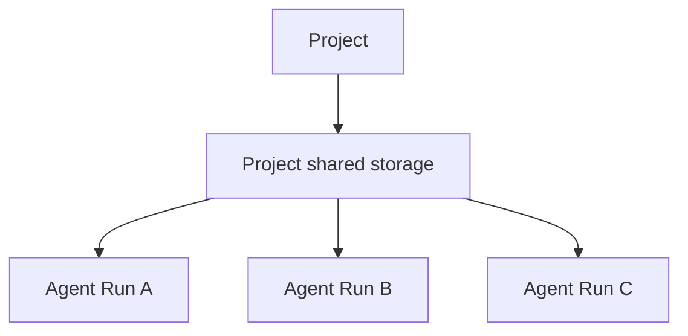
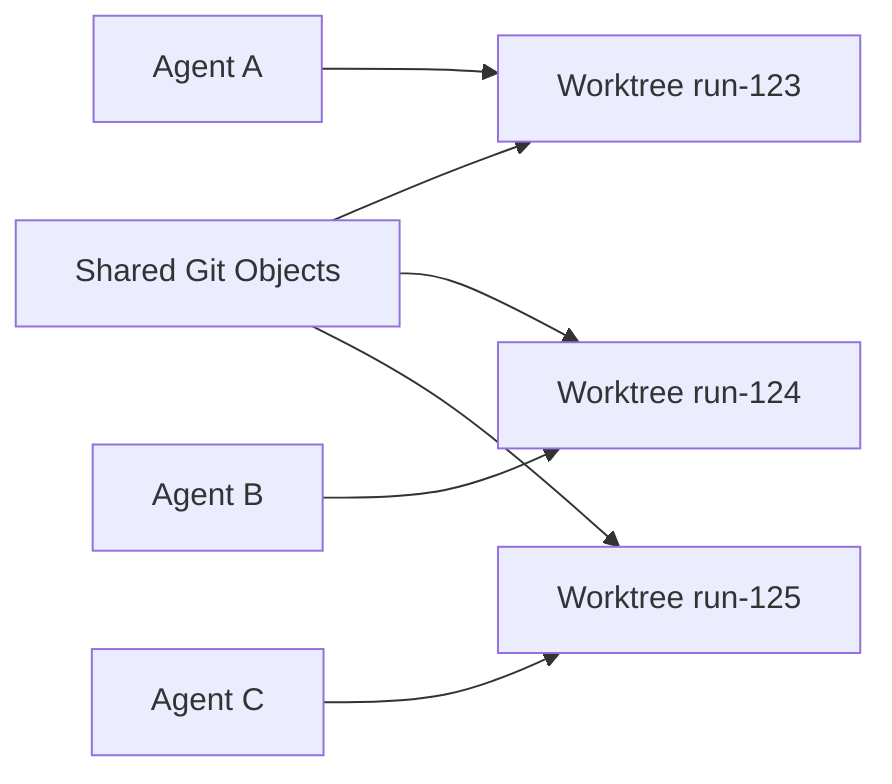
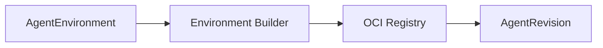
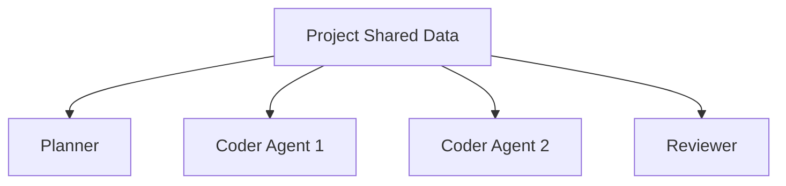

# Environments, storage, caches and worktrees

[← Index](README.md) · [← Previous](05-runtime.md) · [Next →](07-tools.md)


---

## 27. AgentEnvironment

`AgentEnvironment` describes the execution environment needed by one or more agent configurations.

Example:

```yaml
apiVersion: agents.vymalo.com/v1alpha1
kind: AgentEnvironment

metadata:
  name: fullstack-development

spec:
  image:
    ref: registry.example.com/dev/fullstack@sha256:...

  resources:
    cpu: "4"
    memory: 8Gi

  volumes:
    - name: workspace
      scope: run
      mountPath: /workspace

      source:
        ephemeral: {}

    - name: project-data
      scope: project
      mountPath: /project

      source:
        persistent:
          size: 100Gi

    - name: cache
      scope: project
      mountPath: /cache

      source:
        cache: {}

  services:
    - name: postgres

      image:
        ref: postgres:17

      readiness:
        tcpPort: 5432

    - name: redis

      image:
        ref: redis:8

      readiness:
        tcpPort: 6379
```

---

## 28. Volumes

The platform must not assume one universal workspace PVC.

Volumes are an optional list.

Possible scopes:

```text
run
agent
project
```

#### Run-scoped

Destroyed after execution.

Examples:

```text
temporary checkout
scratch data
temporary OpenCode state
```

#### Agent-scoped

Shared between runs of one `AgentService`.

Examples:

```text
agent-specific cache
agent memory database
specialized index
```

#### Project-scoped

Reusable by multiple agents belonging to the same project.

Examples:

```text
Git object database
dependency cache
code index
large build cache
```

---

## 29. Shared Project Storage

Multiple agents working on the same project can share project-level state.



However:

> concurrent agents should normally not mutate the same Git working tree.

A preferred structure is:

```text
/project
├── git/
│   └── shared object database
├── worktrees/
│   ├── run-123/
│   ├── run-124/
│   └── run-125/
├── cache/
└── indexes/
```

Each run works in an isolated worktree.



Good candidates for sharing:

| Data | Shared? |
|---|---|
| Git objects | yes |
| package download caches | yes |
| Cargo/Maven/npm cache | yes |
| code-intelligence indexes | often |
| read-only baseline | yes |
| build cache | when concurrency-safe |
| mutable worktree | no |
| OpenCode session database | no |
| credentials | no |
| home directory | generally no |

OpenCode itself should normally be installed in the runtime image rather than persisted on a shared volume.

**Storage reality check (netcup, 2026-09-28):**

- The only StorageClasses are `longhorn` (default) and `longhorn-static`. Sharing one project volume between concurrently running agents needs ReadWriteMany; Longhorn provides RWX through an NFS share-manager, whose performance for Git object databases and build `target/` directories is unverified here.
- A realistic v1: one project volume per active runtime (RWO), plus caches that are already networked and shared (sccache backend, package-registry mirror).
- A mount shadows whatever the image holds at that path, so toolchains belong under `/opt` in the image and only caches/state under mount points (learned running OpenHands Agent Canvas).

---

## 30. Dev Containers

Dev Containers can be supported as an **environment authoring format**.

They should not become the runtime abstraction.

Conceptually:

```text
.devcontainer/devcontainer.json
            ↓
Environment Builder
            ↓
policy validation
            ↓
resolve Features
            ↓
build image
            ↓
SBOM
            ↓
signature
            ↓
immutable OCI digest
            ↓
AgentEnvironment
```

Potentially unsafe developer settings must be rejected or normalized:

```text
privileged=true
docker.sock mount
hostPath
SYS_ADMIN
host networking
```

The platform defines what is permitted.

---

## 31. Environment Builder

Building runtime images should be separate from runtime reconciliation.



Responsibilities:

- resolve DevContainer configuration;
- build images;
- generate SBOMs;
- sign artifacts;
- create provenance;
- pin image digest;
- report build status.

The Kubernetes operator should not itself build container images.

---

## 54. Project-Level Shared Runtime State

A `Project` can also become the natural scope for expensive reusable state.

Examples:

```text
Git mirror
package cache
code-intelligence index
build cache
dependency graph
repository metadata
```

This is particularly useful for fleets of coding agents.



Permissions determine which shared resources each agent may mount.

---

## 55. Side Services

An environment can request supporting services.

Example:

```yaml
services:
  - name: postgres

    image:
      ref: postgres:17

    volumes:
      - name: pgdata
        mountPath: /var/lib/postgresql/data

        source:
          ephemeral: {}

  - name: redis

    image:
      ref: redis:8
```

These are logical services.

The runtime provider may implement them as:

```text
same-Pod sidecars
separate Deployments
Jobs
external managed services
```

depending on policy and provider capabilities.

---

## 81. Caches

Caches should have distinct lifecycle semantics from correct working state.

Caches may be:

```text
deleted
recreated
shared
evicted
```

without affecting correctness.

Examples:

```text
Cargo registry
npm cache
Maven cache
compiler cache
Git objects
code intelligence index
```

A cache should not become the only copy of important mutable state.

---

## 82. Project Worktrees

For parallel coding agents, isolated Git worktrees are recommended.

Example:

```text
/project/git
/project/worktrees/run-a
/project/worktrees/run-b
/project/worktrees/run-c
```

This permits:

```text
agent A modifies backend
agent B modifies frontend
agent C adds tests
```

without direct working-tree collision.

Merge/integration occurs through explicit workflow stages.

---

[← Index](README.md) · [← Previous](05-runtime.md) · [Next →](07-tools.md)
