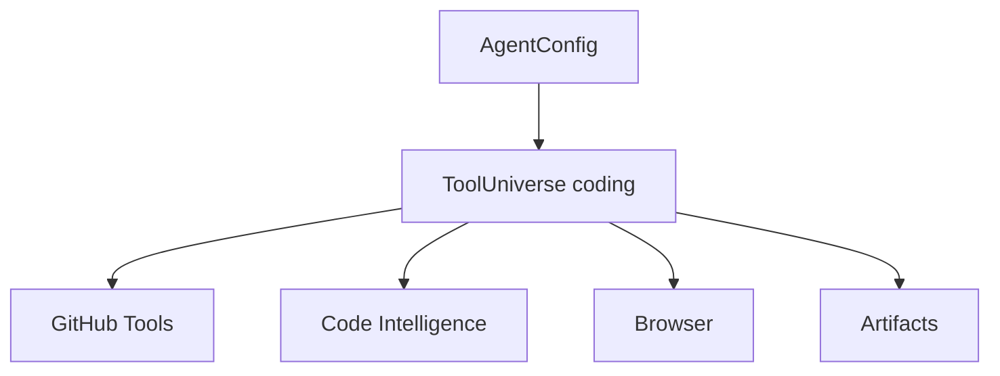
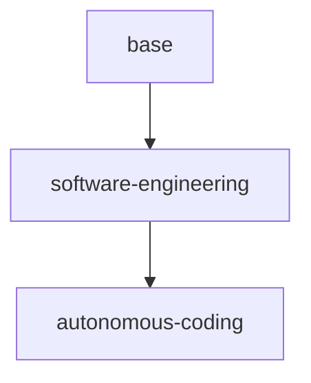

# Tools

[← Index](README.md) · [← Previous](06-environments-and-storage.md) · [Next →](08-security.md)


---

## 32. ToolProvider

A `ToolProvider` defines where tools originate.

Example:

```yaml
apiVersion: agents.vymalo.com/v1alpha1
kind: ToolProvider

metadata:
  name: code-intelligence

spec:
  type: mcp

  mcp:
    transport: streamable-http
    endpoint: https://code-intelligence.internal/mcp

  credentials:
    bindingRef:
      name: code-intelligence
```

Possible provider types:

```text
mcp
native
openapi
a2a
function
```

The list can evolve over time.

---

## 33. ToolUniverse

A `ToolUniverse` defines the set of tools available to an agent class.

```yaml
apiVersion: agents.vymalo.com/v1alpha1
kind: ToolUniverse

metadata:
  name: autonomous-coding

spec:
  providers:
    - providerRef:
        name: github

      include:
        - get_issue
        - get_pull_request
        - create_branch
        - create_pull_request

    - providerRef:
        name: code-intelligence

      include:
        - search
        - references
        - symbols
```

This allows reusable tool sets.



---

## 34. ToolUniverse Composition

ToolUniverses may compose reusable capability layers.

Example:

```text
base
├── artifacts
└── company knowledge

software-engineering
├── base
├── Git
└── code intelligence

autonomous-coding
├── software-engineering
├── shell
└── filesystem
```



When a revision is generated:

```text
references
    ↓
recursive resolution
    ↓
policy filtering
    ↓
effective tool set
    ↓
digest
    ↓
AgentRevision
```

Changes to the ToolUniverse do not mutate existing revisions.

---

## 35. Internal Tools vs Caller-Supplied Tools

The platform should distinguish:

```text
platform/internal tools
caller-provided tools
```

Effective tools are:

```text
platform-required tools
+
AgentConfig ToolUniverses
+
approved request tools
```

A caller must not be able to remove mandatory platform verification or security tooling.

Request-provided MCP/function tools must pass policy evaluation.

---

## 36. MCP Exposure

A tool available to an agent does not automatically need to be exposed through its MCP endpoint.

Example:

```yaml
tools:
  - ref: github

    visibility:
      agent: true
      externalMcp: false

  - ref: architecture-search

    visibility:
      agent: true
      externalMcp: true
```

This avoids unintentionally turning internal privileged capabilities into public tools.

---

[← Index](README.md) · [← Previous](06-environments-and-storage.md) · [Next →](08-security.md)
