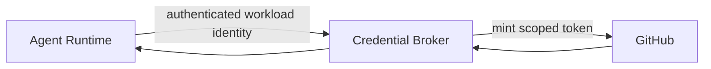
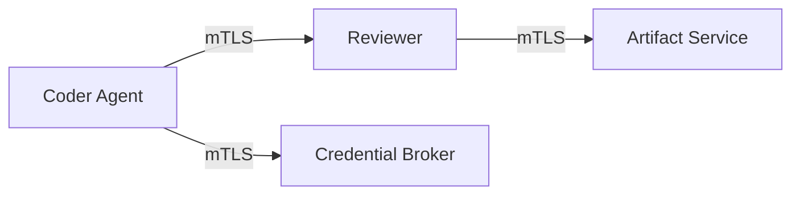
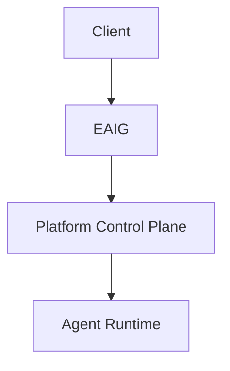
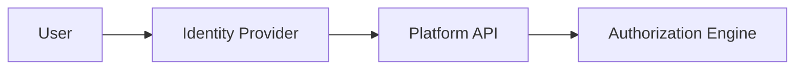
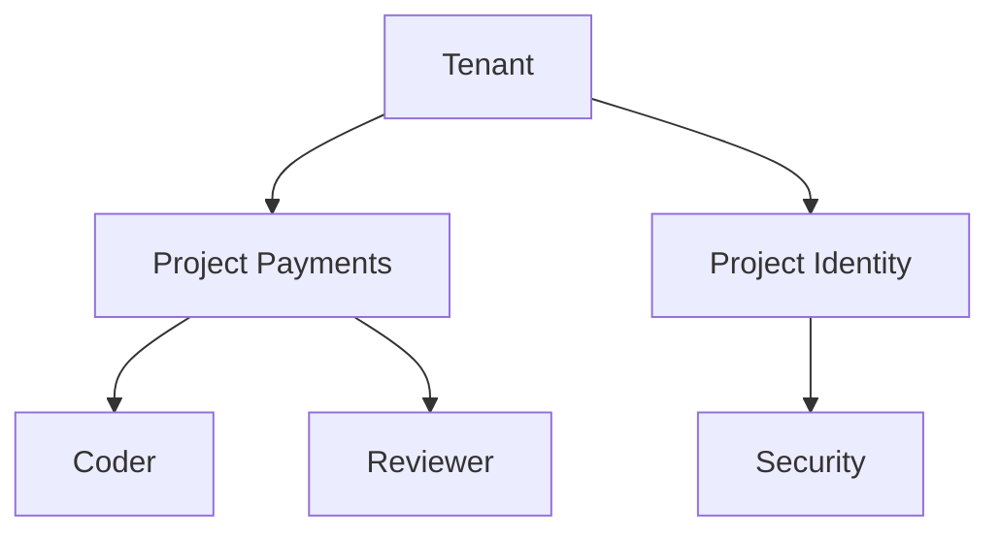

# Security, identity, credentials and tenancy

[← Index](README.md) · [← Previous](07-tools.md) · [Next →](09-operations.md)


---

## 37. SecurityProfile

Reusable runtime security constraints should be modeled explicitly.

Example:

```yaml
apiVersion: agents.vymalo.com/v1alpha1
kind: SecurityProfile

metadata:
  name: restricted-coding-agent

spec:
  runAsNonRoot: true

  capabilities:
    drop:
      - ALL

  hostNetwork: false
  hostPID: false

  privileged: false

  filesystem:
    allowHostPath: false

  networking:
    defaultEgress: deny

  images:
    requireDigest: true
```

The profile is translated into provider-specific runtime policy.

Kubernetes admission policy should enforce critical invariants independently of the operator.

---

## 38. Secrets Model

Secrets fall into different categories.

### Platform secrets

Examples:

```text
GitHub App private key
model-provider master credential
signing key
```

These must never enter agent runtimes.

### Ephemeral runtime credentials

Examples:

```text
GitHub installation token
temporary object-store credentials
database token
```

Properties:

- short-lived;
- scoped;
- renewable;
- revocable.

### Test environment secrets

Examples:

```text
temporary PostgreSQL password
temporary Redis password
test application secrets
```

These may be generated per environment and deleted with the environment.

---

## 39. Credential Broker

A dedicated credential broker is recommended.

Example Git workflow:



The control plane owns the long-lived GitHub App credential.

The agent receives only a short-lived credential scoped to:

```text
repository
permissions
operation
time
```

Where possible, Git write operations can be mediated by trusted platform components rather than giving the coding process broad Git credentials.

---

## 40. SPIFFE / SPIRE

SPIFFE answers:

> Which workload is making this request?

Potential identities:

```text
spiffe://agents.vymalo.com/control-plane

spiffe://agents.vymalo.com/credential-broker

spiffe://agents.vymalo.com/agent/coder

spiffe://agents.vymalo.com/agent/reviewer
```



SPIFFE identity can later support:

- workload mTLS;
- service authorization;
- secret issuance;
- agent-to-agent trust;
- workload identity independent of bearer tokens.

The API model should therefore avoid treating Kubernetes `ServiceAccount` as the conceptual identity.

A ServiceAccount may simply be one identity provider implementation.

---

## 41. EAIG

EAIG remains the ingress and governance plane.

EAIG is **Envoy AI Gateway**, since renamed **Agent Router** (an Agentic AI Foundation project; the `AIGatewayRoute` CRD and the `aigateway.envoyproxy.io` API group are unchanged). Like AISIX, it is consumed through OpenAI-compatible endpoints: the platform has **no hard dependency** on any one gateway (AD-018).

The same class of gateway also governs **model egress**: agents call models through an OpenAI-compatible gateway endpoint (`AgentConfig.spec.model.providerRef`), never with raw provider keys. That is where model tokens and cost (§85) are measured.

It may provide:

- external routing;
- authentication integration;
- policy enforcement;
- rate limiting;
- request observability;
- activation integration.

Example:



EAIG does not become the agent runtime.

---

## 51. Human Authentication

Users authenticate through SSO/OIDC.



JWT claims are input attributes.

They should not themselves be the entire authorization model.

---

## 52. RBAC and ABAC

Example permissions:

```text
agent.read
agent.invoke
agent.configure
agent.publish
agent.promote
agent.logs.read

run.read
run.cancel

artifact.read
artifact.delete

project.admin
tenant.admin
```

ABAC may add constraints such as:

```text
subject group = payments-developers

action = agent.invoke

resource.project = payments
```

> **Decision (2026-10-05, AD-032):** for the admin dashboard (§60a), permissions are **Keycloak client roles** of the client `another-agentic`, and human-facing roles are **composite roles** that bundle them; the Platform API checks individual permissions, never a role name. v0 names, proposed and not final: `platform:agents.read`, `platform:agents.write`, `platform:models.write`, `platform:toolproviders.write`, `platform:secrets.pick` and `agent.use:<agent-name>`. `agent.configure` above stays an example of the target model; v0 replaces it with the finer set.

Human authorization belongs to the application control plane.

Humans should not need direct Kubernetes RBAC.

---

## 53. Multi-Tenancy

Multi-tenancy should exist in the model from day one.



Ownership hierarchy:

```text
Tenant
  └── Project
       ├── AgentService
       ├── AgentRun
       ├── Artifacts
       └── policies
```

This provides natural boundaries for:

- permissions;
- quotas;
- model budgets;
- credentials;
- artifacts;
- audit;
- resource isolation.

---

## 68. Agent-to-Agent Security

A2A invocation should pass through authorization.

Example:

```text
planner
    CAN invoke
        repository-analyst
        test-agent
        documentation-agent

planner
    CANNOT invoke
        production-deployer
```

Authorization can use:

```text
caller workload identity
caller AgentService
caller project
target AgentService
action
tenant
```

With SPIFFE this may become:

```text
spiffe://agents.vymalo.com/agent/planner

MAY a2a.invoke

spiffe://agents.vymalo.com/agent/test-agent
```

---

## 75. Security Boundaries

Primary trust boundaries:

```text
Internet / external client
        ↓
EAIG
        ↓
platform control plane
        ↓
runtime
        ↓
tools / Git / databases
```

Sensitive boundaries include:

```text
credential broker
artifact store
Git writes
model providers
tenant boundary
runtime-to-runtime communication
```

Each must have explicit authentication and authorization.

---

## 76. Egress Policy

Agent runtimes should not automatically have unrestricted Internet access.

Policy may allow:

```text
Git provider
model provider
approved MCP services
package registries
artifact store
specific project dependencies
```

Default-deny egress is desirable for high-security environments.

---

## 77. Supply-Chain Security

Runtime artifacts should preferably support:

```text
immutable image digests
SBOM
signatures
build provenance
policy validation
```

Potential ecosystem:

```text
OCI
Sigstore/Cosign
SLSA provenance
```

A revision should record the exact runtime image digest.

---

## 83. Git Integration

Preferred Git architecture:


Where practical, a trusted platform service can own:

```text
clone
push
branch creation
PR creation
merge
```

while the agent operates on the filesystem.

This reduces credentials available inside untrusted agent processes.

---

[← Index](README.md) · [← Previous](07-tools.md) · [Next →](09-operations.md)
