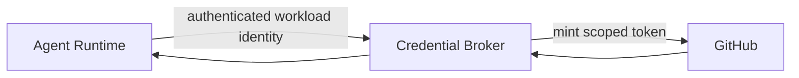
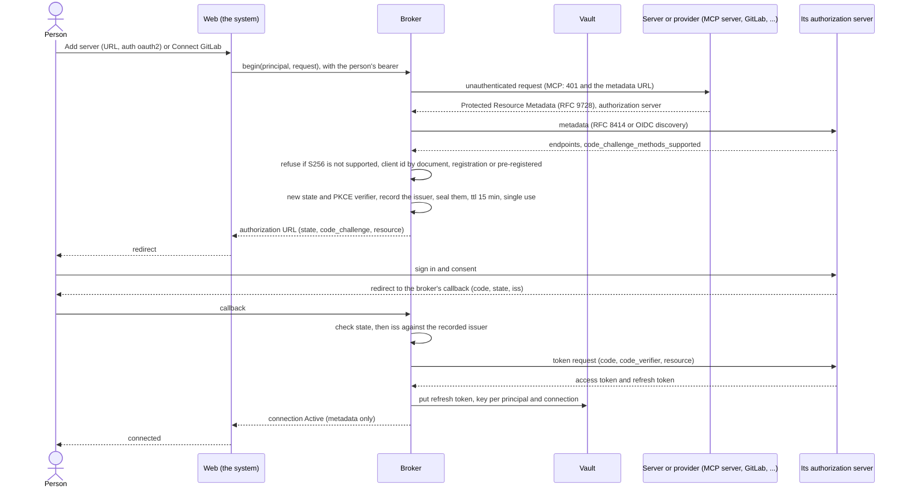
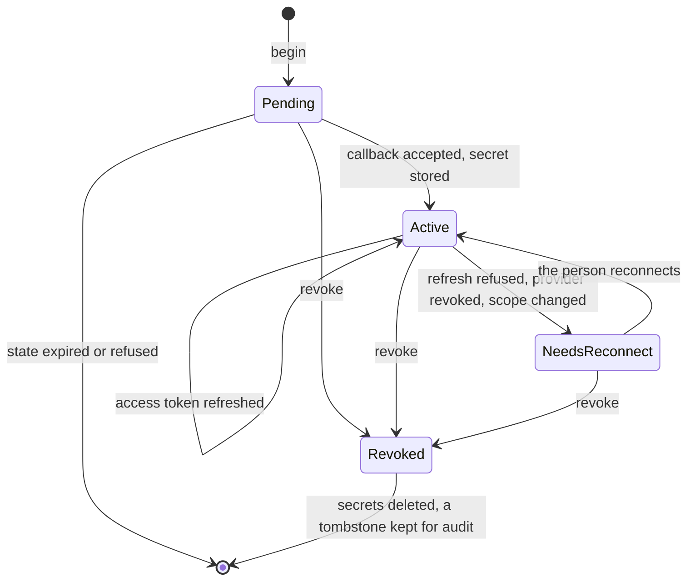
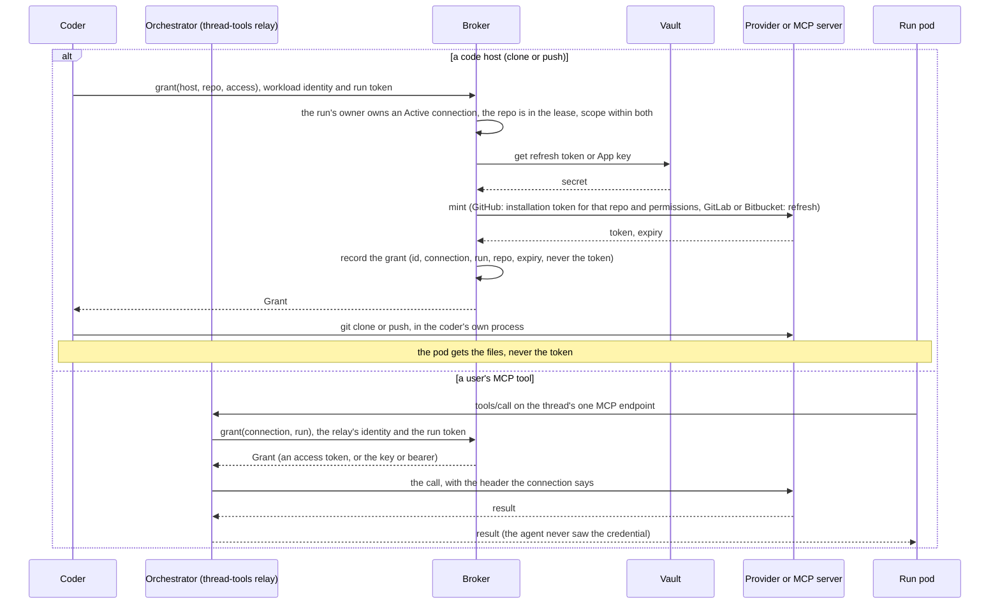
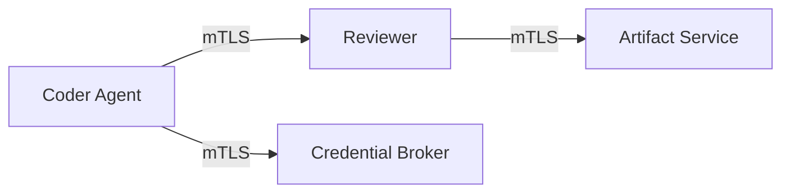
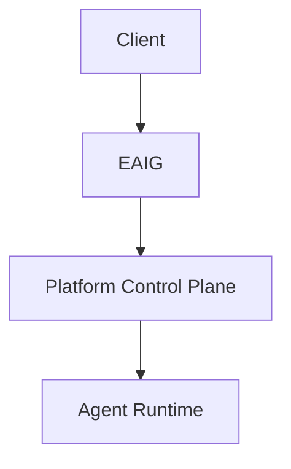
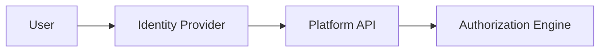
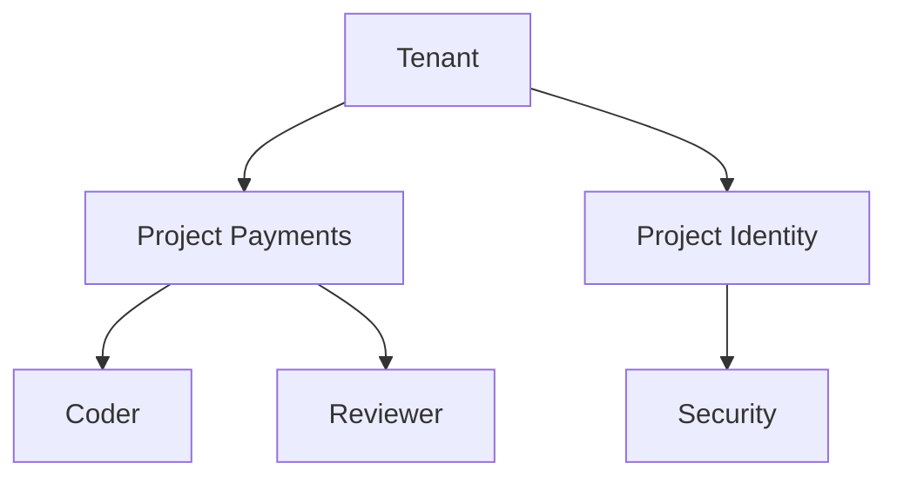
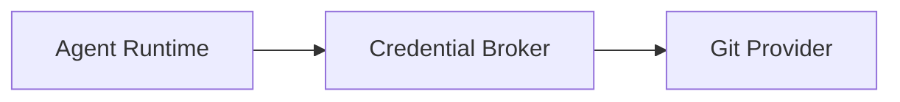

# Security, identity, credentials and tenancy

[← Index](README.md) · [← Previous](07-tools.md) · [Next →](09-operations.md)


---

## 37. SecurityProfile

Reusable runtime security constraints should be modeled explicitly.

Example:

```yaml
apiVersion: agents.vymalo.com/v1alpha1
kind: SecurityProfile

metadata:
  name: restricted-coding-agent

spec:
  runAsNonRoot: true

  capabilities:
    drop:
      - ALL

  hostNetwork: false
  hostPID: false

  privileged: false

  filesystem:
    allowHostPath: false

  networking:
    defaultEgress: deny

  images:
    requireDigest: true
```

The profile is translated into provider-specific runtime policy.

Kubernetes admission policy should enforce critical invariants independently of the operator.

---

## 38. Secrets Model

Secrets fall into different categories.

### Platform secrets

Examples:

```text
GitHub App private key
model-provider master credential
signing key
```

These must never enter agent runtimes.

### Ephemeral runtime credentials

Examples:

```text
GitHub installation token
temporary object-store credentials
database token
```

Properties:

- short-lived;
- scoped;
- renewable;
- revocable.

### Test environment secrets

Examples:

```text
temporary PostgreSQL password
temporary Redis password
test application secrets
```

These may be generated per environment and deleted with the environment.

---

## 39. Credential Broker

A dedicated credential broker is recommended.

Example Git workflow:



The control plane owns the long-lived GitHub App credential.

The agent receives only a short-lived credential scoped to:

```text
repository
permissions
operation
time
```

Where possible, Git write operations can be mediated by trusted platform components rather than giving the coding process broad Git credentials.

---

## 39a. Connections, user MCP servers and the credential broker

> **Status: design only, decided by the owner (2026-10-06).** Nothing here is built. Decisions: AD-040 to AD-042; proposals: P-015 and P-016 (§92); open questions: §93 (*Connections and the broker*). It makes concrete the broker §39 recommends, and the one that closes the gap AD-024 records (the GitHub App key in the coder's pod).

### The owner's decisions

| # | Decision | Record |
|---|---|---|
| 1 | **An agent's own MCP servers are fixed** (its folder or `AgentConfig`). Users cannot change them | AD-040 |
| 2 | **Users can add MCP servers from the UI**, on top of the agent's: auth kinds **OAuth 2** (authorization code with PKCE), **API key** (header name configurable), **bearer token**, **none**. Stored per user, optionally shared to an organisation later. The owner wants it to *"mimic how LibreChat is doing their stuff"* | AD-040 |
| 3 | **Connections for code hosts**: GitHub (an App installed by the user), GitLab and Bitbucket (OAuth). They feed adam-rs's `CodeHost` trait | AD-041 |
| 4 | **A credential broker** keeps refresh tokens and keys encrypted per user and per connection, hands a run a short-lived scoped token per request, revokes in one action, and puts **nothing secret in agent pods, files or logs** | AD-042 |
| 5 | Ownership is per user and, later, per organisation; **pods are never shared across owners** (§59b) | AD-042 |

Not the same as AD-030: the dashboard (§60a) *picks* a reference to a deployment secret and never takes a value. A **user** types their own key into a connection, which goes to the broker and nowhere else. It is never a custom resource, a Secret, an ExternalSecret or a file.

### Vocabulary

| Term | Is |
|---|---|
| **Principal** | The person (the identity the system already has, §51): `{ kind: User, id }`, and later `{ kind: Org, id }` |
| **Connection** | One link from a principal to a third party: a user MCP server with its auth, or a code host. Metadata is readable; the secret is not |
| **Grant** | A short-lived token for one connection, for one run, with a scope and an audience. It is minted per request and recorded without its value |
| **Vault** | Where secrets rest, encrypted. A backend behind a trait, below |

### What a user can add (AD-040)

An agent's servers stay what its `AgentConfig` says (`tools.mcpServers`, `providerRef`, §59a and §60a). A person's own servers are a *second* list, theirs alone. A record, in the broker's store, not a custom resource (per-user, many, and changed by people who have no Kubernetes rights, §52):

```yaml
# a connection record: broker store, not a Kubernetes object
id: conn_01J9ZK4
owner: { kind: User, id: 5c1b0e5e-0f3a-4e57-9d1e-2f7a5b7c9a11 }
kind: mcp
name: Internal wiki
server: { url: https://wiki.example.com/mcp, transport: streamable-http }
auth:
  kind: api_key                    # oauth2 | api_key | bearer | none
  header: X-Api-Key                # api_key: the header's name (default Authorization); prefix optional
  prefix: ""
status: Active                     # see the lifecycle below
sharedWith: []                     # later: organisations
```

| Auth kind | What the person gives | What the broker keeps | How a call is made |
|---|---|---|---|
| `oauth2` | A URL, then a sign-in at the server's authorization server | The refresh token (and the registered client) | Authorization code with PKCE, below. Access token per call, `Authorization: Bearer` |
| `api_key` | The key, and the header's name (and an optional prefix) | The key | `<header>: <prefix><key>` |
| `bearer` | The token | The token | `Authorization: Bearer <token>` |
| `none` | Nothing | No secret (the record only) | No credential |

**OAuth 2 follows the MCP authorization specification's current revision, *verified 2026-10-06*** (<https://modelcontextprotocol.io/specification/latest/basic/authorization>, which resolved to the revision `2026-07-28`; its security page at the same revision). What the broker must do as the OAuth client:

- find the authorization server from the MCP server's **Protected Resource Metadata** (RFC 9728), then its metadata by **RFC 8414 or OpenID Connect Discovery** (a client must support both);
- get a client id by, in the spec's order of preference, **Client ID Metadata Documents**, pre-registration, or **Dynamic Client Registration** (the spec marks DCR deprecated, kept for servers without the first). The broker therefore serves a metadata document at a stable HTTPS URL;
- **PKCE with `S256`**, and **refuse to proceed if the server's metadata lacks `code_challenge_methods_supported`**;
- send the **`resource` parameter** (RFC 8707) in the authorization and token requests, naming the MCP server;
- validate `iss` on the authorization response (RFC 9207) against the issuer recorded before the redirect; use `state` and exact, pre-registered redirect URIs (HTTPS or `localhost`);
- keep refresh tokens confidential in storage and transit; send tokens only in the `Authorization` header, never the query string; **never pass a token received from one party to another** (no token passthrough).

**Rules for a user-supplied URL** (it is an SSRF vector; the system already guards its fetch tool the same way, `dev/searxng-mcp` in another-agentic-system):

- `https` only; `allowInsecureHttp` (§59a) never applies to a user server; no user name, password or `${…}` in the URL;
- resolve, then **refuse loopback, link-local, private and cluster ranges**, at connect time and again on every call, and connect to the address that was checked (against DNS rebinding);
- a header name is an HTTP token and not `Host`, `Content-Length` or `Transfer-Encoding`;
- a user server's tools are namespaced, so they can **never shadow** an agent's own tool; a limit on servers per person and on tools per server;
- a user server can reference **nothing of the deployment**: no environment variable, no profile field, no token of the person.

**How this mimics LibreChat** (*verified 2026-10-06*, <https://www.librechat.ai/docs/features/mcp>, read by a fetch that summarises the page, and the search listing of <https://www.librechat.ai/docs/configuration/librechat_yaml/object_structure/mcp_servers>):

| LibreChat | Here |
|---|---|
| Servers in its YAML file, **and servers a user adds from the UI** (a `+` in the MCP settings panel: name, description, URL, transport, authentication), stored in its database with per-user ACL (Viewer, Editor, Owner) | Agent servers fixed; user servers per person; the ACL becomes `sharedWith` when organisations arrive |
| **Per-user OAuth**, authorization code with PKCE recommended, a callback `…/api/mcp/<server>/oauth/callback`, tokens refreshed, a 15-minute flow TTL | The same shape; the callback is the broker's |
| API key: *User provides key*, header format Bearer, Basic or Custom, through `customUserVars` | `api_key` with a configurable header, plus `bearer`. (Basic is not offered: it is a header and a prefix) |
| **UI-created servers can only resolve `customUserVars` placeholders**; environment variables, profile fields and OIDC tokens are blocked | Adopted whole (the last rule above) |
| Tokens and keys stored encrypted per user (the page says so; the cipher is not stated) | Encrypted per user and per connection, in the vault |

Where it differs: LibreChat connects from its own server. Here the call goes through the orchestrator's relay, which is an open question (§93), because the system already has a mechanism for tools a person attaches to a chat: [`thread-tools/v1`](https://github.com/vymalo/another-agentic-system/blob/main/docs/api/thread-tools-v1.md) (*verified 2026-10-06*, read on `origin/main`): the orchestrator holds each attached server's credentials, the agent gets one MCP endpoint per thread and **no tool server's credential ever travels in an A2A message** or reaches the event log. A user's server is such a server whose credential comes from the broker per call, so **the agent never holds it**.

### Code-host connections (AD-041)

They feed adam-rs's `CodeHost` (`crates/adam-workspace/src/code_host.rs`; open and find a pull request, comment, create a repository; *verified 2026-10-06* that GitHub is the only implementation and that the trait says "GitHub today; the trait leaves room for others") and its `GitCredentials`.

| | GitHub | GitLab | Bitbucket |
|---|---|---|---|
| Connection | **An App the user installs** (the platform's own GitHub App; the user picks the account or organisation and repositories). The broker records the installation id | OAuth 2, authorization code with PKCE (`S256`) (*verified 2026-10-06*, <https://docs.gitlab.com/api/oauth2/>) | OAuth 2, authorization code (*verified 2026-10-06*, <https://support.atlassian.com/bitbucket-cloud/docs/use-oauth-on-bitbucket-cloud/>); PKCE is **not mentioned** on that page (*unverified*) |
| What the broker holds | The App's private key **(a platform secret, only here)** and the installation id | A refresh token | A refresh token and the OAuth consumer's secret |
| Token handed out | An **installation access token**, which can be restricted to named `repositories` and `permissions` in the request that creates it, and **expires after one hour** (*verified 2026-10-06*, <https://docs.github.com/en/rest/apps/apps#create-an-installation-access-token-for-an-app>) | The user's access token: **2 hours**; a refresh **invalidates the old access and refresh tokens** (*verified 2026-10-06*, same page) | The user's access token: **2 hours**; the refresh grant exists (*verified 2026-10-06*, same page) |
| Scope | **Per repository and per permission, by the token** | OAuth scopes, **not per repository** (*unverified*: `read_repository`, `write_repository`, `api`) | OAuth scopes, **not per repository** (*unverified*) |
| Early revoke of one grant | *Unverified*: `DELETE /installation/token` | *Unverified*: the revocation endpoint | *Unverified* |

**Consequence, stated and not hidden:** a token cut to one repository is a GitHub property only. For GitLab and Bitbucket the broker enforces "this lease's repositories" **by policy** (it refuses a grant for a repository the lease does not name), but the token it hands over can reach everything the user authorised. So **who holds it matters**: only the coder, never a run pod, and a push is the coder's (P-015).

The GitHub setup (the installation's Setup URL redirects to the broker with the installation id, and a user-to-server sign-in proves the installer can see that installation) is *unverified*: the GitHub page read on 2026-10-06 did not cover it, and it is proved on a throwaway App before it is built.

**What adam-rs gains:** implementations of `CodeHost` for GitLab (merge requests) and Bitbucket (pull requests) and a `GitCredentials` backed by the broker, each in its own crate and chosen by configuration (AD-020); how a merge request is named in `PullRequest` is adam's to decide.

**Versus AD-033:** one GitHub App per coder, its key in AWS Secrets Manager and in the coder's pod, is today's rule. With connections the App is the platform's and users install it, and the coder-per-owner rule may become unnecessary. **Not decided**; AD-033 stands until the owner says (§93).

### The port and its testkit (AD-042, AD-020)

Two traits, so a backend is swappable and the policy is written once. A new crate `aap-broker` (the trait, the types, the testkit) and one crate per backend, composed by a binary (a broker service of its own, so that the key material is in no process that takes browser traffic; §39 asked for "a dedicated credential broker").

```rust
/// The broker's logic: OAuth flows, minting, policy. Written once.
#[async_trait]
pub trait CredentialBroker: Send + Sync {
    async fn begin(&self, who: &Principal, req: ConnectRequest) -> Result<Begun, BrokerError>;        // a redirect URL and a state id
    async fn complete(&self, cb: Callback) -> Result<ConnectionView, BrokerError>;                     // checks state and iss, exchanges the code
    async fn list(&self, who: &Principal) -> Result<Vec<ConnectionView>, BrokerError>;                 // metadata only
    async fn grant(&self, who: &Caller, req: GrantRequest) -> Result<Grant, BrokerError>;              // per run, per connection
    async fn revoke(&self, who: &Principal, id: &ConnectionId) -> Result<(), BrokerError>;
}

/// Where secrets rest. A backend, not the policy.
#[async_trait]
pub trait SecretVault: Send + Sync {
    async fn put(&self, key: &VaultKey, value: Secret) -> Result<VaultVersion, VaultError>;
    async fn get(&self, key: &VaultKey) -> Result<Secret, VaultError>;
    async fn replace(&self, key: &VaultKey, expect: VaultVersion, value: Secret)
        -> Result<VaultVersion, VaultError>;   // compare-and-set: refresh tokens rotate
    async fn delete(&self, key: &VaultKey) -> Result<(), VaultError>;
}
```

`Secret` zeroizes on drop, prints `[redacted]` for `Debug`, and has no `Display`, no `Serialize` and no `Clone` into a log. `Caller` is a workload identity (§40; until SPIFFE exists, a projected ServiceAccount token) **plus a run token** that names the run and the owner, so the broker can check that the connection is the run owner's. No Kubernetes, HTTP-client or SDK type is in either signature. `BrokerError` is `NotFound` (also what a **different owner's** connection answers: never `Denied`, which would confirm it exists), `NeedsReconnect`, `Denied`, `Invalid`, `Unavailable`.

The testkit (`broker_conformance!`, `vault_conformance!`, with a `Memory` vault and a fake provider) asserts:

| Property |
|---|
| No secret value in any `Debug`, error, log line, status, Event or serialised record |
| A grant's lifetime is at most the configured maximum and its scope is within the connection's and the request's |
| Owner A cannot list, grant or revoke owner B's connection (`NotFound`) |
| After `revoke`: every later grant fails, the secret is gone from the vault, outstanding grants are marked revoked |
| Two concurrent refreshes make one provider call and neither loses the rotated token (`replace`) |
| A refresh the provider rejects is `NeedsReconnect`, not a retry loop |
| A `state` is single use and expires; the PKCE verifier is bound to it; a mismatching `iss` is refused before the code is sent |
| A user URL that resolves to a private address is refused, at connect and again on a call |
| The clock is injected, so expiry is tested without sleeping |

### Connect



GitHub differs in the first half only: the person is sent to the App's installation page and returns with an installation id (*unverified*, above); nothing is exchanged for a refresh token, and the broker keeps the installation id (metadata) and, as a platform secret, the App key. `api_key` and `bearer` have no redirect: the person's value goes to `begin` over the web's session and straight to the vault.



### A run uses a connection



A grant is asked **per request** and held in memory for its use. The broker does not cache a minted token past its use except for the one refresh it must not repeat.

### Revocation (one action)

`DELETE /v1/connections/{id}` by the owner:

1. the connection becomes `Revoked`: **no further grant**, effective at once (the broker checks before it mints);
2. the refresh token, key or installation id is **deleted from the vault**; for an App installation the person also removes the App on the host, and the broker says so;
3. where the provider has a revocation endpoint the broker calls it, best effort (*unverified*, table above);
4. the grants it issued and have not expired are marked revoked in its ledger, and the orchestrator and the coder are told, so an attached tool server is detached and a lease loses the repository.

What it cannot do: **a provider token already handed out lives to its own expiry**, one hour for GitHub's and two for GitLab's and Bitbucket's (above), unless the provider revokes it. That bounds the damage, and is why a grant is asked per request and not held.

### Where a secret is, and is not

| Place | Holds a secret? |
|---|---|
| A custom resource, a ConfigMap, a Secret of an agent, an ExternalSecret | No |
| A run pod's environment, files, command line, or its logs | **No**: files are cloned by the coder; a pod gets no grant |
| An A2A message, the event log, the outbox | No (`thread-tools/v1`'s rule) |
| Any log, trace or metric | No (a `Secret` has no `Display`) |
| The vault | Yes, encrypted, per principal and connection |
| The broker's memory | Yes, while a request uses it |
| The coder's and the orchestrator's memory | **Yes, one grant, for one operation** |

*The line §38 and AD-024 draw is kept for what rests:* the GitHub App key leaves the coder's pod and lives only in the broker. The coder's process does hold a short-lived grant while it runs `git`, which is why a push is mediated further (P-015).

### Vault backends (candidates, none chosen)

| | Vault (HashiCorp) | A KMS-envelope table in Postgres | AWS Secrets Manager |
|---|---|---|---|
| Shape | A secrets engine: KV, or Transit for encryption only | A row per secret, encrypted with a data key that a KMS key wraps | One secret per connection |
| Already here | No | Postgres (CloudNativePG) yes; a KMS no | Yes: the platform's secrets live in AWS SM through ExternalSecrets |
| Per-user volume | Fine | Fine; queryable (list a person's connections) | One object each; list and rotation cost API calls |
| Refresh-token rotation (`replace`) | Check-and-set on KV v2 | A transaction | Version stage handling |
| New dependency | A server to run and unseal | A KMS (cloud or self-hosted) | None |
| Audit | Built in | Ours | CloudTrail |

*Unverified* throughout (limits, prices, and the exact check-and-set of each): the choice is the owner's, §93.

### Tenancy

- **Ownership is the principal's.** A connection belongs to one `Principal`. `sharedWith: [org]` is reserved; sharing means a grant check on the caller's membership, and which membership source (Keycloak groups, §52) is open.
- A grant request carries the **run token**, so the broker answers only for the run's owner. The system's thread token carries `{thread, job, agent, caller}` today and has no `owner`; adding it is an additive change on its side (*unverified* how its audience extends).
- **Pods are never shared across owners** (§59b), and the lease carries the same `owner`, so the identity that picks a pod is the one that picks a connection.

### Facts checked

- *Verified 2026-10-06:* the MCP authorization specification (`latest`, revision `2026-07-28`) and its security considerations; LibreChat's MCP page; GitHub's installation-token page; GitLab's OAuth page; Atlassian's Bitbucket OAuth page; the user-namespaces page (for §59b); `thread-tools/v1` and `CodeHost` on the `origin/main` of their repositories.
- *Unverified:* PKCE on Bitbucket; the OAuth scope names and the lack of per-repository scope on GitLab and Bitbucket; every early-revocation endpoint; GitHub's Setup URL flow; each vault backend's limits.

---

## 40. SPIFFE / SPIRE

SPIFFE answers:

> Which workload is making this request?

Potential identities:

```text
spiffe://agents.vymalo.com/control-plane

spiffe://agents.vymalo.com/credential-broker

spiffe://agents.vymalo.com/agent/coder

spiffe://agents.vymalo.com/agent/reviewer
```



SPIFFE identity can later support:

- workload mTLS;
- service authorization;
- secret issuance;
- agent-to-agent trust;
- workload identity independent of bearer tokens.

The API model should therefore avoid treating Kubernetes `ServiceAccount` as the conceptual identity.

A ServiceAccount may simply be one identity provider implementation.

---

## 41. EAIG

EAIG remains the ingress and governance plane.

EAIG is **Envoy AI Gateway**, since renamed **Agent Router** (an Agentic AI Foundation project; the `AIGatewayRoute` CRD and the `aigateway.envoyproxy.io` API group are unchanged). Like AISIX, it is consumed through OpenAI-compatible endpoints: the platform has **no hard dependency** on any one gateway (AD-018).

The same class of gateway also governs **model egress**: agents call models through an OpenAI-compatible gateway endpoint (`AgentConfig.spec.model.providerRef`), never with raw provider keys. That is where model tokens and cost (§85) are measured.

It may provide:

- external routing;
- authentication integration;
- policy enforcement;
- rate limiting;
- request observability;
- activation integration.

Example:



EAIG does not become the agent runtime.

---

## 51. Human Authentication

Users authenticate through SSO/OIDC.



JWT claims are input attributes.

They should not themselves be the entire authorization model.

---

## 52. RBAC and ABAC

Example permissions:

```text
agent.read
agent.invoke
agent.configure
agent.publish
agent.promote
agent.logs.read

run.read
run.cancel

artifact.read
artifact.delete

project.admin
tenant.admin
```

ABAC may add constraints such as:

```text
subject group = payments-developers

action = agent.invoke

resource.project = payments
```

> **Decision (2026-10-05, AD-032):** for the admin dashboard (§60a), permissions are **Keycloak client roles** of the client `another-agentic`, and human-facing roles are **composite roles** that bundle them; the Platform API checks individual permissions, never a role name. v0 names, proposed and not final: `platform:agents.read`, `platform:agents.write`, `platform:models.write`, `platform:toolproviders.write`, `platform:secrets.pick` and `agent.use:<agent-name>`. `agent.configure` above stays an example of the target model; v0 replaces it with the finer set.

> **Decision (2026-10-06, AD-044):** **every client is a public OAuth client with PKCE**, per RFC 8252 (OAuth 2.0 for Native Apps), with **one Keycloak public client per platform**. Web: redirect. Desktop (Tauri): the system browser and a loopback redirect `http://127.0.0.1:<port>` (for example tauri-plugin-oauth, <https://www.lib.rs/crates/tauri-plugin-oauth>, maintenance *unverified*). Mobile: an in-app browser tab (ASWebAuthenticationSession or Custom Tabs, never an embedded webview) with an app-claimed https link or a custom scheme. Tokens live in the OS keychain or keystore. The clients call the orchestrator and the Platform API directly with the bearer JWT (§60a, *Clients without a web server*). The details are another-agentic-system's ADR 0047, *to be added*, in <https://github.com/vymalo/another-agentic-system/blob/main/docs/decisions/>.

Human authorization belongs to the application control plane.

Humans should not need direct Kubernetes RBAC.

---

## 53. Multi-Tenancy

Multi-tenancy should exist in the model from day one.



Ownership hierarchy:

```text
Tenant
  └── Project
       ├── AgentService
       ├── AgentRun
       ├── Artifacts
       └── policies
```

This provides natural boundaries for:

- permissions;
- quotas;
- model budgets;
- credentials;
- artifacts;
- audit;
- resource isolation.

---

## 68. Agent-to-Agent Security

A2A invocation should pass through authorization.

Example:

```text
planner
    CAN invoke
        repository-analyst
        test-agent
        documentation-agent

planner
    CANNOT invoke
        production-deployer
```

Authorization can use:

```text
caller workload identity
caller AgentService
caller project
target AgentService
action
tenant
```

With SPIFFE this may become:

```text
spiffe://agents.vymalo.com/agent/planner

MAY a2a.invoke

spiffe://agents.vymalo.com/agent/test-agent
```

---

## 75. Security Boundaries

Primary trust boundaries:

```text
Internet / external client
        ↓
EAIG
        ↓
platform control plane
        ↓
runtime
        ↓
tools / Git / databases
```

Sensitive boundaries include:

```text
credential broker
artifact store
Git writes
model providers
tenant boundary
runtime-to-runtime communication
```

Each must have explicit authentication and authorization.

---

## 76. Egress Policy

Agent runtimes should not automatically have unrestricted Internet access.

Policy may allow:

```text
Git provider
model provider
approved MCP services
package registries
artifact store
specific project dependencies
```

Default-deny egress is desirable for high-security environments.

---

## 77. Supply-Chain Security

Runtime artifacts should preferably support:

```text
immutable image digests
SBOM
signatures
build provenance
policy validation
```

Potential ecosystem:

```text
OCI
Sigstore/Cosign
SLSA provenance
```

A revision should record the exact runtime image digest.

---

## 83. Git Integration

Preferred Git architecture:



Where practical, a trusted platform service can own:

```text
clone
push
branch creation
PR creation
merge
```

while the agent operates on the filesystem.

This reduces credentials available inside untrusted agent processes.

---

[← Index](README.md) · [← Previous](07-tools.md) · [Next →](09-operations.md)
