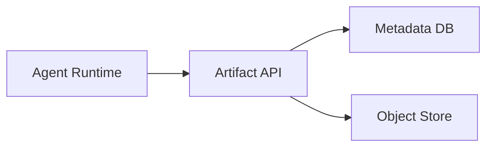
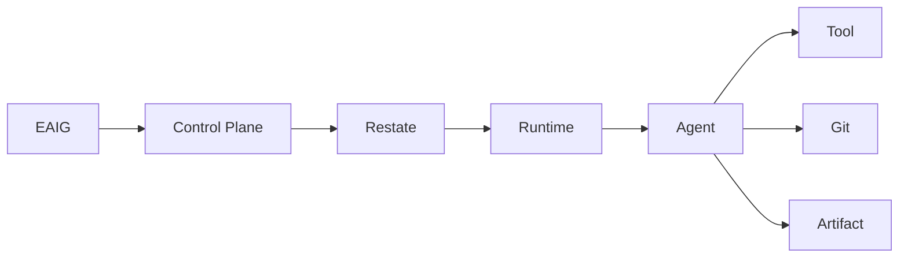

# Artifacts, observability, lifecycle, reliability and quotas

[← Index](README.md) · [← Previous](08-security.md) · [Next →](10-control-plane-and-crds.md)


---

## 46. Artifacts

Artifacts are first-class outputs.

Examples:

```text
patch
screenshot
Playwright trace
JUnit XML
coverage report
binary
SBOM
security scan
architecture report
generated documentation
benchmark result
```

An artifact should contain metadata such as:

```text
artifact ID
run ID
revision ID
producer
digest
media type
created time
retention
size
```

Storage should be content-addressable where practical.

---

## 47. Artifact Architecture



Possible object storage providers:

```text
S3
MinIO
GCS
filesystem for development
```

Important distinction:

```text
PVC
    mutable working state

Artifact store
    durable outputs

Git
    source history

Restate
    workflow history/state
```

---

## 48. Observability

Observability is mandatory.

All major operations should emit OpenTelemetry signals.

Common attributes should include:

```text
agent.tenant.id
agent.project.id
agent.service.name
agent.revision.id
agent.run.id
agent.execution.id
agent.protocol
```

Potential protocol values:

```text
responses
a2a
mcp
acp
internal
```

---

## 49. End-to-End Trace



The UI should be capable of presenting a safe timeline such as:

```text
12:01:00 Request accepted
12:01:01 Runtime activation requested
12:01:14 Runtime ready
12:01:15 Agent started
12:01:19 Repository inspected
12:04:30 Tests executed
12:04:47 Tests failed
12:09:10 Files modified
12:11:42 Tests passed
12:12:05 Patch artifact created
12:12:20 Pull request created
```

This is operational information.

The platform should not attempt to expose hidden model chain-of-thought.

---

## 50. Logs

Two paths are useful.

### Live logs

The UI may stream logs directly through a trusted backend:

```text
Browser
   ↓
Next.js / Control Plane
   ↓
Kubernetes logs or runtime provider
```

The browser never receives Kubernetes credentials.

### Historical logs

Historical logs should be stored in the observability backend because runtime Pods/workspaces are disposable.

---

## 66. Lifecycle and Garbage Collection

The platform must explicitly manage retention.

Resources include:

```text
revisions
runs
runtime Pods
volumes
snapshots
branches
worktrees
artifacts
leases
routes
temporary credentials
side services
```

Example policies:

```text
successful run filesystem:
    delete after 1h

failed run filesystem:
    retain 24h

artifacts:
    retain 30d

successful AgentRuns:
    retain metadata 90d

production revisions:
    retain indefinitely

old unreferenced revisions:
    keep last 20
```

Kubernetes `ownerReferences` should handle Kubernetes-owned resources.

Finalizers should be used only where external cleanup is necessary.

Examples:

```text
delete Git branch
revoke credential
delete object-store data
remove external route
```

---

## 67. Events

The platform should use stable versioned events.

A CloudEvents-inspired envelope is appropriate:

```json
{
  "id": "...",
  "type": "agent.run.completed.v1",
  "source": "...",
  "subject": "...",
  "time": "...",
  "data": {}
}
```

Possible events:

```text
agent.run.created.v1
agent.run.started.v1
agent.run.completed.v1
agent.run.failed.v1

agent.revision.created.v1
agent.revision.promoted.v1

agent.runtime.started.v1
agent.runtime.suspended.v1

artifact.created.v1
```

Transport should remain replaceable.

Potential transports:

```text
Restate
NATS
Kafka
HTTP
```

The event contract should outlive the transport implementation.

---

## 78. Reliability Principles

A Pod or runtime may disappear at any time.

The system must therefore tolerate:

```text
runtime crash
node failure
operator restart
control-plane restart
network interruption
agent crash
OpenCode crash
tool timeout
model provider failure
```

Durability comes from:

```text
Restate
control-plane database
Git
artifact store
immutable revisions
```

not from process memory.

---

## 79. Failure Example

Suppose:

```text
run-123
```

has:

```text
implemented changes
committed branch
started CI
```

and the runtime crashes.

Recovery can be:

```text
Restate resumes
    ↓
workflow state says WaitingForCI
    ↓
no need to rerun implementation
    ↓
check CI
    ↓
continue review stage
```

This is a major reason workflow state must remain separate from runtime state.

---

## 86. Quotas

Quotas may be enforced at:

```text
Tenant
Project
AgentService
User
```

Examples:

```text
maximum concurrent AgentRuns
maximum active runtimes
maximum CPU
maximum memory
maximum model spend
maximum stored artifacts
```

---

[← Index](README.md) · [← Previous](08-security.md) · [Next →](10-control-plane-and-crds.md)
