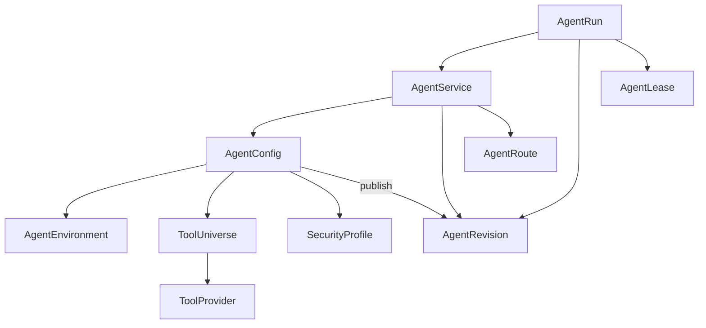
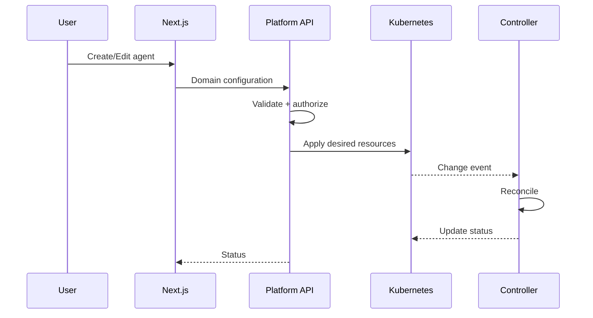
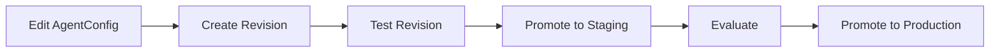
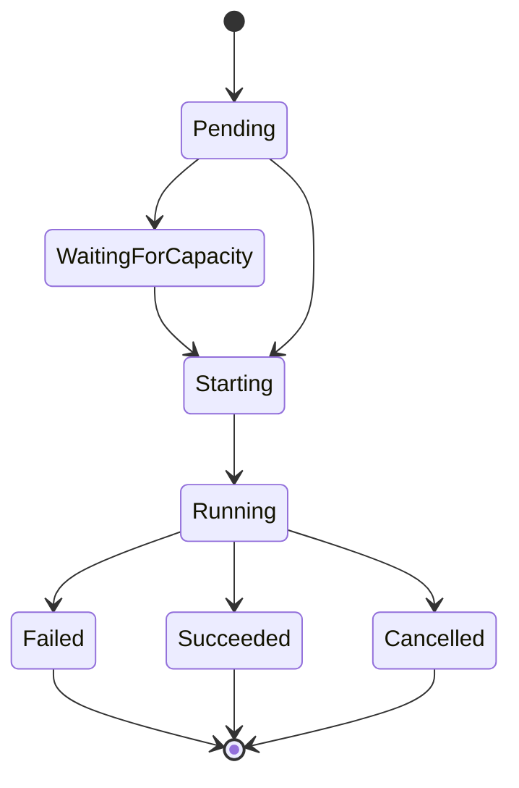

# Control plane, CRDs, operator and UI

[← Index](README.md) · [← Previous](09-operations.md) · [Next →](11-decisions.md)


---

## 56. CRD Inventory

Recommended first-class CRDs:

| CRD | Responsibility |
|---|---|
| `AgentService` | stable agent service identity |
| `AgentConfig` | editable agent behavior |
| `AgentRevision` | immutable resolved agent definition |
| `AgentEnvironment` | runtime/environment requirements |
| `ToolProvider` | where tools come from |
| `ToolUniverse` | reusable sets of effective tools |
| `SecurityProfile` | reusable execution security |
| `AgentRoute` | optional routing/exposure |

`AgentRun` and `AgentLease` are application records, not CRDs (§19–20, AD-016).

Potential later CRDs:

```text
ResourceClass
CredentialBinding
ArtifactPolicy
VerificationPolicy
RuntimeProviderConfig
RouteProviderConfig
```

They should only become CRDs if Kubernetes reconciliation is useful.

---

## 57. Things That Should Probably Not Be CRDs

Not every domain object benefits from Kubernetes reconciliation.

Likely application database objects:

```text
Tenant
Project
User
Role
Permission
Conversation
Response
AgentRun
AgentLease
AuditEvent
Artifact metadata
billing records
model usage
workflow history
```

The platform should avoid using Kubernetes as a general-purpose database.

---

## 58. CRD Reference Model



Not every arrow is a Kubernetes `ownerReference`.

`AgentRun` and `AgentLease` appear here as application records, not CRDs (AD-016).

Many are normal object references.

Shared resources such as:

```text
ToolUniverse
AgentEnvironment
SecurityProfile
```

must not be deleted simply because one consuming agent is deleted.

---

## 59. Operator Design

The operator should be deliberately boring.

It should reconcile desired infrastructure.

It should not implement business workflows.

For example:

```text
active leases > 0 (from the lease service)
    ↓
ensure runtime active

active leases = 0
    ↓
wait idle timeout
    ↓
ensure runtime stopped
```

Not:

```text
run agent
wait PR
check CI
ask reviewer
retry implementation
merge
```

The latter belongs in Restate.

---

## 60. UI Architecture

Administrators should not need to touch CRDs.



The beginner UI may expose:

```text
Name
Description
Model
Environment
Tools
Responses
A2A
MCP
CPU
Memory
Volumes
Security profile
Scaling
Routes
```

Advanced mode can expose:

```text
View YAML
Export YAML
GitOps configuration
status conditions
revision digest
runtime status
```

---

## 61. Draft → Revision → Promotion UX

Recommended workflow:



The UI can display:

```text
Coder

Production      r47
Staging         r51
Latest          r53

Revision    Status      Created
r53         Ready       5m ago
r52         Ready       1d ago
r51         Staging     2d ago
r47         Production  8d ago
```

Editing production in-place is impossible because revisions are immutable.

---

## 62. API / CRD Versioning

Initial resources should use:

```text
agents.vymalo.com/v1alpha1
```

Evolution path:

```text
v1alpha1
   ↓
v1beta1
   ↓
v1
```

Resources should follow Kubernetes conventions:

```text
spec
status
conditions
observedGeneration
```

Where conversion becomes necessary, conversion webhooks can support multiple served versions.

---

## 63. Provider Interfaces

The architecture should prefer a small number of meaningful provider boundaries.

Per AD-020, each is a Rust trait with a conformance testkit, implemented by
separate crates and selected at build time (Cargo features + configuration, or
a developer's own composition root). Nothing outside the trait's crate may
depend on an implementation's types.

Possible interfaces:

```text
RuntimeProvider
WorkflowProvider
RouteProvider
IdentityProvider
SecretProvider
ArtifactProvider
AdmissionProvider
```

Each provider can advertise capabilities.

Example:

```text
scale-to-zero
persistent-volumes
volume-snapshot
shared-rwx-storage
gpu
runtime-class
direct-exec
multi-container
spiffe
```

An `AgentEnvironment` may require capabilities.

If the selected provider does not support them, validation should fail clearly.

---

## 87. Suggested CRD Status Pattern

Example:

```yaml
status:
  observedGeneration: 12

  conditions:
    - type: Ready
      status: "True"
      reason: Reconciled

    - type: RuntimeAvailable
      status: "False"
      reason: ScaledToZero

  currentRevision:
    name: coder-r53

  productionRevision:
    name: coder-r47
```

Conditions should describe state rather than burying errors in arbitrary text fields.

---

## 88. Possible `AgentService` State

Logical service state may include:

```text
Ready
Degraded
Suspended
Blocked
```

This is distinct from runtime state.

An agent can be:

```text
AgentService: Ready
Runtime: Suspended
```

because scale-to-zero is healthy.

---

## 89. Possible `AgentRun` State Machine



Application-specific workflow state remains in Restate.

---

## 90. Naming

Suggested API group:

```text
agents.vymalo.com
```

Potential resource names:

```text
AgentService
AgentConfig
AgentRevision
AgentEnvironment
ToolUniverse
ToolProvider
SecurityProfile
AgentRun
AgentLease
AgentRoute
```

Resource naming should avoid tying the project to a specific underlying agent framework.

---

[← Index](README.md) · [← Previous](09-operations.md) · [Next →](11-decisions.md)
