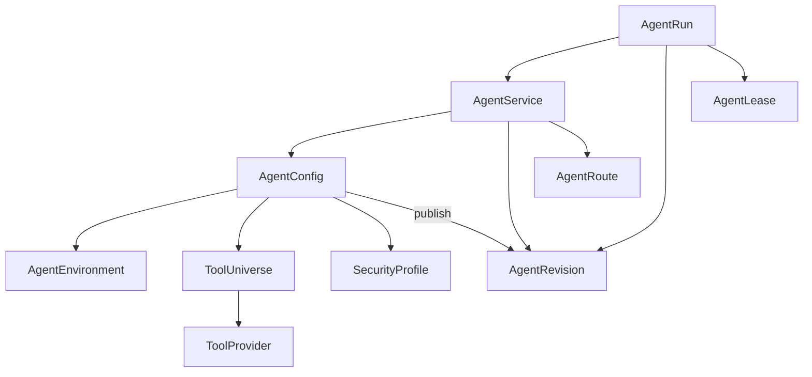
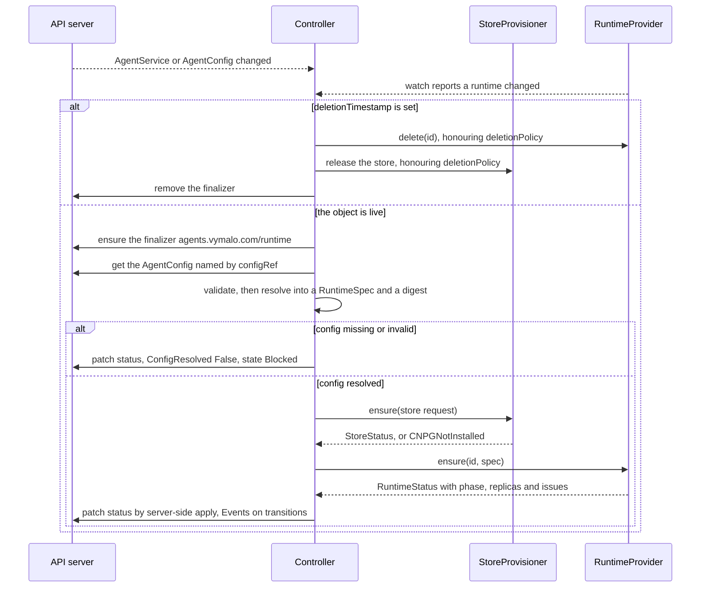
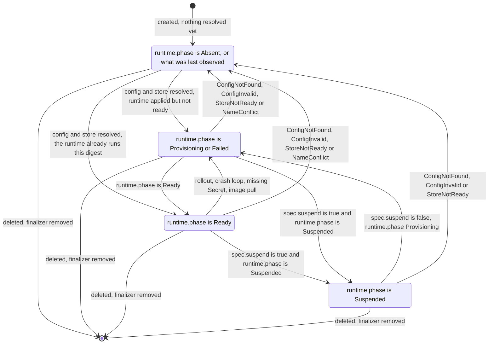
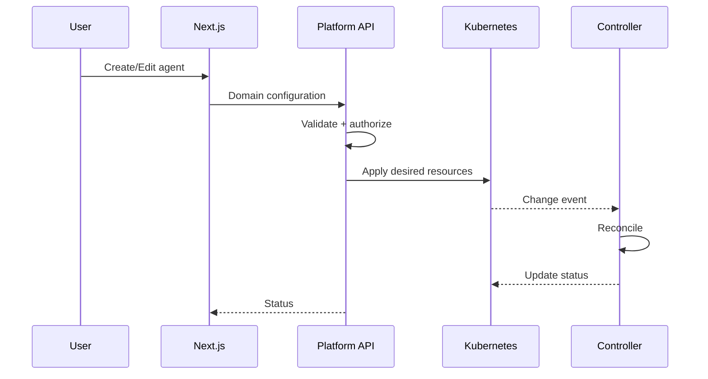
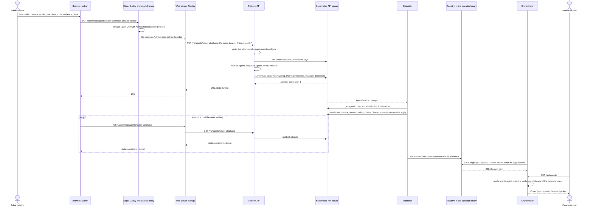
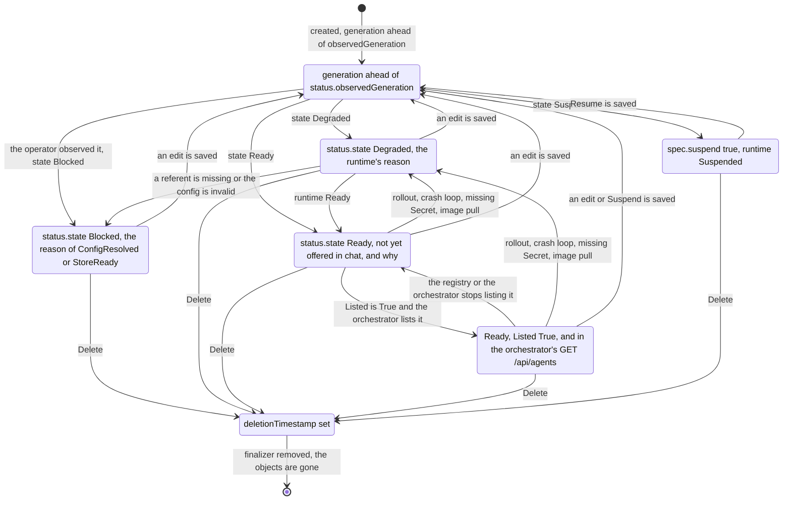
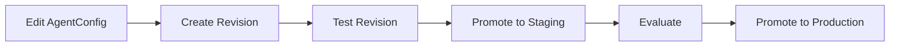
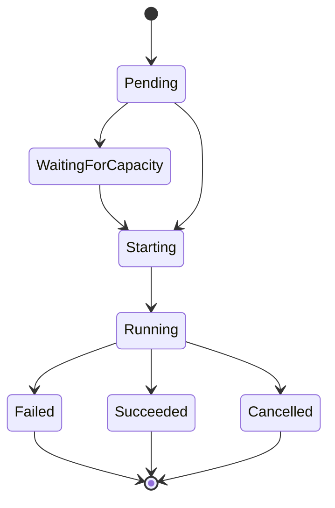

# Control plane, CRDs, operator and UI

[← Index](README.md) · [← Previous](09-operations.md) · [Next →](11-decisions.md)


---

## 56. CRD Inventory

Recommended first-class CRDs:

| CRD | Responsibility |
|---|---|
| `AgentService` | stable agent service identity |
| `AgentConfig` | editable agent behavior |
| `AgentRevision` | immutable resolved agent definition |
| `AgentEnvironment` | runtime/environment requirements |
| `ToolProvider` | where tools come from |
| `ToolUniverse` | reusable sets of effective tools |
| `SecurityProfile` | reusable execution security |
| `AgentRoute` | optional routing/exposure |

`AgentRun` and `AgentLease` are application records, not CRDs (§19–20, AD-016).

> **Decision (2026-10-04, AD-023):** v0 implements two of these, `AgentService` and `AgentConfig` ([§59a](#59a-operator-v0-adam-rs-agents)). The inline `environment`, `tools` and `security` of an `AgentConfig` have the shape of the specs of `AgentEnvironment`, `ToolUniverse` / `ToolProvider` and `SecurityProfile`, so those CRDs can come later as exclusive `*Ref` fields. `AgentRevision` and `AgentRoute` wait; `status.config.digest` is the seed of the first.

Potential later CRDs:

```text
ResourceClass
CredentialBinding
ArtifactPolicy
VerificationPolicy
RuntimeProviderConfig
RouteProviderConfig
```

They should only become CRDs if Kubernetes reconciliation is useful.

> **Proposed (2026-10-05, P-010):** the dashboard of [§60a](#what-the-custom-resources-gain) adds `ModelEndpoint` (new) and a v0 subset of `ToolProvider` (one remote MCP server), referenced from `AgentConfig` by exclusive `endpointRef` and `providerRef` fields, so a model or a tool server is set once and named by every agent that uses it.

---

## 57. Things That Should Probably Not Be CRDs

Not every domain object benefits from Kubernetes reconciliation.

Likely application database objects:

```text
Tenant
Project
User
Role
Permission
Conversation
Response
AgentRun
AgentLease
AuditEvent
Artifact metadata
billing records
model usage
workflow history
```

The platform should avoid using Kubernetes as a general-purpose database.

---

## 58. CRD Reference Model



Not every arrow is a Kubernetes `ownerReference`.

`AgentRun` and `AgentLease` appear here as application records, not CRDs (AD-016).

Many are normal object references.

Shared resources such as:

```text
ToolUniverse
AgentEnvironment
SecurityProfile
```

must not be deleted simply because one consuming agent is deleted.

---

## 59. Operator Design

The operator should be deliberately boring.

It should reconcile desired infrastructure.

It should not implement business workflows.

For example:

```text
active leases > 0 (from the lease service)
    ↓
ensure runtime active

active leases = 0
    ↓
wait idle timeout
    ↓
ensure runtime stopped
```

Not:

```text
run agent
wait PR
check CI
ask reviewer
retry implementation
merge
```

The latter belongs in Restate.

> **Decision (2026-10-04, AD-023):** the first operator is deliberately smaller than this design: two CRDs, adam-rs agents, native Kubernetes, no leases and no scale-to-zero. It is specified in [§59a](#59a-operator-v0-adam-rs-agents); the text above stays the target.

---

## 59a. Operator v0: adam-rs agents

> **Status: design only (2026-10-04).** Nothing here is built; slice S0 is this text. The first code lands with S1 (§59a, *Slices*).

> **S1 built (2026-10-05):** the workspace, `aap-api`, `crdgen` and the examples, in [`crates/api`](../../crates/api/README.md) and [`bin/operator`](../../bin/operator/README.md). The `kind` job in CI is what proves the CEL rules against a real API server (*unverified* until it has run).

> **S2, S3 built (2026-10-05):** [`aap-domain`](../../crates/domain/README.md) with parity goldens against the adam-rs chart at `0391809` (*verified 2026-10-05*, `helm template`; the folder agent's golden is hand-written from its README, *verified by reading only*, because the chart renders `adam-coder` only) and [`aap-ports`](../../crates/ports/README.md) with its testkit. What this section leaves open, and where the crates deviate from it, is in their READMEs.

> **S4 built (2026-10-05):** [`aap-runtime-kubernetes`](../../crates/runtime-kubernetes/README.md): `RuntimeProvider` on native Kubernetes. It renders a `RuntimeSpec` into its objects (golden YAML of `examples/coder.yaml`, combined and split, and `examples/chat.yaml`), applies them by server-side apply under `aap-operator`, guards adoption, maps pods to `RuntimeStatus`, honours `deletionPolicy` on delete and watches the owned kinds. Proven locally against a fake API server (`tests/api.rs`); **the proof against a real API server is *unverified* until the `runtime-kubernetes` job of `operator.yml` has run**: no cluster was available where it was written. Where it differs from this section, and why, is in the crate's README (*Applying*, *Status*) and below, at *Owned objects*.

> **S5 built (2026-10-05):** [`aap-controller`](../../crates/controller/README.md) (the reconcilers over the two provider seams, kube-rs), [`aap-store-secret`](../../crates/store-secret/README.md) (the `StoreProvisioner` for a referenced Secret) and `operator run` in [`bin/operator`](../../bin/operator/README.md) (health 8081, metrics 9090, `WATCH_NAMESPACE`, no leader election). Proven against a fake API server that has list and watch (`crates/controller/tests`), and by `bin/operator/tests/cluster.rs` against **a bare kube-apiserver v1.35.8 and etcd, run by hand on 2026-10-05, with the test playing the controller manager**; **the proof with real pods, in kind (the `operator-e2e` job of `operator.yml`), is *unverified* until CI has run it** (no cluster, docker daemon or kubelet existed where S5 was written). The controller's README lists every place it differs from this section and why: the reasons of a condition that is `Unknown`, a spec a provider refuses (`ConfigResolved: False`), `Listed: RegistryDisabled` until S7, the timers and back-off, the owner handle passed in by the composition root, and **`aap-store-secret` not checking that a Secret exists**, because *Secrets and databases* below gives the operator no right on Secrets.

The first operator the platform ships. It is smaller than the design of §59 on purpose: it manages **adam-rs agents** (AD-022) from two CRDs, `AgentService` and `AgentConfig`, on native Kubernetes (AD-023), and it keeps secrets out of the custom resources (AD-024).

It exists because of one request from the owner (2026-10-04): *"that coder, I wanted to have a k8s operator to manage it automatically using CRDs"*. The owner's defaults, which this section follows:

- it lives in this repository, in Rust with kube-rs;
- the coder first, then folder agents;
- it runs next to the existing charts until it is proven.

What it does, in one paragraph: a controller reads an `AgentService` and the `AgentConfig` it names, validates them, resolves them into one neutral `RuntimeSpec` with a digest, and has a `RuntimeProvider` make a workload, a Service, a NetworkPolicy and storage for an adam-rs agent (`adam-coder` or `adam-agent`, one image). It reports conditions and a state, and it lists the agent in the [agent registry](../extensions/agent-registry-v1.md) (§12b). It reconciles infrastructure and nothing else, as §59 asks: no run, no workflow, no lease.

The adam-rs side is cited at revision `0391809`, the source of the coder image the netcup deployment pins (*verified 2026-10-04*, read at that revision in [vymalo/another-adam-rs](https://github.com/vymalo/another-adam-rs)): `deploy/coder/templates/statefulset.yaml`, `_validate.tpl`, `networkpolicy.yaml` and `extra-mcp-configmap.yaml` ([chart](https://github.com/vymalo/another-adam-rs/tree/0391809/deploy/coder/templates)), `bin/adam-coder/README.md` and `bin/adam-agent/README.md` ([environment tables](https://github.com/vymalo/another-adam-rs/blob/0391809/bin/adam-agent/README.md#configuration)), `docker/coder/Dockerfile` ([entrypoint](https://github.com/vymalo/another-adam-rs/blob/0391809/docker/coder/Dockerfile)).

### Workspace layout

One Cargo workspace in this repository. Crates are prefixed `aap-` (owner question in §93).

| Path | Crate | What |
|---|---|---|
| `crates/api` | `aap-api` | The CRD types only: kube `CustomResource` plus schemars, CEL rules, `fn crds()` |
| `crates/domain` | `aap-domain` | Pure: `validate`, `resolve` into a `ResolvedAgent` with a sha256 digest, and the mapping of `adam-coder` / `adam-agent` onto `aap_ports::RuntimeSpec`. **The env contract of the two binaries lives only here** |
| `crates/ports` | `aap-ports` | The traits `RuntimeProvider`, `StoreProvisioner`, `AgentDirectory` and their neutral types. Feature `testkit`: the conformance macros and `Memory` implementations |
| `crates/runtime-kubernetes` | `aap-runtime-kubernetes` | `RuntimeProvider` on native Kubernetes (§23) |
| `crates/store-secret` | | `StoreProvisioner` for a referenced Secret |
| `crates/store-cnpg` | | `StoreProvisioner` for an operator-owned CloudNativePG `Cluster` |
| `crates/registry` | | The `agent-registry/v1` document builder and an axum router: bearer, `ETag` / `304`, `Cache-Control: private, max-age<=60`, `Vary` |
| `crates/controller` | | The reconcilers, generic over `<R: RuntimeProvider, S: StoreProvisioner>`: status, conditions, events, the finalizer, and an `AgentDirectory` backed by a reflector |
| `crates/testsupport` | | Fixtures and the API-server harness |
| `bin/operator` | | The composition root (AD-020). Features `runtime-kubernetes`, `store-cnpg`, `registry`; subcommands `run` and `crdgen`; ports 8080 (registry), 8081 (health), 9090 (metrics) |
| `deploy/operator` | | The Helm chart |
| `examples/` | | `coder.yaml`, `chat.yaml` |

Libraries: `kube` 4.0.0 (features `runtime`, `derive`), `k8s-openapi` 0.28.0, `schemars` 1 (*verified 2026-10-04*, kube-rs documentation). CEL rules through `x_kube(validation = …)` are *unverified*: S1 proves them against a real API server, and a rule that cannot be expressed moves into the reconciler's validation (below).

**AD-020 in practice.** No Kubernetes type appears in a trait signature. `RuntimeSpec` is made of neutral types (`EnvValue::{Literal, Secret(SecretRef), PodName}`, `VolumeSpec`, …). Ownership travels as an opaque `OwnerHandle` the controller got from the object, so a provider can set owner references without the controller knowing what they are. `RuntimeProvider::watch()` feeds the controller with the ids of runtimes that changed: the controller never watches StatefulSets itself. The trait is in [§22](05-runtime.md#22-runtimeprovider).

`RuntimeStatus` is `{ phase: Absent | Provisioning | Ready | Suspended | Failed, replicas, issues[] }` (the phases of §18), where an issue is `{ role, reason, message }` and the reason is one of:

| Issue reason | Means | Seen as |
|---|---|---|
| `ConfigRejected` | the agent process refused its configuration | exit code 78 |
| `DependencyUnavailable` | a dependency of the agent is unreachable (database, an MCP server) | exit code 69 |
| `MissingSecret{name}` | a referenced Secret or key does not exist | `CreateContainerConfigError` |
| `ImagePull` | the image cannot be pulled | `ErrImagePull`, `ImagePullBackOff` |
| `CrashLoop` | the container keeps exiting for another reason | `CrashLoopBackOff` |
| `NameConflict` | an object with the name the runtime needs exists and is not ours | adoption guard |

Exit codes 78 and 69 are adam's (`adam_service`: 0 clean shutdown, 78 configuration, 69 a dependency is unreachable; *verified 2026-10-04*, `bin/adam-agent/README.md`, "The process").

### The v0 CRDs

Group `agents.vymalo.com`, version `v1alpha1` (§62), **namespaced**. Two kinds. Where a field exists in §7 or §8 it keeps its name and meaning; the fields §7 and §8 draw that v0 does not implement are in [What v0 leaves out](#what-v0-leaves-out), and the fields v0 adds (`store`, `access`, `registry`, `deletionPolicy`, the inline `environment`, `tools` and `security`) are the ones adam-rs and the operator need today. A **secret is never a value** in either kind (AD-024): a field that needs one names a Secret and a key.

#### `AgentService`: the netcup coder

```yaml
apiVersion: agents.vymalo.com/v1alpha1
kind: AgentService
metadata: { name: coder, namespace: another-agentic-system }
spec:
  description: Coding task to verified pull request.
  configRef: { name: coder }
  interfaces:
    a2a:
      enabled: true
      bearerTokensSecretRef: { name: coder-secrets, key: A2A_BEARER_TOKENS }
      publicUrl: ""          # empty: http://<name>.<ns>.svc:8080/
    responses: { enabled: false }   # v0: CEL refuses true
    mcp: { enabled: false }         # v0: CEL refuses true
  scaling:
    topology: combined     # combined | split
    workers: 1
    front: { replicas: 1 } # split only; a PodDisruptionBudget when > 1
  suspend: false
  store:
    postgres:
      secretRef: { name: coder-db-uri, key: uri }
      # or an operator-owned CloudNativePG cluster:
      # cnpg: { instances: 1, storage: { size: 5Gi, storageClass: longhorn } }
  access:
    allowFrom:
      - namespaceSelector: { matchLabels: { kubernetes.io/metadata.name: another-agentic-system } }
  registry: { title: Coder, tags: [coding, git] }
  deletionPolicy: Retain   # Retain | Delete
```

#### `AgentConfig`: the netcup coder

```yaml
apiVersion: agents.vymalo.com/v1alpha1
kind: AgentConfig
metadata: { name: coder, namespace: another-agentic-system }
spec:
  harness:
    type: adam-rs
    adam:
      binary: adam-coder         # adam-coder | adam-agent
      agent: { embedded: {} }
      coder:
        workers: 4
        maxCheckCycles: 3
        checkTimeoutSecs: 900
        workspaceSweepSecs: 300
        workspacePlacement: ""   # "" | shared | affinity | isolated
        allowedRepoHosts: [github.com]
        githubApiUrl: https://api.github.com
        prDraft: true
        gitAuthor: { name: "bored-giant-panda[bot]", email: "337696346+bored-giant-panda[bot]@users.noreply.github.com" }
        createRepoOwners: []
        opencodeModel: coding-model
        github:
          app:
            id: Iv23li4m1ZrQ8wdwjnQH       # the App's client ID: public, not a secret
            owners: [vymalo]               # or installationId: 12345 (exactly one of the two)
            privateKeySecretRef: { name: coder-github-app, key: private-key.pem }
          # token: { secretRef: { name: coder-secrets, key: GITHUB_TOKEN } }   # instead of app, never both
  model:
    model: coding-model
    baseUrl: { secretRef: { name: coder-secrets, key: MODEL_BASE_URL } }   # or { value: https://…/v1 }
    apiKeySecretRef: { name: coder-secrets, key: MODEL_API_KEY }
  tools:
    githubMcp: { sidecar: true, port: 8082, host: "" }
    mcpServers:
      websearch:
        url: http://another-agentic-websearch.another-agentic-system.svc:8080/mcp
        headers:
          Authorization: { prefix: "Bearer ", secretRef: { name: coder-secrets, key: SEARCH_MCP_TOKEN } }
        optional: true
      context7:
        url: https://mcp.context7.com/mcp
        headers:
          Authorization: { prefix: "Bearer ", secretRef: { name: coder-secrets, key: CONTEXT7_API_KEY } }
        optional: true
    allowInsecureHttp: true
  environment:
    image: { ref: ghcr.io/vymalo/another-adam-rs/coder:sha-0391809@sha256:814d8ee329a5e4d8634e8a82532c035999c4be27aac086508b742a635449ea40 }
    resources: { requests: { cpu: 500m, memory: 1Gi }, limits: { memory: 6Gi } }
    volumes:
      - name: work
        scope: agent
        mountPath: /work
        source: { persistent: { size: 20Gi, storageClass: longhorn, perReplica: true } }
    terminationGracePeriodSeconds: 120
  security: { runAsUser: 10001, runAsGroup: 10001, fsGroup: 10001, fsGroupChangePolicy: OnRootMismatch }
  extraEnv: {}
```

The model alias is a placeholder here: the real alias is the deployment's. The gateway URL is a Secret key in this example because the netcup deployment keeps it out of git (adam-rs `config.modelBaseUrlFromSecret`); a plain `value` is the other form.

#### A folder agent: `chat`

An agent that is only a folder (the `adam-agent-folder` case) needs the same two kinds and no volume. The service:

```yaml
apiVersion: agents.vymalo.com/v1alpha1
kind: AgentService
metadata: { name: chat, namespace: another-agentic-system }
spec:
  description: A chat assistant.
  configRef: { name: chat }
  interfaces:
    a2a:
      enabled: true
      bearerTokensSecretRef: { name: chat-secrets, key: A2A_BEARER_TOKENS }
  scaling: { topology: combined, workers: 1 }
  store:
    postgres:
      secretRef: { name: chat-db-app, key: uri }   # the system chart's CNPG Secret of the `agent` database
  registry: { title: Chat, tags: [chat] }
```

and its config:

```yaml
apiVersion: agents.vymalo.com/v1alpha1
kind: AgentConfig
metadata: { name: chat, namespace: another-agentic-system }
spec:
  harness:
    type: adam-rs
    adam:
      binary: adam-agent
      agent:
        folder:
          files:                                  # relative path -> content; mounted at /etc/adam/agent (ADAM_AGENT_DIR)
            instructions.md: |
              ---
              name: chat
              description: A chat assistant.
              card:
                name: Chat
              ---
              Your name is Chat.
              In one sentence: I talk things through with you.
          # or: configMapRef: { name: chat-agent }   (exactly one of files and configMapRef)
  model:
    model: chat-model
    baseUrl: { value: https://gateway.example.invalid/v1 }
    apiKeySecretRef: { name: chat-secrets, key: MODEL_API_KEY }
  tools:
    allowInsecureHttp: true     # the orchestrator's thread tools are plain http on another host, inside the cluster
  environment:
    image: { ref: "ghcr.io/vymalo/another-adam-rs/coder:sha-0391809@sha256:<digest>" }   # tag and digest
    resources: { requests: { cpu: 100m, memory: 256Mi }, limits: { memory: 512Mi } }
```

There is no `volumes`, so the operator renders a Deployment. `files` is the whole folder inline, and ConfigMaps hold 1 MiB, which is the folder's size limit in v0. A path with a `/` in it (`skills/…`) is stored under a mangled ConfigMap key and mounted at its path with `items`. The adam-agent folder format is [`docs/authoring.md`](https://github.com/vymalo/another-adam-rs/blob/0391809/docs/authoring.md) in adam-rs.

#### Validation

Two layers, so a bad object is refused at the earliest place that can know.

- **CEL on the CRD** (shape, no other object needed): `interfaces.responses.enabled` and `interfaces.mcp.enabled` must be `false` in v0; exactly one of `store.postgres.secretRef` and `store.postgres.cnpg`; exactly one of `github.app` and `github.token`; exactly one of `app.installationId` and `app.owners`; exactly one of `agent.folder.files` and `agent.folder.configMapRef`, and exactly one of `folder` and `embedded`; `binary: adam-coder` needs `embedded` and the `coder` block, `binary: adam-agent` needs `folder` and no `coder` block; `scaling.front` only with `topology: split`.
- **The reconciler** (`aap-domain::validate`, cross-object, reported as `ConfigInvalid`): the rules of the adam-rs chart's [`_validate.tpl`](https://github.com/vymalo/another-adam-rs/blob/0391809/deploy/coder/templates/_validate.tpl), mirrored so the same mistakes fail the same way: a placement is one of `""`, `shared`, `affinity`, `isolated` (`a2a-only` is refused for the coder); more than one worker needs a placement; `shared` and `affinity` need the `work` volume to be a single ReadWriteMany claim (`perReplica: false`) and `isolated` needs it per replica; `githubMcp.port` is 1 to 65535; an MCP server URL is `http` or `https`, with no user name, password or `${…}` in it; a header name is an HTTP token and its prefix is plain text; a plain `http://` URL to another machine needs `tools.allowInsecureHttp` (adam refuses such a server at startup otherwise); `extraEnv` may not name a variable the operator sets.

### What each field becomes

The field-to-environment contract. It is the only place in the operator that knows adam's variable names (`aap-domain`); the parity goldens (below) hold it equal to what the adam-rs chart renders. Variable names and meanings are those of `bin/adam-coder/README.md` and `bin/adam-agent/README.md` (*verified 2026-10-04*, revision `0391809`).

| Field | Becomes | Notes |
|---|---|---|
| `AgentService.spec.interfaces.a2a.bearerTokensSecretRef` | `A2A_BEARER_TOKENS` from `secretKeyRef` | Not set on a worker of `split`. No token, no server (the agent fails closed) |
| `…a2a.publicUrl` | `PUBLIC_URL` | Empty: `http://<name>.<ns>.svc:8080/`. Not set on a worker of `split` |
| `…scaling.topology` | `ROLE` | `combined`: unset (the binary runs `all`). `split`: `control-plane` on `<svc>-front`, `worker` on the StatefulSet or Deployment `<svc>` |
| `…scaling.workers` | replicas of `<svc>` | The adam *workers* as pods. Not the `WORKERS` variable (below) |
| `…scaling.front.replicas` | replicas of `<svc>-front` | `split` only |
| `…suspend` | replicas 0, `runtime.phase: Suspended` | The only scale-to-zero in v0 |
| `…store.postgres.secretRef` | `DATABASE_URL` from `secretKeyRef` | |
| `…store.postgres.cnpg` | `DATABASE_URL` from `<svc>-db-app`, key `uri` | The Secret CloudNativePG makes for the cluster `<svc>-db` |
| `…access.allowFrom` | NetworkPolicy `<svc>`, ingress on 8080 | No egress rule: the agent needs git hosts, the model gateway and registries |
| `…registry`, `…description` | the registry item (`title`, `tags`, `service`) | Nothing reaches the pod |
| `…deletionPolicy` | the finalizer's behaviour | [Finalizer](#finalizer-and-deletion) |
| `AgentConfig…adam.binary` | the container command | `adam-coder`: the image's entrypoint. `adam-agent`: `tini -- adam-agent` (the image says so in its `Dockerfile`) |
| `…adam.agent.folder` | `ADAM_AGENT_DIR=/etc/adam/agent`, a ConfigMap `<svc>-agent-<hash8>` mounted read-only | `files` gives the ConfigMap, `configMapRef` mounts the named one. `embedded` sets nothing |
| `…adam.coder.workers` | `WORKERS` | Runs advanced at once, per process |
| `…coder.maxCheckCycles`, `checkTimeoutSecs`, `workspaceSweepSecs` | `MAX_CHECK_CYCLES`, `CHECK_TIMEOUT_SECS`, `WORKSPACE_SWEEP_SECS` | |
| `…coder.workspacePlacement` | `WORKSPACE_PLACEMENT`, and `WORKER_ID` from `metadata.name` for `affinity` and `isolated` | `""`: not set. `WORKSPACE_ROOT` is the mount path of the volume `work` |
| `…coder.allowedRepoHosts`, `githubApiUrl`, `prDraft` | `ALLOWED_REPO_HOSTS` (comma-joined), `GITHUB_API_URL`, `PR_DRAFT` | |
| `…coder.gitAuthor` | `GIT_AUTHOR_NAME`, `GIT_AUTHOR_EMAIL` | |
| `…coder.createRepoOwners` | `CREATE_REPO_OWNERS` (comma-joined) | Not set when empty: the tool stays off |
| `…coder.opencodeModel` | `OPENCODE_MODEL` | |
| `…coder.github.app.id`, `owners`, `installationId` | `GITHUB_APP_ID`, `GITHUB_APP_OWNERS`, `GITHUB_APP_INSTALLATION_ID` | Exactly one of the last two |
| `…coder.github.app.privateKeySecretRef` | a Secret volume at `/var/run/secrets/github-app` (mode 0440) and `GITHUB_APP_PRIVATE_KEY_PATH` | The key is a file, never a variable. See the gap in AD-024 |
| `…coder.github.token.secretRef` | `GITHUB_TOKEN` from `secretKeyRef` | Not with `app` |
| `…model.model` | `MODEL` | |
| `…model.baseUrl` | `MODEL_BASE_URL`, a value or a `secretKeyRef` | |
| `…model.apiKeySecretRef` | `MODEL_API_KEY` from `secretKeyRef` | |
| `…tools.githubMcp` | a native sidecar `github-mcp`, `GITHUB_MCP_URL=http://127.0.0.1:<port>`, and `GITHUB_HOST` on the sidecar when `host` is set | The sidecar holds no credential: the coder sends the credentials of each call. Loopback only |
| `…tools.mcpServers` | a ConfigMap `<svc>-mcp` (`mcp.json`, mounted at `/etc/adam/extra-mcp`), `ADAM_EXTRA_MCP_FILE`, and one variable per header Secret | The file holds `${VAR}` references only. The variable is named by the Secret key (`SEARCH_MCP_TOKEN`), and the file refers to it |
| `…tools.allowInsecureHttp` | `MCP_ALLOW_INSECURE=true` | Covers every MCP server of the agent and the endpoints a sender announces. Never automatic |
| (fixed for `adam-coder`) | `MCP_ALLOW_STDIO=true` | Parity with the chart, which keeps it for one release for folders written before the GitHub server became a sidecar. Not set for `adam-agent` |
| (fixed) | `LISTEN_ADDR=0.0.0.0:8080` | |
| `…environment.image`, `resources` | the container's image and resources | The sidecar has its own small defaults |
| `…environment.volumes` | volume mounts, a `volumeClaimTemplate`, or the shared claim | [Owned objects](#owned-objects) |
| `…environment.terminationGracePeriodSeconds` | the pod's | |
| `…security` | the pod's `securityContext` (`runAsUser`, `runAsGroup`, `fsGroup`, `fsGroupChangePolicy`) | Everything else of the security context is fixed, below |
| `…extraEnv` | literal variables | Names only the adam binaries do not own; never a secret |

The only variables that carry a secret are the ones the adam binaries know (`MODEL_API_KEY`, `A2A_BEARER_TOKENS`, `GITHUB_TOKEN`, `DATABASE_URL`, `MODEL_BASE_URL` when it is a Secret key) and the ones the extra MCP file names. The operator never invents a secret variable.

### Reconciliation

One controller per kind. The `AgentConfig` controller validates the object and sets its `Valid` condition. The `AgentService` controller does the work: it is triggered by its own object, by `RuntimeProvider::watch()`, and by a change of an `AgentConfig` (mapped to every service that references it).



The state the controller derives and writes to `status.state` (§88), with the phase of the runtime beneath it (§18):



The rule, in order: a false `ConfigResolved` or `StoreReady`, or a `NameConflict` issue, is `Blocked` (the operator did not apply the desired state, and **it leaves what runs untouched**); `spec.suspend` with phase `Suspended` is `Suspended`; phase `Ready` is `Ready`; anything else is `Degraded`, and the reason says which (`Provisioning` for a rollout in progress, or the issue's reason). As in §88, the service state is distinct from the runtime's: `Suspended` is healthy.

Steps of one pass:

1. **Finalizer** `agents.vymalo.com/runtime`, added before anything is created.
2. **Fetch and validate the config.** `ConfigNotFound` or `ConfigInvalid`, with the cross-object rules above.
3. **Ensure the store.** A referenced Secret needs nothing; `cnpg` makes the Cluster `<svc>-db`, whose Secret `<svc>-db-app` (key `uri`) is the connection string. `CNPGNotInstalled` when the CloudNativePG API is absent.
4. **Resolve, then `RuntimeProvider::ensure`.** `resolve` turns the two objects into a `ResolvedAgent`: the `RuntimeSpec` and its sha256 digest. The pods are annotated `agents.vymalo.com/config-digest`, so a changed folder, MCP file, image or variable is a rollout (adam reads its files at startup only).
5. **Patch the status** by server-side apply, and emit Events on transitions.

#### Owned objects

Applied by server-side apply under the field manager `aap-operator`, each labelled `app.kubernetes.io/managed-by: aap-operator` (and `app.kubernetes.io/instance: <svc>`, which the adoption guard checks too).

*Amended 2026-10-05 (S4):* this said `agents.vymalo.com/operator` and `agents.vymalo.com`. The S4 brief names `aap-operator` for both, which is what [`aap-runtime-kubernetes`](../../crates/runtime-kubernetes/README.md) writes (`names::FIELD_MANAGER`, `names::MANAGED_BY_VALUE`); a Helm release's `managed-by` is its tool's name, and this one is ours in the same style. One constant each to change if the owner prefers the first. **Every apply is forced** (this section said nothing about `force`): the provider is the one writer of the fields it sets and moves `replicas` itself on `suspend`, so a conflict with its own earlier patch or a `kubectl scale` must be resolved by taking the field back, and the adoption guard, which runs before any apply, is what protects objects that are not ours.

| Object | Name | When |
|---|---|---|
| StatefulSet | `<svc>` | A `perReplica` persistent volume exists: its `volumeClaimTemplate` is named after the volume (`work`) |
| Deployment | `<svc>` | Otherwise |
| Deployment, PodDisruptionBudget | `<svc>-front` | `topology: split` (the budget when the front has more than one replica) |
| Service | `<svc>` | Always: port 8080, selecting the front in `split` |
| ConfigMap | `<svc>-agent-<hash8>` | Folder `files`: immutable, named by the first 8 hex digits of its content hash; superseded ones are deleted after the rollout |
| ConfigMap | `<svc>-mcp` | `tools.mcpServers`: the extra MCP file, `${VAR}` references only |
| NetworkPolicy | `<svc>` | `access.allowFrom`: ingress on 8080, no egress rule |
| PersistentVolumeClaim | `<svc>-work` | Placement `shared` or `affinity`: one ReadWriteMany claim for all workers |
| Cluster (CloudNativePG) | `<svc>-db` | `store.postgres.cnpg` |

Compute objects carry an owner reference to the `AgentService` (through the `OwnerHandle`). **Data objects do not** (the claim `<svc>-work`, the Cluster `<svc>-db`, and the claims a StatefulSet makes): garbage collection must not take them with the service, so the finalizer deletes them explicitly, and only under `deletionPolicy: Delete`.

**Pod template.** The same as the adam-rs chart's `statefulset.yaml` (*verified 2026-10-04*, revision `0391809`), so the workload that replaces a Helm release behaves like it:

- no service-account token (`automountServiceAccountToken: false`); `runAsNonRoot`, uid and gid from `security` (10001 for the adam image), `seccompProfile: RuntimeDefault`; every container drops all capabilities and refuses privilege escalation;
- `/healthz` startup, liveness and readiness probes on the `http` port, with the chart's periods;
- the `github-mcp` sidecar as a **native sidecar** (an init container with `restartPolicy: Always`), probed by an `exec` startup probe on loopback, because the kubelet's TCP probe connects to the pod IP and the server listens on loopback only (adam-rs #86);
- `WORKER_ID` from the downward API (`metadata.name`) when the placement pins runs to a worker;
- the annotation `agents.vymalo.com/config-digest`, and `OrderedReady` with `RollingUpdate` for the StatefulSet.

The goldens in *Testing* hold the parity, not this list.

#### Adoption guard

The operator never takes over an object that has the name it needs but not its `managed-by` label: it reports `NameConflict` (a `RuntimeStatus` issue, so `state: Blocked`) and changes nothing. This is what makes running next to an existing Helm release safe: a Helm object carries `app.kubernetes.io/managed-by: Helm`, so the operator waits until that release's object is gone (*Rollout on netcup*).

#### Finalizer and deletion

Deleting an `AgentService` runs `RuntimeProvider::delete` and releases the store, as the sequence above shows, then removes the finalizer. `deletionPolicy` decides what happens to data:

- `Retain` (default): the compute (workloads, Service, NetworkPolicy, ConfigMaps) is removed; the work volumes and an operator-owned database stay, with their labels, so an `AgentService` of the same name later finds them again (the adoption guard accepts its own label).
- `Delete`: the data goes too.

The policy reaches the provider and the provisioner in their neutral spec types, so `delete(id)` has what it needs without a Kubernetes type in its signature.

#### Status

```yaml
status:
  observedGeneration: 3
  state: Ready                 # Ready | Degraded | Suspended | Blocked
  config: { name: coder, observedGeneration: 7, digest: "sha256:…" }
  runtime: { provider: kubernetes, phase: Ready, replicas: 1 }
  endpoints:
    a2a: http://coder.another-agentic-system.svc:8080/
    agentCard: http://coder.another-agentic-system.svc:8080/.well-known/agent-card.json
  conditions:
    - { type: ConfigResolved, status: "True", reason: Resolved }
    - { type: StoreReady, status: "True", reason: SecretReferenced }
    - { type: RuntimeReady, status: "True", reason: Ready }
    - { type: Listed, status: "True", reason: Listed }
    - { type: Ready, status: "True", reason: Reconciled }
```

| Condition | `True` reason | `False` reasons |
|---|---|---|
| `ConfigResolved` | `Resolved` | `ConfigNotFound`, `ConfigInvalid` |
| `StoreReady` | `SecretReferenced`, `ClusterReady` | `CNPGNotInstalled`, `ClusterNotReady` |
| `RuntimeReady` | `Ready` | `Provisioning`, `Suspended`, `MissingSecret`, `ConfigRejected`, `DependencyUnavailable`, `ImagePull`, `CrashLoop`, `NameConflict` |
| `Listed` | `Listed` | `A2ADisabled`, `ServiceBlocked`, `RegistryFull`, `RegistryDisabled` |
| `Ready` | `Reconciled` | the reason of the first false condition above, in this order |

`Ready` is true when the first three are; `Listed` informs and does not gate it, so a full registry never makes an agent unready. The runtime reasons come from pod status: `CreateContainerConfigError` is `MissingSecret`, an exit with code 78 is `ConfigRejected`, 69 is `DependencyUnavailable`, `ImagePullBackOff` is `ImagePull`. Because the operator has **no RBAC on Secrets**, it cannot check that a referenced Secret exists: the kubelet's answer in the pod's status is how it learns. `status.config.digest` is the seed of AgentRevision (§9): the digest a revision would record as its `configurationDigest`, with nothing yet that publishes or promotes it.

#### Secrets and databases

- **References only (AD-024).** A custom resource names a Secret and a key; the operator copies a reference into the pod spec as a `secretKeyRef`, and never reads or writes a value. It has no RBAC on Secrets and creates no ExternalSecret. The conformance macros include "no secret value ever materialises": no `RuntimeSpec`, status, Event, log line or ConfigMap holds one.
- **Two store modes** behind the `StoreProvisioner` seam (AD-020): `secretRef` (a Secret someone else owns) and operator-owned `cnpg` (a `Cluster` `<svc>-db` per service, owned by it, data kept by `Retain`). "A `Database` in someone else's Cluster" is deferred: server-side-apply co-ownership of that Cluster's `managed.roles` is *unverified*, and the operator must not fight the Cluster's owner for the field.
- **`store` sits on `AgentService`, not on `AgentConfig`** (owner question in §93): a config can be shared by services, and two services must not share a ledger. adam keys a run by the agent's name, and several processes with the same name are replicas of one agent (*verified 2026-10-04*, `bin/adam-agent/README.md`, "Several agents, one database").

### Registry in v0

The operator binary serves `GET /registry/v1/agents` ([§12b](03-interfaces.md#12b-agent-registry), [the contract](../extensions/agent-registry-v1.md)) from the cache of its own reflector, through the `AgentDirectory` trait, until a control plane exists. The document has one item per service that has A2A enabled and is not `Blocked`: `href` is `status.endpoints.agentCard`, `service` the object's name, `title` and `tags` from `spec.registry`, in name order, with the linkset headers of the contract, an `ETag` over the document (`304` on a match), `Cache-Control: private, max-age=30` and `Vary: Authorization`.

Deviations from the contract and from §12b, all of them v0 only:

| The contract | v0 |
|---|---|
| Served by the control plane | Served by the operator binary (feature `registry`, port 8080, ClusterIP); no ingress |
| The platform API's bearer token, `401` or `403`, the list filtered per caller (`agent.invoke`, §52) | **One static bearer** read from a file and compared in constant time; `401` only; **no per-caller filtering**, every holder sees every listed service. Open question in §93 |
| `max-age` of 60 seconds or less | 30 |
| At most 500 items and 1 MiB; a client never truncates | The operator **refuses rather than truncates**: past either limit it answers `503` and every service gets `Listed=False` `RegistryFull` |
| HTTPS outside a trusted cluster network, rate limiting | In-cluster plain HTTP behind a NetworkPolicy; no rate limit |
| The card is served by the control plane, so it never wakes compute | The agent serves its own card (adam does), and nothing scales to zero yet (below), so nothing wakes |
| Releases on each card (§12a) | No release-channels extension in v0 |

**The agent token rule.** A consumer sends one token to every agent a registry lists; another-agentic-system names it `AGENT_REGISTRY_AGENT_TOKEN` (its `orch-registry-platform` crate, *verified 2026-10-04*, `orchestrator/crates/registry-platform/README.md` in [vymalo/another-agentic-system](https://github.com/vymalo/another-agentic-system)). For that to work, the token must be one of each listed service's `A2A_BEARER_TOKENS`. The operator cannot check it (no Secret RBAC), so it is a deployment rule, and the consumer test of the registry crate covers it.

### What v0 leaves out

Each item is additive later, and the third column says how it stays so.

| Left out | Why | Stays additive because |
|---|---|---|
| `AgentRevision`, channels, the release-channels card extension | Nothing consumes them yet. adam's ledger is keyed by the agent name, so revisions running side by side would share or fork one ledger. adam serves the card itself | `status.config.digest` is already the content of a revision |
| `minReplicas`, `maxReplicas`, `idleTimeout`, leases, scale-to-zero | They need a lease service, an activator and a control-plane card, and the coder's workers keep stepping a run after the A2A call returns, so no HTTP-bound signal means "idle" | `spec.suspend`, the phase `Suspended` and a reserved capability exist. adam's store has run leases (`lease_until`) for v1 (open question in §93) |
| `interfaces.responses` and `interfaces.mcp` | adam serves A2A only | The fields exist, and CEL refuses `true` |
| `AgentEnvironment`, `ToolUniverse`, `ToolProvider`, `SecurityProfile`, `AgentRoute`, `authorization.policyRef` | They are reuse mechanisms, and nothing is shared yet | The inline `environment`, `tools` and `security` have the shape of those CRDs' specs, so a later `*Ref`, exclusive with the inline form, is additive |
| An admission webhook | It needs cert-manager | CEL on the CRD plus validation in the reconciler cover v0 |
| Per-caller registry filtering | There is no platform API yet | The registry is behind `AgentDirectory`; the filter joins when the control plane serves it |
| Credential broker, SPIFFE | §39 and §40 are not built | AD-024 records the gap |

### Testing

- `aap-domain`: table tests, and **parity goldens**: what the adam-rs chart renders for the same inputs, vendored into this repository with the adam-rs commit they came from.
- Render goldens of the owned objects, checked with kubeconform in strict mode.
- Reconciler unit tests with `tower_test::mock` and the `Memory` implementations of the ports.
- The conformance macros of `aap-ports` (`testkit`), run by every provider and provisioner, including "no secret value ever materialises".
- An envtest-like harness: a real kube-apiserver and etcd, for the CRDs, the CEL rules and server-side apply.
- The registry contract tests, and a **consumer test** that reads the document with another-agentic-system's `orch-registry-platform` parser.
- A kind end-to-end in CI: a stub agent; `adam-agent` with a WireMock model; and the coder with a throwaway GitHub App key.

### The operator chart

`deploy/operator`, next to the existing charts until the operator is proven.

- `kubeVersion: ">=1.29"`, for the native sidecar of the pod template (*unverified* that sidecar containers are on by default from 1.29, and that netcup's cluster is that new, see *Risks*).
- The image `ghcr.io/vymalo/another-agentic-platform/operator`, tag `sha-0000000` until CI bumps it (`bump-tag.sh`); built with cargo-chef onto a distroless base, non-root 65532.
- Values: `crds.install`, `watchNamespace`, the registry's settings and the Secret (or ExternalSecret) of its bearer token.
- **One replica, `Recreate`, no leader election.** A second reconciler would only race the first; the cost is a short gap in reconciling during an upgrade, and a running agent is not touched by it.
- A namespaced `Role`: the two kinds and their `status` and `finalizers`, the owned kinds, `pods` for status, `events`, and the CloudNativePG `Cluster` when `store-cnpg` is built in. **No right on Secrets.**
- Render checks, goldens, vendored schemas, as in the other charts of the family.
- CI: `rust.yml` (fmt, clippy, test, deny, MSRV, a check that the generated CRDs match the committed ones) and `operator.yml` (helm, kubeconform, hadolint, build, then the kind end-to-end, then push the image that passed, then the bump job).

### Rollout on netcup

Next to the existing charts, one step at a time. The coder stays on its Helm chart until M3.

| Step | What |
|---|---|
| M0 | In home-os, an app for the CRDs (project `infrastructure`) and an app for the operator (project `another-agentic`, with this repository as a source repository) |
| M1 | The system chart's registry wiring. **The coder stays a static agent**: only static agents carry the `agent-checks` gate in the system, and a registry agent does not |
| M2 | A shadow, `coder-next`, an `AgentService` of its own with its own CloudNativePG cluster, beside the Helm coder |
| M3 | The cutover. Snapshot the `work-coder-0` volume. Mark the objects that hold data `Prune=false` and keep them. The home-os source moves to adam-rs `deploy/coder-agent`. The operator reports `NameConflict` until Argo prunes the Helm objects, then creates the StatefulSet `coder` and **reattaches the claim `work-coder-0`**. The Service name and the database are unchanged. No fixed downtime window: made when no run is active (decided in §93, 2026-10-05) |
| M4 | The rollback recipe, written with the cutover. Under `Retain`, deleting the `AgentService` keeps the volume and the database |
| M5 | `chat`: `chat.runtime: agentservice` in the system chart |
| M6 | Retire `deploy/coder` and the chat Deployment path |

*Unverified:* that Argo CD leaves the claims of a StatefulSet's `volumeClaimTemplates` alone when it prunes (M3 depends on it), and that netcup's Kubernetes is 1.29 or newer.

### Slices

| Slice | Repository | What |
|---|---|---|
| S0 | platform | this documentation change |
| S1 | platform | the workspace, `aap-api`, `crdgen`, the examples |
| S2 | platform | `aap-domain` with the parity goldens |
| S3 | platform | the ports and the testkit |
| S4 | platform | `runtime-kubernetes`, with the envtest harness |
| S5 | platform | the controller and the operator binary, with `secretRef` stores |
| S6 | platform | `store-cnpg` |
| S7 | platform | the registry |
| S8 | platform | the Dockerfile, the chart and `operator.yml` with the kind end-to-end |
| S9 | platform | the kind end-to-end of the coder |
| S10 | home-os | the CRD and operator apps |
| S11 | adam-rs | `deploy/coder-agent` |
| S12 | system | the registry values and `chat.runtime: agentservice` |
| S13 | home-os | the shadow `coder-next` |
| S14 | home-os | the coder cutover |
| S15 | system and home-os | the chat cutover |
| S16 | all | retire the old paths |

### Risks

| Risk | Handling |
|---|---|
| adam's env contract is copied into `aap-domain` | Parity goldens against adam-rs renders; adam-rs could publish a configuration schema |
| The cutover collides with the Helm objects, and Argo might prune a volume | `NameConflict` instead of adoption; `Prune=false`; a snapshot; the shadow first |
| The registry deviates from its contract (one bearer, no filtering) | Listed above; the consumer fails closed |
| §38 says the GitHub App key never enters an agent runtime, and the coder holds it in its pod | AD-024 records the gap; closed by the credential broker (§39) |
| A secret leaking into an environment, an Event or a log | The conformance test "no secret value ever materialises" |
| `v1alpha1` with no conversion webhook | Breaking changes are made before the first deployment is proven; a conversion path comes with `v1beta1` (§62) |
| One replica of the operator | A short reconcile gap on upgrade; agents keep running |
| A folder over 1 MiB does not fit a ConfigMap | A clear `ConfigInvalid`; an artifact source later |
| netcup's Kubernetes version and Argo's pruning behaviour are unverified | Checked in M0 and on the shadow, before M3 |
| kube-rs churn | Pinned versions; the controller sits behind the ports |
| A bot pushing tag bumps to this repository's `main` against its governance check | Allowed by the owner (§93, decided 2026-10-05); the bump commits follow the other repositories' |

### Facts checked

- *Verified 2026-10-04*, adam-rs at `0391809`: the variable names, defaults and rules of the table above (`bin/adam-coder/README.md`, `bin/adam-agent/README.md`), the chart's pod template, `_validate.tpl`, network policy and extra MCP file, and the image's two binaries and entrypoint (`docker/coder/Dockerfile`).
- *Verified 2026-10-04*, kube-rs documentation: `kube` 4.0.0, `k8s-openapi` 0.28.0, `schemars` 1.
- *Unverified*: CEL rules through `x_kube(validation = …)`; server-side-apply co-ownership of a CloudNativePG Cluster's `managed.roles`; Argo CD pruning of `volumeClaimTemplates` claims; netcup's Kubernetes version.

---

## 60. UI Architecture

Administrators should not need to touch CRDs.



The beginner UI may expose:

```text
Name
Description
Model
Environment
Tools
Responses
A2A
MCP
CPU
Memory
Volumes
Security profile
Scaling
Routes
```

Advanced mode can expose:

```text
View YAML
Export YAML
GitOps configuration
status conditions
revision digest
runtime status
```

> **Decision (2026-10-05, AD-025):** v0 of this UI is the admin dashboard of [§60a](#60a-admin-dashboard-v0): an `/admin` area of another-agentic-system's chat web over a Platform API that writes `AgentService` and `AgentConfig` (P-007, P-008). The beginner fields above that v0 has no CRD field for (Responses, MCP exposure, routes) are not shown.

---

## 60a. Admin dashboard v0

> **Status: design only (2026-10-05).** Nothing here is built; slice S0 of the dashboard is this text. The decision to build it is AD-025; the choices that wait for the owner are P-007 to P-012 (§92) and the questions of *Dashboard v0* in §93, each with its recommendation.

The owner, 2026-10-05: *"The MVP worked and now we need a dashboard for configuring all these. The same one actually."*

"All these" is what is configured today in Helm values in the GitOps repository `WhyThatFunction/home-os`, in Keycloak and in AWS Secrets Manager:

- the coders, which become **one coder per GitHub owner** (`coder-vymalo`, `coder-stephane`, …), each limited to its owners by `GITHUB_APP_OWNERS` (adam-rs ADR 0017);
- the folder agents (`chat`, `researcher`);
- who may use which agent;
- models, tool servers (web search, Context7), the size class of the per-run pod;
- sharing, and the rest of the system chart's values.

This section is the §60 UI made concrete for the v0 operator (§59a): a dashboard that writes `AgentService` and `AgentConfig` objects through a Platform API, so administrators do not touch CRDs, and humans get no Kubernetes RBAC (§52).

### The reading of "the same one" (an assumption)

**Assumed:** "the same one" means **one dashboard inside the existing chat web app** (another-agentic-system `web/`, Next.js and assistant-ui), with the same sign-in, look and roles: an `/admin` area of that app, not a second app. The first question of *Dashboard v0* in §93 asks the owner to confirm it, in case they meant a separate app or the platform's own UI.

### What the dashboard covers in v0

| Item | Set today in | v0 | How |
|---|---|---|---|
| Coders, one per GitHub owner | home-os (adam-rs chart `deploy/coder`) | **Edited** | `AgentService` + `AgentConfig` with `binary: adam-coder` |
| Folder agents | the system chart (`chat`), `dev/` (`researcher`) | **Edited** | `AgentService` + `AgentConfig` with `binary: adam-agent` and inline `files` |
| Who may use which agent | the orchestrator's `auth.roles.<role>.agents` and Keycloak client roles | **Edited**, per agent | `AgentService.spec.access.audience`, published in the registry (P-009) |
| Models | each chart's `model` values | **Edited** | `ModelEndpoint` objects, referenced by name (P-010) |
| Tool servers of an agent | the adam-rs chart's `mcp` values | **Edited** | `ToolProvider` objects, referenced by name (P-010) |
| Run-pod size class | not yet (adam-rs run pods are in progress, ADR 0019 there) | **Edited** once adam-rs has it | `coder.runPods.sizeClass`, a name the operator's chart defines |
| Secret values | AWS Secrets Manager, through ExternalSecrets | **Referenced only**, never shown or written | a picker over offered Secret keys (P-011) |
| The coder and `chat` that GitOps deploys | home-os and the system chart | **Read-only**, with View YAML | one owner per object (P-012) |
| Sharing, the tool servers a person attaches in chat, the orchestrator's roles, its title and description models | the system chart (the orchestrator reads its file at startup) | **Read-only** where the browser can already read them; otherwise not shown | `GET /api/me` (`sharing`), `GET /api/tool-servers`, `GET /api/registry`, `GET /api/config` |
| People and their roles | Keycloak | **Out**: the dashboard never writes Keycloak | — |
| The operator, the CRDs, the system chart, oauth2-proxy, the edge, databases of the system | home-os | **Out** | GitOps |

### Where it lives (P-007)

An `/admin` area of the system web, with three gates:

1. **Capability-detected**, in the style of another-agentic-system's ADR 0008: the area exists only when the deployment gives the web's server a Platform API URL (`PLATFORM_API_URL`), and only while `GET /v1/info` on that URL answers, read live on each page load and never cached. Without the URL, `/admin` is a 404 and no link to it is drawn; the chat works as it does today. A Platform API that does not answer is "The platform API cannot be reached", with nothing editable (fail closed).
2. **Shown to administrators**: the link and the area are drawn when `GET /api/me` lists the `admin` permission. This is a hint for the screen, never a check (the web's rule since ADR 0033 there).
3. **Enforced by the Platform API**, which authorizes every request itself (below).

`admin` fits: another-agentic-system ADR 0039 makes it "operational and content-free", reserved for endpoints that show no thread content and no personal data beyond counts. Agent configuration holds no thread, file, message or listing of anybody's, so the area reads nothing ADR 0039 protects. The dashboard does not read threads, and it never shows who used an agent.

The dashboard has the chat's look (its tokens, shadcn components, the panda), its sign-in (oauth2-proxy at the edge) and its roles. The web side is the system's decision, another-agentic-system ADR 0045 (proposed).

### The Platform API (AD-025, P-008)

A Rust (axum) service in this repository, **its own binary `bin/api`**, beside `bin/operator` in the same workspace and the same chart (`deploy/operator`, component `api`, off by default). Why not inside the operator binary:

- **Least privilege per process.** The API writes the specs people edit and reads ExternalSecrets; the operator writes workloads, the status and the finalizer. One process with both sets of rights is the larger target, and it would take people's tokens.
- **Exposure.** The API takes requests carrying people's tokens; the operator takes none. The operator stays one replica with `Recreate` and no leader election (§59a); the API is stateless and can run two replicas.
- **Failure.** A bad request or a bug in the API never stops reconciliation.

The cost is a second image and a second Deployment. The registry stays in the operator binary for v0 (§59a); moving it behind the API is the open question of §93 *Routing*.

**Crates** (AD-020: traits with testkits, implementations apart, the binary composes):

| Path | Crate | What |
|---|---|---|
| `crates/forms` | `aap-forms` | Pure: the dashboard's forms to and from the custom resources, with the deployment's defaults filled in. A round trip of every form is a test. An object a form cannot represent (a GitOps object with fields the form lacks) is shown as YAML only |
| `crates/ports` | `aap-ports` | Adds `AgentObjects` (apply, get, list, delete the dashboard's kinds, list offered secret references) and `Authenticator` (a bearer token to a `Principal` with roles), with `Memory` implementations and conformance macros |
| `crates/objects-kubernetes` | | `AgentObjects` on the API server: server-side apply, the ownership rules, ExternalSecrets read |
| `crates/auth-oidc` | | `Authenticator` for OIDC ID or access tokens checked against the issuer's JWKS |
| `crates/platform-api` | | The axum router, generic over the ports |
| `bin/api` | | The composition root; one YAML configuration file, secrets by reference |

**Authorization.** The request carries `Authorization: Bearer <JWT>`. The API checks it as another-agentic-system's orchestrator does (ADR 0033 there): signed by the configured issuer's keys (RS256, RS384, ES256 or EdDSA), `iss` equal to the issuer, one of the configured audiences in `aud`, `exp`, 60 seconds of leeway. The roles are the configured claim (`agentic_roles` on netcup). A role listed in `auth.configureRoles` grants **`agent.configure`** (§52), the only permission of v0, which covers every route below. No token is 401, a token without the role is 403, keys that cannot be fetched are 503. On netcup the same Keycloak client role `admin` that gives the orchestrator's `admin` is the configure role, so the web's hint and the API's check agree; when they do not, the API's 403 is what the person sees.

**How the web gets the token today** (*verified 2026-10-05*, another-agentic-system `deploy/chart/files/Caddyfile` and `dev/Caddyfile`): every request to the web passes the edge's `forward_auth` to oauth2-proxy, which answers 202 with `Authorization: Bearer <ID token>` (`--set-authorization-header=true`, `deploy/chart/templates/oauth2-proxy.yaml`), and `copy_headers Authorization` puts it on the request that goes to the web, replacing what the browser sent. The ID token carries `aud: another-agentic` (the client id) and the roles claim `agentic_roles` (`deploy/keycloak/README.md`). So the web's server already receives the person's token on every request, and today ignores it. The dashboard's route handler, `/admin/api/[...path]`, forwards that header, unchanged, to the Platform API, and nothing else: it stores no token and logs none. `/admin/api/*` is not under `/api/*`, so the edge routes it to the web, not to the orchestrator.

**Routes** (problem details on error, RFC 9457):

| Route | What |
|---|---|
| `GET /v1/info` | The capability document: version, namespace, the deployment's defaults as the forms show them (read-only), the run-pod size classes, the offer label |
| `GET /v1/agents` | Every `AgentService` of the namespace with its config's kind, its state and conditions, and `managedBy`: `dashboard` or `gitops` |
| `GET /v1/agents/{name}` | The form, the status, and the `resourceVersion` of both objects as an `ETag` |
| `PUT /v1/agents/{name}` | Create (with `If-None-Match: *`) or replace (with `If-Match`) both objects |
| `DELETE /v1/agents/{name}` | Delete the `AgentService`, then the `AgentConfig`; `deletionPolicy` decides what happens to data (§59a) |
| `GET /v1/agents/{name}/yaml` | Both objects as YAML, without `status`, `managedFields` and server-set metadata: View YAML and Export YAML |
| `GET`, `PUT`, `DELETE /v1/models/{name}`, `GET /v1/models` | `ModelEndpoint` objects; a delete of one still referenced is 409 with the agents that use it |
| `GET`, `PUT`, `DELETE /v1/tool-servers/{name}`, `GET /v1/tool-servers` | `ToolProvider` objects; the same 409 rule |
| `GET /v1/secret-keys` | The Secret keys an agent may reference (P-011): Secret name, key, and the ExternalSecret that makes it. Never a value |

Status codes: 400 a body that is not a form, 401, 403, 404, 409 (exists, still referenced, owned by GitOps, or a server-side-apply conflict), 412 (`If-Match` is stale: somebody saved first), 422 (validation, each error with its form field), 503 (the API server or the issuer's keys cannot be reached).

**Applying.** The API validates the form with `aap-forms` and `aap-domain::validate` (the reconciler's rules of §59a, so the dashboard refuses what the operator would mark `ConfigInvalid`), then applies `AgentConfig` before `AgentService` by **server-side apply**, field manager `agents.vymalo.com/dashboard`, with `force: false`. The CRD's CEL rules run in the API server and come back as 422 on the field they name. Every object it writes carries the label `app.kubernetes.io/managed-by: dashboard.agents.vymalo.com`; the operator writes only `status`, so the two managers never share a field. Status and conditions are read back from the objects (§59a, *Status*); the dashboard asks again every 2 seconds while a page shows an agent that is not settled.

**RBAC of the API** (a namespaced `Role`): `get`, `list`, `watch`, `create`, `patch`, `delete` on `agentservices`, `agentconfigs`, `modelendpoints`, `toolproviders`; `get`, `list` on `externalsecrets.external-secrets.io`. **No right on Secrets**, like the operator (AD-024): `list` on Secrets would return their values (*verified 2026-10-05*, <https://kubernetes.io/docs/concepts/security/rbac-good-practices/>, "Listing secrets").

### Deployment defaults

The forms show what matters to an administrator; the rest comes from the API's configuration file (Helm values in home-os, so GitOps owns it), shown read-only on each form under *Deployment defaults*:

- the store: an operator-owned CloudNativePG cluster per agent (`store.postgres.cnpg`, instances and size), or a `secretRef` pattern;
- the A2A bearer: `interfaces.a2a.bearerTokensSecretRef`, a Secret key that **must hold the orchestrator's `AGENT_REGISTRY_AGENT_TOKEN`** (the agent token rule of §59a; without it the orchestrator lists the agent and cannot call it);
- `access.allowFrom` (the orchestrator's namespace), the GitHub App's id and private-key reference, `gitAuthor`, `allowedRepoHosts`, `githubApiUrl`, the coder's work volume, resources and `security`.

The image is not copied into each agent. With P-010, `environment.image` becomes optional and the operator takes its own default (`--default-agent-image`, a value of its chart), so a GitOps bump of that value rolls every agent that has none, through the config digest.

### What the custom resources gain

All additive to `v1alpha1` (§62), each a CEL rule or a reconciler rule as §59a sorts them, and none needed by an object written without the dashboard.

```yaml
apiVersion: agents.vymalo.com/v1alpha1
kind: AgentService
metadata:
  name: coder-stephane
  namespace: another-agentic-system
  labels: { app.kubernetes.io/managed-by: dashboard.agents.vymalo.com }
spec:
  description: Coding task to verified pull request, for stephane's repositories.
  configRef: { name: coder-stephane }
  access:
    allowFrom:                                   # §59a: the NetworkPolicy
      - namespaceSelector: { matchLabels: { kubernetes.io/metadata.name: another-agentic-system } }
    audience: [team-stephane]                    # P-009: values of the consumer's roles claim; ["*"]: everyone; absent or []: administrators only
  registry: { title: Coder (stephane), tags: [coding, git] }
  # interfaces, scaling, store: the deployment defaults
```

```yaml
apiVersion: agents.vymalo.com/v1alpha1
kind: AgentConfig
metadata: { name: coder-stephane, namespace: another-agentic-system }
spec:
  harness:
    type: adam-rs
    adam:
      binary: adam-coder
      agent: { embedded: {} }
      coder:
        workers: 2
        prDraft: true
        github:
          app:
            id: Iv23li4m1ZrQ8wdwjnQH
            owners: [stephane]                   # GITHUB_APP_OWNERS
            privateKeySecretRef: { name: coder-github-app, key: private-key.pem }
        runPods: { sizeClass: standard }         # waits for adam-rs ADR 0019
  model:
    endpointRef: { name: gateway }               # P-010: exclusive with baseUrl and apiKeySecretRef
    model: coding-model
  tools:
    mcpServers:
      websearch: { providerRef: { name: websearch } }   # P-010: exclusive with url and headers
    allowInsecureHttp: true                      # never automatic (§59a); the form asks
  # environment.image absent: the operator's default image (P-010)
```

```yaml
apiVersion: agents.vymalo.com/v1alpha1
kind: ModelEndpoint
metadata: { name: gateway, namespace: another-agentic-system }
spec:
  title: Gateway
  baseUrl: { secretRef: { name: agent-models, key: GATEWAY_BASE_URL } }   # or { value: https://…/v1 }
  apiKeySecretRef: { name: agent-models, key: GATEWAY_API_KEY }
  models: [coding-model, chat-model]             # the aliases the forms offer; informative
---
apiVersion: agents.vymalo.com/v1alpha1
kind: ToolProvider
metadata: { name: websearch, namespace: another-agentic-system }
spec:
  title: Web search
  mcp:                                           # v0 subset of §32: one remote MCP server
    url: http://another-agentic-websearch.another-agentic-system.svc:8080/mcp
    headers:
      Authorization: { prefix: "Bearer ", secretRef: { name: agent-tools, key: SEARCH_MCP_TOKEN } }
    tools: []                                    # empty: every tool of the server
    optional: true
```

- **Resolution is the operator's.** `aap-domain::resolve` reads the referenced `ModelEndpoint` and `ToolProvider` into the same `RuntimeSpec` the inline form gives, so the pod is unchanged and the digest moves when the referenced object changes: an edit of an endpoint rolls out every agent that uses it. A missing referent is `ConfigResolved=False`, reason `ConfigInvalid`, with a message that names it. The controller maps a change of either kind to the services whose config references it, as it does for `AgentConfig`.
- **`audience`** is a list of at most 32 strings of 1 to 64 visible characters; `"*"` only alone. It reaches no pod: it goes to the registry item (below) and nowhere else.
- **`runPods.sizeClass`** names a class of the operator chart's `runPodClasses` (`standard: { requests: { cpu: 250m, memory: 512Mi }, limits: { memory: 2Gi } }`), the seed of §65's `ResourceClass`. The operator turns it into the resources of the run-pod template adam-rs reads (`RUN_POD_TEMPLATE_FILE` in the work in progress there, *unverified*: not on adam-rs `main` at `ea570d6`). This field is the last slice (D15) and waits for adam-rs.
- A `ToolProvider`'s header variable is named by its Secret key (§59a, *What each field becomes*); two providers of one agent whose keys have the same name are `ConfigInvalid`.

### Who may use an agent (P-009)

Today, another-agentic-system decides per role: `auth.roles.<role>.agents` in the orchestrator's configuration file lists agent ids or `"*"`, and the roles come from Keycloak client roles in the token (*verified 2026-10-05*, `docs/api/config.md` "Roles and permissions", `orchestrator/crates/app/src/authz.rs`). Two ways to make it a dashboard setting:

| | (a) The dashboard edits Keycloak and the orchestrator's file | (b) The access list is on the `AgentService`, published in the registry, enforced by the orchestrator |
|---|---|---|
| Writes | Keycloak's admin API, and the system chart's values (a commit to home-os, or a ConfigMap) | One field of a custom resource the API already writes |
| Takes effect | After a restart of the orchestrator (it reads its file once) | Within the registry's `max-age` (30 s in v0), no restart |
| Credentials the API needs | A Keycloak admin client, and write access to GitOps or the system's namespace | None more |
| Two writers of one file | GitOps and the dashboard on the orchestrator's configuration | No |

**Recommended: (b).** It keeps the dashboard out of Keycloak and out of the orchestrator's file. People still get roles in Keycloak: the administrator of the identity provider makes a client role such as `team-stephane` on the client `another-agentic` and gives it to people or groups; the client's role mapper puts every client role in `agentic_roles` (*verified 2026-10-05*, another-agentic-system `deploy/keycloak/README.md`). The orchestrator's own roles do not change per agent: a role with `agent.read` and `agent.invoke` over `"*"` (the netcup `user`) stays, and `audience` narrows it.

**The registry attribute.** The item of `agent-registry/v1` gains an optional extension target attribute `audience`, an array of strings (as `tags`, RFC 9264 §4.2.4.3):

```json
{ "href": "http://coder-stephane.another-agentic-system.svc:8080/.well-known/agent-card.json",
  "type": "application/json", "title": "Coder (stephane)", "service": ["coder-stephane"],
  "tags": ["coding", "git"], "audience": ["team-stephane"] }
```

- **The consumer's rule** (to be added to the contract in D3): a client that offers listed agents to people shows an item to a person, and lets them invoke it, only when `audience` holds `"*"` or one of the values of the person's roles claim; an item with no `audience`, an empty one or a malformed one is for the client's administrators only. **Fail closed**: an agent the dashboard has just made, with no audience yet, is seen by administrators, who can try it, and by nobody else. A client that offers nothing to people (a script) may ignore it.
- **Additive under the contract's Versioning**: an optional item attribute, which clients that do not know it ignore. The risk is that such a client shows a restricted agent to everybody; the only consumer is another-agentic-system, which ships the rule (ADR 0045 there, slice D8) before any agent with an `audience` exists.
- **Listing is still not a grant** (the contract's *Serving*): the agent itself checks only the orchestrator's bearer, so for people the orchestrator is the enforcement point, as it is today for `auth.roles`. The platform's own per-caller filtering (§12b, rule 1 of the contract) remains the target for clients that read the registry with a person's token.

### Secrets (P-011)

The dashboard **never shows, reads or writes a secret value** (AD-024).

- **v0, recommended: pick a reference.** A field that needs a secret (an API key, a header token, a base URL kept out of git) offers the keys of `GET /v1/secret-keys`: the `data[].secretKey` of every ExternalSecret in the namespace that carries the label `agents.vymalo.com/offer: "true"`, under its `target.name`. An ExternalSecret holds no value (*verified 2026-10-05*, <https://external-secrets.io/latest/api/externalsecret/>), so the API needs no right on Secrets. A key fetched with `dataFrom` is not listed and is typed by hand. The value is put in AWS Secrets Manager and the ExternalSecret in home-os, as today; the dashboard says where.
- **The offer label is the guard.** A form may reference only an offered key; the API refuses anything else (422). Without it, anyone who may configure agents could point an agent's `MODEL_API_KEY` at the orchestrator's database Secret and a model URL of their own, and read it from the requests: the operator and the kubelet would mount any Secret of the namespace that a custom resource names.
- **v1, not recommended now:** a write-only form that writes a Kubernetes Secret (the API then needs `create` and `update` on Secrets, which in Kubernetes come with nothing that stops it reading them back, and the value then lives outside AWS, where GitOps does not know it), or a write to AWS Secrets Manager through an IAM role scoped to one prefix (`prod/another-agentic/agents/*`) and to `PutSecretValue`, with an ExternalSecret made per secret. Either is a credential with write power held by a process that takes browser traffic, and needs its own decision.

### GitOps and the dashboard (P-012)

Argo CD in home-os owns the infrastructure: the CRDs, the operator, the system chart, and the custom resources that §59a's rollout puts in charts (`coder` from adam-rs `deploy/coder-agent`, `chat` from the system chart; decided in §93 on 2026-10-05). The dashboard owns the agents it makes. **One owner per object:**

- **Argo prunes only what it tracks.** It tracks an object by its own annotation (`argocd.argoproj.io/tracking-id`, the default method; *verified 2026-10-05*, <https://argo-cd.readthedocs.io/en/stable/user-guide/resource_tracking/>), and an object of no Application is an orphan, which it can show and warn about but does not delete (<https://argo-cd.readthedocs.io/en/stable/user-guide/orphaned-resources/>). The `another-agentic` AppProject has `orphanedResources: { }`, so the dashboard's objects appear in Argo's orphan list; an ignore rule by kind can quiet that.
- **The dashboard writes only its own objects.** It writes an object only when it carries its `managed-by` label and no Argo tracking annotation. Anything else is **read-only** in the dashboard, marked *Managed by GitOps*, with View YAML. A create whose name exists is 409.
- **An agent defined in both places.** If a chart later renders an object with the name of a dashboard object, Argo applies over it and its tracking annotation appears: the dashboard sees the annotation, stops writing, and shows the object as GitOps's with a warning. The reverse, a dashboard save over a GitOps object, never happens (the rule above). With `selfHeal` on (home-os sets `automated: { prune: true, selfHeal: true }` for both another-agentic apps), a dashboard edit of a GitOps object would be undone within a sync, which is why it is refused.
- **Moving an agent between owners.** Dashboard to GitOps: Export YAML, commit it, sync. GitOps to dashboard (not in v0): mark the objects `Prune=false`, remove them from git, then an "Adopt" action adds the label. The existing `coder` and `chat` stay GitOps's in v0.

### Revisions

§61 (immutable revisions, channels, promotion) is **out of dashboard v0**: the operator has no revisions (AD-023) and nothing consumes them. An edit applies at once, as an edit of the custom resource does. What the dashboard gives instead: the config digest (`status.config.digest`) on each agent, **View YAML** and **Export YAML** for GitOps users, and an `If-Match` on every save so two administrators never overwrite each other silently.

### Screens

Every screen lists what the API returns; a GitOps object is read-only everywhere. Every field error is the API's 422, shown on its field.

| Screen | Fields and validation | Writes |
|---|---|---|
| **Agents** (`/admin`) | One row per `AgentService`: name, title, kind (coder or folder), state (the lifecycle below), the first false condition's reason and message, owners (coders), audience, *Managed by GitOps*, *In chat*. Actions: New coder, New folder agent, Edit, Suspend or Resume, Delete (confirm by typing the name; says what `deletionPolicy` keeps) | `spec.suspend`; delete |
| **Coder** (new, edit) | Name: `^[a-z][a-z0-9-]{0,38}[a-z0-9]$`, at most 40 characters so every derived name fits 63, unique, fixed after create. Title (1 to 80), description (at most 500). Tags (at most 16, each 1 to 64, lower-case words and dashes). **GitHub owners**: at least one GitHub login (`^[A-Za-z0-9](?:[A-Za-z0-9-]{0,38})$`), no `*`. Owners who may get new repositories: a subset of the owners, default none. **Model**: an endpoint and one of its aliases (or a typed alias); OpenCode's model, default the same. **Run-pod size class**: one of `GET /v1/info`'s classes, hidden while there are none. Runs at once: 1 to 16. Pull requests as drafts. **Tool servers**: any `ToolProvider`s; an `http://` one to another host asks for *Allow plain http*, which covers every server of the agent. **Access**: the audience | `AgentService`: `metadata.name`, `description`, `registry.title`, `registry.tags`, `access.audience`. `AgentConfig`: `coder.github.app.owners`, `coder.createRepoOwners`, `model.endpointRef`, `model.model`, `coder.opencodeModel`, `coder.runPods.sizeClass`, `coder.workers`, `coder.prDraft`, `tools.mcpServers.<n>.providerRef`, `tools.allowInsecureHttp`; the rest from the deployment defaults |
| **Folder agent** (new, edit) | Name, title, description, tags, as above. **Instructions**: `instructions.md` in a text editor, with its front matter; more files by relative path (`skills/…`); the folder at most 1 MiB; no `mcp.json` (tools come from the Tool servers screen). Model, tool servers, access, as above | `AgentConfig`: `adam.binary: adam-agent`, `agent.folder.files`, `model`, `tools`; `AgentService` as above |
| **Models** | Name (`^[a-z][a-z0-9-]{0,62}$`), title, base URL as a value (`http` or `https`, a host, no user, password, query or fragment) or an offered secret key, the API key (an offered secret key), the aliases (at most 32). *Used by*: the agents that reference it. Delete is refused while it is used | `ModelEndpoint` |
| **Tool servers** | Name (`^[a-z][a-z0-9-]{0,30}$`, the prefix of its tools as `<name>__<tool>`), title, URL (the same URL rules), headers (an HTTP token as name, a plain-text prefix, an offered secret key), tools allow-list, optional (default on). *Used by*. A second, read-only list: the tool servers a person can attach in chat, from the orchestrator's `GET /api/tool-servers`, marked *set in the system chart* | `ToolProvider` |
| **Access** | A table: agents by rows, the audience values in use by columns, and `*`. A cell toggles a value for one agent. A note says that people get roles in Keycloak, and that the orchestrator's own roles are in the system chart. GitOps agents are shown and not editable | `AgentService.spec.access.audience` |
| **Deployment** | Read-only: the sharing cap (`GET /api/me`), the registry's state (`GET /api/registry`), the public `ui` settings (`GET /api/config`), the deployment defaults (`GET /v1/info`), and where each is changed | nothing |

### Create a coder

From the form to the person's agent picker. The Platform API, the web's `/admin` route handler and the `audience` attribute are planned (D1 to D9); the operator, the registry, the orchestrator's registry reader and `GET /api/agents` are §59a's slices and another-agentic-system's built code.



The person sees the agent at most the registry's `max-age` plus the orchestrator's cap after it is listed (30 s and 60 s; *verified 2026-10-05* for the orchestrator: `orchestrator/crates/registry-platform/README.md` and `orchestrator/crates/app/src/app.rs`, `list_agents` reads the registry on every call). No restart: `dev/registry-e2e.sh` (b) asserts that an agent added to a mock registry is listed within 10 seconds (the script exists; it was not run for this text).

### An agent's lifecycle, as the dashboard shows it



`Saving` to `Blocked`, `Degraded`, `Ready` and `Suspended` are §59a's states once the operator has observed the generation; `InChat` is the page's own check, `GET /api/agents` read by the browser (an administrator sees every listed agent, P-009). A GitOps object goes through the same states and is read-only.

### Slices

After the operator slices they need (§59a, *Slices*): S5 (the controller), S7 (the registry) and S12 (the system reads the registry). Each slice is one pull request in one repository.

| Slice | Repository | What | Tests | Needs |
|---|---|---|---|---|
| D1 | platform | `aap-api`: `access.audience`, `ModelEndpoint`, `ToolProvider` (v0 subset), `model.endpointRef`, `mcpServers.<n>.providerRef`, optional `environment.image`; CEL; crdgen; examples | the CEL rules against a real API server, invalid examples | S1 |
| D2 | platform | `aap-domain` resolves the references and the default image; the controller watches the two new kinds | table tests, parity goldens unchanged for inline objects, reconciler tests on the `Memory` ports | S5, D1 |
| D3 | platform | The registry item's `audience`; the contract's *Item* table and consumer rule edited | the contract tests, the consumer test with the system's parser | S7, D1 |
| D4 | platform | `aap-forms`; `AgentObjects` and `Authenticator` in `aap-ports` with testkits | form round trips, property tests (no secret value in a form, a CR or a YAML export) | D1 |
| D5 | platform | `objects-kubernetes`: server-side apply, the ownership rules, ExternalSecrets read | the envtest-like harness: apply, conflict, the Argo annotation, a GitOps object refused | S4, D4 |
| D6 | platform | `auth-oidc` | the conformance suite against an in-process issuer: algorithms, `aud`, expiry, unknown `kid`, roles claim | D4 |
| D7 | platform | `platform-api` and `bin/api`; the chart's `api` component (Role without Secrets, NetworkPolicy from the web's pods only); `GET /v1/info` | router tests on the `Memory` ports; kind end-to-end: create a folder agent through the API, see it `Ready` and listed | S8, D2, D5, D6 |
| D8 | system | The orchestrator enforces `audience` (ADR 0045): the reader parses it, every agent check applies it; the mock registry's items get one | unit and property tests of the predicate, conformance, `dev/registry-e2e.sh` extended (a person without the role does not see the agent; an administrator does) | D3 |
| D9 | system | Web: the `/admin` area, `PLATFORM_API_URL`, the route handler, the gates, the Agents screen read-only; a mock Platform API in `web/mock` | Playwright with axe on the mock: hidden without the URL, hidden without `admin`, unreachable API, a 403 from the API, the header forwarded and never logged | D7 |
| D10 | system | Web: the coder and folder-agent forms, Suspend, Delete, View and Export YAML | Playwright: create, a 422 on its field, a 412 on a stale save, a GitOps agent read-only | D9 |
| D11 | system | Web: Models, Tool servers, Access, Deployment | Playwright, as D10; `pnpm screens` | D10 |
| D12 | system | The chart: `web.platformApiUrl`, the web's egress to the API | `deploy/chart/tests/render-check.sh` | D9 |
| D13 | platform | kind end-to-end of the whole chain: the API creates a coder with an audience, the operator runs it, a pinned orchestrator image lists it for a person who holds the role and not for one who does not | CI job in `operator.yml` | D7, D8 |
| D14 | home-os | The `api` component on, its configuration, the offer label on the agents' ExternalSecrets, the Keycloak client roles of the audiences, `web.platformApiUrl` | the first agent made on netcup | S10, S12, D12, D13 |
| D15 | platform and adam-rs | `runPods.sizeClass` and the chart's `runPodClasses`, once adam-rs's run pods (ADR 0019 there) are merged | goldens of the run-pod template | D2, adam-rs ADR 0019 |

### Risks

| Risk | Handling |
|---|---|
| Whoever may configure agents can make a pod read any Secret its custom resource names | The offer label (P-011): only keys of labelled ExternalSecrets are accepted. A namespace of their own for agents is the stronger fence, later (owner question in §93) |
| The web gains its first server-side call and setting; another-agentic-system says the web has none | ADR 0045 there: one route handler, one URL, the header forwarded as received, nothing stored or logged |
| The registry's `audience` is ignored by a client that does not know it, which then shows a restricted agent to everybody | The only consumer ships the rule (D8) before D14; the contract states the rule (D3) |
| The web's `admin` and the API's configure role disagree | One Keycloak client role on netcup; the API's 403 is shown |
| GitOps and the dashboard fight over an object | One owner per object, the label and the tracking annotation checked on every write (P-012) |
| A broken edit takes an agent down at once (no revisions) | `aap-domain::validate` before the apply; `Blocked` leaves what runs untouched (§59a); Export YAML before risky edits |
| Two administrators edit the same agent | `If-Match` on every save, 412 for the second |
| The ID token expires during a long edit | The web's session refresh (another-agentic-system ADR 0033 amendment of 2026-10-04) retries the call; the form keeps its fields |
| adam-rs's run-pod settings change before they merge | D15 is last and starts from adam-rs `main` |

### Facts checked

- *Verified 2026-10-05*, another-agentic-system at `e5da0a4`: the orchestrator reads the registry on every `list_agents` (`orchestrator/crates/app/src/app.rs`) through `CompositeRegistry<FixedRegistry, Option<Platform>>`, static agents first (`orchestrator/bin/orchestrator/src/boot.rs`); a copy lives at most `max-age`, capped at 60 s (`orchestrator/crates/registry-platform/README.md`); the roles filter agent ids (`orchestrator/crates/app/src/authz.rs`), and a credential's roles are its claim's values as spelled; `admin` is content-free (ADR 0039, `docs/api/config.md`).
- *Verified 2026-10-05*, the same revision: the edge copies `Authorization: Bearer <ID token>` onto every request to the web (`deploy/chart/files/Caddyfile`, `dev/Caddyfile`), oauth2-proxy runs with `--set-authorization-header=true`, the roles claim is `agentic_roles` and the client id `another-agentic` (`deploy/chart/values.yaml`, `deploy/keycloak/README.md`); the web makes no server-side call today (`docs/architecture.md`).
- *Verified 2026-10-05*, home-os at `12bb11d`: both another-agentic Applications sync with `ServerSideApply=true` and `automated: { prune: true, selfHeal: true }` (`charts/apps/values.yaml`); the AppProject has `orphanedResources: { }` (`charts/cd/values.yaml`); no `application.resourceTrackingMethod` is set (`charts/argocd/values.yaml`).
- *Verified 2026-10-05*, documentation: Argo CD's default tracking method is the annotation, and orphaned resources are reported, not deleted (the two Argo CD pages above); an ExternalSecret holds no value (external-secrets.io); `list` on Secrets returns their contents (kubernetes.io).
- *Verified 2026-10-05*, adam-rs at `ea570d6`: `deploy/coder/values.yaml` has `github.app.owners` (`GITHUB_APP_OWNERS`) and the `mcp.websearch` and `mcp.context7` servers the forms replace; no run-pod setting is on `main`.
- *Unverified*: adam-rs ADR 0019 and its settings (`RUN_POD_TEMPLATE_FILE`, a 2Gi limit), seen only as uncommitted work in a local working copy; the Argo CD version on netcup (installed by hand, unpinned) and so its tracking method; that `dev/registry-e2e.sh` passes today (not run); that a StatefulSet name over 52 characters fails (the reason for the 40-character cap).

---

## 61. Draft → Revision → Promotion UX

Recommended workflow:



The UI can display:

```text
Coder

Production      r47
Staging         r51
Latest          r53

Revision    Status      Created
r53         Ready       5m ago
r52         Ready       1d ago
r51         Staging     2d ago
r47         Production  8d ago
```

Editing production in-place is impossible because revisions are immutable.

> **Note (2026-10-05):** out of the dashboard's v0 ([§60a](#revisions)): the operator has no revisions yet (AD-023). The dashboard offers the config digest, View YAML and Export YAML instead (owner question in §93, *Dashboard v0*).

---

## 62. API / CRD Versioning

Initial resources should use:

```text
agents.vymalo.com/v1alpha1
```

Evolution path:

```text
v1alpha1
   ↓
v1beta1
   ↓
v1
```

Resources should follow Kubernetes conventions:

```text
spec
status
conditions
observedGeneration
```

Where conversion becomes necessary, conversion webhooks can support multiple served versions.

---

## 63. Provider Interfaces

The architecture should prefer a small number of meaningful provider boundaries.

Per AD-020, each is a Rust trait with a conformance testkit, implemented by
separate crates and selected at build time (Cargo features + configuration, or
a developer's own composition root). Nothing outside the trait's crate may
depend on an implementation's types.

Possible interfaces:

```text
RuntimeProvider
WorkflowProvider
RouteProvider
IdentityProvider
SecretProvider
ArtifactProvider
AdmissionProvider
```

Each provider can advertise capabilities.

Example:

```text
scale-to-zero
persistent-volumes
volume-snapshot
shared-rwx-storage
gpu
runtime-class
direct-exec
multi-container
spiffe
```

An `AgentEnvironment` may require capabilities.

If the selected provider does not support them, validation should fail clearly.

---

## 87. Suggested CRD Status Pattern

Example:

```yaml
status:
  observedGeneration: 12

  conditions:
    - type: Ready
      status: "True"
      reason: Reconciled

    - type: RuntimeAvailable
      status: "False"
      reason: ScaledToZero

  currentRevision:
    name: coder-r53

  productionRevision:
    name: coder-r47
```

Conditions should describe state rather than burying errors in arbitrary text fields.

---

## 88. Possible `AgentService` State

Logical service state may include:

```text
Ready
Degraded
Suspended
Blocked
```

This is distinct from runtime state.

An agent can be:

```text
AgentService: Ready
Runtime: Suspended
```

because scale-to-zero is healthy.

---

## 89. Possible `AgentRun` State Machine



Application-specific workflow state remains in Restate.

---

## 90. Naming

Suggested API group:

```text
agents.vymalo.com
```

Potential resource names:

```text
AgentService
AgentConfig
AgentRevision
AgentEnvironment
ToolUniverse
ToolProvider
SecurityProfile
AgentRun
AgentLease
AgentRoute
```

Resource naming should avoid tying the project to a specific underlying agent framework.

---

[← Index](README.md) · [← Previous](09-operations.md) · [Next →](11-decisions.md)
