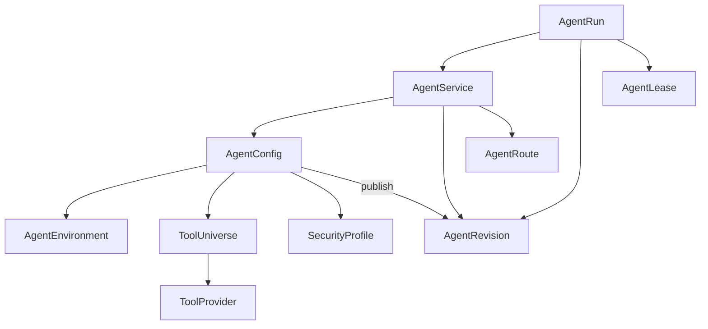
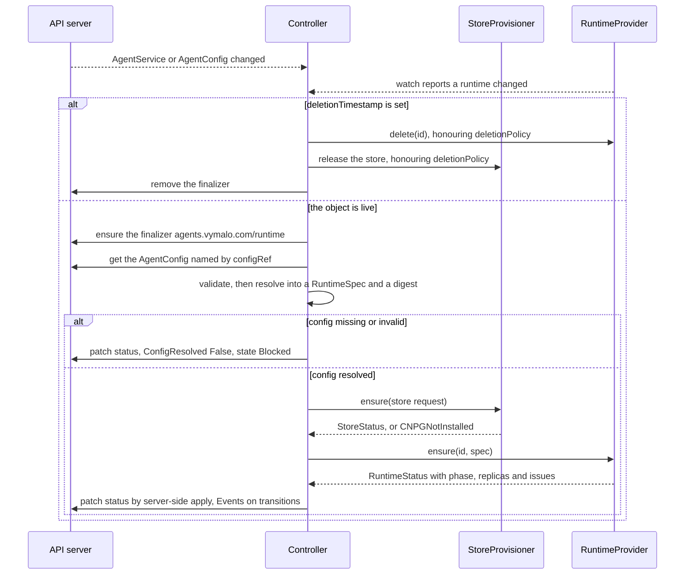
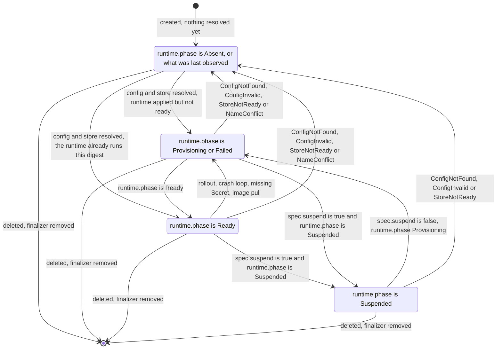
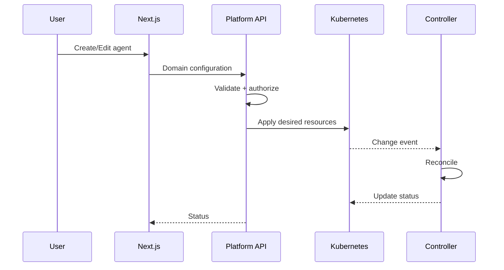
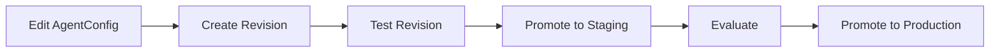
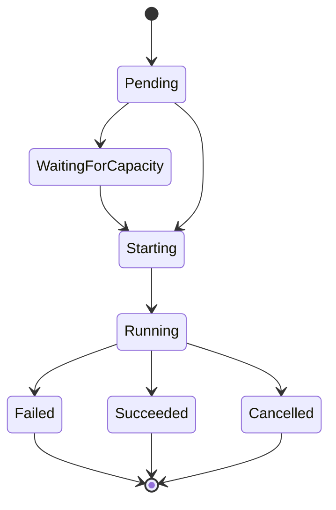

# Control plane, CRDs, operator and UI

[← Index](README.md) · [← Previous](09-operations.md) · [Next →](11-decisions.md)


---

## 56. CRD Inventory

Recommended first-class CRDs:

| CRD | Responsibility |
|---|---|
| `AgentService` | stable agent service identity |
| `AgentConfig` | editable agent behavior |
| `AgentRevision` | immutable resolved agent definition |
| `AgentEnvironment` | runtime/environment requirements |
| `ToolProvider` | where tools come from |
| `ToolUniverse` | reusable sets of effective tools |
| `SecurityProfile` | reusable execution security |
| `AgentRoute` | optional routing/exposure |

`AgentRun` and `AgentLease` are application records, not CRDs (§19–20, AD-016).

> **Decision (2026-10-04, AD-023):** v0 implements two of these, `AgentService` and `AgentConfig` ([§59a](#59a-operator-v0-adam-rs-agents)). The inline `environment`, `tools` and `security` of an `AgentConfig` have the shape of the specs of `AgentEnvironment`, `ToolUniverse` / `ToolProvider` and `SecurityProfile`, so those CRDs can come later as exclusive `*Ref` fields. `AgentRevision` and `AgentRoute` wait; `status.config.digest` is the seed of the first.

Potential later CRDs:

```text
ResourceClass
CredentialBinding
ArtifactPolicy
VerificationPolicy
RuntimeProviderConfig
RouteProviderConfig
```

They should only become CRDs if Kubernetes reconciliation is useful.

---

## 57. Things That Should Probably Not Be CRDs

Not every domain object benefits from Kubernetes reconciliation.

Likely application database objects:

```text
Tenant
Project
User
Role
Permission
Conversation
Response
AgentRun
AgentLease
AuditEvent
Artifact metadata
billing records
model usage
workflow history
```

The platform should avoid using Kubernetes as a general-purpose database.

---

## 58. CRD Reference Model



Not every arrow is a Kubernetes `ownerReference`.

`AgentRun` and `AgentLease` appear here as application records, not CRDs (AD-016).

Many are normal object references.

Shared resources such as:

```text
ToolUniverse
AgentEnvironment
SecurityProfile
```

must not be deleted simply because one consuming agent is deleted.

---

## 59. Operator Design

The operator should be deliberately boring.

It should reconcile desired infrastructure.

It should not implement business workflows.

For example:

```text
active leases > 0 (from the lease service)
    ↓
ensure runtime active

active leases = 0
    ↓
wait idle timeout
    ↓
ensure runtime stopped
```

Not:

```text
run agent
wait PR
check CI
ask reviewer
retry implementation
merge
```

The latter belongs in Restate.

> **Decision (2026-10-04, AD-023):** the first operator is deliberately smaller than this design: two CRDs, adam-rs agents, native Kubernetes, no leases and no scale-to-zero. It is specified in [§59a](#59a-operator-v0-adam-rs-agents); the text above stays the target.

---

## 59a. Operator v0: adam-rs agents

> **Status: design only (2026-10-04).** Nothing here is built; slice S0 is this text. The first code lands with S1 (§59a, *Slices*).

The first operator the platform ships. It is smaller than the design of §59 on purpose: it manages **adam-rs agents** (AD-022) from two CRDs, `AgentService` and `AgentConfig`, on native Kubernetes (AD-023), and it keeps secrets out of the custom resources (AD-024).

It exists because of one request from the owner (2026-10-04): *"that coder, I wanted to have a k8s operator to manage it automatically using CRDs"*. The owner's defaults, which this section follows:

- it lives in this repository, in Rust with kube-rs;
- the coder first, then folder agents;
- it runs next to the existing charts until it is proven.

What it does, in one paragraph: a controller reads an `AgentService` and the `AgentConfig` it names, validates them, resolves them into one neutral `RuntimeSpec` with a digest, and has a `RuntimeProvider` make a workload, a Service, a NetworkPolicy and storage for an adam-rs agent (`adam-coder` or `adam-agent`, one image). It reports conditions and a state, and it lists the agent in the [agent registry](../extensions/agent-registry-v1.md) (§12b). It reconciles infrastructure and nothing else, as §59 asks: no run, no workflow, no lease.

The adam-rs side is cited at revision `0391809`, the source of the coder image the netcup deployment pins (*verified 2026-10-04*, read at that revision in [vymalo/another-adam-rs](https://github.com/vymalo/another-adam-rs)): `deploy/coder/templates/statefulset.yaml`, `_validate.tpl`, `networkpolicy.yaml` and `extra-mcp-configmap.yaml` ([chart](https://github.com/vymalo/another-adam-rs/tree/0391809/deploy/coder/templates)), `bin/adam-coder/README.md` and `bin/adam-agent/README.md` ([environment tables](https://github.com/vymalo/another-adam-rs/blob/0391809/bin/adam-agent/README.md#configuration)), `docker/coder/Dockerfile` ([entrypoint](https://github.com/vymalo/another-adam-rs/blob/0391809/docker/coder/Dockerfile)).

### Workspace layout

One Cargo workspace in this repository. Crates are prefixed `aap-` (owner question in §93).

| Path | Crate | What |
|---|---|---|
| `crates/api` | `aap-api` | The CRD types only: kube `CustomResource` plus schemars, CEL rules, `fn crds()` |
| `crates/domain` | `aap-domain` | Pure: `validate`, `resolve` into a `ResolvedAgent` with a sha256 digest, and the mapping of `adam-coder` / `adam-agent` onto `aap_ports::RuntimeSpec`. **The env contract of the two binaries lives only here** |
| `crates/ports` | `aap-ports` | The traits `RuntimeProvider`, `StoreProvisioner`, `AgentDirectory` and their neutral types. Feature `testkit`: the conformance macros and `Memory` implementations |
| `crates/runtime-kubernetes` | | `RuntimeProvider` on native Kubernetes (§23) |
| `crates/store-secret` | | `StoreProvisioner` for a referenced Secret |
| `crates/store-cnpg` | | `StoreProvisioner` for an operator-owned CloudNativePG `Cluster` |
| `crates/registry` | | The `agent-registry/v1` document builder and an axum router: bearer, `ETag` / `304`, `Cache-Control: private, max-age<=60`, `Vary` |
| `crates/controller` | | The reconcilers, generic over `<R: RuntimeProvider, S: StoreProvisioner>`: status, conditions, events, the finalizer, and an `AgentDirectory` backed by a reflector |
| `crates/testsupport` | | Fixtures and the API-server harness |
| `bin/operator` | | The composition root (AD-020). Features `runtime-kubernetes`, `store-cnpg`, `registry`; subcommands `run` and `crdgen`; ports 8080 (registry), 8081 (health), 9090 (metrics) |
| `deploy/operator` | | The Helm chart |
| `examples/` | | `coder.yaml`, `chat.yaml` |

Libraries: `kube` 4.0.0 (features `runtime`, `derive`), `k8s-openapi` 0.28.0, `schemars` 1 (*verified 2026-10-04*, kube-rs documentation). CEL rules through `x_kube(validation = …)` are *unverified*: S1 proves them against a real API server, and a rule that cannot be expressed moves into the reconciler's validation (below).

**AD-020 in practice.** No Kubernetes type appears in a trait signature. `RuntimeSpec` is made of neutral types (`EnvValue::{Literal, Secret(SecretRef), PodName}`, `VolumeSpec`, …). Ownership travels as an opaque `OwnerHandle` the controller got from the object, so a provider can set owner references without the controller knowing what they are. `RuntimeProvider::watch()` feeds the controller with the ids of runtimes that changed: the controller never watches StatefulSets itself. The trait is in [§22](05-runtime.md#22-runtimeprovider).

`RuntimeStatus` is `{ phase: Absent | Provisioning | Ready | Suspended | Failed, replicas, issues[] }` (the phases of §18), where an issue is `{ role, reason, message }` and the reason is one of:

| Issue reason | Means | Seen as |
|---|---|---|
| `ConfigRejected` | the agent process refused its configuration | exit code 78 |
| `DependencyUnavailable` | a dependency of the agent is unreachable (database, an MCP server) | exit code 69 |
| `MissingSecret{name}` | a referenced Secret or key does not exist | `CreateContainerConfigError` |
| `ImagePull` | the image cannot be pulled | `ErrImagePull`, `ImagePullBackOff` |
| `CrashLoop` | the container keeps exiting for another reason | `CrashLoopBackOff` |
| `NameConflict` | an object with the name the runtime needs exists and is not ours | adoption guard |

Exit codes 78 and 69 are adam's (`adam_service`: 0 clean shutdown, 78 configuration, 69 a dependency is unreachable; *verified 2026-10-04*, `bin/adam-agent/README.md`, "The process").

### The v0 CRDs

Group `agents.vymalo.com`, version `v1alpha1` (§62), **namespaced**. Two kinds. Where a field exists in §7 or §8 it keeps its name and meaning; the fields §7 and §8 draw that v0 does not implement are in [What v0 leaves out](#what-v0-leaves-out), and the fields v0 adds (`store`, `access`, `registry`, `deletionPolicy`, the inline `environment`, `tools` and `security`) are the ones adam-rs and the operator need today. A **secret is never a value** in either kind (AD-024): a field that needs one names a Secret and a key.

#### `AgentService`: the netcup coder

```yaml
apiVersion: agents.vymalo.com/v1alpha1
kind: AgentService
metadata: { name: coder, namespace: another-agentic-system }
spec:
  description: Coding task to verified pull request.
  configRef: { name: coder }
  interfaces:
    a2a:
      enabled: true
      bearerTokensSecretRef: { name: coder-secrets, key: A2A_BEARER_TOKENS }
      publicUrl: ""          # empty: http://<name>.<ns>.svc:8080/
    responses: { enabled: false }   # v0: CEL refuses true
    mcp: { enabled: false }         # v0: CEL refuses true
  scaling:
    topology: combined     # combined | split
    workers: 1
    front: { replicas: 1 } # split only; a PodDisruptionBudget when > 1
  suspend: false
  store:
    postgres:
      secretRef: { name: coder-db-uri, key: uri }
      # or an operator-owned CloudNativePG cluster:
      # cnpg: { instances: 1, storage: { size: 5Gi, storageClass: longhorn } }
  access:
    allowFrom:
      - namespaceSelector: { matchLabels: { kubernetes.io/metadata.name: another-agentic-system } }
  registry: { title: Coder, tags: [coding, git] }
  deletionPolicy: Retain   # Retain | Delete
```

#### `AgentConfig`: the netcup coder

```yaml
apiVersion: agents.vymalo.com/v1alpha1
kind: AgentConfig
metadata: { name: coder, namespace: another-agentic-system }
spec:
  harness:
    type: adam-rs
    adam:
      binary: adam-coder         # adam-coder | adam-agent
      agent: { embedded: {} }
      coder:
        workers: 4
        maxCheckCycles: 3
        checkTimeoutSecs: 900
        workspaceSweepSecs: 300
        workspacePlacement: ""   # "" | shared | affinity | isolated
        allowedRepoHosts: [github.com]
        githubApiUrl: https://api.github.com
        prDraft: true
        gitAuthor: { name: "bored-giant-panda[bot]", email: "337696346+bored-giant-panda[bot]@users.noreply.github.com" }
        createRepoOwners: []
        opencodeModel: coding-model
        github:
          app:
            id: Iv23li4m1ZrQ8wdwjnQH       # the App's client ID: public, not a secret
            owners: [vymalo]               # or installationId: 12345 (exactly one of the two)
            privateKeySecretRef: { name: coder-github-app, key: private-key.pem }
          # token: { secretRef: { name: coder-secrets, key: GITHUB_TOKEN } }   # instead of app, never both
  model:
    model: coding-model
    baseUrl: { secretRef: { name: coder-secrets, key: MODEL_BASE_URL } }   # or { value: https://…/v1 }
    apiKeySecretRef: { name: coder-secrets, key: MODEL_API_KEY }
  tools:
    githubMcp: { sidecar: true, port: 8082, host: "" }
    mcpServers:
      websearch:
        url: http://another-agentic-websearch.another-agentic-system.svc:8080/mcp
        headers:
          Authorization: { prefix: "Bearer ", secretRef: { name: coder-secrets, key: SEARCH_MCP_TOKEN } }
        optional: true
      context7:
        url: https://mcp.context7.com/mcp
        headers:
          Authorization: { prefix: "Bearer ", secretRef: { name: coder-secrets, key: CONTEXT7_API_KEY } }
        optional: true
    allowInsecureHttp: true
  environment:
    image: { ref: ghcr.io/vymalo/another-adam-rs/coder:sha-0391809 }
    resources: { requests: { cpu: 500m, memory: 1Gi }, limits: { memory: 6Gi } }
    volumes:
      - name: work
        scope: agent
        mountPath: /work
        source: { persistent: { size: 20Gi, storageClass: longhorn, perReplica: true } }
    terminationGracePeriodSeconds: 120
  security: { runAsUser: 10001, runAsGroup: 10001, fsGroup: 10001, fsGroupChangePolicy: OnRootMismatch }
  extraEnv: {}
```

The model alias is a placeholder here: the real alias is the deployment's. The gateway URL is a Secret key in this example because the netcup deployment keeps it out of git (adam-rs `config.modelBaseUrlFromSecret`); a plain `value` is the other form.

#### A folder agent: `chat`

An agent that is only a folder (the `adam-agent-folder` case) needs the same two kinds and no volume. The service:

```yaml
apiVersion: agents.vymalo.com/v1alpha1
kind: AgentService
metadata: { name: chat, namespace: another-agentic-system }
spec:
  description: A chat assistant.
  configRef: { name: chat }
  interfaces:
    a2a:
      enabled: true
      bearerTokensSecretRef: { name: chat-secrets, key: A2A_BEARER_TOKENS }
  scaling: { topology: combined, workers: 1 }
  store:
    postgres:
      secretRef: { name: chat-db-app, key: uri }   # the system chart's CNPG Secret of the `agent` database
  registry: { title: Chat, tags: [chat] }
```

and its config:

```yaml
apiVersion: agents.vymalo.com/v1alpha1
kind: AgentConfig
metadata: { name: chat, namespace: another-agentic-system }
spec:
  harness:
    type: adam-rs
    adam:
      binary: adam-agent
      agent:
        folder:
          files:                                  # relative path -> content; mounted at /etc/adam/agent (ADAM_AGENT_DIR)
            instructions.md: |
              ---
              name: chat
              description: A chat assistant.
              card:
                name: Chat
              ---
              Your name is Chat.
              In one sentence: I talk things through with you.
          # or: configMapRef: { name: chat-agent }   (exactly one of files and configMapRef)
  model:
    model: chat-model
    baseUrl: { value: https://gateway.example.invalid/v1 }
    apiKeySecretRef: { name: chat-secrets, key: MODEL_API_KEY }
  tools:
    allowInsecureHttp: true     # the orchestrator's thread tools are plain http on another host, inside the cluster
  environment:
    image: { ref: "ghcr.io/vymalo/another-adam-rs/coder:sha-0391809@sha256:<digest>" }   # tag and digest
    resources: { requests: { cpu: 100m, memory: 256Mi }, limits: { memory: 512Mi } }
```

There is no `volumes`, so the operator renders a Deployment. `files` is the whole folder inline, and ConfigMaps hold 1 MiB, which is the folder's size limit in v0. A path with a `/` in it (`skills/…`) is stored under a mangled ConfigMap key and mounted at its path with `items`. The adam-agent folder format is [`docs/authoring.md`](https://github.com/vymalo/another-adam-rs/blob/0391809/docs/authoring.md) in adam-rs.

#### Validation

Two layers, so a bad object is refused at the earliest place that can know.

- **CEL on the CRD** (shape, no other object needed): `interfaces.responses.enabled` and `interfaces.mcp.enabled` must be `false` in v0; exactly one of `store.postgres.secretRef` and `store.postgres.cnpg`; exactly one of `github.app` and `github.token`; exactly one of `app.installationId` and `app.owners`; exactly one of `agent.folder.files` and `agent.folder.configMapRef`, and exactly one of `folder` and `embedded`; `binary: adam-coder` needs `embedded` and the `coder` block, `binary: adam-agent` needs `folder` and no `coder` block; `scaling.front` only with `topology: split`.
- **The reconciler** (`aap-domain::validate`, cross-object, reported as `ConfigInvalid`): the rules of the adam-rs chart's [`_validate.tpl`](https://github.com/vymalo/another-adam-rs/blob/0391809/deploy/coder/templates/_validate.tpl), mirrored so the same mistakes fail the same way: a placement is one of `""`, `shared`, `affinity`, `isolated` (`a2a-only` is refused for the coder); more than one worker needs a placement; `shared` and `affinity` need the `work` volume to be a single ReadWriteMany claim (`perReplica: false`) and `isolated` needs it per replica; `githubMcp.port` is 1 to 65535; an MCP server URL is `http` or `https`, with no user name, password or `${…}` in it; a header name is an HTTP token and its prefix is plain text; a plain `http://` URL to another machine needs `tools.allowInsecureHttp` (adam refuses such a server at startup otherwise); `extraEnv` may not name a variable the operator sets.

### What each field becomes

The field-to-environment contract. It is the only place in the operator that knows adam's variable names (`aap-domain`); the parity goldens (below) hold it equal to what the adam-rs chart renders. Variable names and meanings are those of `bin/adam-coder/README.md` and `bin/adam-agent/README.md` (*verified 2026-10-04*, revision `0391809`).

| Field | Becomes | Notes |
|---|---|---|
| `AgentService.spec.interfaces.a2a.bearerTokensSecretRef` | `A2A_BEARER_TOKENS` from `secretKeyRef` | Not set on a worker of `split`. No token, no server (the agent fails closed) |
| `…a2a.publicUrl` | `PUBLIC_URL` | Empty: `http://<name>.<ns>.svc:8080/`. Not set on a worker of `split` |
| `…scaling.topology` | `ROLE` | `combined`: unset (the binary runs `all`). `split`: `control-plane` on `<svc>-front`, `worker` on the StatefulSet or Deployment `<svc>` |
| `…scaling.workers` | replicas of `<svc>` | The adam *workers* as pods. Not the `WORKERS` variable (below) |
| `…scaling.front.replicas` | replicas of `<svc>-front` | `split` only |
| `…suspend` | replicas 0, `runtime.phase: Suspended` | The only scale-to-zero in v0 |
| `…store.postgres.secretRef` | `DATABASE_URL` from `secretKeyRef` | |
| `…store.postgres.cnpg` | `DATABASE_URL` from `<svc>-db-app`, key `uri` | The Secret CloudNativePG makes for the cluster `<svc>-db` |
| `…access.allowFrom` | NetworkPolicy `<svc>`, ingress on 8080 | No egress rule: the agent needs git hosts, the model gateway and registries |
| `…registry`, `…description` | the registry item (`title`, `tags`, `service`) | Nothing reaches the pod |
| `…deletionPolicy` | the finalizer's behaviour | [Finalizer](#finalizer-and-deletion) |
| `AgentConfig…adam.binary` | the container command | `adam-coder`: the image's entrypoint. `adam-agent`: `tini -- adam-agent` (the image says so in its `Dockerfile`) |
| `…adam.agent.folder` | `ADAM_AGENT_DIR=/etc/adam/agent`, a ConfigMap `<svc>-agent-<hash8>` mounted read-only | `files` gives the ConfigMap, `configMapRef` mounts the named one. `embedded` sets nothing |
| `…adam.coder.workers` | `WORKERS` | Runs advanced at once, per process |
| `…coder.maxCheckCycles`, `checkTimeoutSecs`, `workspaceSweepSecs` | `MAX_CHECK_CYCLES`, `CHECK_TIMEOUT_SECS`, `WORKSPACE_SWEEP_SECS` | |
| `…coder.workspacePlacement` | `WORKSPACE_PLACEMENT`, and `WORKER_ID` from `metadata.name` for `affinity` and `isolated` | `""`: not set. `WORKSPACE_ROOT` is the mount path of the volume `work` |
| `…coder.allowedRepoHosts`, `githubApiUrl`, `prDraft` | `ALLOWED_REPO_HOSTS` (comma-joined), `GITHUB_API_URL`, `PR_DRAFT` | |
| `…coder.gitAuthor` | `GIT_AUTHOR_NAME`, `GIT_AUTHOR_EMAIL` | |
| `…coder.createRepoOwners` | `CREATE_REPO_OWNERS` (comma-joined) | Not set when empty: the tool stays off |
| `…coder.opencodeModel` | `OPENCODE_MODEL` | |
| `…coder.github.app.id`, `owners`, `installationId` | `GITHUB_APP_ID`, `GITHUB_APP_OWNERS`, `GITHUB_APP_INSTALLATION_ID` | Exactly one of the last two |
| `…coder.github.app.privateKeySecretRef` | a Secret volume at `/var/run/secrets/github-app` (mode 0440) and `GITHUB_APP_PRIVATE_KEY_PATH` | The key is a file, never a variable. See the gap in AD-024 |
| `…coder.github.token.secretRef` | `GITHUB_TOKEN` from `secretKeyRef` | Not with `app` |
| `…model.model` | `MODEL` | |
| `…model.baseUrl` | `MODEL_BASE_URL`, a value or a `secretKeyRef` | |
| `…model.apiKeySecretRef` | `MODEL_API_KEY` from `secretKeyRef` | |
| `…tools.githubMcp` | a native sidecar `github-mcp`, `GITHUB_MCP_URL=http://127.0.0.1:<port>`, and `GITHUB_HOST` on the sidecar when `host` is set | The sidecar holds no credential: the coder sends the credentials of each call. Loopback only |
| `…tools.mcpServers` | a ConfigMap `<svc>-mcp` (`mcp.json`, mounted at `/etc/adam/extra-mcp`), `ADAM_EXTRA_MCP_FILE`, and one variable per header Secret | The file holds `${VAR}` references only. The variable is named by the Secret key (`SEARCH_MCP_TOKEN`), and the file refers to it |
| `…tools.allowInsecureHttp` | `MCP_ALLOW_INSECURE=true` | Covers every MCP server of the agent and the endpoints a sender announces. Never automatic |
| (fixed for `adam-coder`) | `MCP_ALLOW_STDIO=true` | Parity with the chart, which keeps it for one release for folders written before the GitHub server became a sidecar. Not set for `adam-agent` |
| (fixed) | `LISTEN_ADDR=0.0.0.0:8080` | |
| `…environment.image`, `resources` | the container's image and resources | The sidecar has its own small defaults |
| `…environment.volumes` | volume mounts, a `volumeClaimTemplate`, or the shared claim | [Owned objects](#owned-objects) |
| `…environment.terminationGracePeriodSeconds` | the pod's | |
| `…security` | the pod's `securityContext` (`runAsUser`, `runAsGroup`, `fsGroup`, `fsGroupChangePolicy`) | Everything else of the security context is fixed, below |
| `…extraEnv` | literal variables | Names only the adam binaries do not own; never a secret |

The only variables that carry a secret are the ones the adam binaries know (`MODEL_API_KEY`, `A2A_BEARER_TOKENS`, `GITHUB_TOKEN`, `DATABASE_URL`, `MODEL_BASE_URL` when it is a Secret key) and the ones the extra MCP file names. The operator never invents a secret variable.

### Reconciliation

One controller per kind. The `AgentConfig` controller validates the object and sets its `Valid` condition. The `AgentService` controller does the work: it is triggered by its own object, by `RuntimeProvider::watch()`, and by a change of an `AgentConfig` (mapped to every service that references it).



The state the controller derives and writes to `status.state` (§88), with the phase of the runtime beneath it (§18):



The rule, in order: a false `ConfigResolved` or `StoreReady`, or a `NameConflict` issue, is `Blocked` (the operator did not apply the desired state, and **it leaves what runs untouched**); `spec.suspend` with phase `Suspended` is `Suspended`; phase `Ready` is `Ready`; anything else is `Degraded`, and the reason says which (`Provisioning` for a rollout in progress, or the issue's reason). As in §88, the service state is distinct from the runtime's: `Suspended` is healthy.

Steps of one pass:

1. **Finalizer** `agents.vymalo.com/runtime`, added before anything is created.
2. **Fetch and validate the config.** `ConfigNotFound` or `ConfigInvalid`, with the cross-object rules above.
3. **Ensure the store.** A referenced Secret needs nothing; `cnpg` makes the Cluster `<svc>-db`, whose Secret `<svc>-db-app` (key `uri`) is the connection string. `CNPGNotInstalled` when the CloudNativePG API is absent.
4. **Resolve, then `RuntimeProvider::ensure`.** `resolve` turns the two objects into a `ResolvedAgent`: the `RuntimeSpec` and its sha256 digest. The pods are annotated `agents.vymalo.com/config-digest`, so a changed folder, MCP file, image or variable is a rollout (adam reads its files at startup only).
5. **Patch the status** by server-side apply, and emit Events on transitions.

#### Owned objects

Applied by server-side apply under the field manager `agents.vymalo.com/operator`, each labelled `app.kubernetes.io/managed-by: agents.vymalo.com`.

| Object | Name | When |
|---|---|---|
| StatefulSet | `<svc>` | A `perReplica` persistent volume exists: its `volumeClaimTemplate` is named after the volume (`work`) |
| Deployment | `<svc>` | Otherwise |
| Deployment, PodDisruptionBudget | `<svc>-front` | `topology: split` (the budget when the front has more than one replica) |
| Service | `<svc>` | Always: port 8080, selecting the front in `split` |
| ConfigMap | `<svc>-agent-<hash8>` | Folder `files`: immutable, named by the first 8 hex digits of its content hash; superseded ones are deleted after the rollout |
| ConfigMap | `<svc>-mcp` | `tools.mcpServers`: the extra MCP file, `${VAR}` references only |
| NetworkPolicy | `<svc>` | `access.allowFrom`: ingress on 8080, no egress rule |
| PersistentVolumeClaim | `<svc>-work` | Placement `shared` or `affinity`: one ReadWriteMany claim for all workers |
| Cluster (CloudNativePG) | `<svc>-db` | `store.postgres.cnpg` |

Compute objects carry an owner reference to the `AgentService` (through the `OwnerHandle`). **Data objects do not** (the claim `<svc>-work`, the Cluster `<svc>-db`, and the claims a StatefulSet makes): garbage collection must not take them with the service, so the finalizer deletes them explicitly, and only under `deletionPolicy: Delete`.

**Pod template.** The same as the adam-rs chart's `statefulset.yaml` (*verified 2026-10-04*, revision `0391809`), so the workload that replaces a Helm release behaves like it:

- no service-account token (`automountServiceAccountToken: false`); `runAsNonRoot`, uid and gid from `security` (10001 for the adam image), `seccompProfile: RuntimeDefault`; every container drops all capabilities and refuses privilege escalation;
- `/healthz` startup, liveness and readiness probes on the `http` port, with the chart's periods;
- the `github-mcp` sidecar as a **native sidecar** (an init container with `restartPolicy: Always`), probed by an `exec` startup probe on loopback, because the kubelet's TCP probe connects to the pod IP and the server listens on loopback only (adam-rs #86);
- `WORKER_ID` from the downward API (`metadata.name`) when the placement pins runs to a worker;
- the annotation `agents.vymalo.com/config-digest`, and `OrderedReady` with `RollingUpdate` for the StatefulSet.

The goldens in *Testing* hold the parity, not this list.

#### Adoption guard

The operator never takes over an object that has the name it needs but not its `managed-by` label: it reports `NameConflict` (a `RuntimeStatus` issue, so `state: Blocked`) and changes nothing. This is what makes running next to an existing Helm release safe: a Helm object carries `app.kubernetes.io/managed-by: Helm`, so the operator waits until that release's object is gone (*Rollout on netcup*).

#### Finalizer and deletion

Deleting an `AgentService` runs `RuntimeProvider::delete` and releases the store, as the sequence above shows, then removes the finalizer. `deletionPolicy` decides what happens to data:

- `Retain` (default): the compute (workloads, Service, NetworkPolicy, ConfigMaps) is removed; the work volumes and an operator-owned database stay, with their labels, so an `AgentService` of the same name later finds them again (the adoption guard accepts its own label).
- `Delete`: the data goes too.

The policy reaches the provider and the provisioner in their neutral spec types, so `delete(id)` has what it needs without a Kubernetes type in its signature.

#### Status

```yaml
status:
  observedGeneration: 3
  state: Ready                 # Ready | Degraded | Suspended | Blocked
  config: { name: coder, observedGeneration: 7, digest: "sha256:…" }
  runtime: { provider: kubernetes, phase: Ready, replicas: 1 }
  endpoints:
    a2a: http://coder.another-agentic-system.svc:8080/
    agentCard: http://coder.another-agentic-system.svc:8080/.well-known/agent-card.json
  conditions:
    - { type: ConfigResolved, status: "True", reason: Resolved }
    - { type: StoreReady, status: "True", reason: SecretReferenced }
    - { type: RuntimeReady, status: "True", reason: Ready }
    - { type: Listed, status: "True", reason: Listed }
    - { type: Ready, status: "True", reason: Reconciled }
```

| Condition | `True` reason | `False` reasons |
|---|---|---|
| `ConfigResolved` | `Resolved` | `ConfigNotFound`, `ConfigInvalid` |
| `StoreReady` | `SecretReferenced`, `ClusterReady` | `CNPGNotInstalled`, `ClusterNotReady` |
| `RuntimeReady` | `Ready` | `Provisioning`, `Suspended`, `MissingSecret`, `ConfigRejected`, `DependencyUnavailable`, `ImagePull`, `CrashLoop`, `NameConflict` |
| `Listed` | `Listed` | `A2ADisabled`, `ServiceBlocked`, `RegistryFull`, `RegistryDisabled` |
| `Ready` | `Reconciled` | the reason of the first false condition above, in this order |

`Ready` is true when the first three are; `Listed` informs and does not gate it, so a full registry never makes an agent unready. The runtime reasons come from pod status: `CreateContainerConfigError` is `MissingSecret`, an exit with code 78 is `ConfigRejected`, 69 is `DependencyUnavailable`, `ImagePullBackOff` is `ImagePull`. Because the operator has **no RBAC on Secrets**, it cannot check that a referenced Secret exists: the kubelet's answer in the pod's status is how it learns. `status.config.digest` is the seed of AgentRevision (§9): the digest a revision would record as its `configurationDigest`, with nothing yet that publishes or promotes it.

#### Secrets and databases

- **References only (AD-024).** A custom resource names a Secret and a key; the operator copies a reference into the pod spec as a `secretKeyRef`, and never reads or writes a value. It has no RBAC on Secrets and creates no ExternalSecret. The conformance macros include "no secret value ever materialises": no `RuntimeSpec`, status, Event, log line or ConfigMap holds one.
- **Two store modes** behind the `StoreProvisioner` seam (AD-020): `secretRef` (a Secret someone else owns) and operator-owned `cnpg` (a `Cluster` `<svc>-db` per service, owned by it, data kept by `Retain`). "A `Database` in someone else's Cluster" is deferred: server-side-apply co-ownership of that Cluster's `managed.roles` is *unverified*, and the operator must not fight the Cluster's owner for the field.
- **`store` sits on `AgentService`, not on `AgentConfig`** (owner question in §93): a config can be shared by services, and two services must not share a ledger. adam keys a run by the agent's name, and several processes with the same name are replicas of one agent (*verified 2026-10-04*, `bin/adam-agent/README.md`, "Several agents, one database").

### Registry in v0

The operator binary serves `GET /registry/v1/agents` ([§12b](03-interfaces.md#12b-agent-registry), [the contract](../extensions/agent-registry-v1.md)) from the cache of its own reflector, through the `AgentDirectory` trait, until a control plane exists. The document has one item per service that has A2A enabled and is not `Blocked`: `href` is `status.endpoints.agentCard`, `service` the object's name, `title` and `tags` from `spec.registry`, in name order, with the linkset headers of the contract, an `ETag` over the document (`304` on a match), `Cache-Control: private, max-age=30` and `Vary: Authorization`.

Deviations from the contract and from §12b, all of them v0 only:

| The contract | v0 |
|---|---|
| Served by the control plane | Served by the operator binary (feature `registry`, port 8080, ClusterIP); no ingress |
| The platform API's bearer token, `401` or `403`, the list filtered per caller (`agent.invoke`, §52) | **One static bearer** read from a file and compared in constant time; `401` only; **no per-caller filtering**, every holder sees every listed service. Open question in §93 |
| `max-age` of 60 seconds or less | 30 |
| At most 500 items and 1 MiB; a client never truncates | The operator **refuses rather than truncates**: past either limit it answers `503` and every service gets `Listed=False` `RegistryFull` |
| HTTPS outside a trusted cluster network, rate limiting | In-cluster plain HTTP behind a NetworkPolicy; no rate limit |
| The card is served by the control plane, so it never wakes compute | The agent serves its own card (adam does), and nothing scales to zero yet (below), so nothing wakes |
| Releases on each card (§12a) | No release-channels extension in v0 |

**The agent token rule.** A consumer sends one token to every agent a registry lists; another-agentic-system names it `AGENT_REGISTRY_AGENT_TOKEN` (its `orch-registry-platform` crate, *verified 2026-10-04*, `orchestrator/crates/registry-platform/README.md` in [vymalo/another-agentic-system](https://github.com/vymalo/another-agentic-system)). For that to work, the token must be one of each listed service's `A2A_BEARER_TOKENS`. The operator cannot check it (no Secret RBAC), so it is a deployment rule, and the consumer test of the registry crate covers it.

### What v0 leaves out

Each item is additive later, and the third column says how it stays so.

| Left out | Why | Stays additive because |
|---|---|---|
| `AgentRevision`, channels, the release-channels card extension | Nothing consumes them yet. adam's ledger is keyed by the agent name, so revisions running side by side would share or fork one ledger. adam serves the card itself | `status.config.digest` is already the content of a revision |
| `minReplicas`, `maxReplicas`, `idleTimeout`, leases, scale-to-zero | They need a lease service, an activator and a control-plane card, and the coder's workers keep stepping a run after the A2A call returns, so no HTTP-bound signal means "idle" | `spec.suspend`, the phase `Suspended` and a reserved capability exist. adam's store has run leases (`lease_until`) for v1 (open question in §93) |
| `interfaces.responses` and `interfaces.mcp` | adam serves A2A only | The fields exist, and CEL refuses `true` |
| `AgentEnvironment`, `ToolUniverse`, `ToolProvider`, `SecurityProfile`, `AgentRoute`, `authorization.policyRef` | They are reuse mechanisms, and nothing is shared yet | The inline `environment`, `tools` and `security` have the shape of those CRDs' specs, so a later `*Ref`, exclusive with the inline form, is additive |
| An admission webhook | It needs cert-manager | CEL on the CRD plus validation in the reconciler cover v0 |
| Per-caller registry filtering | There is no platform API yet | The registry is behind `AgentDirectory`; the filter joins when the control plane serves it |
| Credential broker, SPIFFE | §39 and §40 are not built | AD-024 records the gap |

### Testing

- `aap-domain`: table tests, and **parity goldens**: what the adam-rs chart renders for the same inputs, vendored into this repository with the adam-rs commit they came from.
- Render goldens of the owned objects, checked with kubeconform in strict mode.
- Reconciler unit tests with `tower_test::mock` and the `Memory` implementations of the ports.
- The conformance macros of `aap-ports` (`testkit`), run by every provider and provisioner, including "no secret value ever materialises".
- An envtest-like harness: a real kube-apiserver and etcd, for the CRDs, the CEL rules and server-side apply.
- The registry contract tests, and a **consumer test** that reads the document with another-agentic-system's `orch-registry-platform` parser.
- A kind end-to-end in CI: a stub agent; `adam-agent` with a WireMock model; and the coder with a throwaway GitHub App key.

### The operator chart

`deploy/operator`, next to the existing charts until the operator is proven.

- `kubeVersion: ">=1.29"`, for the native sidecar of the pod template (*unverified* that sidecar containers are on by default from 1.29, and that netcup's cluster is that new, see *Risks*).
- The image `ghcr.io/vymalo/another-agentic-platform/operator`, tag `sha-0000000` until CI bumps it (`bump-tag.sh`); built with cargo-chef onto a distroless base, non-root 65532.
- Values: `crds.install`, `watchNamespace`, the registry's settings and the Secret (or ExternalSecret) of its bearer token.
- **One replica, `Recreate`, no leader election.** A second reconciler would only race the first; the cost is a short gap in reconciling during an upgrade, and a running agent is not touched by it.
- A namespaced `Role`: the two kinds and their `status` and `finalizers`, the owned kinds, `pods` for status, `events`, and the CloudNativePG `Cluster` when `store-cnpg` is built in. **No right on Secrets.**
- Render checks, goldens, vendored schemas, as in the other charts of the family.
- CI: `rust.yml` (fmt, clippy, test, deny, MSRV, a check that the generated CRDs match the committed ones) and `operator.yml` (helm, kubeconform, hadolint, build, then the kind end-to-end, then push the image that passed, then the bump job).

### Rollout on netcup

Next to the existing charts, one step at a time. The coder stays on its Helm chart until M3.

| Step | What |
|---|---|
| M0 | In home-os, an app for the CRDs (project `infrastructure`) and an app for the operator (project `another-agentic`, with this repository as a source repository) |
| M1 | The system chart's registry wiring. **The coder stays a static agent**: only static agents carry the `agent-checks` gate in the system, and a registry agent does not |
| M2 | A shadow, `coder-next`, an `AgentService` of its own with its own CloudNativePG cluster, beside the Helm coder |
| M3 | The cutover. Snapshot the `work-coder-0` volume. Mark the objects that hold data `Prune=false` and keep them. The home-os source moves to adam-rs `deploy/coder-agent`. The operator reports `NameConflict` until Argo prunes the Helm objects, then creates the StatefulSet `coder` and **reattaches the claim `work-coder-0`**. The Service name and the database are unchanged. Needs a downtime window (open question in §93) |
| M4 | The rollback recipe, written with the cutover. Under `Retain`, deleting the `AgentService` keeps the volume and the database |
| M5 | `chat`: `chat.runtime: agentservice` in the system chart |
| M6 | Retire `deploy/coder` and the chat Deployment path |

*Unverified:* that Argo CD leaves the claims of a StatefulSet's `volumeClaimTemplates` alone when it prunes (M3 depends on it), and that netcup's Kubernetes is 1.29 or newer.

### Slices

| Slice | Repository | What |
|---|---|---|
| S0 | platform | this documentation change |
| S1 | platform | the workspace, `aap-api`, `crdgen`, the examples |
| S2 | platform | `aap-domain` with the parity goldens |
| S3 | platform | the ports and the testkit |
| S4 | platform | `runtime-kubernetes`, with the envtest harness |
| S5 | platform | the controller and the operator binary, with `secretRef` stores |
| S6 | platform | `store-cnpg` |
| S7 | platform | the registry |
| S8 | platform | the Dockerfile, the chart and `operator.yml` with the kind end-to-end |
| S9 | platform | the kind end-to-end of the coder |
| S10 | home-os | the CRD and operator apps |
| S11 | adam-rs | `deploy/coder-agent` |
| S12 | system | the registry values and `chat.runtime: agentservice` |
| S13 | home-os | the shadow `coder-next` |
| S14 | home-os | the coder cutover |
| S15 | system and home-os | the chat cutover |
| S16 | all | retire the old paths |

### Risks

| Risk | Handling |
|---|---|
| adam's env contract is copied into `aap-domain` | Parity goldens against adam-rs renders; adam-rs could publish a configuration schema |
| The cutover collides with the Helm objects, and Argo might prune a volume | `NameConflict` instead of adoption; `Prune=false`; a snapshot; the shadow first |
| The registry deviates from its contract (one bearer, no filtering) | Listed above; the consumer fails closed |
| §38 says the GitHub App key never enters an agent runtime, and the coder holds it in its pod | AD-024 records the gap; closed by the credential broker (§39) |
| A secret leaking into an environment, an Event or a log | The conformance test "no secret value ever materialises" |
| `v1alpha1` with no conversion webhook | Breaking changes are made before the first deployment is proven; a conversion path comes with `v1beta1` (§62) |
| One replica of the operator | A short reconcile gap on upgrade; agents keep running |
| A folder over 1 MiB does not fit a ConfigMap | A clear `ConfigInvalid`; an artifact source later |
| netcup's Kubernetes version and Argo's pruning behaviour are unverified | Checked in M0 and on the shadow, before M3 |
| kube-rs churn | Pinned versions; the controller sits behind the ports |
| A bot pushing tag bumps to this repository's `main` against its governance check | Owner question in §93 |

### Facts checked

- *Verified 2026-10-04*, adam-rs at `0391809`: the variable names, defaults and rules of the table above (`bin/adam-coder/README.md`, `bin/adam-agent/README.md`), the chart's pod template, `_validate.tpl`, network policy and extra MCP file, and the image's two binaries and entrypoint (`docker/coder/Dockerfile`).
- *Verified 2026-10-04*, kube-rs documentation: `kube` 4.0.0, `k8s-openapi` 0.28.0, `schemars` 1.
- *Unverified*: CEL rules through `x_kube(validation = …)`; server-side-apply co-ownership of a CloudNativePG Cluster's `managed.roles`; Argo CD pruning of `volumeClaimTemplates` claims; netcup's Kubernetes version.

---

## 60. UI Architecture

Administrators should not need to touch CRDs.



The beginner UI may expose:

```text
Name
Description
Model
Environment
Tools
Responses
A2A
MCP
CPU
Memory
Volumes
Security profile
Scaling
Routes
```

Advanced mode can expose:

```text
View YAML
Export YAML
GitOps configuration
status conditions
revision digest
runtime status
```

---

## 61. Draft → Revision → Promotion UX

Recommended workflow:



The UI can display:

```text
Coder

Production      r47
Staging         r51
Latest          r53

Revision    Status      Created
r53         Ready       5m ago
r52         Ready       1d ago
r51         Staging     2d ago
r47         Production  8d ago
```

Editing production in-place is impossible because revisions are immutable.

---

## 62. API / CRD Versioning

Initial resources should use:

```text
agents.vymalo.com/v1alpha1
```

Evolution path:

```text
v1alpha1
   ↓
v1beta1
   ↓
v1
```

Resources should follow Kubernetes conventions:

```text
spec
status
conditions
observedGeneration
```

Where conversion becomes necessary, conversion webhooks can support multiple served versions.

---

## 63. Provider Interfaces

The architecture should prefer a small number of meaningful provider boundaries.

Per AD-020, each is a Rust trait with a conformance testkit, implemented by
separate crates and selected at build time (Cargo features + configuration, or
a developer's own composition root). Nothing outside the trait's crate may
depend on an implementation's types.

Possible interfaces:

```text
RuntimeProvider
WorkflowProvider
RouteProvider
IdentityProvider
SecretProvider
ArtifactProvider
AdmissionProvider
```

Each provider can advertise capabilities.

Example:

```text
scale-to-zero
persistent-volumes
volume-snapshot
shared-rwx-storage
gpu
runtime-class
direct-exec
multi-container
spiffe
```

An `AgentEnvironment` may require capabilities.

If the selected provider does not support them, validation should fail clearly.

---

## 87. Suggested CRD Status Pattern

Example:

```yaml
status:
  observedGeneration: 12

  conditions:
    - type: Ready
      status: "True"
      reason: Reconciled

    - type: RuntimeAvailable
      status: "False"
      reason: ScaledToZero

  currentRevision:
    name: coder-r53

  productionRevision:
    name: coder-r47
```

Conditions should describe state rather than burying errors in arbitrary text fields.

---

## 88. Possible `AgentService` State

Logical service state may include:

```text
Ready
Degraded
Suspended
Blocked
```

This is distinct from runtime state.

An agent can be:

```text
AgentService: Ready
Runtime: Suspended
```

because scale-to-zero is healthy.

---

## 89. Possible `AgentRun` State Machine



Application-specific workflow state remains in Restate.

---

## 90. Naming

Suggested API group:

```text
agents.vymalo.com
```

Potential resource names:

```text
AgentService
AgentConfig
AgentRevision
AgentEnvironment
ToolUniverse
ToolProvider
SecurityProfile
AgentRun
AgentLease
AgentRoute
```

Resource naming should avoid tying the project to a specific underlying agent framework.

---

[← Index](README.md) · [← Previous](09-operations.md) · [Next →](11-decisions.md)
