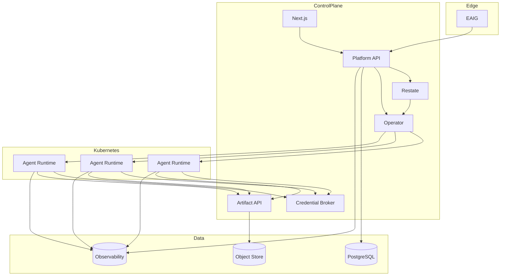
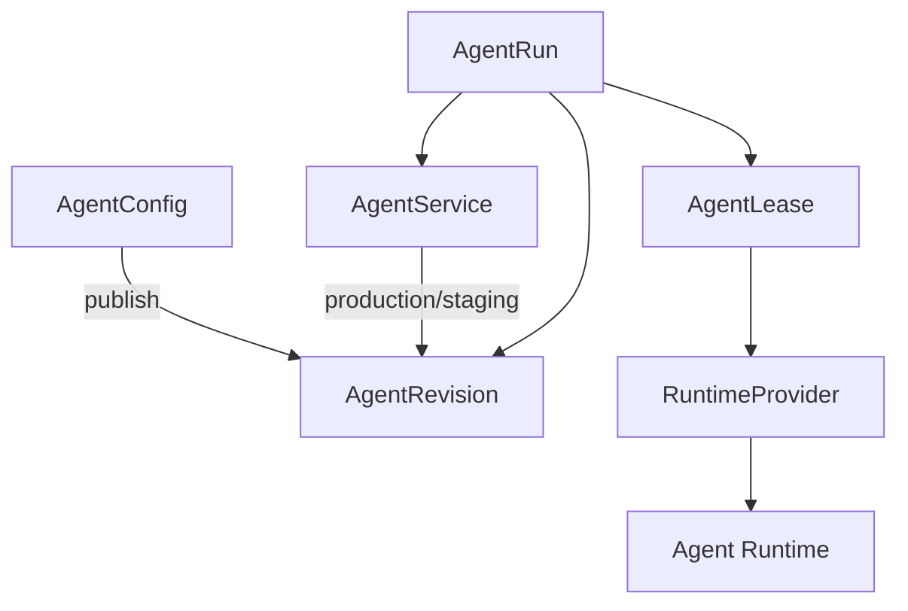
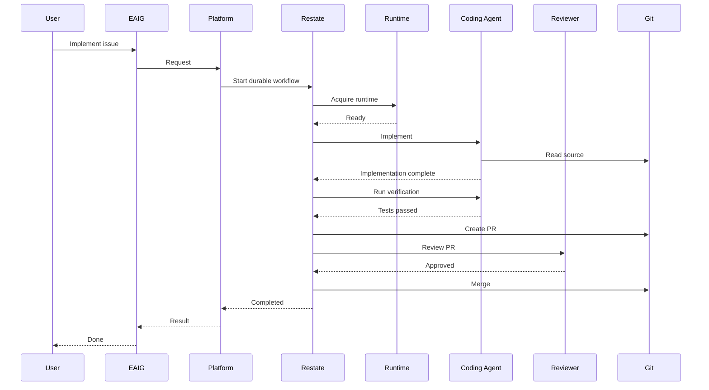

# Deployment, summary and success criteria

[← Index](README.md) · [← Previous](11-decisions.md)


---

## 94. Possible Deployment



If Coder is used, the Operator/runtime portion changes, while the rest remains substantially the same.

---

## 95. Minimal System Explanation

For someone new to the project:

```text
AgentService
    = stable agent identity

AgentConfig
    = editable definition

AgentRevision
    = immutable executable version

AgentRun
    = one piece of work

AgentLease
    = "this agent currently needs compute"

AgentEnvironment
    = runtime requirements

ToolUniverse
    = tools this type of agent may use

SecurityProfile
    = execution security requirements

RuntimeProvider
    = turns revisions + leases into compute

Restate
    = remembers the long-running workflow
```

---

## 96. Minimal Architecture Diagram



Everything else supports these concepts.

---

## 97. Example End-to-End Coding Flow



A more complex version could use multiple parallel specialist agents.

---

## 98. Design Philosophy

`another-agentic-platform` should remain opinionated about **semantics**:

```text
immutable revisions
explicit interfaces
durable workflows
strong identity
safe credentials
observable execution
tenant ownership
explicit state
```

but flexible about **implementations**:

```text
Coder vs native Kubernetes
OpenCode vs another ACP agent
one LLM vendor vs another
one route implementation vs another
one storage provider vs another
one identity implementation vs another
```

This distinction is central to avoiding both vendor lock-in and unnecessary abstraction.

---

## 99. Success Criteria

The architecture should be considered successful if the following scenarios are straightforward.

### Scenario A — Simple stateless agent

Create a review agent with:

```text
no PVC
small model
code-search tools
A2A
scale-to-zero
```

### Scenario B — Full coding environment

Create a coding agent with:

```text
persistent project storage
run-isolated worktree
PostgreSQL
Redis
OpenCode over ACP
GitHub credentials
tests
artifacts
```

### Scenario C — Multi-agent task

One coordinator delegates:

```text
repository analysis
implementation
testing
security review
documentation
```

to independent agents.

### Scenario D — Rollback

Production is moved:

```text
r53 → r47
```

without rebuilding.

### Scenario E — Scale-to-zero

An agent:

```text
exists
is discoverable
has docs
has OpenAPI
```

while consuming zero runtime compute.

### Scenario F — Runtime failure

An active runtime disappears and a long-running workflow resumes without losing logical execution state.

### Scenario G — Provider replacement

A runtime implementation can change without changing:

```text
AgentService
AgentConfig
ToolUniverse
A2A clients
Responses clients
```

---

## 100. Final Architecture Statement

The architecture can be summarized as:

> **another-agentic-platform is a platform for running durable, versioned, independently addressable AI agent services on disposable compute.**

Agents are defined through reusable configuration.

Configurations produce immutable revisions.

Services select revisions through release channels.

Runs represent work.

Leases represent compute demand.

Restate coordinates durable workflows.

Runtime providers turn demand into execution environments.

ToolUniverses define reusable capabilities.

AgentEnvironment defines runtime needs.

A2A allows agents to collaborate.

MCP exposes or consumes tools.

Responses optionally exposes an agent as a model-like API.

EAIG governs access and routing.

SPIFFE/SPIRE can provide workload identity.

Artifacts preserve durable outputs.

OpenTelemetry makes the complete execution observable.

And Kubernetes remains the infrastructure foundation without becoming the product's domain model.

The resulting system supports both:

```text
one sophisticated coding agent
```

and:

```text
a fleet of inexpensive specialized agents
working together on one complex task
```

through the same underlying platform.

---

[← Index](README.md) · [← Previous](11-decisions.md)
