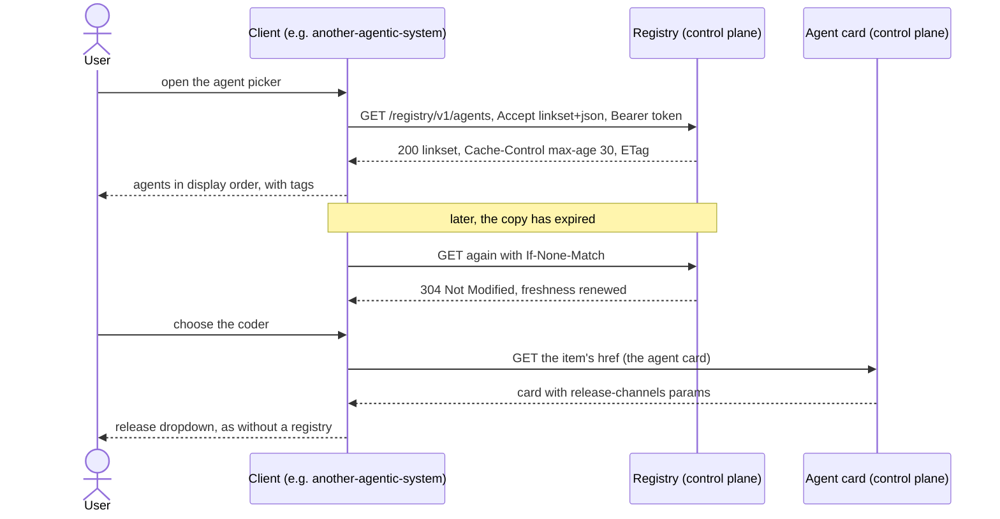
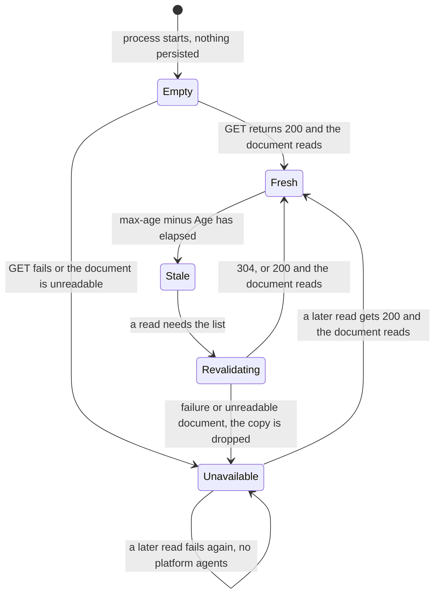

# Agent registry (v1)

- **URI:** `https://agents.vymalo.com/registry/v1`
- **Status:** draft (2026-10-01)
- **Implemented by:** the another-agentic-platform control plane (platform API)
- **Consumed by:** any client that wants to list the fleet's A2A agents — first consumer: another-agentic-system ([ADR 0022](https://github.com/vymalo/another-agentic-system/blob/main/docs/decisions/0022-platform-provisions-agents-system-discovers-them.md))

The URI is a **profile identifier** (it names this contract inside the document and in the
media type's `profile` parameter), like the URI of the
[release-channels extension](release-channels-v1.md). It does not have to resolve.

## Purpose

Let a client list the A2A agents the platform provisions, **using only HTTP and one JSON
document** — no Kubernetes access, no platform SDK, no client-side state. The registry answers
one question: *which agent services exist for this caller, and where is each agent card?*

A2A names curated registries as one way to discover agents but does not prescribe an API for
them (*verified 2026-10-01*, <https://a2a-protocol.org/latest/topics/agent-discovery/>: "The
current A2A specification does not prescribe a standard API for curated registries"). This
contract is that API for the platform's fleet.

What the registry is **not**:

- It is not a gateway. It lists addresses; it never proxies an invocation, and it does not put
  all agents behind one endpoint ([architecture §44](../architecture/03-interfaces.md)). Each
  agent keeps its own host, identity, authorization and card.
- It does not carry releases. Channels and revisions stay on each agent card, in the
  [release-channels extension](release-channels-v1.md) ([architecture §12a](../architecture/03-interfaces.md)).
- It carries no prompts, configuration, credentials or UI concepts. The platform knows nothing
  about any client's user interface; it provisions A2A-capable agents and lists them.

Clients that do not know this contract lose nothing: every agent card and every service's
`/.well-known/api-catalog` ([architecture §12](../architecture/03-interfaces.md)) works without it.

## The document

The registry is a **linkset** in the shape of an API catalog: one JSON document in the
`application/linkset+json` format, with one `item` link per agent service. Request and response:

```http
GET /registry/v1/agents HTTP/1.1
Host: platform.example.com
Accept: application/linkset+json
Authorization: Bearer <token>
```

```http
HTTP/1.1 200 OK
Content-Type: application/linkset+json; profile="https://www.rfc-editor.org/info/rfc9727"
Cache-Control: private, max-age=30
Vary: Authorization
ETag: "r-2026-10-01T09:00:00Z"
```

```json
{
  "linkset": [
    {
      "anchor": "https://platform.example.com/registry/v1/agents",
      "profile": [ { "href": "https://agents.vymalo.com/registry/v1" } ],
      "item": [
        {
          "href": "https://coder.agents.example.com/.well-known/agent-card.json",
          "type": "application/json",
          "title": "Coder",
          "service": ["coder"],
          "tags": ["coding", "git"]
        },
        {
          "href": "https://researcher.agents.example.com/.well-known/agent-card.json",
          "type": "application/json",
          "title": "Researcher",
          "service": ["researcher"]
        }
      ]
    }
  ]
}
```

### Media type

`application/linkset+json`, encoded as UTF-8. The `profile` parameter is optional; per RFC 9727
a server SHOULD send `https://www.rfc-editor.org/info/rfc9727` (it may list more URIs, space
separated, such as the v1 URI above). A client **requires the media type, ignores the
parameter**, and takes the contract version from the document's own `profile` link (below), so
the document stays self-contained when it is saved or forwarded outside the HTTP exchange.

### Context object

| Member | Required | Meaning |
|---|---|---|
| `anchor` | no | URI of the registry document itself. Servers SHOULD send it; clients ignore its value. |
| `profile` | yes | An array whose `href` values include `https://agents.vymalo.com/registry/v1`. This is the version marker. |
| `item` | no | An array of link target objects, one per agent service, in display order. Absent (or `[]`) means the caller sees no agents. |

The set of links is an object with `linkset` as its only member, an array of context objects
even when there is only one. Relation members are arrays even when they hold one link.

### Item (link target object)

| Member | Required | Type | Meaning |
|---|---|---|---|
| `href` | yes | string | Absolute `http` or `https` URL of the agent card, normally `<service host>/.well-known/agent-card.json`. A client MAY accept a service base URL and derive the card path from it. |
| `type` | no | string | Media type of the card: `application/json`. |
| `title` | no | string | Display name. A client defaults to the `service` id when absent. |
| `service` | yes | array of one string | The service id: the `AgentService` name ([architecture §7](../architecture/02-domain-model.md)), lower-case letters, digits and dashes, starting with a letter or digit, at most 63 characters (`^[a-z0-9][a-z0-9-]{0,62}$`). Stable for the life of the service. |
| `tags` | no | array of strings | Labels for grouping and filtering (see [Tags](#tags)). Omitted when the service has none. |

`title` and `type` are target attributes defined by Web Linking, so each is a single value;
`service` and `tags` are extension target attributes, so each is an array even when it holds
one value (*verified 2026-10-01*, RFC 9264 §4.2.4.1 and §4.2.4.3).

## Rules

1. **One item per service.** A service appears if its A2A interface is enabled
   ([architecture §11](../architecture/03-interfaces.md)) **and** the caller may invoke it
   (`agent.invoke`, [architecture §52](../architecture/08-security.md), within the tenants and
   projects the caller can see, [§53](../architecture/08-security.md)). Two callers can get
   different lists.
2. **Display order.** `item` order is the order a client shows. The control plane decides it and
   keeps it stable between reads. A client that needs a default agent MAY take the first item.
3. **Unique ids.** A server never lists the same `service` twice. A client that meets a
   duplicate keeps the first and skips the rest.
4. **Nothing else.** No releases, channels, revisions, prompts, configuration, secrets or tokens.
   Clients ignore members and attributes they do not know (RFC 9264 §4.2.5 allows consumers to
   ignore extra members; for unknown item attributes this contract requires it).
5. **Invalid items are skipped, not fatal.** A client skips an item with a missing or relative
   `href`, a `service` that is not an array of exactly one valid id, or a `title` that is not a
   string. The remaining items are kept, and the client says it skipped some (a warning in its
   logs, not in the user's way). Tags are advisory: a malformed `tags` value (not an array of
   strings, an empty or over-long tag, more than 16 tags) is dropped as a whole and the item
   is kept.
6. **Unreadable documents fail closed.** The source is **unavailable** (not "empty") when the
   body is not valid JSON, is not an object with a `linkset` array, has no context object
   carrying the v1 `profile` link or more than one context object carrying it (context objects
   for other versions are ignored, see [Versioning](#versioning)), exceeds 1 MiB or 500 items, or
   was not served as `application/linkset+json`. A client never truncates: silently dropping agents
   from a long list would hide them.

Limits: at most 500 items and a 1 MiB body per document; at most 16 tags per item and 64
characters per tag. A fleet that outgrows them needs grouping (nested catalogs, RFC 9727
§4.3 and §5.3) or a v2.

## Tags

Tags are labels the platform keeps on an `AgentService`, set and changed in the control plane
(where the platform stores them is not part of this contract). They appear **only** as the
optional `tags` attribute of an item.

- A tag is a free-form, non-empty string of at most 64 characters. Servers SHOULD use
  lower-case words joined by dashes (`coding`, `code-review`). Clients show tags as given and
  compare them exactly; they never write them.
- Tags classify an agent so a client can group, filter or suggest it. They have **no
  behaviour**: they do not route, authorize, version or select anything.
- Tags are **not releases**. Channel names (`production`, `staging`) and revision names are
  never listed here. A client that wants a release picker reads the agent card's
  release-channels extension, live, as it does without a registry.

## Serving

- **Path.** `GET /registry/v1/agents` on the platform API host is recommended. Clients take the
  full URL from their configuration and do not derive it, so a deployment may serve the
  document anywhere (RFC 9727 leaves the location to the publisher).
- **Served by the control plane.** Reading the registry never wakes runtime compute
  ([architecture §13](../architecture/03-interfaces.md)); it is metadata, like the agent card.
- **Authorization.** The registry takes the platform API's standard bearer token
  ([architecture §51](../architecture/08-security.md), [§52](../architecture/08-security.md)):
  `Authorization: Bearer <token>`. `401` when the token is missing or invalid, `403` when it is
  valid but may not read the registry. A caller who may read it but may invoke nothing gets
  `200` and an empty list. The list is filtered per caller (rule 1), so the response carries
  `Vary: Authorization` and `Cache-Control: private`.
- **Listing is not a grant.** The registry hands out no credentials. Each agent card and A2A
  endpoint applies its own service's authorization
  ([architecture §44](../architecture/03-interfaces.md), [§68](../architecture/08-security.md)).
- **Transport.** HTTPS outside a trusted cluster network, and the endpoint is rate-limited like
  other control-plane endpoints (RFC 9727 §8 recommends both for an API catalog; *verified
  2026-10-01*).

## Caching

Servers send `Cache-Control: private, max-age=<seconds>` with **`max-age` of 60 or less**
recommended, and an `ETag` (they MAY add `Last-Modified`), and answer `If-None-Match` with `304
Not Modified` when nothing changed. The `ETag` is opaque.

Clients honour these headers, and in addition:

1. **Freshness.** A copy is fresh for `max-age` minus `Age` (RFC 9111). A client MAY cap the
   lifetime lower. With no `max-age`, or with `no-cache` or `no-store`, a client revalidates on
   every read.
2. **Revalidate.** When a copy is stale, send `If-None-Match` (and `If-Modified-Since` when only
   `Last-Modified` was given). A `304` renews freshness; a `200` replaces the copy.
3. **Single flight.** Concurrent readers share one fetch.
4. **Never persist.** The copy lives in the client process's memory, never in a database or a
   file, and is never part of a client's own durable state.
5. **Fail closed, never stale.** If a fetch fails (connection error, timeout, a status other
   than `200` or `304`, an unreadable document) the answer is **"the registry is unavailable,
   so no platform agents"**. A client does not fall back to the stale copy and ignores
   `stale-while-revalidate` and `stale-if-error` (RFC 5861). An agent that was removed
   must not stay selectable just because the registry is down. A client keeps this
   distinct from an empty list, so it can tell the user the registry could not be reached.
6. **Credentials errors are failures.** `401` and `403` make the source unavailable; the client
   reports that the registry refused its credentials, without printing the token.

Cache headers and validators: *verified 2026-10-01*, RFC 9111 §5.1 (`Age`), §5.2.2.1
(`max-age`), §5.2.2.4 (`no-cache`), §5.2.2.5 (`no-store`), §5.2.2.7 (`private`); RFC 9110
§8.8.3 (`ETag`), §12.5.5 (`Vary`), §13.1.2 (`If-None-Match`), §15.4.5 (`304`); RFC 5861 §3
and §4.

## Client flow



How a client holds the document between reads (in memory only):



While `Unavailable`, a client lists no platform agents and says the registry cannot be reached.
It holds no copy and no validator, so the next read is an unconditional `GET`.

## Versioning

Breaking changes get a new URI (`…/registry/v2`) and a new file, `agent-registry-v2.md`; this
file stays. Adding an optional item attribute is not breaking, because clients ignore unknown
attributes (rule 4). A service may declare both versions during a transition: the document then
carries both `profile` links, either in one context object whose items are valid under both
versions or in one context object per version. A client reads the one context object that
carries the profile it implements.

## Facts checked

- *Verified 2026-10-01* against the RFC text at <https://www.rfc-editor.org/rfc/rfc9264.html>
  (Linkset): §4.2.1 (`linkset` is the sole member, an array of context objects), §4.2.2
  (`anchor` optional, relation members are arrays), §4.2.3 (`href` required), §4.2.4.1 (`title`
  and `type` are single values), §4.2.4.3 (extension target attributes are arrays of strings),
  §4.2.5 (consumers can ignore other extensions), §5 (the `profile` media type parameter is a
  space-separated list of URIs), §7.4.3 (a `profile` link inside the document).
- *Verified 2026-10-01* against <https://www.rfc-editor.org/rfc/rfc9727.html> (`api-catalog`):
  §3.1 (the `item` relation identifies a member of the catalog), §4.2 (the catalog MUST be
  `application/linkset+json` and SHOULD carry `profile="https://www.rfc-editor.org/info/rfc9727"`),
  §4.3 and §5.3 (nested catalogs, caching and compression), §8 (TLS, rate limiting).
- Not from the RFCs: the attributes `service` and `tags`, the version `profile` link and the
  limits are this contract's own definitions. The RFCs supply only the shape (a linkset of
  `item` links with extension target attributes).
- *Verified 2026-10-01* against <https://a2a-protocol.org/latest/topics/agent-discovery/>: A2A
  lists well-known URI, curated registries and direct configuration as discovery strategies
  and prescribes no registry API.
