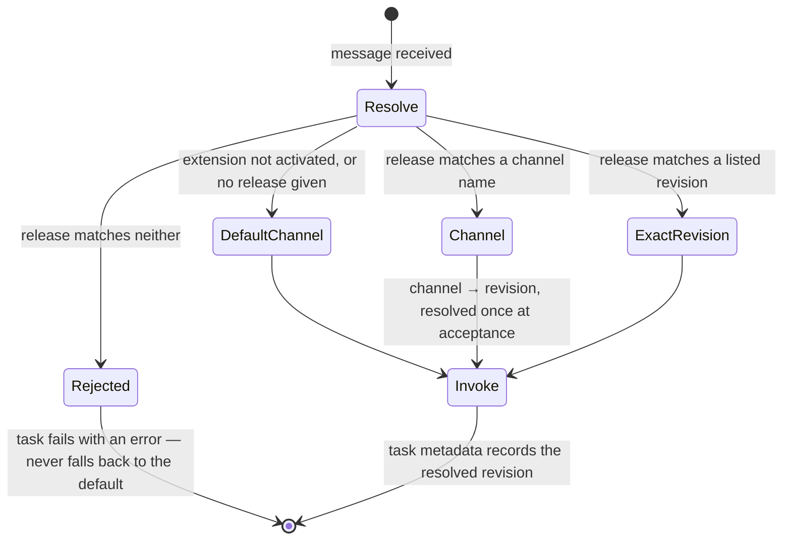
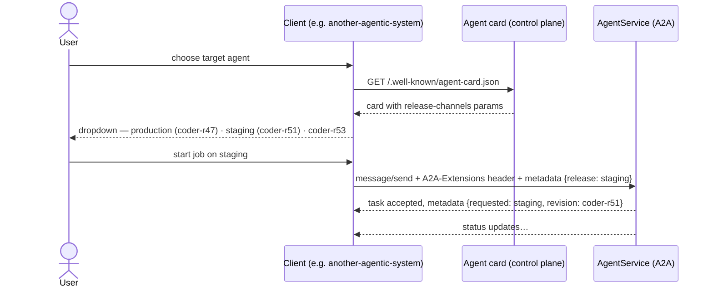

# A2A extension: release channels (v1)

- **URI:** `https://agents.vymalo.com/a2a/extensions/release-channels/v1`
- **Status:** draft (2026-09-28)
- **Implemented by:** every another-agentic-platform `AgentService` with A2A enabled
- **Consumed by:** any A2A client that wants to select a release — first consumer: another-agentic-system (release dropdown)

## Purpose

Let an A2A client discover an agent's release channels and revisions
([architecture §10](../architecture/02-domain-model.md)) and invoke a specific one, **using
only the A2A agent card and message metadata** — no platform-specific API, no
Kubernetes access, no client-side state.

Clients that do not know this extension ignore it and get the service's
default channel.

## Discovery: the agent card

The control plane serves `/.well-known/agent-card.json` (discovery never wakes
runtime compute — [architecture §13](../architecture/03-interfaces.md)) and declares the extension in
`capabilities.extensions`:

```json
{
  "name": "coder",
  "capabilities": {
    "extensions": [
      {
        "uri": "https://agents.vymalo.com/a2a/extensions/release-channels/v1",
        "description": "Select a release channel or an exact revision of this agent.",
        "required": false,
        "params": {
          "service": "coder",
          "defaultChannel": "production",
          "channels": {
            "production": "coder-r47",
            "staging": "coder-r51",
            "latest": "coder-r53"
          },
          "revisions": [
            { "name": "coder-r53", "createdAt": "2026-09-28T09:10:00Z" },
            { "name": "coder-r51", "createdAt": "2026-09-26T14:02:00Z" },
            { "name": "coder-r47", "createdAt": "2026-09-20T08:45:00Z" }
          ]
        }
      }
    ]
  }
}
```

- `channels` maps channel name → revision name. Always contains `defaultChannel`.
- `revisions` lists invocable revisions, newest first, bounded by the
  retention policy ([architecture §66](../architecture/09-operations.md)). Each channel's target is always listed.

## Invocation: selecting a release

The client activates the extension on the request and names the release in
the message metadata, keyed by the extension URI:

```http
POST /a2a
A2A-Extensions: https://agents.vymalo.com/a2a/extensions/release-channels/v1
```

```json
{
  "message": {
    "role": "user",
    "parts": [{ "kind": "text", "text": "Implement issue #428." }],
    "metadata": {
      "https://agents.vymalo.com/a2a/extensions/release-channels/v1": {
        "release": "staging"
      }
    }
  }
}
```

`release` is a **channel name** (`staging`) or an **exact revision name**
(`coder-r47`).

## Resolution



Rules:

1. **Resolved once.** A channel is resolved to a revision when the task is
   accepted. Promoting the channel mid-task does not change the running task.
2. **Fail closed.** An unknown `release` fails the task with an error naming the
   value. It is never silently replaced by the default channel.
3. **Echo the result.** The task's metadata (same URI key) carries
   `{ "requested": "staging", "revision": "coder-r51" }`, so the client can
   record which revision actually ran without keeping any platform state.
4. **Authorization applies per revision.** Selecting a revision is subject to
   the same policy as invoking the service ([architecture §52, §68](../architecture/08-security.md)); a policy may
   restrict non-default channels to some callers.

## Client flow



## Caching

Clients should re-read the card when presenting a choice and honour HTTP
cache headers; they must not keep their own copy of the channel map.

## Versioning

Breaking changes get a new URI (`…/release-channels/v2`). A service may
declare both during a transition.
